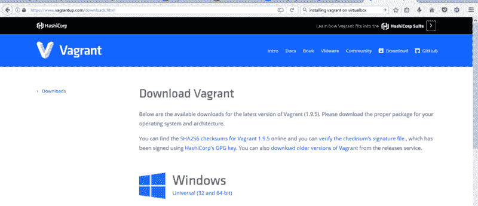
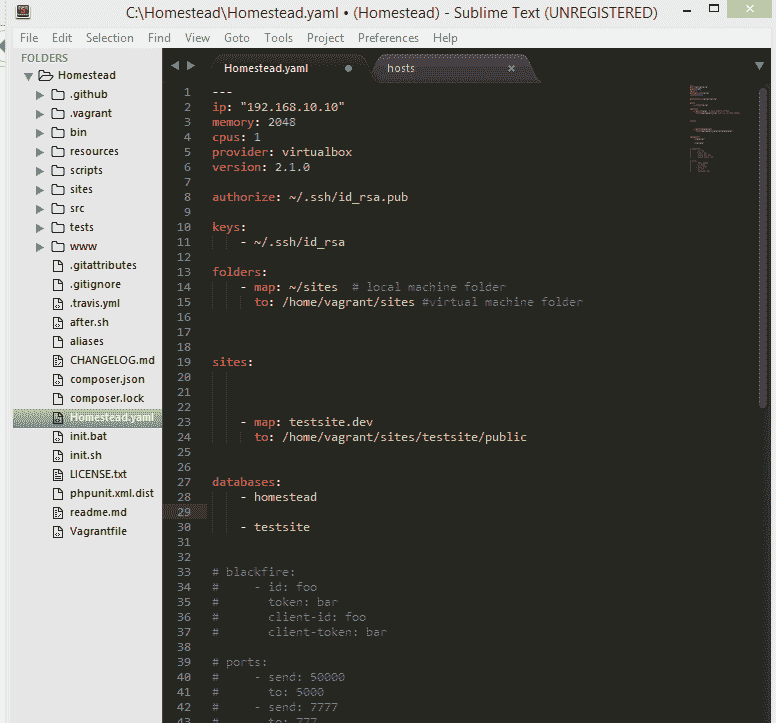
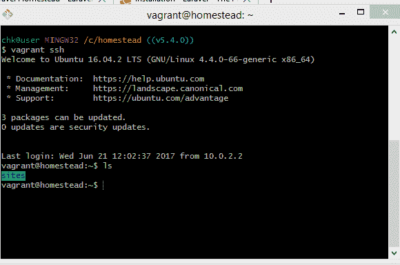
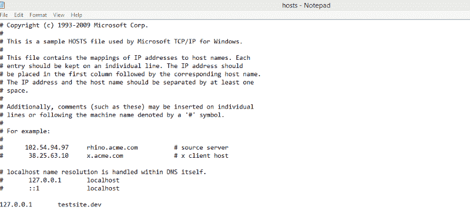

# 如何在 Windows 上使用 Homestead 安装 Laravel 简单的方法

> 原文：<https://www.freecodecamp.org/news/a-simplified-approach-to-installing-laravel-using-homestead-on-windows-f5fc50e59af0/>

laravel [文档](https://laravel.com/docs/5.5)推荐使用 Homestead(一个预打包的 all in one 游民盒子，包含 Ubuntu 16.04、PHP 7.1、Nginx、Composer)安装 laravel。一旦你的机器上运行了 homestead，建立一个 laravel 项目就很容易了。

在本文中，我们将研究一种在 windows 系统上安装 laravel 的简单方法。

### 先决条件

要开始安装，请安装以下软件:

Git 将作为一个 SSH 客户端，我们将在整个设置过程中使用 Git Bash shell 作为命令行。点击[这里](https://git-scm.com/downloads)下载 git 并安装在你的系统上。

**升华文本**:这将作为建筑应用的文本编辑器。点击[这里](https://www.sublimetext.com/3)下载安装 sublime text。或者你可以安装任何你选择的文本编辑器，比如 [VS code](https://code.visualstudio.com/) 和 [atom](https://atom.io/) 。

安装 git 后，打开 git bash 并生成一个 ssh 密钥对。为此，转到主目录并运行命令:

```
ssh-keygen -t rsa -C "youremail@mail.com"
```

## 主安装

**第一步**:要开始安装，我们必须下载并安装 virtual box。点击[这里](https://www.virtualbox.org/wiki/Downloads)下载并安装 windows 安装设置。

**第二步**:在这一点上，我们将安装流浪者，它将作为一个家园的容器。下载并安装 Windows 版[流浪汉](https://www.vagrantup.com/downloads.html)。



Download page for vagrant. Source: [https://www.vagrantup.com/downloads.ht](https://www.vagrantup.com/downloads.ht)ml

**第三步**:安装好虚拟盒子和流浪汉之后，我们就可以在流浪汉盒子中添加 laravel 了。现在打开 Git Bash，在主目录中运行以下命令:

```
vagrant box add laravel/homestead
```

等待它下载。为 virtualbox 选择选项，在我的例子中是 2。按回车键，等待它下载盒子。

**第四步:**通过运行以下命令，在您的主目录中安装 homestead:

```
git clone https://github.com/laravel/homestead.git Homestead
```

完成后，使用 git bash 将目录切换到 Homestead 文件夹并运行以下命令:

```
init.bat
```

## 配置家园

现在我们准备配置宅基地。打开 sublime text，进入文件，打开文件夹，选择 homestead 文件夹。它位于 C:/Homestead。打开 Homestead.yaml 文件，如下图所示



我们的重点是 Homestead.yaml 文件中的文件夹和站点部分。

-映射:~/代码

简单地说就是本地机器上的项目文件夹。

收件人:/home/流浪者/代码

只是指虚拟机上的文件夹，它将同步到本地机器上的目录。

在本地机器的主目录中为您的项目创建一个文件夹(我命名为 mine sites)。我的位于 C:/Users/username/sites。

在 Homestead.yaml 文件中，将–map:~/Code 更改为-map: ~/sites。

还要将/home/travel/Code 改为/home/travel/sites

## 现在安装 Laravel

现在，通过运行以下命令下载 laravel 安装程序:

```
Composer global require “laravel/installer”
```

完成后，运行以下命令:

```
vagrant up
```

然后这个命令:

```
vagrant ssh
```

将显示在本地计算机上创建的站点文件夹



将目录切换到 sites 文件夹，您就可以开始您的 laravel 项目了。

运行以下命令:

```
laravel new testsite
```

并等待它下载。耶！我们准备好出发了

> “建造令人惊叹的东西”！

## 配置 Nginx 站点

要在 web 浏览器上访问我们的 laravel 项目，我们只需配置 sites 属性

“站点”属性允许您轻松地将“域”映射到家园环境中的文件夹— [单据](https://laravel.com/docs/5.4/homestead)

让我们为测试站点创建一个域。以管理员身份打开记事本，转到文件并打开主机 C:/Windows/System32/Drivers/etc/hosts，然后将 127.0.0.1 分配给 testsite.dev



127.0.0.1 testsite.dev

在 homestead.yaml 文件中，将 homestead.app 更改为 testsite.dev，并将/home/vagger/Code/Laravel/public 更改为/home/vagger/sites/public，并发出命令:

```
vagrant provision
```

现在打开 web 浏览器，输入 testsite.dev:8000。您的浏览器将显示封面照片所示的 laravel 页面。

如果这篇文章有帮助，请在社交媒体上分享，让其他人也能看到。