# 我的朋友讨厌 SoundCloud iOS，所以我为他们重新设计了它

> 原文：<https://www.freecodecamp.org/news/my-friends-hate-soundcloud-ios-so-i-redesigned-it-for-them-d3038cdd020b/>

你是谁

# 我的朋友讨厌 SoundCloud iOS，所以我为他们重新设计了它

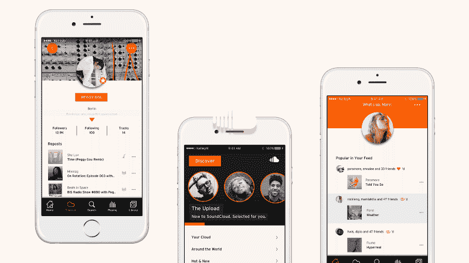

开始只是和朋友的一次随意的谈话，后来变成了一次严肃的探索。这部分是因为我喜欢 SoundCloud，部分是因为我需要挑战自己，以便在我的职业生涯中前进。

我从 2013 年开始痴迷地使用 SoundCloud，此后也开始使用其他流媒体应用程序。SoundCloud 太棒了。每当我浏览它的社区时，我都能期待发现如此多的新人才。

因此，我开始重新设计 SoundCloud 的 iOS 应用程序，按照我和我的朋友们希望的方式。

### 第一部分—从零开始

#### 迭代 I

在过去的六个月里，自从 SoundCloud 发布了他们的移动平台以来，我一直有一种感觉。而且不是好的方面。当我问我的朋友们对此有何感受时，他们会变得非常激动。我们会争论我们仍然喜欢它的哪些地方，以及哪里出了问题；我会和我的 Lyft 司机进行深入的交谈；我会谨慎地将关于 SoundCloud 的问题加入到随机讨论中。

你瞧，我发现我们大多数人都避免使用它。

于是，我变得越来越好奇……？

Fry from Futrama

是什么让其他移动流媒体应用比 SoundCloud 更强或更弱？我们不快乐的细节是什么？需要改变什么？为了获得洞察力，我扩展了我的流媒体体验，并开始使用 Spotify 和 Apple Music，比较和对比它们的优势、劣势和模式。这些流媒体平台有哪些通用的元素和术语？

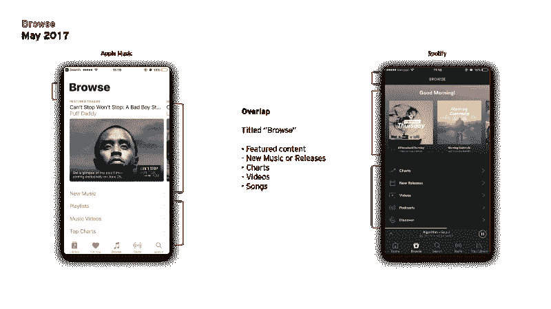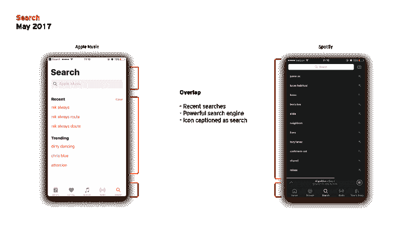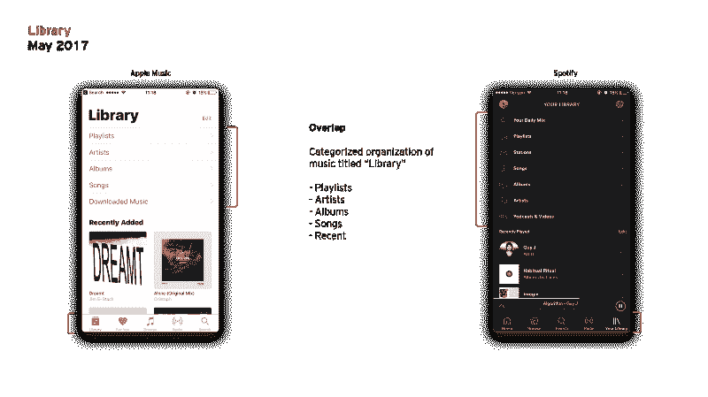

在脑海中为 SoundCloud 编制了一个建议和改进列表(来自非正式对话等)。)，我意识到了必然。

> 如果我想重新设计 SoundCloud，我必须从头开始。

我不得不从零开始。

#### 情况

2016 年，由于流媒体的原因，全球录制音乐市场增长了 5.9%([IFPI 事实与统计 2016](http://www.ifpi.org/facts-and-stats.php) )。同年 59%的数字收入来自流媒体。作为最受欢迎的流媒体平台之一，SoundCloud 非常强调他们的社区，在 2015 年记录了 8.47 亿次电子连接。它拥有最大的电子音乐草根数字社区之一，估计超过 1000 万。

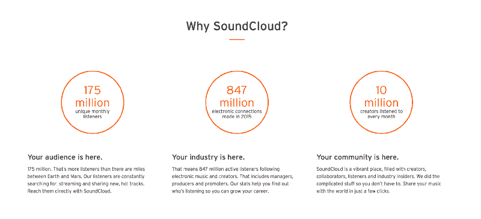

[https://soundcloud.com/for/electronic](https://soundcloud.com/for/electronic)

#### **假设**

SoundCloud 在 2016 年推出订阅服务 SoundCloud Go 后，成为了音乐流媒体的竞争对手。该片发行后，媒体的评价并不令人满意；SoundCloud 随后在 2017 年发布了一个名为 SoundCloud Go+的新层。随着[平台努力争取用户超过 Spotify Premium](https://about.crunchbase.com/news/streaming-wars-continue-soundcloud-balance/?utm_source=cb_daily&utm_medium=email&utm_campaign=20170518&utm_content=intro&utm_term=content&send_email=kelleytmnguyen@gmail.com) ，我开始形成假设。

> 1.音乐流和发现是一项非常社会化的活动
> 2。制作播放列表对一个人的听觉体验至关重要。发现新音乐一定很方便

#### 市场研究 I

从全球来看，欧洲和亚洲的电子音乐份额最高，而美国、英国、丹麦和墨西哥的电子音乐流量最高。( [IMS 峰会商业报告 2017](http://www.internationalmusicsummit.com/wp-content/uploads/2017/05/IMS-Business-Report-2017-vFinal2.pdf) )

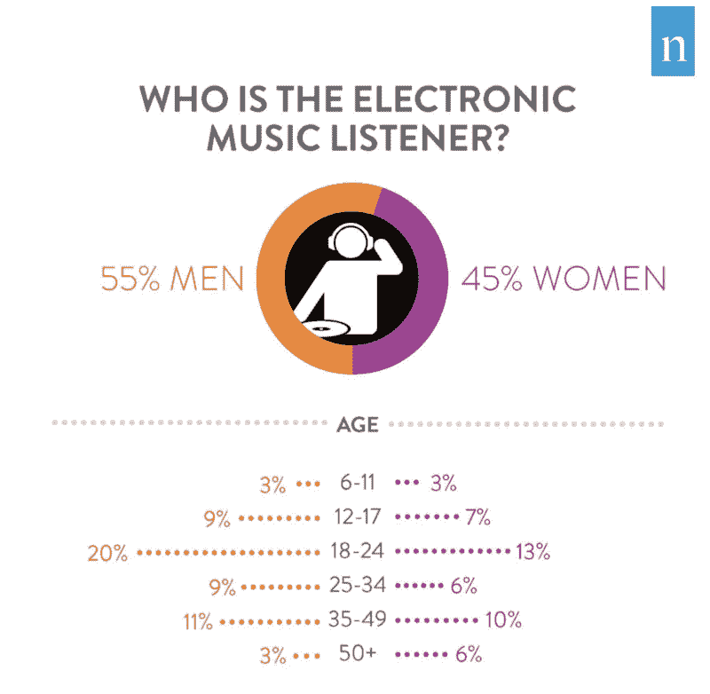

[Who is the electronic music listener?](http://www.nielsen.com/us/en/insights/news/2014/who-is-the-electronic-music-listener.html) (Nielsen)

> “千禧一代在美国参加俱乐部活动的可能性增加了 40%，全球共有 20 亿人。”——2017 年国际音乐峰会商业报告

#### **研究一**

*利益相关方*

我将利益相关者分为两类:业余爱好者和专业人士。为了满足每个人的共同需求，我研究了他们的主要角色。

> 每个利益相关者最终都是一个倾听者。

实际上，我的问题集中在听众和飘带的习惯上。在这一轮中，我收集了 23 名年龄在 18 至 28 岁之间的参与者的回答。82%是男性，80%是大学生。

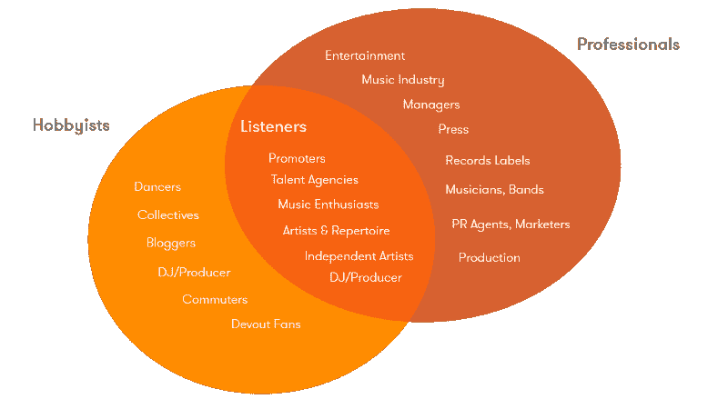

Stakeholders

我发现，我的参与者更有可能重复看到来自同一组艺术家的歌曲。他们发现自己处于一个反馈循环中，相同的曲目会从相同的用户那里传播。用户不太可能找到新的音乐，并受到“喜欢”和“转发”计数等功能的影响。他们中的一些人说，他们会在他们的提要上滚动 3 或 5 首曲目，失去兴趣，然后转向其他内容。

更多的问题开始出现。用户与在线音乐社区的联系有多重要？听众多久听一次他们朋友的音乐？他们是如何受到转发的曲目和 like count 的影响的？

*面试*

我参加了 5 次面试，每次大约持续 30 分钟。我问了 20 多个问题，旨在揭示每个人认为 SoundCloud iOS 的优势和劣势。我的采访暴露了对 SoundCloud 作为发现平台的推荐缺乏信任。人们认为 SoundCloud 不像 Spotify 和 Apple Music 那样完美。相反，它被视为培养艺术家的作品集，而不是专业的唱片集。我所有的成绩都在[这里](https://docs.google.com/document/d/1Knf2hzWY4bebUQhTu35HNFuVnH2RcPb9meRNNi_m4uM/edit#heading=h.f0z79jq5lysy)整理。

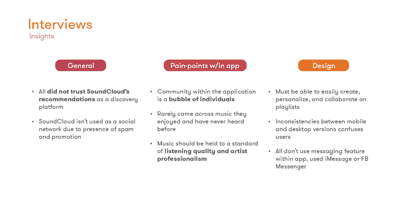

根据我收集的数据，我可以描绘出一幅更好的画面。我用[人物角色和场景](https://files.persona.co/44294/sc-pov-personas.pdf)说明了我将要设计的行为类型。第一个场景是关于一个朋友的故事，她的聆听经历激励她与朋友分享一首曲目。第二个故事讲述了一个年轻的工作成年人，他希望在开车上班的路上有一种新的听觉体验。

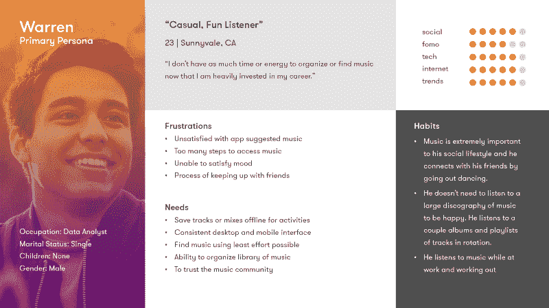

Primary Persona

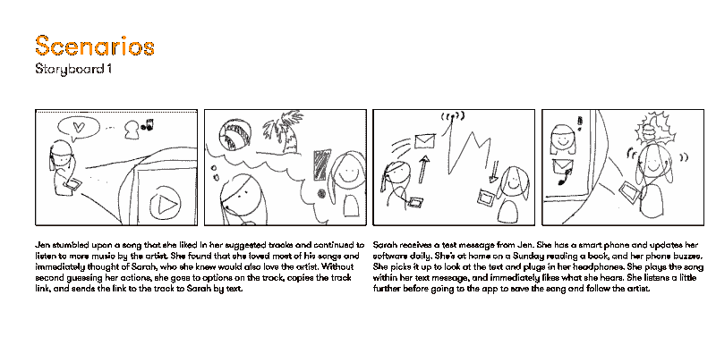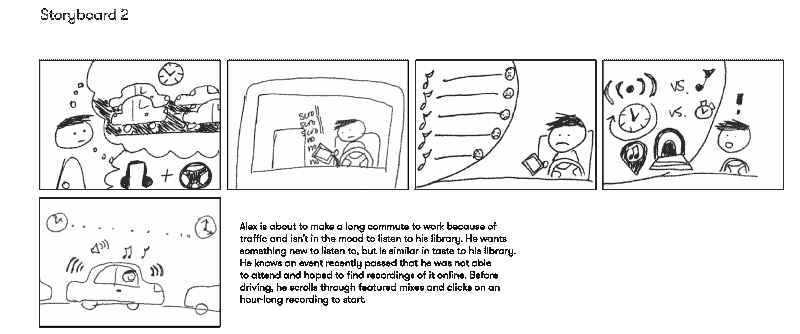

100%的调查和访谈参与者都听过各种电子音乐。这包括了广泛的子流派，包括陷阱、电子乐和流行乐。60%的受访者表示，他们听播客、套装或混音，所有这些都可能持续 30 分钟到 3 小时。他们的反馈支持了我对 SoundCloud 作为电子音乐平台的理解，无论是说唱制作还是子流派形式。

#### 重温我的假设:

> 1.我的采访最终表明，音乐流和发现并不是大量的社会活动，而是个人探索。个人口味极其独特。

> 2.不是每个人都制作播放列表，因为这比普通用户能承受的要多得多。

> 3.解决办法？给听众他们从来不知道他们想要的音乐。或者换句话说，人类很懒，所以我们必须做所有的工作。

最重要的是，SoundCloud 的电子音乐社区和资料库必须在最表层。这将意味着**管理内容**(录音、影响者、现场混音)**组织音乐库**以便**吸引电子音乐社区的习惯**。为了满足我的研究对象的需求，我提出了以下建议:

#### 求婚

> 1.事件和混音专用的新页面

> 2.对保存的音乐集合进行组织和分类

> 3.专为策展人设计的新页面

> 4.热门转贴曲目的独立模块

> 5.只关注电子音乐和舞曲社区

### 样机研究

#### 用户流量

在我研究了常见的音乐流媒体应用程序并消化了 SoundCloud 的移动路径之后，我大致想象出了它最重要的功能。这些功能引导了我认为用户在使用 SoundCloud 时最有可能遵循的[用户流和路径](https://files.persona.co/44294/sc-infoarch-sitemaps.pdf)。

#### 低保真度

利用通过网站地图和用户流组织的信息，我使用纸质原型为个人资料或家庭、图书馆和发现创建了低保真度的线框。后来我移到了数字线框图，并绘制了基本的 T2 线框图来将屏幕组合在一起。

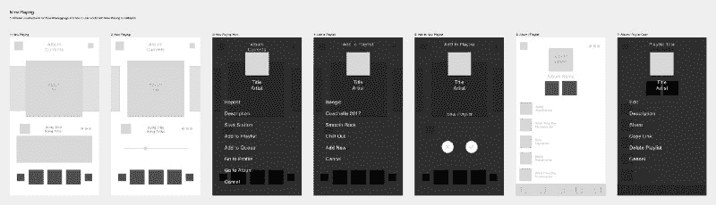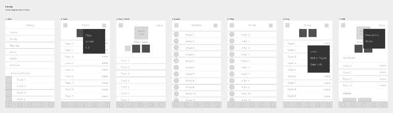

#### 中等保真度

从低保真度，我注意到每个元素和页面的意义和目的。同样，下面是由应用程序的主要分支组织的:Profile 或 Home、Discover 和 Library。

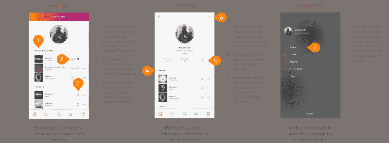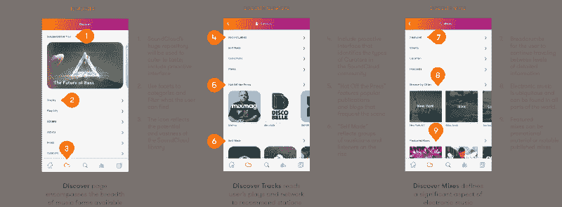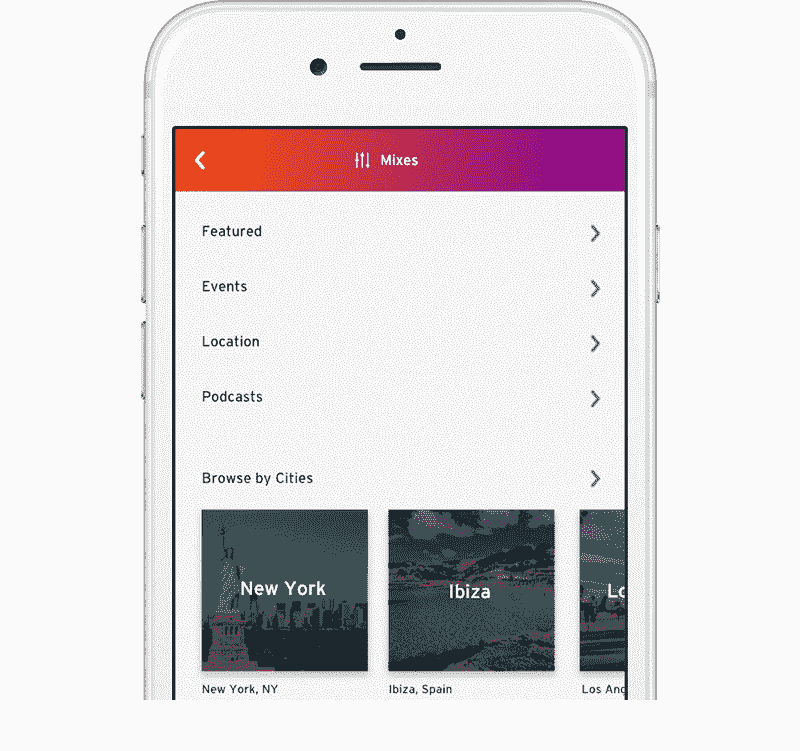

**事件&混合**

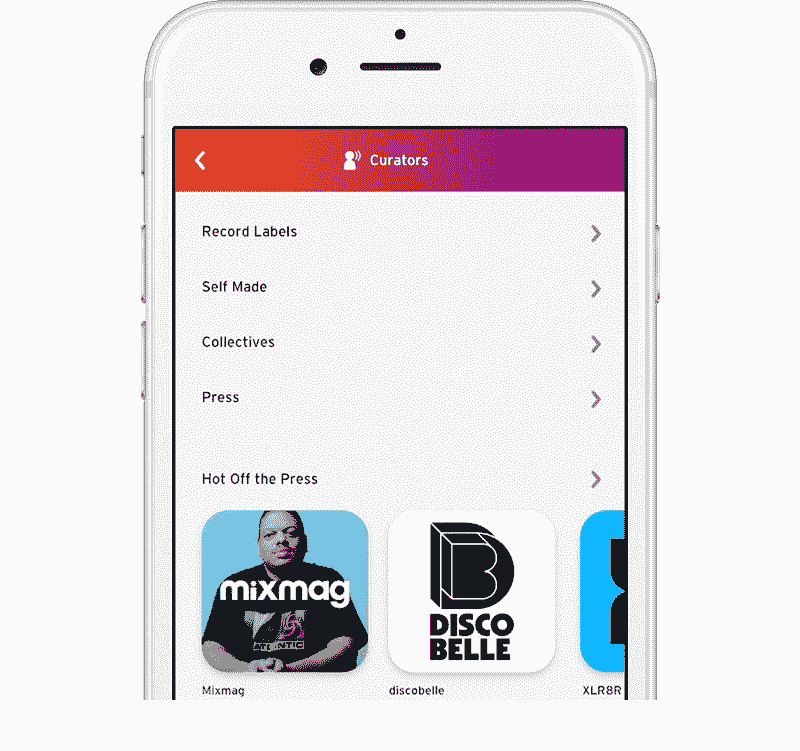

*发现>混合* s >

1.特色—合作者、推荐艺术家等。

2.活动——节日、表演

3.位置-主要城市和场景

4.播客——居民、每日混音

**策展人**

*发现>混合* s >

1.唱片公司——专业分销商

2.自制——YouTube 频道

3.音乐集体——团体、合作者

新闻杂志和公关首映音乐

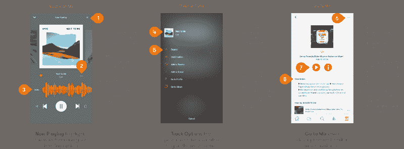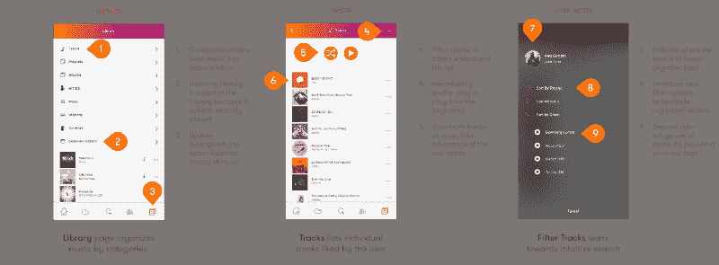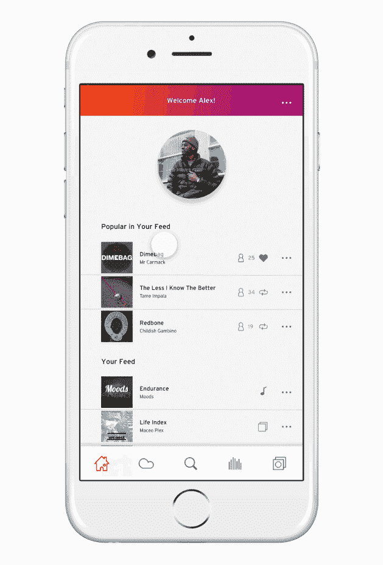

#### 高保真度

[在线原型](https://xd.adobe.com/view/145e74af-77aa-42c7-8951-5d683f98d40a/)

请让我知道您对基础架构如何为您工作的想法，界面的哪些方面可以做得更好，以及您的整体体验。

第一部分是我第一次在 Adobe XD 上运行，我对使用原型功能的简单性印象深刻。第一部分还涵盖了初步的研究结果和第一次互动样机。对于**第二部**，我将专注于使用草图和原理的视觉设计和微交互，为更好的第二次迭代平滑第一个模型的边缘。

### 第二部分——后退一步

#### 迭代 II

**感谢迄今为止的阅读！这个项目的最后一点让我对交互设计更加感兴趣。我找到这些 gif 是为了向你们展示我对进展的感受？**

L: Sailor Moon, R: Finn from Adventure Time

在进入这个项目的后半部分之前，我看了一下 SoundCloud 在过去几个月里的变化。我查看了几个月前收集的数据，筛选了 SoundCloud 目前的活动。像*里尔·简自豪·维特*、*波斯特·马龙*和*特拉维斯·斯科特*这样的艺术家一直在 SoundCloud 的排行榜上名列前茅，这使得嘻哈音乐像电子音乐一样受欢迎(如果不是超过的话)。在将这个项目建立在主要听电子音乐的受试者的基础上之后，我认为我必须转向一个全新的方向。

> 我后退了一步。

如果 SoundCloud 的基地已经转移，我知道我需要更多的证据。在我自己的网络中，我关注的是一个小样本，需要扩展。为什么不收集更多关于音乐流媒体的数据？

#### 市场研究 2

通过对一系列文章、新闻稿和来自纽约时报、T2、福布斯、T4 和其他网站的研究，我意识到嘻哈音乐的趋势是在过去几年中出现的。2015 年 SoundCloud 上排名前 3 的艺人分别是 **Drake** 、 **Major Lazer** 和 **G-Eazy** ( [福布斯 2015](https://www.forbes.com/sites/hughmcintyre/2015/08/23/soundclouds-ten-most-played-artists-this-year-tell-a-lot-about-its-users/2/#7b1192be3990) )。2016 年，最受欢迎的专辑是说唱歌手**吉斯**的*涂色书*，最受欢迎的歌曲*设计者的*熊猫*，以及最受欢迎的歌曲:**里尔·简自豪·维特**。*

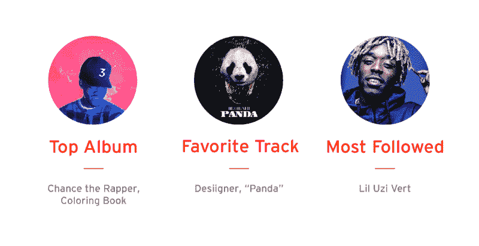

[SoundCloud 2016 Overview](https://blog.soundcloud.com/2017/01/19/throwbackto2016/)

#### 研究二

我做了另一个调查，更简洁，侧重于定量数据。由四个选择题组成，我收集了 167 名参与者的回答。

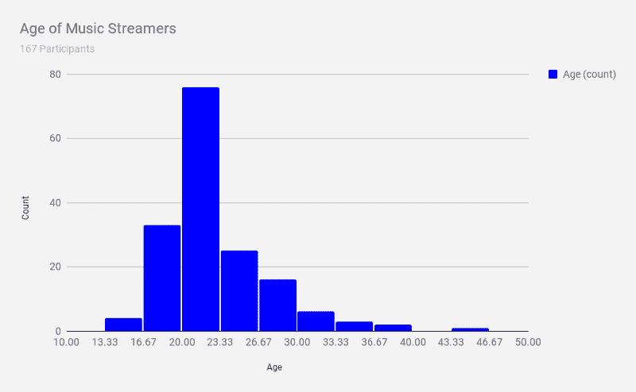

Q1: What is your age?

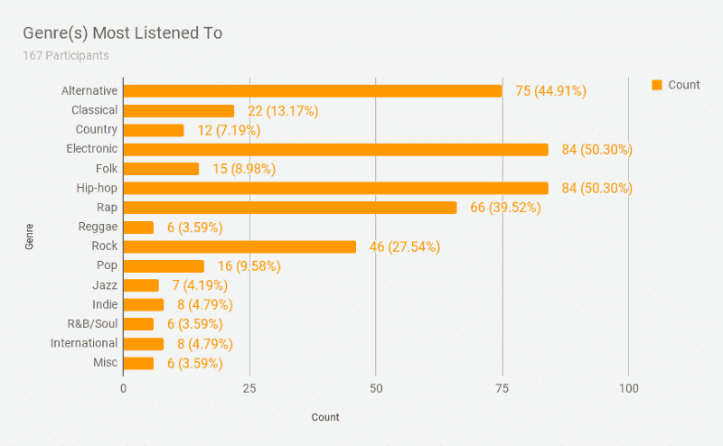

Q2: What genre(s) do you listen to the most?

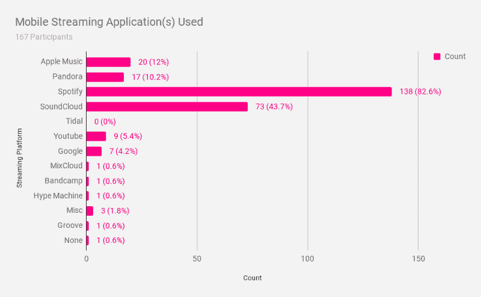

Q3: What streaming application(s) do you use on your phone?

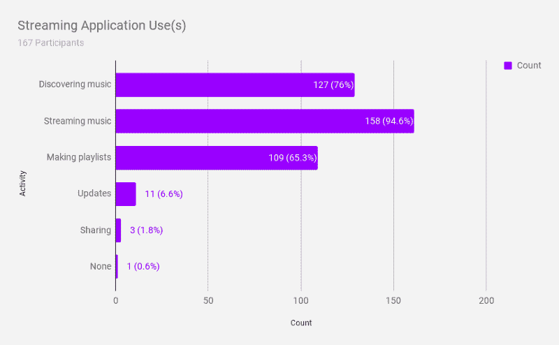

Q4: What do you use your streaming application(s) for?

以下是结果:**电子音乐和嘻哈音乐**并列最受欢迎的音乐类型。大多数音乐飘带的年龄在 16 岁到 27 岁之间，平均年龄约为 **21 岁**。 **Spotify 领先【SoundCloud 成为最受欢迎的移动流媒体平台。流媒体被认为是最重要的活动，然后是发现，然后是制作播放列表。**

#### 重温我的提议:

> 1.对保存的音乐集合进行组织和分类

> 2.热门转贴曲目的独立模块

> 3.专注于电子、舞蹈和嘻哈社区

> 4.构建 Discover 页面，以适应不同类型和社区

第二轮的大部分结果反映了我几个月前收集的数据，但我确实学到了一些新东西:

> 作为一个平台，SoundCloud 的最大优势之一是它的多功能性和与观众一起发展的能力。

为了与它的社区融为一体，设计必须不带偏见，支持所有音乐流派，并建立在 SoundCloud 当前品牌的特征上:鲜明和中立。

### 核标准情报中心

我尝试了一把制作图标的手，以获得完善像素的感觉。虽然这是我的第一次，还有很大的改进空间，但我可以看到我对细节的关注是如何被冲昏头脑的。

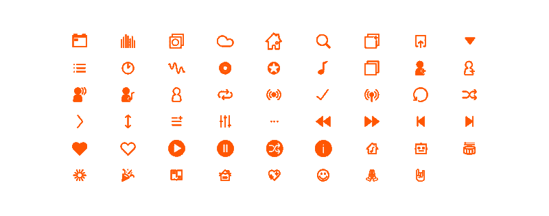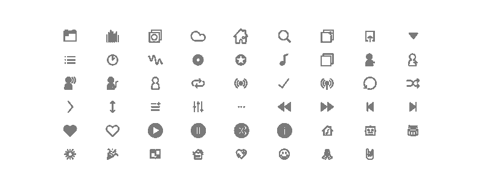

### 视觉设计和微交互

#### **首页**

对于 SoundCloud iOS 来说，Home 的目的(也是唯一的目的)是显示你关注的人的活动。所有的帖子都是按照时间顺序转储到 feed 中的。提要中最显著的元素是每个帖子的插图、点赞和转发数。

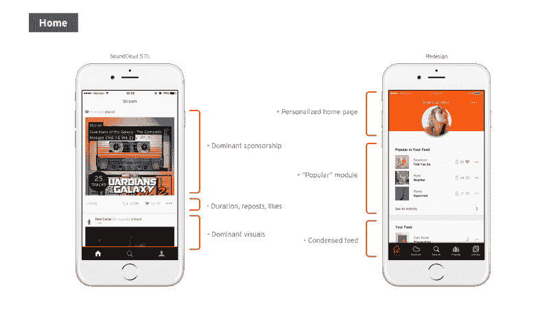

SoundCloud vs Iteration 2: Home

**在你的订阅源中受欢迎**允许听众看到他们关注的用户的活动。本模块中的第一首曲目显示，Mary 关注的 35 个人喜欢来自帕拉摩尔的帖子。该模块将活动编译到一个通知中，并处理重复的通知。如果玛丽追随的人反映了她自己的音乐品味，玛丽可能也会喜欢这首歌。

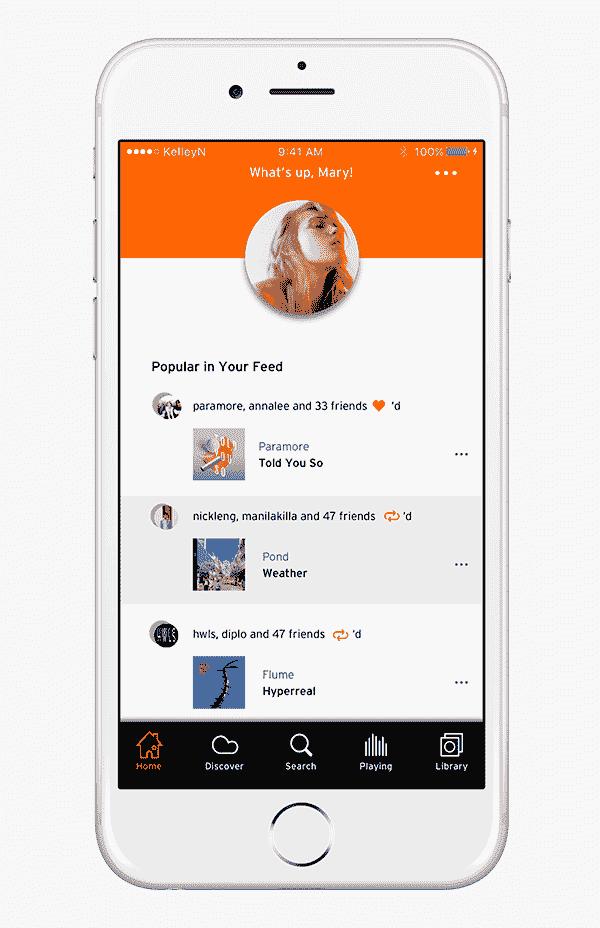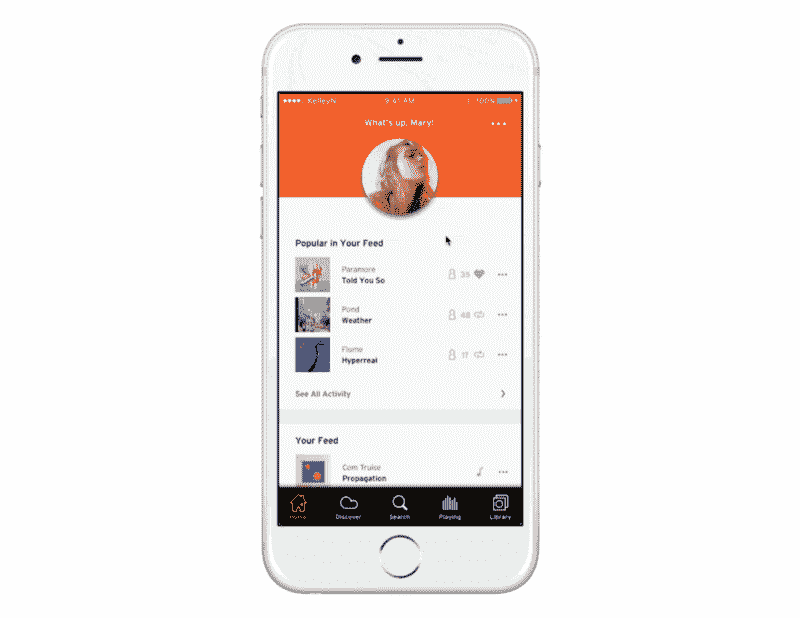

Iteration 2: Popular in Your Feed

假设一个帖子只有不到 10 个赞和一个不吸引人的专辑封面。你会听吗？*如果我们说实话，你不太可能去做一个看起来不那么专业的职位，数字总是会影响你的预期。*

我拿走了类似的，并重新发布计数，以减少判断和偏见。右手边的图标将文章分类为不同的类型:电台、混音、播放列表、专辑或曲目。为了专注于聆听而不是外表，**你的 Feed** 强调标题、艺术家和类型。

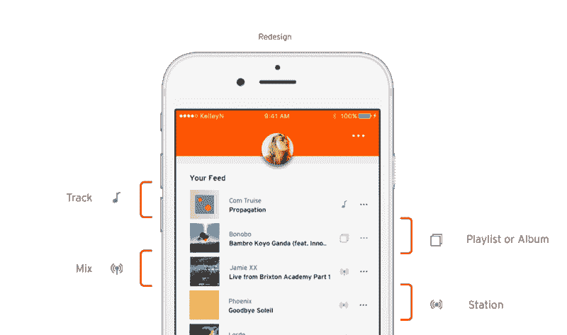

Iteration 2: Your Feed

#### 搜索

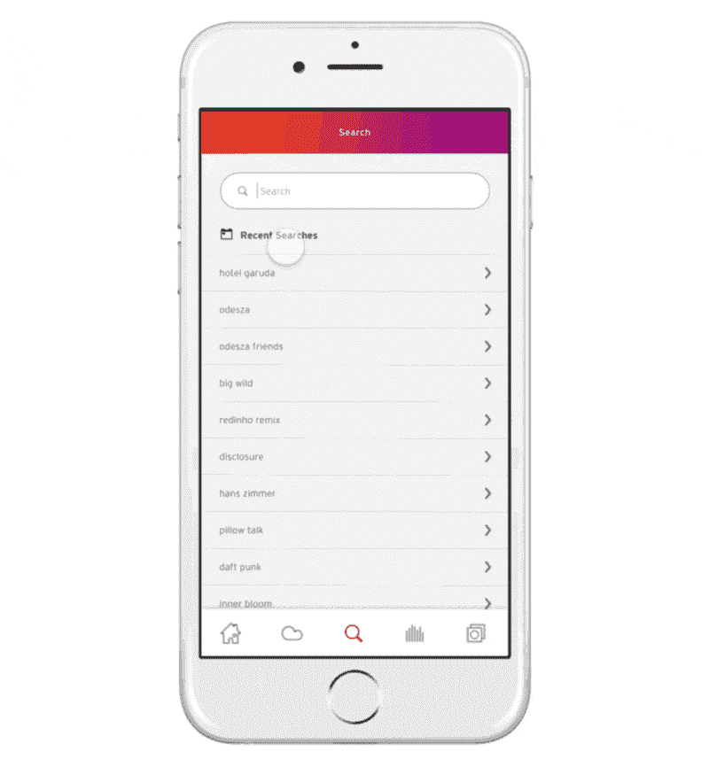

Iteration 1: search and album description

在 SoundCloud iOS 上，按下搜索标签会带你进入他们的 Discover 版本。按下页面顶部的搜索栏，将页面切换到搜索。我将搜索和发现分成两个独立的导航标签。如果听众只想搜索，他们可以按下搜索按钮。这是我第一次迭代的例子。

**搜索**包含最近的搜索，搜索结果分为各个类别的预览，如曲目、专辑、人物。

我去掉了水平滚动的过滤条，只用了一个垂直滚动来消除上下左右移动的时间。**搜索**的重新设计通过找到最相关的条目作为顶部结果并给出结果类型的片段来优化结果。

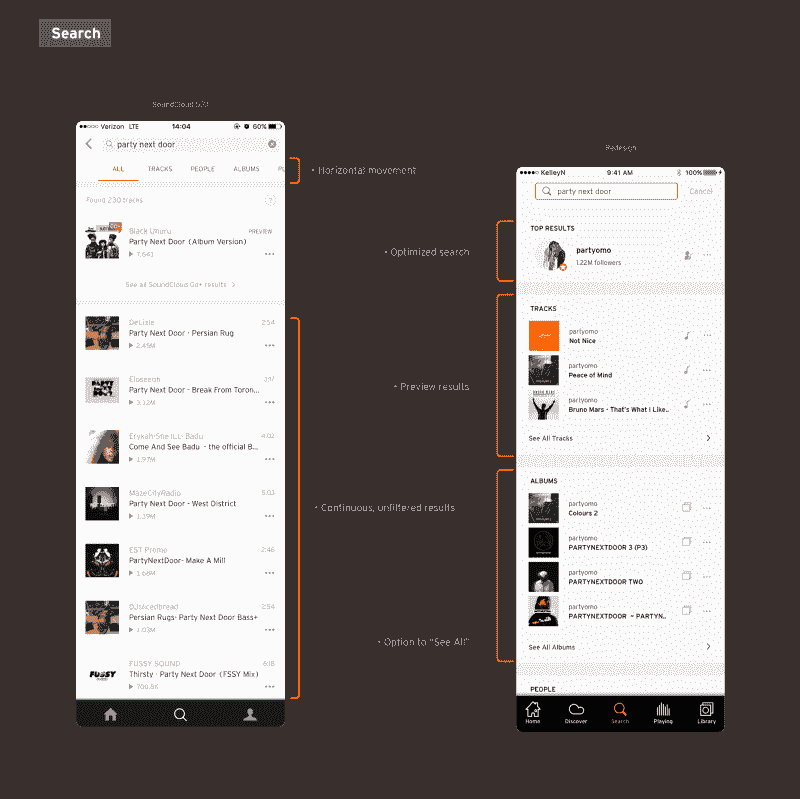

SoundCloud 5.7.1 vs Iteration 2: Search

为了将流派应用于曲目，SoundCloud 允许用户使用标签来标记他们的上传。我认为标签可以用更多的生命来引起人们的注意。

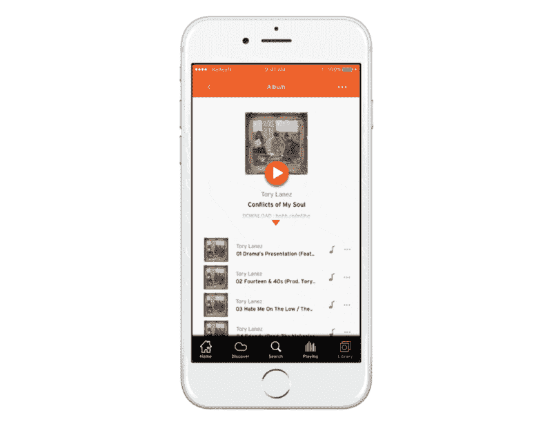

Iteration 2: album description and hashtags

#### 发现

第一次迭代的 Discover 页面更侧重于按照曲目、播放列表和专辑等类型对 SoundCloud 进行分类。我注意到在这些项目中导航变得重复(曲目、播放列表和专辑都有热门、新、建议的模块)。每个菜单项背后都没有一个主题。

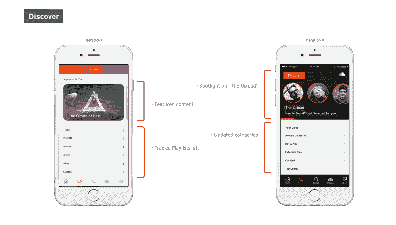

Iteration 1 vs Iteration 2: Discover landing

为了减少菜单项的随意性，我修改了 **Discover** 的网站地图，以适应 SoundCloud 狂热的节日参与者的年龄统计。我还试图为每个页面上的模块保持一定的灵活性。由于项目的不同重点，我在头脑风暴 Discover 的功能时省略了图表，并强调了 **Your Cloud，World wide，Extended Play** 和**策展的**。

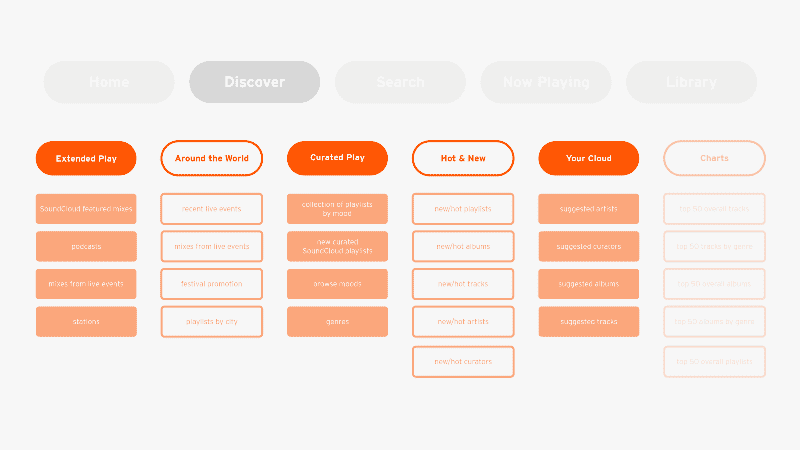

Revised Discover sitemap

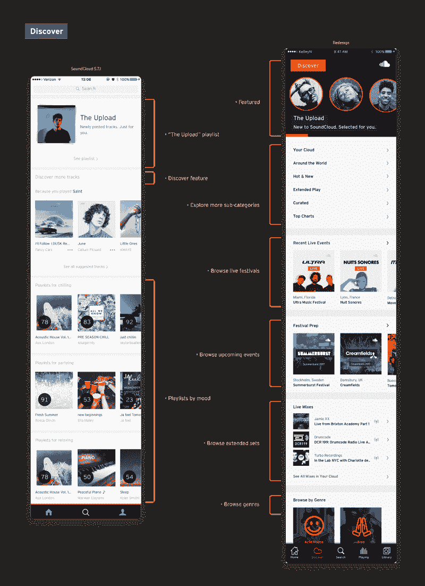

SoundCloud vs Iteration 2: Discover landing

探索>特色 ed
SoundCloud 最新加入探索[的是 Upl](https://techcrunch.com/2017/05/03/soundclouds-the-upload-uses-machine-learning-to-help-you-find-new-tracks/) oad。作为热门艺术家或由 SoundCloud 策划的播放列表的预览，我创建了一个 Featu 红色窗口，让用户浏览新鲜、新的音乐和人才。

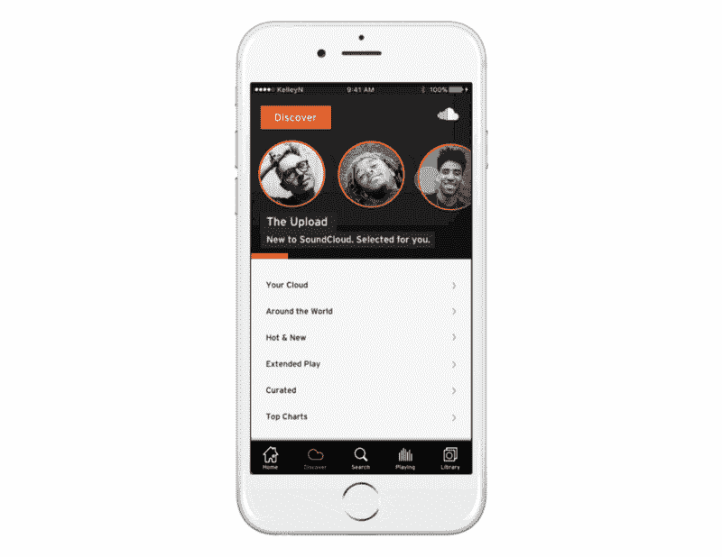

Iteration 2: featured scroll for Discover

*发现>你的音乐天地*T2【你的追随者和追随者构成了**你的音乐天地**，那里是你的音乐品味所在。您的云由您的直接同行以及您可能喜欢的推荐内容组成。随着所有这些信息在(Sou*nd】Cl*oud(ha get it)周围旋转，该功能捕捉相关的内容以加强和扩展您的聆听体验。

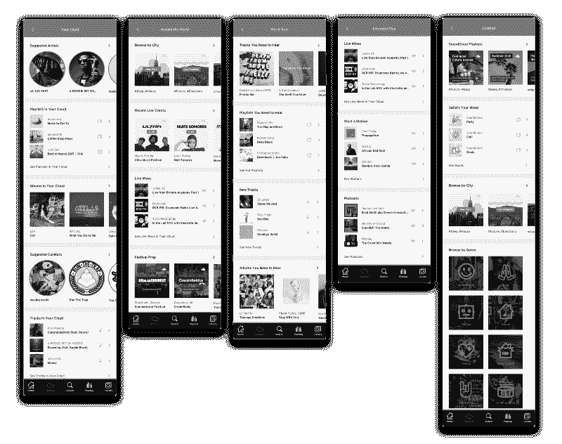

Left to Right: Your Cloud, Around the World, Hot & New, Extended Play, and Curated

*探索世界各地>世界各地*世界各地
作为世界各地独立艺术家的全球平台，SoundCloud 已经成为主要城市和场景的代言人**世界各地**世界各地涵盖大型活动、现场布景和运动。这个页面旨在将全球活动带到 SoundCloud 的表面。

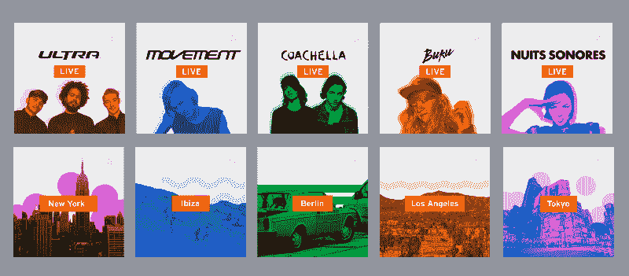

Artwork for ‘Live Events’ and ‘Cities

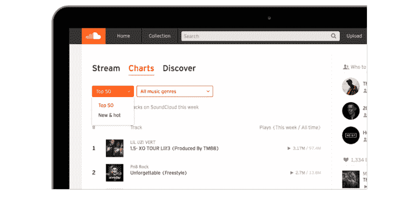

*发现>热门&* 新
这已经存在于 SoundCloud 桌面(但不在手机上)的图表下。Hot & New 识别来自新晋艺术家的病毒和值得注意的发行，这对于热门嘻哈艺术家和说唱歌手来说是完美的。

*发现>扩展 P* lay
电子音乐以成套和更长的表演 **es 而闻名。Extended Pl** ay 将上传的内容分类为混音或电台，这样用户就可以连续听几个小时的音乐。

*发现> Cura* ted
由于人类天生懒惰 **e，Cura** ted 是 SoundCloud 向听众回馈精选播放列表的方式。这些播放列表的范围可以从子流派到音乐场景中的运动。

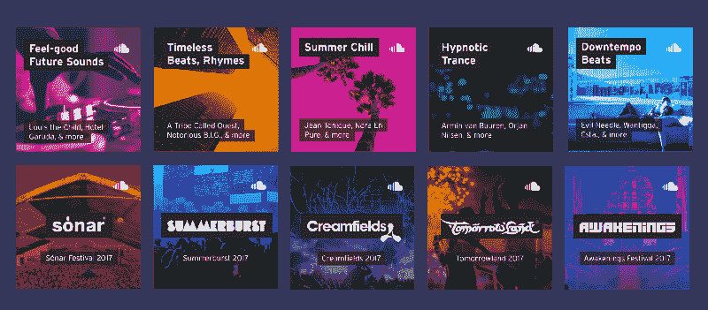

Artwork for ‘SoundCloud Playlists’ and ‘Upcoming Events’

#### 正在播放

我保留了 SoundCloud 的导航标签和 waveform 以供现在播放，但让暂停、下一个和重复等控件对用户来说更明显。我减少了对艺术品的关注，以带出媒体播放器的感觉。我还在 **Now Playing** 屏幕中放置了转贴曲目的选项，以鼓励听众在转贴到个人资料之前播放曲目。

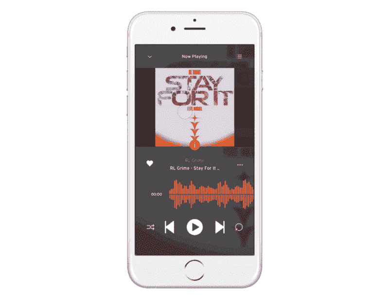

Iteration 2: track description and more

#### 图书馆

如果 SoundCloud 更多地迎合黑胶唱片收藏家和纺纱工，我可以看到 Collection 将是音乐图书馆的一个伟大的名字。但由于 SoundCloud 覆盖了如此庞大的听众群体，我想使用**库**，因为这是一个更常见的标题。

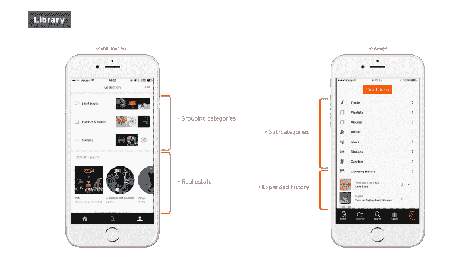

SoundCloud vs Iteration 2: Library

我加入了一个功能，不仅可以根据歌曲被喜欢的时间来过滤，还可以根据艺术家、流派或标题来过滤。这是一个我想象中的例子。

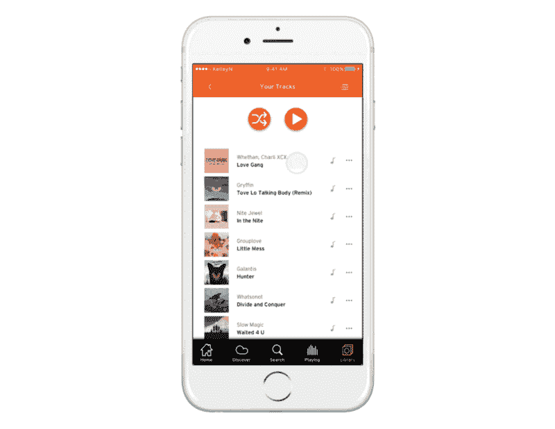

Iteration 2: filter library by artist

在 SoundCloud 上，喜欢某个东西会增加喜欢次数并将其添加到库中，但没有反馈显示“添加到库”已被执行。类似于 Apple Music 或 Spotify 在曲库中添加曲目时通知用户的方式，我为 SoundCloud 演示了该操作。

Iteration 2: adding to and removing from library

#### 轮廓

最后但同样重要的是，侧面！我的受访者要求的一些建议是显示和访问描述、链接和关注者/关注计数。我在这位艺术家的个人资料中复制了 Discover 上的帖子列表。

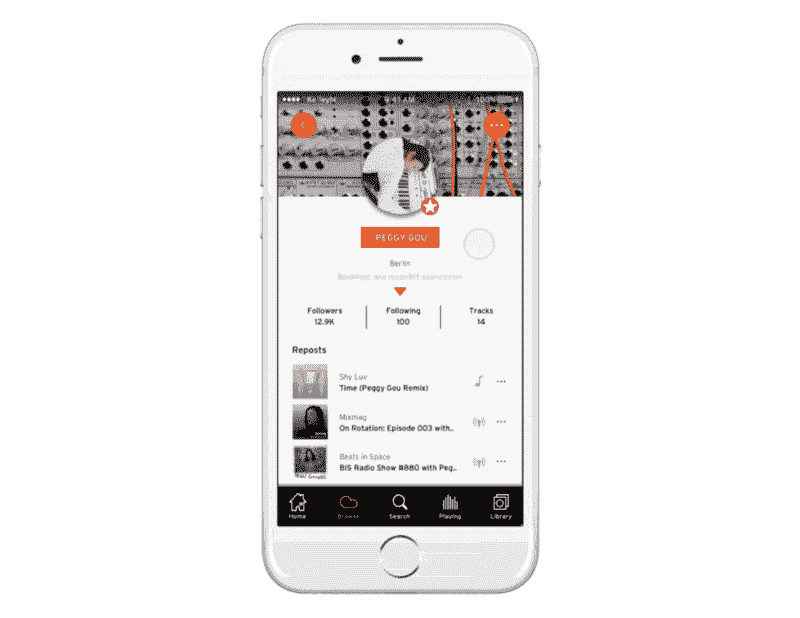

Iteration 2: artist profile and more options

任何与描述相关的东西都是自上而下的。对于更多选项，如关注、转发或访问艺术家的歌曲，菜单是自下而上的。

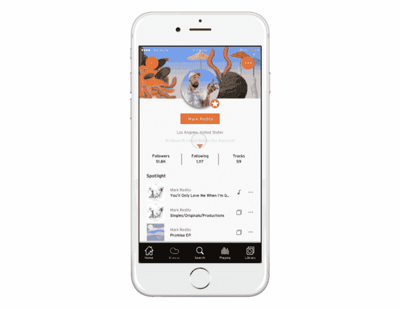

Iteration 2: artist description

### 反思所做的事情

起初只是和朋友的随意交谈，后来变成了对我们作为人类的习惯和作为听众的需求的深入调查。在过去的 4 个月里，我探索了用户体验设计的每个方面，发现我对人机交互的迷恋源于我对人的同情。

我把这个项目作为对自己的挑战，看看我到底能做什么。没有第二次猜测，没有收回。我面对判断、期望和我最大的障碍:我自己。在整个努力过程中，我锻炼了自己的优势，并利用了自己的弱点。我学到的一些强大的东西是知道如何处理变化，迭代是多么重要，以及彻底。最重要的是，*在设计和研究方面还有很多东西要学。*

那么，去哪里？我不能告诉你，因为我没有一个确切的答案(我们中的一些人没有，这完全没关系)。但是我可以告诉你:我将终生学习；成为产品设计师；向月球和更远的地方射击！

如果您想了解更多信息，请随时访问我的网站。
感谢收看！！？