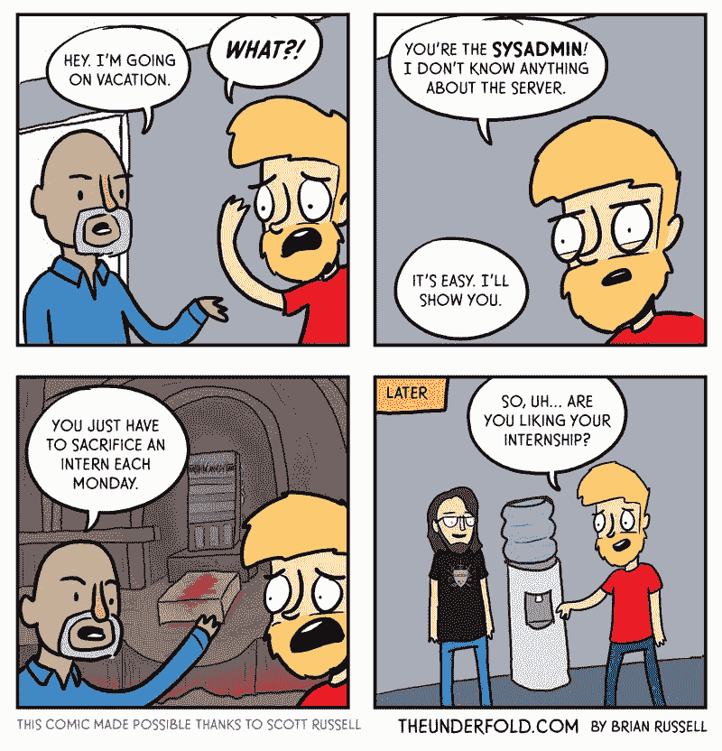
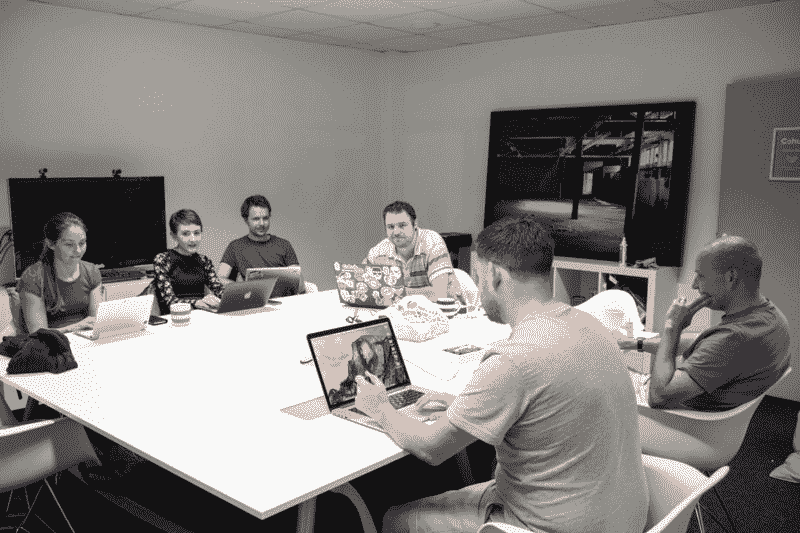

# 美国国家安全局已经开源了几十种安全工具

> 原文：<https://www.freecodecamp.org/news/the-nsa-has-open-sourced-dozens-of-security-tools-7af99cfe422/>

如果你是一个纳税的美国人，你可能想知道影子般的国家安全局(NSA)在用你的钱做什么。

好吧，除了[在旧版本的 Windows](https://fcc.im/2sszV0u) 中储存漏洞、[编写破坏核离心机的病毒](https://fcc.im/2siu0N0)之外，国家安全局[开发并开源了一些非常酷的技术:](https://fcc.im/2tkWfJA)

*   [goSecure](https://fcc.im/2sHH0fT) —一个用 Linux 和 Raspberry Pi 构建的便携式虚拟专用网络(VPN)系统
*   [安全主机基线](https://fcc.im/2sKMRBN) —根据国防部“安全主机基线”标准配置 Windows 10 和 Windows Server 2016 的指南
*   [WALKOFF](https://fcc.im/2sPeARt) —一个主动的网络防御开发框架，使您能够跨支持 WALKOFF 的编排工具编写和部署代码

你可以在这里浏览 NSA 的开源项目——以及其防御信息保障部门的项目。

### 以下是其他三个值得你花时间去做的链接:

1.  黑客马拉松是如何运作的，以及为什么你应该考虑参加一个( [5 分钟阅读](https://fcc.im/2tkPM16))
2.  vue . js:3 分钟的互动介绍( [3 分钟阅读](https://fcc.im/2rwlR4J))
3.  一名自由代码营贡献者的一天，他现在是 IBM 的一名设计师( [11 分钟观察](https://fcc.im/2sOMrKs)

### 想到这一天:

> "糟糕管理的第一法则:如果某件事不起作用，那就多做一些."—汤姆·狄马克

### 今日趣事:

网络漫画由[的下一代](http://theunderfold.com/)创作。

### 今日学习小组:

伊斯特本自由代码营

编码快乐！

–昆西·拉森，自由代码营的老师

如果你从这些邮件中获得了价值，请考虑[支持我们的非营利组织](http://bit.ly/donate-to-fcc)。