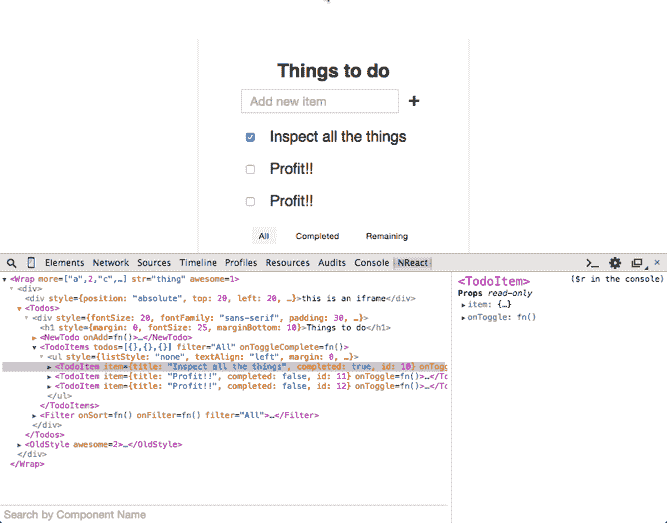
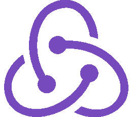
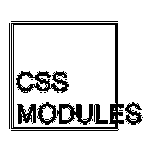
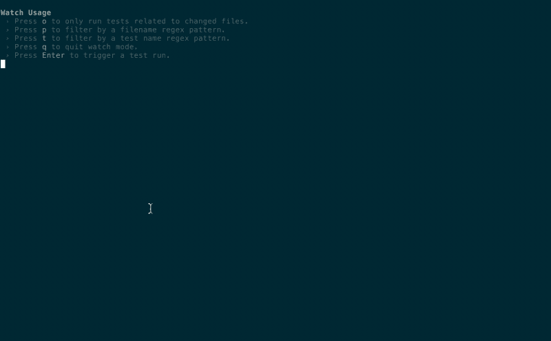
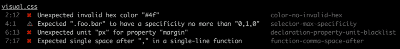

# 我们庞大的工程师团队使用该前端开发指南

> 原文：<https://www.freecodecamp.org/news/grabs-front-end-guide-for-large-teams-484d4033cc41/>

作者:杨顺泰

# 我们庞大的工程师团队使用该前端开发指南

Illustration from [https://dribbble.com/shots/3577639-Isometric-Developer-Desk](https://dribbble.com/shots/3577639-Isometric-Developer-Desk) by [Yang Heng Tay](https://www.freecodecamp.org/news/grabs-front-end-guide-for-large-teams-484d4033cc41/undefined)

前端开发从未像今天这样复杂和激动人心。每隔一天就会出现新的工具、库、框架和插件。要学的东西太多了。

幸运的是，我们在 [Grab](https://www.grab.com/sg/) 的网络团队一直在[跟进](https://blog.daftcode.pl/hype-driven-development-3469fc2e9b22)最新的最佳实践，并在我们的网络应用中融入了现代 JavaScript 生态系统。

这样做的结果是，我们的新员工或后端工程师不一定非常熟悉现代 JavaScript 生态系统，他们可能会被大量的新事物淹没，他们必须学习这些新东西才能完成他们在 web 应用程序中的功能或错误修复。

当务之急是引导他们接受前端的这种演变，学会轻松地在生态系统中导航，并在尽快将代码交付给我们的用户时变得高效。我们想出了一个学习指南来介绍我们为什么要做这些事情。

本学习指南的灵感来自于"[一个治疗 JavaScript 疲劳的学习计划](https://medium.freecodecamp.com/a-study-plan-to-cure-javascript-fatigue-8ad3a54f2eb1#.g9egaapps)"，在某种意义上，我们基于目前认为最适合 Grab 的库/框架，推荐某些库/框架学习前端开发的每个方面。

我们解释了为什么选择某个图书馆，并提供了学习资源的链接，使读者能够自己找到它。也提供了可能对其他用例更好的替代选择，以供参考和进一步的自我探索。

如果您熟悉前端开发，并且一直在关注最新的开发，那么本指南可能对您没什么用。它是针对新来的前端。

如果您的公司也在探索现代 JavaScript 堆栈，您可能会发现本学习指南对您的公司也很有用！请随意根据您的需要进行调整。根据我们最新的工作和选择，我们将定期更新本学习指南。

请注意，我们也在 [GitHub](https://github.com/grab/front-end-guide) 上发布了这份学习指南，我们将在未来对其进行更新。

[**抓取/前端引导**](https://github.com/grab/front-end-guide)
[*前端引导-？现代前端堆栈的学习指南和介绍。g*ithub.com](https://github.com/grab/front-end-guide)

*准备前端技术面试？看看这本[手册](https://github.com/yangshun/front-end-interview-handbook)，它包含了著名的前端工作面试问题的答案。*

[**阳顺/前端-面试-手册**](https://github.com/yangshun/front-end-interview-handbook)
[*前端-面试-手册-？“前端工作面试问题”几乎全部答案 g*ithub.com](https://github.com/yangshun/front-end-interview-handbook)

**先决条件**

*   对核心编程概念有很好的理解。
*   熟悉基本的命令行操作，熟悉 Git 等源代码版本控制系统。
*   网页开发经验。已经使用 Ruby on Rails、Django、Express 等框架构建了服务器端呈现的 web 应用程序。
*   理解网络是如何工作的。熟悉 web 协议和约定，如 HTTP 和 RESTful APIs。

### 我们将在本文中介绍一些内容:

*   单页应用程序(spa)
*   新时代 JavaScript
*   用户界面
*   状态管理
*   风格编码
*   测试
*   林挺 JavaScript
*   林挺 CSS
*   类型
*   构建系统
*   包装管理
*   连续累计
*   主办；主持
*   部署

如果你已经有过相关的经验，可以随意跳过其中的一些话题。

### 单页应用程序(spa)

如今，网络开发者将他们开发的产品称为网络应用，而不是网站。虽然这两个术语之间没有严格的区别，但 web 应用程序往往是高度交互式和动态的，允许用户执行操作并接收对其操作的响应。

传统上，浏览器从服务器接收 HTML 并呈现它。当用户导航到另一个 URL 时，需要刷新整个页面，服务器会为新页面发送新的 HTML。这被称为服务器端渲染。

然而，在现代 spa 中，使用客户端渲染来代替。浏览器从服务器加载初始页面，以及整个应用程序所需的脚本(框架、库、应用程序代码)和样式表。当用户导航到其他页面时，不会触发页面刷新。页面的 URL 通过 [HTML5 历史 API](https://developer.mozilla.org/en-US/docs/Web/API/History_API) 更新。新页面所需的新数据通常是 JSON 格式，由浏览器通过对服务器的 [AJAX](https://developer.mozilla.org/en-US/docs/AJAX/Getting_Started) 请求来检索。然后，SPA 通过 JavaScript 用数据动态更新页面，它已经在初始页面加载中下载了这些数据。这种模式类似于原生移动应用的工作方式。

好处:

*   这款应用的响应速度更快，用户不会因为整页刷新而看到页面导航之间的闪烁。
*   向服务器发出的 HTTP 请求更少，因为不必为每次页面加载再次下载相同的资产。
*   客户机和服务器之间关注点的清晰分离；您可以轻松地为不同平台(例如手机、聊天机器人、智能手表)构建新的客户端，而无需修改服务器代码。您还可以独立地修改客户机和服务器上的技术栈，只要不破坏 API 契约。

缺点是:

*   由于加载多个页面所需的框架、应用程序代码和资产，初始页面负载较重。
*   在您的服务器上还需要完成一个额外的步骤，即配置它将所有请求路由到一个入口点，并允许客户端路由从那里接管。
*   SPAs 依赖 JavaScript 来呈现内容，但并不是所有的搜索引擎在抓取时都执行 JavaScript，它们可能会在您的页面上看到空的内容。这在不经意间伤害了你 app 的 SEO。

虽然传统的服务器端渲染应用仍然是一个可行的选择，但清晰的客户端-服务器分离更适合大型工程团队，因为客户端和服务器代码可以独立开发和发布。当我们有多个客户端应用程序访问同一个 API 服务器时，在 Grab 上尤其如此。

随着 web 开发人员现在构建应用程序而不是页面，客户端 JavaScript 的组织变得越来越重要。在服务器端呈现的页面中，通常使用 jQuery 代码片段为每个页面添加用户交互性。然而，在构建大型 app 时，仅有 jQuery 是不够的。毕竟，jQuery 主要是一个用于 DOM 操作的库，而不是一个框架；它没有为你的应用程序定义一个清晰的结构和组织。

JavaScript 框架被创建来提供 DOM 的更高层次的抽象，允许您将状态保存在内存中，而不在 DOM 中。使用框架还带来了重用推荐概念和最佳实践来构建应用程序的好处。团队中不熟悉代码库但有框架经验的新工程师会发现理解代码更容易，因为代码是以他们熟悉的结构组织的。流行的框架有很多教程和指南，利用来自同事和社区的知识和经验将帮助新工程师快速上手。

#### 学习链接

*   [单页 App:优缺点](http://stackoverflow.com/questions/21862054/single-page-app-advantages-and-disadvantages)
*   [Web 开发的(R)进化](http://blog.isquaredsoftware.com/presentations/2016-10-revolution-of-web-dev/)
*   [这就是客户端渲染获胜的原因](https://medium.freecodecamp.com/heres-why-client-side-rendering-won-46a349fadb52)

### 新时代 JavaScript

在深入构建 JavaScript web 应用程序的各个方面之前，熟悉 web 语言— JavaScript 或 ECMAScript 是很重要的。JavaScript 是一种非常通用的语言，你也可以用它来构建网络服务器、本地移动应用和桌面应用。

在 2015 年之前，最后一次重大更新是在 2011 年的 ECMAScript 5.1。然而，近年来，JavaScript 在短时间内突然出现了巨大的改进。2015 年，ECMAScript 2015(以前称为 ECMAScript 6)发布，并引入了大量语法结构，以使编写代码不那么笨拙。如果你对此感到好奇，Auth0 写了一篇关于 JavaScript 的[历史的好文章。直到今天，并不是所有的浏览器都完全实现了 ES2015 规范。像](https://auth0.com/blog/a-brief-history-of-javascript/) [Babel](https://babeljs.io/) 这样的工具使开发者能够在他们的应用中编写 ES2015，Babel 将它们转换成 ES5 以兼容浏览器。

熟悉 ES5 和 ES2015 至关重要。ES2015 仍然相对较新，许多开源代码和 Node.js 应用程序仍然用 ES5 编写。如果在浏览器控制台中进行调试，您可能无法使用 ES2015 语法。另一方面，我们将在下面介绍的许多现代库的文档和示例代码仍然是在 ES2015 中编写的。在 Grab，我们使用 use [babel-preset-env](https://github.com/babel/babel-preset-env) 来享受未来 JavaScript 提供的语法改进带来的生产力提升，到目前为止我们一直很喜欢它。随着浏览器增加对更多 es 语言功能的原生支持，智能地确定哪些巴别塔插件是必要的(哪些新的语言功能不被支持，必须被转换)。如果你更喜欢使用已经稳定的语言特性，你可能会发现 [babel-preset-stage-3](https://babeljs.io/docs/plugins/preset-stage-3/) ，这是一个最有可能在浏览器中实现的完整规范，会更合适。

花一两天时间修改 ES5，探索 ES2015。ES2015 中更常用的功能包括“箭头和词汇 This”、“类”、“模板字符串”、“析构”、“默认/Rest/Spread 运算符”和“导入和导出模块”。

预计持续时间:3-4 天。你可以像学习其他库一样学习/查找语法，并尝试构建自己的应用。

#### 学习链接

*   [在 Codecademy 上学习 ES5](https://www.codecademy.com/learn/learn-javascript)
*   [在巴别塔上学习 es 2015](https://babeljs.io/learn-es2015/)
*   [ES6 卡塔斯](http://es6katas.org/)
*   [免费代码营](https://www.freecodecamp.com/)
*   [你不知道的 JS](https://github.com/getify/You-Dont-Know-JS) (高级内容，新手可选)

### 用户界面—反应

如果说最近几年有哪个 JavaScript 项目席卷了前端生态系统，那就是 [React](https://facebook.github.io/react/) 。React 是一个由脸书的聪明人构建并开源的库。在 React 中，开发人员为他们的 web 界面编写组件，并将它们组合在一起。

React 带来了许多激进的想法，并鼓励开发人员[重新思考最佳实践](https://www.youtube.com/watch?v=DgVS-zXgMTk)。多年来，web 开发人员被告知，分别编写 HTML、JavaScript 和 CSS 是一个很好的实践。React 做的正好相反，鼓励你用 JavaScript 编写 HTML 和 [CSS。起初这听起来像是一个疯狂的想法，但在尝试之后，它实际上并不像最初听起来那么怪异。原因是前端开发场景正在向基于组件的开发模式转变。React 的特点:](https://speakerdeck.com/vjeux/react-css-in-js)

*   陈述性的——你描述你想在你的视图中看到什么，而不是如何实现它。在 jQuery 时代，开发人员必须想出一系列步骤来操作 DOM，以便从一个应用程序状态进入下一个状态。在 React 中，您只需更改组件中的状态，视图就会根据状态进行自我更新。通过查看`render()`方法中的标记，也很容易确定组件的外观。
*   **功能** —视图是`props`和`state`的纯函数。大多数情况下，React 组件由`props`(外部参数)和`state`(内部数据)定义。对于相同的`props`和`state`，产生相同的视图。纯功能很容易测试，功能组件也一样。React 中的测试很容易，因为组件的接口定义良好，您可以通过向组件提供不同的`props`和`state`并比较呈现的输出来测试组件。
*   **可维护** —以基于组件的方式编写视图有助于重用。我们发现定义组件的`propTypes`使得 React 代码自文档化，因为读者可以清楚地知道使用该组件需要什么。最后，您的视图和逻辑在组件中是独立的，不应该受到影响，也不应该影响其他组件。这使得在大规模重构期间转移组件变得容易，只要向组件提供相同的`props`。
*   **高性能** —你可能听说过 React 使用虚拟 DOM(不要与[阴影 DOM](https://developer.mozilla.org/en-US/docs/Web/Web_Components/Shadow_DOM) 混淆)，当状态发生变化时，它会重新渲染一切。为什么需要虚拟 DOM？虽然现代的 JavaScript 引擎很快，但是读取和写入 DOM 却很慢。React 在内存中保留 DOM 的轻量级虚拟表示。重新渲染一切是一个误导性的术语。在 React 中，它实际上指的是重新呈现 DOM 的内存表示，而不是实际的 DOM 本身。当组件的底层数据发生变化时，会创建一个新的虚拟表示，并与以前的表示进行比较。这种差异(所需的最小更改集)随后被修补到真正的浏览器 DOM 中。
*   **易于学习** —学习 React 非常简单。React API surface 与[这个](https://angular.io/docs/ts/latest/api/)相比相对较小；只需要学习几个 API，而且它们不会经常改变。React 社区是最大的社区之一，随之而来的是一个充满活力的工具生态系统、开源 UI 组件和大量在线资源，可以帮助您开始学习 React。
*   **开发者体验** —有许多工具可以改善 React 的开发体验。 [React 开发者工具](https://github.com/facebook/react-devtools)是一个浏览器扩展，允许你检查你的组件，查看和操作它的`props`和`state`。使用 webpack 的热重装允许您在浏览器中查看对代码的修改，而无需刷新浏览器。前端开发涉及大量的代码调整，保存，然后刷新浏览器。热重装通过消除最后一步来帮助你。当有库更新时，脸书提供 [codemod 脚本](https://github.com/reactjs/react-codemod)来帮助你将代码迁移到新的 API。这使得升级过程相对轻松。向脸书团队致敬，他们为 React 的开发体验做出了巨大贡献。

React Developer Tools in action!

多年来，出现了比 React 性能更好的新视图库。React 可能不是最快的库，但就生态系统、整体使用体验和好处而言，它仍然是最棒的库之一。脸书也在努力让 React 更快，重写了底层的协调算法。React 引入的概念教会了我们如何编写更好的代码，更易维护的 web 应用程序，并使我们成为更好的工程师。我们喜欢这样。

我们建议浏览 React 主页上关于构建井字游戏的[教程](https://facebook.github.io/react/tutorial/tutorial.html)，感受一下 React 是什么以及它的功能。如需更深入的学习，请查看由来自 React 社区的专家 [React 路由器](https://github.com/ReactTraining/react-router/)的创建者提供的评价很高的免费课程 [React 基础](https://reacttraining.com/online/react-fundamentals)。它还涵盖了 React 文档中没有涵盖的更高级的概念。脸书的 Create React App 是一款用最少的配置搭建 React 项目的工具，强烈推荐用于启动新的 React 项目。

React 是一个库，不是一个框架，不处理视图下面的层——应用状态。稍后会详细介绍。

预计持续时间:3-4 天。尝试用 pure React 构建简单的项目，如待办事项列表、黑客新闻克隆。你会慢慢地欣赏它，并且可能会在过程中面临一些 React 无法解决的问题，这就把我们带到了下一个话题…

#### 学习链接

*   [React 官方教程](https://facebook.github.io/react/tutorial/tutorial.html)
*   [反应基础](https://reacttraining.com/online/react-fundamentals)
*   [2017 年简单的 React 开发](https://hackernoon.com/simple-react-development-in-2017-113bd563691f)
*   [表示和容器组件](https://medium.com/@dan_abramov/smart-and-dumb-components-7ca2f9a7c7d0#.5iexphyg5)

#### 可供选择的事物

*   [角度](https://angular.io/)
*   [余烬](https://www.emberjs.com/)
*   视图
*   [周期](https://cycle.js.org/)

### 状态管理—通量/还原

随着你的应用越来越大，你可能会发现应用的结构变得有点乱。整个应用程序中的组件可能不得不共享和显示公共数据，但在 React 中没有优雅的方式来处理这一点。毕竟，React 只是视图层，它并没有规定如何在传统的 MVC 范式中构建应用程序的其他层，如模型和控制器。为了解决这个问题，脸书发明了 Flux，这是一种应用程序架构，通过利用单向数据流来补充 React 的可组合视图组件。点击阅读更多关于 Flux 如何工作的信息[。总之，通量模式具有以下特征:](https://facebook.github.io/flux/docs/in-depth-overview.html)

*   **单向数据流** —使应用程序更可预测，因为可以轻松跟踪更新。
*   **关注点分离**—Flux 架构中的每个部分都有明确的职责，并且是高度解耦的。
*   **与声明式编程**配合得很好——商店可以向视图发送更新，而无需指定如何在状态之间转换视图。

由于 Flux 本身并不是一个框架，开发人员已经尝试了很多 Flux 模式的实现。最终，一个明显的赢家出现了，那就是 [Redux](http://redux.js.org/) 。Redux 结合了 Flux、 [Command pattern](https://www.wikiwand.com/en/Command_pattern) 和 [Elm architecture](https://guide.elm-lang.org/architecture/) 的思想，是目前开发人员与 React 一起使用的事实上的状态管理库。其核心概念是:

*   App **状态**由一个简单的旧 JavaScript 对象(POJO)描述。
*   分派一个**动作**(也是一个 POJO)来修改状态。
*   **减速器**是一个纯函数，接受当前状态和动作，产生新的状态。

这些概念听起来很简单，但它们非常强大，因为它们使应用程序能够:

*   在服务器上呈现它们的状态，在客户机上启动。
*   在整个应用程序中跟踪、记录和回溯更改。
*   轻松实现撤销/重做功能。

Redux 的创建者[丹·阿布拉莫夫](https://github.com/gaearon)非常用心地为 Redux 编写了详细的文档，并为学习[基础](https://egghead.io/courses/getting-started-with-redux)和[高级](https://egghead.io/courses/building-react-applications-with-idiomatic-redux) Redux 创建了全面的视频教程。它们是学习 Redux 非常有用的资源。

**组合视图和状态**

虽然 Redux 不一定必须与 React 一起使用，但强烈建议使用，因为它们可以很好地配合使用。React 和 Redux 有很多共同的想法和特点:

*   **函数组合范例** — React 组合视图(纯函数)，而 Redux 组合纯归约器(也是纯函数)。给定相同的输入集，输出是可预测的。
*   **关于**很容易推理——你可能已经听过这个术语很多次了，但它实际上是什么意思呢？我们把它解释为对我们的代码有控制和理解——我们的代码以我们期望的方式运行，当有问题时，我们可以很容易地找到它们。通过我们的经验，React 和 Redux 让调试变得更简单。由于数据流是单向的，跟踪数据流(服务器响应、用户输入事件)更容易，并且可以直接确定问题发生在哪一层。
*   **分层结构**—app/Flux 架构中的每一层都是一个纯粹的功能，有明确的职责。为纯函数编写测试相对容易。
*   **开发体验** —在开发过程中，我们投入了大量精力来创建工具，以帮助调试和检查应用程序，例如 [Redux DevTools](https://github.com/gaearon/redux-devtools) 。

Backtracking state with Redux DevTools

您的应用程序可能需要处理异步调用，比如发出远程 API 请求。redux-thunk 和 [redux-saga](https://github.com/redux-saga/redux-saga) 就是为了解决这些问题而产生的。它们可能需要一些时间来理解，因为它们需要理解函数式编程和生成器。我们的建议是只在你需要的时候处理它。

[react-redux](https://github.com/reactjs/react-redux) 是 redux 的官方 react 绑定，非常简单易学。

预计持续时间:4 天。知识分子课程可能有点耗时，但值得花时间去学。在学会 Redux 之后，你可以试着把它合并到你已经构建好的 React 项目中。Redux 解决了您在 pure React 中遇到的一些状态管理问题吗？

#### 学习链接

*   [通量主页](http://facebook.github.io/flux)
*   [Redux 主页](http://redux.js.org/)
*   [Egghead 课程 Redux 入门](https://egghead.io/courses/getting-started-with-redux)
*   [书呆子课程——用惯用的 Redux 构建 React 应用](https://egghead.io/courses/building-react-applications-with-idiomatic-redux)
*   [React Redux 链接](https://github.com/markerikson/react-redux-links)
*   你可能不需要 Redux

#### 可供选择的事物

*   [MobX](https://github.com/mobxjs/mobx)

### 使用样式编码— CSS 模块

CSS(层叠样式表)是描述 HTML 元素外观的规则。写好 CSS 很难。在一个人能够编写可维护和可伸缩的 CSS 之前，通常需要多年的经验和搬起石头砸自己的脚的挫折。CSS 有一个全局命名空间，基本上是为 web 文档设计的，而不是为支持组件架构的 web 应用程序设计的。因此，有经验的前端开发人员设计了一些方法来指导人们如何为复杂的项目编写有组织的 CSS，比如使用[smacs](https://smacss.com/)、 [BEM](http://getbem.com/) 、 [SUIT CSS](http://suitcss.github.io/) 等。

> CSS 方法带来的风格封装，是由惯例和指导方针人为强制的。当开发人员不遵循它们时，它们就崩溃了。

正如你现在可能已经意识到的，前端生态系统充满了工具，不出所料，工具已经被发明来部分解决大规模编写 CSS 的一些问题。“大规模”意味着许多开发人员在同一个大型项目中工作，接触相同的样式表。目前在用 JS 编写 [CSS 方面还没有一个社区认可的方法，我们希望有一天在所有的 Flux 实现中会出现一个赢家，就像 Redux 一样。现在，我们指望](https://github.com/MicheleBertoli/css-in-js) [CSS 模块](https://github.com/css-modules/css-modules)。CSS 模块是对现有 CSS 的改进，旨在解决 CSS 中的全局命名空间问题；它使您能够编写默认情况下是本地的并封装到组件中的样式。这个特性是通过工具实现的。有了 CSS 模块，大型团队可以编写模块化和可重用的 CSS，而不用担心冲突或覆盖应用程序的其他部分。然而，最终，CSS 模块仍然被编译成浏览器能够识别的普通全局命名空间的 CSS，学习和理解原始 CSS 的工作原理仍然很重要。

如果你是一个 CSS 初学者，Codecademy 的 [HTML & CSS 课程](https://www.codecademy.com/learn/learn-html-css)会是一个很好的入门。接下来，阅读一下 [Sass 预处理程序](http://sass-lang.com/)，它是 CSS 语言的一个扩展，增加了语法改进并鼓励风格的可重用性。研究上面提到的 CSS 方法，最后是 CSS 模块。

预计持续时间:3-4 天。尝试使用 SMACSS/BEM 方法和/或 CSS 模块来设计您的应用程序。

#### 学习链接

*   [在 Codecademy 上学习 HTML & CSS 课程](https://www.codecademy.com/learn/learn-html-css)
*   [可汗学院 HTML/CSS 简介](https://www.khanacademy.org/computing/computer-programming/html-css)
*   smacss
*   嗯
*   [套装 CSS](http://suitcss.github.io/)
*   [CSS 模块规范](https://github.com/css-modules/css-modules)
*   [萨斯主页](http://sass-lang.com/)
*   [前端工作面试问题答案— HTML](https://medium.com/@yangshun/clearing-your-front-end-job-interview-html-706f8b2c7dca) ⭐
*   [前端工作面试问题的答案— CSS](https://medium.com/@yangshun/clearing-your-front-end-job-interview-css-95bdd82871f2) ⭐

#### 可供选择的事物

*   [JSS](https://github.com/cssinjs/jss)
*   [样式组件](https://github.com/styled-components/styled-components)

### 可维护性

代码被读取的频率比它被编写的频率要高。在 Grab 尤其如此，那里的团队规模很大，我们有多个工程师跨多个项目工作。我们高度重视代码的可读性、可维护性和稳定性，有几种方法可以做到这一点:“广泛的测试”、“一致的编码风格”和“类型检查”。

### 测试— Jest +酶

Jest 是脸书开发的一个测试库，旨在让测试过程变得轻松。与脸书项目一样，它提供了开箱即用的良好开发体验。测试可以并行运行，从而缩短持续时间。在监视模式下，默认情况下，只运行对已更改文件的测试。我们喜欢的一个特性是“快照测试”。Jest 可以保存 React 组件和 Redux 状态的生成输出，并将其保存为序列化文件，因此您不必自己手动生成预期的输出。Jest 还带有内置的嘲讽、断言和测试覆盖。一个库来统治他们！

React 附带了一些测试工具，但是 Airbnb 的 [Enzyme](http://airbnb.io/enzyme/) 使用类似 jQuery 的 API 可以更容易地生成、断言、操作和遍历 React 组件的输出。建议使用酶来测试反应成分。

Jest 和 Enzyme 使编写前端测试变得有趣和容易。当编写测试变得令人愉快时，开发人员会编写更多的测试。这也有助于 React 组件和 Redux 动作 Redux 相对容易测试，因为它们有明确定义的职责和接口。对于 React 组件，我们可以测试给定一些`props`，期望的 DOM 被呈现，并且在某些模拟的用户交互时触发回调。对于 Redux reducers，我们可以测试给定一个先前的状态和一个动作，产生一个结果状态。

Jest 和 Enzyme 的文档非常简洁，通过阅读应该足以了解它们。

预计持续时间:2-3 天。尝试为您的 React + Redux 应用程序编写 Jest +酶测试！

#### 学习链接

*   [是主页](http://facebook.github.io/jest/)
*   [用 Jest 测试 React 应用](https://auth0.com/blog/testing-react-applications-with-jest/)
*   [酵素主页](http://airbnb.io/enzyme/)
*   [Enzyme:React 的 JavaScript 测试工具](https://medium.com/airbnb-engineering/enzyme-javascript-testing-utilities-for-react-a417e5e5090f)

#### 可供选择的事物

*   [AVA](https://github.com/avajs/ava)
*   [因果报应](https://karma-runner.github.io/)

### 林挺 JavaScript — ESLint

linter 是一种静态分析代码并从中发现问题的工具，有可能防止 bugs 运行时错误，同时加强编码风格。当评审者不必对编码风格进行挑剔的评论时，在拉式请求评审期间节省了时间。 [ESLint](http://eslint.org/) 是一个高度可扩展和可定制的林挺 JavaScript 代码工具。团队可以编写他们自己的 lint 规则来实施他们的定制风格。在 Grab，我们使用 Airbnb 的`[eslint-config-airbnb](https://www.npmjs.com/package/eslint-config-airbnb)`预设，它已经在 [Airbnb JavaScript 风格指南](https://github.com/airbnb/javascript)中配置了通用的良好编码风格。

在大多数情况下，使用 ESLint 就像调整项目文件夹中的配置文件一样简单。如果你不为 ESLint 编写新的规则，那就没什么好学的了。当错误浮出水面的时候，你要意识到这一点，然后谷歌一下，找出推荐的风格。

预计持续时间:半天。这里没什么可学的。将 ESLint 添加到您的项目中并修复林挺错误！

#### 学习链接

*   [诚信通主页](http://eslint.org/)
*   [Airbnb JavaScript 风格指南](https://github.com/airbnb/javascript)

#### 可供选择的事物

*   [标准](https://github.com/feross/standard)
*   [JSHint](http://jshint.com/)

### 林挺 CSS-style lint

如前所述，好的 CSS 是出了名的难写。在 CSS 上使用静态分析工具可以帮助维护我们的 CSS 代码质量和编码风格。对于林挺 CSS，我们使用 stylelint。像 ESLint 一样，stylelint 是以非常模块化的方式设计的，允许开发人员打开/关闭规则并为其编写自定义插件。除了 CSS 之外，stylelint 还能够解析 s CSS，并对 Less 提供了实验性支持，这降低了大多数现有代码库采用它的门槛。

一旦你学会了 ESLint，考虑到它们的相似性，学习 stylelint 将会很容易。stylelint 目前正在被一些大公司使用，比如脸书、T2、Github 和 T4。

stylelint 的一个缺点是 autofix 特性还没有完全成熟，只能修复有限数量的规则。但是，这个问题应该会随着时间的推移而改善。

预计持续时间:半天。这里没什么可学的。将 stylelint 添加到您的项目中，并修复林挺错误！

#### 学习链接

*   [stylelint 主页](https://stylelint.io/)
*   [用 stylelint 对你的 CSS 进行 lint](https://css-tricks.com/stylelint/)

#### 可供选择的事物

*   [Sass Lint](https://github.com/sasstools/sass-lint)
*   [CSS 功能区](http://csslint.net/)

### 类型—流量

编写应用程序时，静态类型带来了许多好处。他们可以在早期发现代码中的常见错误。类型还可以作为代码的文档形式，提高代码的可读性。随着代码库变得越来越大，我们看到了类型的重要性，因为当我们进行重构时，它们给了我们更大的信心。当清楚每个对象拥有什么样的值以及每个函数期望和返回什么样的参数时，也更容易让团队的新成员加入到项目中来。

> 向代码中添加类型需要权衡增加的冗长性和语法的学习曲线。但这种学习成本是预先支付的，并随着时间的推移分期偿还。在复杂的项目中，代码的可维护性很重要，从事代码工作的人会随着时间的推移而改变，向代码中添加类型带来的好处要多于坏处。

最近，我不得不修复一个几个月没碰过的代码库中的一个 bug。多亏了类型，我可以很容易地刷新自己的代码在做什么，并给了我修复的信心。

在 JavaScript 中加入静态类型的两个最大竞争者是 [Flow](https://flow.org/) (脸书)和 [TypeScript](https://www.typescriptlang.org/) (微软)。到目前为止，这场战斗还没有明显的赢家。目前，我们已经做出了使用 Flow 的选择。我们发现，与 TypeScript 相比，Flow 具有更低的学习曲线，并且将现有代码基础迁移到 Flow 需要相对更少的工作。由脸书创建的 Flow 与 React 生态系统有着更好的集成。[《心流》的作者之一詹姆斯·凯尔](https://twitter.com/thejameskyle)，已经[写了](http://thejameskyle.com/adopting-flow-and-typescript.html)关于采用心流和打字稿之间的比较。

无论如何，从 Flow 转移到 TypeScript 并不是非常困难，因为语法和语义非常相似，我们将在未来的时间里重新评估这种情况。毕竟用一个总比什么都不用强。

Flow 最近修改了他们的主页，现在看起来非常整洁！

预计持续时间:1 天。由于类型注释感觉像是 JavaScript 语言的自然扩展，因此 Flow 非常容易学习。将流注释添加到您的项目中，并利用类型系统的强大功能。

#### 学习链接

*   [流量主页](https://flow.org/)
*   [打字稿对流程](https://github.com/niieani/typescript-vs-flowtype)

#### 可供选择的事物

*   [打字稿](https://www.typescriptlang.org/)

### 构建系统— webpack

这一部分将保持简短，因为设置 webpack 可能是一个乏味的过程，并且可能会使那些已经被他们必须为前端开发学习的新东西淹没的开发人员感到厌烦。简而言之， [webpack](https://webpack.js.org/) 是一个模块捆绑器，它将一个前端项目及其依赖项编译成一个最终的捆绑包提供给用户。通常，项目已经设置了 webpack 配置，开发人员很少需要更改它。从长远来看，理解 webpack 仍然是一件好事。正是由于 webpack，像热重载和 CSS 模块这样的特性才成为可能。

我们发现 SurviveJS 的 [webpack 演练](https://survivejs.com/webpack/foreword/)是学习 webpack 的最佳资源。它是对官方文档的一个很好的补充，我们建议首先遵循演练，然后在需要进一步定制时参考文档。

预计持续时间:2 天(可选)。

#### 学习链接

*   [webpack 主页](https://webpack.js.org/)
*   [SurviveJS — Webpack:从学徒到大师](https://survivejs.com/webpack/foreword/)

#### 可供选择的事物

*   [Rollup](https://rollupjs.org/)
*   [浏览确认](http://browserify.org/)

### 包装管理—纱线

如果你看一眼你的`node_modules`目录，你会被其中包含的目录数量所震惊。每个 babel 插件，lodash 函数，都是一个独立的包。当您有多个项目时，这些包在每个项目中都是重复的，它们在很大程度上是相似的。每次你在一个新项目中运行`npm install`时，这些包会被反复下载，即使它们已经存在于你电脑中的其他项目中。

通过`npm install`安装的包中也有不确定性的问题。我们的一些 CI 构建失败是因为在 CI 服务器安装依赖项时，它对一些包含重大变更的包进行了小的更新。如果库作者尊重 [semver](http://semver.org/) 并且工程师不认为 API 合同会一直被尊重，这就不会发生。

[纱](https://yarnpkg.com/)解决了这些问题。已安装软件包的不确定性问题是通过一个`yarn.lock`文件来处理的，这确保了所有机器上的每次安装都会在`node_modules`中产生完全相同的文件结构。Yarn 在你的机器中使用了一个全局缓存目录，以前下载过的包不需要再次下载。这也支持依赖项的离线安装！

最常见的纱线指令可以在[这里](https://yarnpkg.com/en/docs/usage)找到。大多数其他 yarn 命令与`npm`相似，使用`npm`版本也可以。我们最喜欢的命令之一是`yarn upgrade-interactive`,它使得更新依赖关系变得轻而易举，尤其是当现代 JavaScript 项目需要如此多的依赖关系时。一定要去看看！

npm@5.0.0 于 2017 年 5 月发布，它似乎解决了 Yarn 旨在解决的许多问题。一定要留意它！

预计持续时间:2 小时。

#### 学习链接

*   [纱线主页](https://yarnpkg.com/)
*   Yarn:一个新的 JavaScript 包管理器

#### 可供选择的事物

*   [老好人 npm](https://github.com/npm/npm/releases/tag/v5.0.0)

### 连续累计

我们将 [Travis CI](https://travis-ci.com/) 用于我们的持续集成(CI)渠道。Travis 是 Github 上一个非常受欢迎的 CI，它的[构建矩阵](https://docs.travis-ci.com/user/customizing-the-build#Build-Matrix)特性对于像 Grab 这样包含多个项目的存储库非常有用。我们将 Travis 配置为执行以下操作:

*   为这个项目跑林挺。
*   为项目运行单元测试。
*   如果测试通过:
*   Jest 生成的测试覆盖上传到 [Codecov](https://codecov.io/) 。
*   用 webpack 生成一个生产包到一个`build`目录中。
*   `tar``build`目录为`<hash&g`t；。焦油，并上传到一个 S3 桶存储我们所有的焦油建设。
*   向 Slack 发布通知，告知 Travis 构建结果。

#### 学习链接

*   [特拉维斯主页](https://travis-ci.com/)
*   [Codecov 主页](https://codecov.io/)

#### 可供选择的事物

*   詹金斯
*   循环

### 托管—亚马逊 S3

传统上，接收对网页的请求的 web 服务器将在服务器上呈现内容，并返回包含对请求者有意义的动态内容的 HTML 页面。这就是所谓的服务器端渲染。正如前面在单页应用程序一节中提到的，现代 web 应用程序不涉及服务器端呈现，使用提供静态资产文件的 web 服务器就足够了。Nginx 和 Apache 是可能的选择，启动和运行它们不需要太多的配置。需要注意的是，web 服务器必须配置为将所有请求路由到单个入口点，并允许客户端路由接管。前端路由的流程如下:

1.  Web 服务器接收特定路由的 HTTP 请求，例如`/users/john`。
2.  不管服务器接收哪条路由，都从静态资产目录提供`index.html`。
3.  `index.html`应该包含加载处理客户端路由的 JavaScript 框架/库的脚本。
4.  客户端路由库读取当前路由，并与 MVC(或相关的等效物)框架就当前路由进行通信。
5.  MVC JavaScript 框架基于路线呈现期望的视图，如果需要，可能在从 API 获取数据之后。例如，加载`UsersController`，获取用户名为`john`的用户数据作为 JSON，将数据与视图结合，并在页面上呈现。

提供静态内容的一个良好实践是使用缓存并将它们放在 CDN 上。我们使用[亚马逊简单存储服务(S3)](https://aws.amazon.com/s3/) ,因为它可以托管和充当我们静态网站内容的 CDN。我们发现这是一种经济实惠、可靠的解决方案，能够满足我们的需求。S3 提供了“使用这个桶来托管一个网站”的选项，这实质上是将所有路由的请求定向到桶的根，这意味着我们不需要自己的具有特殊路由配置的 web 服务器。

我们在 S3 托管的一个网络应用的例子是 [Hub](https://hub.grab.com/) 。

除了托管网站，我们还使用 S3 托管从每个成功的 Travis 构建生成的构建`.tar`文件。

#### 学习链接

*   [亚马逊 S3 主页](https://aws.amazon.com/s3/)
*   [在亚马逊 S3 上托管一个静态网站](https://docs.aws.amazon.com/AmazonS3/latest/dev/WebsiteHosting.html)

#### 可供选择的事物

*   [谷歌云平台](https://cloud.google.com/storage/docs/hosting-static-website)
*   [现在](https://zeit.co/now)

### 部署

将产品交付给用户的最后一步是部署。我们使用 [Ansible Tower](https://www.ansible.com/tower) ，这是一个强大的自动化软件，使我们能够轻松地部署我们的构建。

如前所述，在成功构建之后，我们所有的提交都被上传到一个用于构建的中央 S3 存储桶中。我们遵循 semver 来发布我们的版本，并有命令来自动生成最新版本的发行说明。到了发布的时候，我们运行一个命令来标记最近的提交，并将其推送到我们的代码托管环境。Travis 将在标记的提交上运行 CI 步骤，并将带有版本的 tar 文件(如`1.0.1.tar`)上传到我们的 S3 构建桶。

在 Tower 上，我们只需指定我们想要部署到托管桶的`.tar`的名称，Tower 会执行以下操作:

1.  从我们的 builds S3 页面下载所需的`.tar`文件。
2.  提取指定环境的配置文件中的内容并进行交换。
3.  将内容上传到托管桶。
4.  向 Slack 发布通知，告知部署成功。

整个过程不到 30 秒就完成了，使用塔式服务器可以轻松地进行部署和回滚。如果我们意识到发生了错误的部署，我们可以简单地找到以前的稳定标签并部署它。

#### 学习链接

*   [安斯比尔塔主页](https://www.ansible.com/tower)

### 旅程才刚刚开始

恭喜你走到这一步！今天的前端开发很难，但也比以前更有趣。到目前为止，我们所介绍的内容将帮助 Grab 的 web 团队中的任何新工程师快速掌握我们的技术。还有更多的东西需要学习，但是在基础知识上打下坚实的基础将有助于学习其余的技术。这个有用的[前端 web 开发者路线图](https://github.com/kamranahmedse/developer-roadmap#-front-end-roadmap)展示了每个方面可用的替代技术。

[Grab](https://www.grab.com/) 是东南亚(SEA)领先的运输平台，我们的使命是利用最新的技术和我们公司的人才推动 SEA 向前发展。截至 2017 年 5 月，拉手[每天有 230 万人次](https://www.bloomberg.com/news/videos/2017-05-11/tans-says-company-has-more-than-850-000-drivers-video)，我们正在快速增长和招聘。

因此，我们基于对快速成长的 Grab 工程团队来说重要的东西——代码库的可维护性和稳定性，做出了我们的技术决策。这些决策可能适用于也可能不适用于较小的团队和项目。一定要评估什么最适合你和你的公司。

随着前端生态系统的发展，我们正在积极探索、试验和评估新技术如何使我们成为更高效的团队并提高我们的生产力。我们希望这篇文章能让你深入了解我们在 Grab 使用的前端技术。如果你对我们的工作感兴趣，我们将雇佣你！

如果你喜欢这篇文章，请不要忘记留下？(你知道可以不止一次鼓掌吗？自己试试看！).你也可以在 F [acebook](https://www.facebook.com/grabengineering/) 和 T [witter 上关注我们。](https://twitter.com/grabengineering)

*这篇文章最初发表在 [Grab 的工程博客](http://engineering.grab.com/grabs-front-end-study-guide)上。最初的学习指南可以在 [Github](https://github.com/grab/front-end-guide) 上找到，未来的更新将在那里进行。*

[**抓取/前端引导**](https://github.com/grab/front-end-guide)
[*前端引导-？现代前端堆栈的学习指南和介绍。g*ithub.com](https://github.com/grab/front-end-guide)

*作者[郑阳顺](https://github.com/yangshun)。非常感谢乔尔·洛、[李凯](https://github.com/li-kai)和[谭薇·森](https://github.com/xming13)审阅了本文的草稿。*

*准备前端技术面试？看看这本[手册](https://github.com/yangshun/front-end-interview-handbook)，它包含了著名的前端工作面试问题的答案。*

[**阳顺/前端-面试-手册**](https://github.com/yangshun/front-end-interview-handbook)
[*前端-面试-手册-？“前端工作面试问题”几乎全部答案 g*ithub.com](https://github.com/yangshun/front-end-interview-handbook)

### 更多阅读

**通用**

*   [JavaScript 的现状:新来者的地图](http://www.infoq.com/articles/state-of-javascript-2016)
*   [现代前端开发工作流程的搭便车指南](http://marcobotto.com/the-hitchhikers-guide-to-the-modern-front-end-development-workflow/)
*   [2016 年学习 JavaScript 的感受](https://hackernoon.com/how-it-feels-to-learn-javascript-in-2016-d3a717dd577f#.tmy8gzgvp)
*   [2017 年成为网页开发者的路线图](https://github.com/kamranahmedse/developer-roadmap#-frontend-roadmap)
*   [面向古代网络开发者的现代 JavaScript】](https://trackchanges.postlight.com/modern-javascript-for-ancient-web-developers-58e7cae050f9)

**其他学习指南**

*   [治愈 JavaScript 疲劳的研究计划](https://medium.freecodecamp.com/a-study-plan-to-cure-javascript-fatigue-8ad3a54f2eb1#.c0wnrrcwd)
*   [JS 栈从头开始](https://github.com/verekia/js-stack-from-scratch)
*   [初级 JavaScript 学习计划](https://medium.freecodecamp.com/a-beginners-javascript-study-plan-27f1d698ea5e#.bgf49xno2)