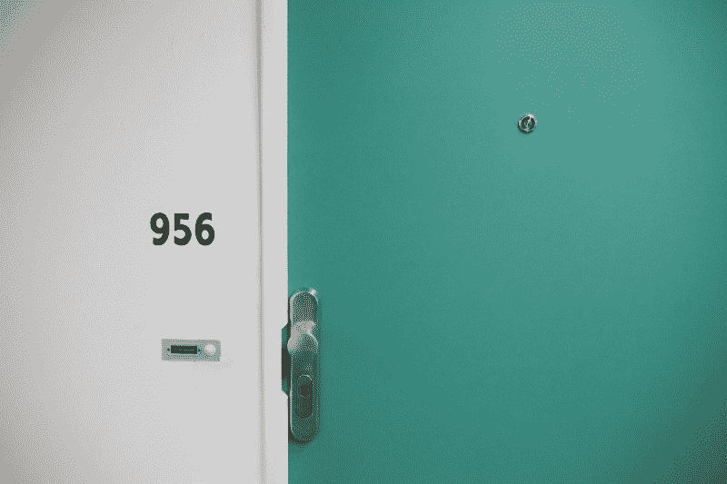
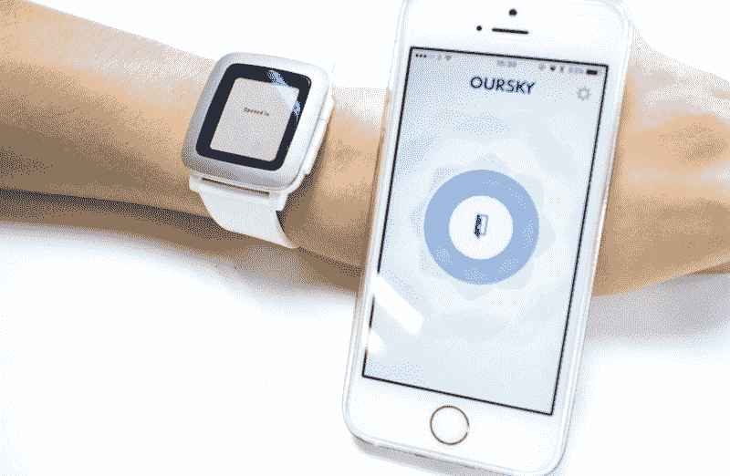
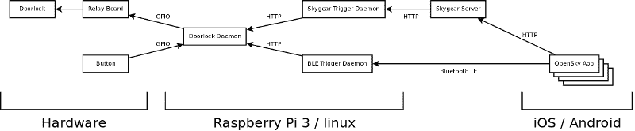
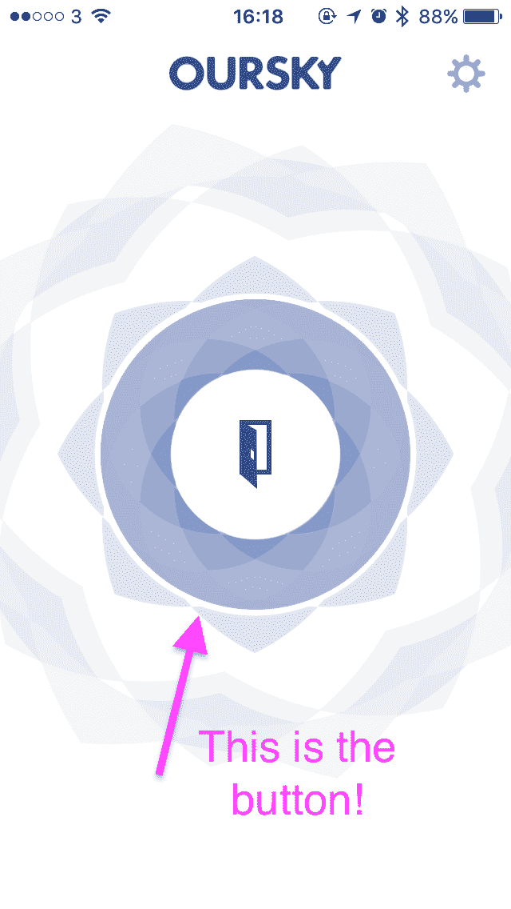
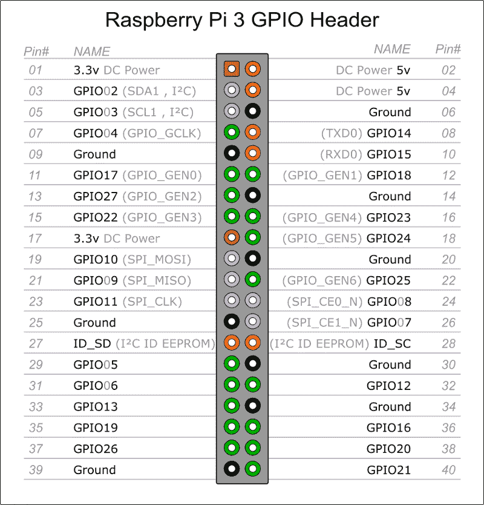
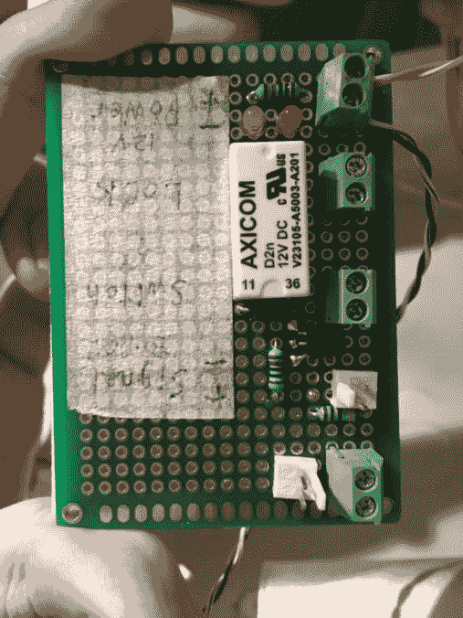
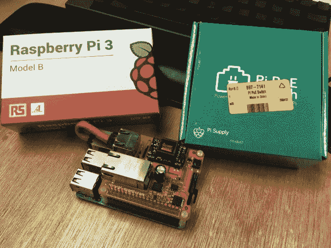

# 如何过度设计门锁

> 原文：<https://www.freecodecamp.org/news/how-to-over-engineer-a-door-lock-863b5d58dd0d/>

史蒂文·陈

# 如何过度设计门锁

Image by Antonina Bukowska via [Unsplash](https://unsplash.com/photos/PpwqEpJ9UaQ)

我公司的物联网(IoT)项目始于我们无法重置从前一个租户那里继承来的门锁。这是我们搬进新办公室后了解到的一个小细节。

通常情况下，人们会花钱买一个新的。但是我们的团队太便宜了，没有人想要更换门锁，也没有人想要门铃。另外，我们是工程师，我们想摆弄一些硬件。

我们的目标是用手机或可穿戴技术开门。对于如何解决这个问题，我们有几种选择。理论上，我们可以使用一个应用程序，集成到另一个平台，或者任何可以发送信号来触发门锁的东西。

Chima Open Door on Pebble and iOS

到目前为止，在我们的门锁实验中，我们已经为 Slack 集成、原生 iOS 和 Android 应用程序、Apple Watch 和 Pebble 开发了解决方案。我将重点介绍移动应用程序的架构。我承认最终产品有点过度设计，但我们就是喜欢它！

### ***iOS 和 Android 架构***

*Our IoT door lock project’s architecture*

当你在我们的 iOS / Android 应用程序中按下按钮时，到底会发生什么？一个 HTTP 请求被发送到云服务器，然后云服务器通过客户端服务器向门锁守护进程发送一条消息，然后通知中继板打开门锁。

传统上，门锁是用门旁的按钮打开的。但是随着现代技术的发展，可能性已经超越了直接的物理按钮。除了触发图中`Doorlock Daemon`的物理按钮，我们还添加了另外两个触发器:一个基于云的触发器和一个蓝牙低能耗(BLE)触发器，这要归功于我们对硬件的选择。

本文重点介绍基于云端的触发器，这也是我们门锁 app 所依赖的。

### 从按下按钮到保存在 Skygear 服务器上的记录。

当用户按下手机应用程序上的开门按钮时，应用程序将访问云服务器。

两件事发生在云服务器上。首先，记录被保存到我们选择的服务器 [Skygear 云数据库](https://docs.skygear.io/guides/)，这允许你将数据同步到云。服务器将在请求开门时记录。

一旦记录被保存，它将触发由 [Skygear 云函数](https://docs.skygear.io/guides/)提供的`after_save`函数，该函数在云中运行我们的代码，而不会干扰服务器部署。

`after_save`功能在记录保存后触发。当保存类型为`'OpenDoor'`的记录时，异步触发`def after_open_door_save(record, original_record, db):`。该功能向渠道`'xxx-channel'`发布消息。

### Raspberry Pi 上的节点客户端和 Clojure 服务器

下一步是为请求创建一个侦听器。这就是 Raspberry Pi 上的节点客户机和 Clojure 服务器的用武之地。节点客户端在 Skygear 服务器上的指定通道中监听消息。Clojure 服务器是唯一有权访问 Raspberry Pi 3 电路的服务器。然后，一旦节点客户机听到任何消息，它就向 Clojure 服务器发出请求。

这是节点客户端的脚本，其中包括与我们对 Skygear 的特定配置相关的代码。端点和 API 密钥用于访问 Skygear 上的主服务器。`skygear.on('xxx-channel', onReceiveOpenDoor)`表示在`'xxx-channel'`通道收到消息时，订阅函数回调(`onReceiveOpenDoor`)。

Clojure 服务器直接控制 Raspberry Pi 上的通用输入/输出(GPIO)。GPIO 是树莓 Pi 3 上的管脚。GPIO 连接到与门磁铁相连的外部电路。

下面是 Clojure 代码，展示了 Raspberry Pi 是如何开门的。一旦 Clojure 服务器接收到来自节点客户端的请求，它将打开门并将其设置为打开 3 秒。但是，如果在这 3 秒钟内有新的请求进来，门会将计时器重置为另一个 3 秒钟。当倒计时结束时，门会再次锁上。

随机边注:Skygear 在美国用的是 AWS，而 door 和 Raspberry Pi 在香港。实际上，我们的芝麻開門(奇马开门)请求在到达门前会环游世界。

### 为什么是树莓派？

现在，你可能想知道为什么我们特别选择了树莓派。我们考虑使用 Arduino 板，因为我们在办公室里就有。我们无法使用我们特定的 Arduino 模型的原因是因为我们希望通过 Skygear JS SDK 同步数据，而这个特定的 Arduino 无法设置节点服务器。

此外，Raspberry Pi 支持蓝牙低能耗(这意味着我们可以使用第三种方法，蓝牙来访问门锁)。

Linus-based Raspberry Pi is compatible with Oursky’s open-source serverless platform, Skygear

### 附加集成

考虑到该应用程序仅供内部使用，我们启动了一个 [Slack](http://www.slack.com/) 定制命令`/chima-open-door`来开门，因为每个用户都可以访问 [Slack](http://www.slack.com/) 。

后来 Oursky 的其他一些同事也参与了这个项目，并帮助编写了发布在内部平台上的 WatchOS 应用程序和 Android 应用程序。除了在应用程序中按下按钮，我们还提供了其他选择，如 iOS 3D touch、Today extension、Android widget 甚至 Pebble 集成，因为我们的一些开发人员使用它。

就是这样！在深入研究之前，还有另外两个主要因素需要考虑:反向电流(在本例中是指 Raspberry Pi)和每个集成的安全性。例如，我们还将蓝牙应用程序访问与蓝牙低能耗(BLE)集成在一起，后者具有自我实现的类似 2FA 的身份验证。您可以包括的其他集成有门打开时的通知(铃声、LED)。

如果你想了解以上任何一项，欢迎随时联系！

**链接到回购/文件**
门锁:[https://github.com/oursky/doorlock](https://github.com/oursky/doorlock)

我要感谢我的同事们:吴志强、鲍里斯、阿基罗兹、布莱恩和 T4 壹貳參肆零零)和 [May Yeung](https://www.freecodecamp.org/news/how-to-over-engineer-a-door-lock-863b5d58dd0d/undefined) 分别负责 Android 应用、circuit implementation&clo jure、Pebble 应用和这篇博客文章。为团队合作干杯！

在 Oursky，我们致力于帮助品牌和企业家实现他们的想法，开发人员也是如此——我们的最新项目 sky gear([https://sky gear . io](https://skygear.io))，一个开源(【https://github.com/skygeario】T3)移动、网络&物联网应用的无服务器平台，帮助您更快地构建更好的应用。？