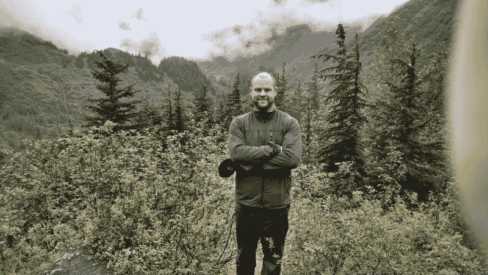
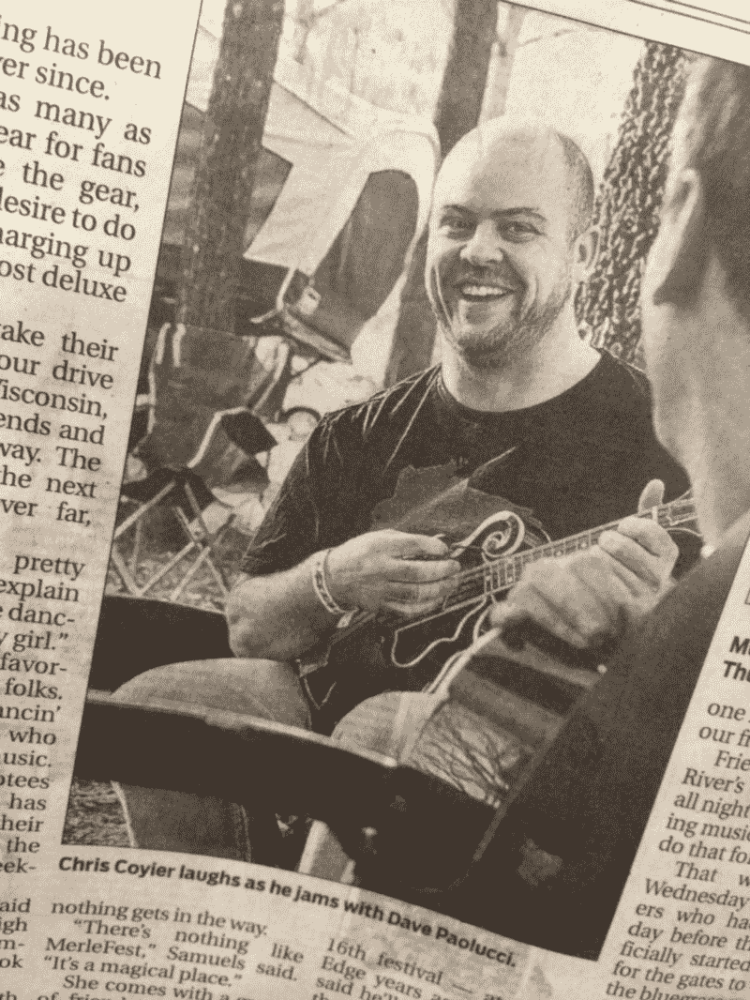
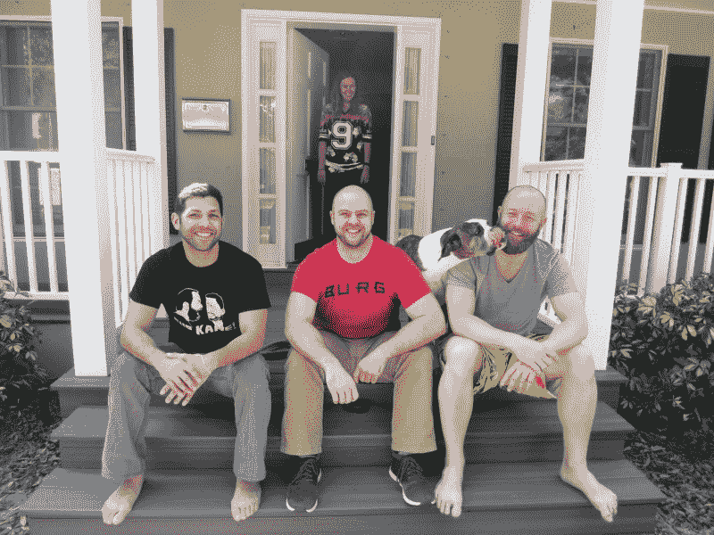
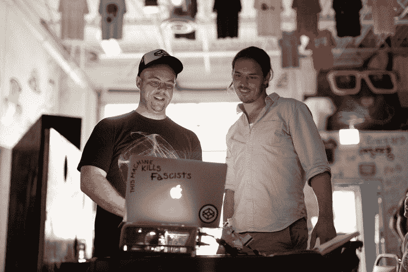
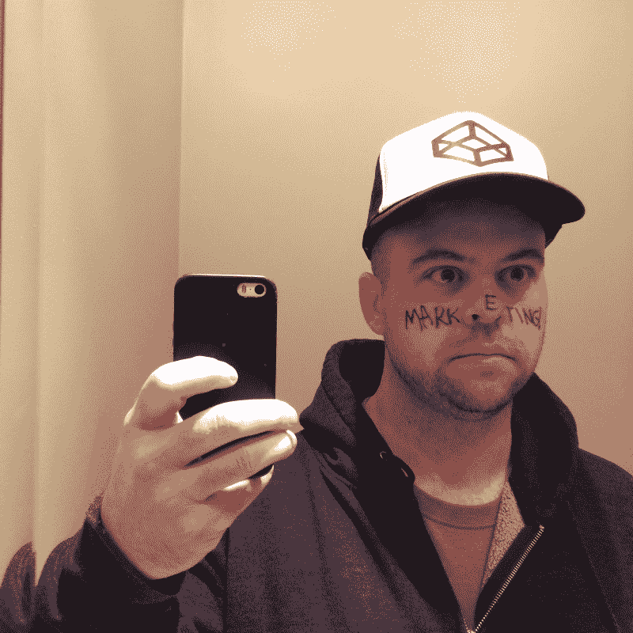
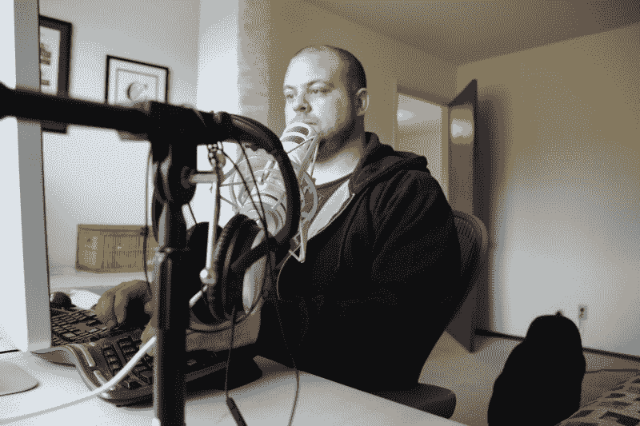
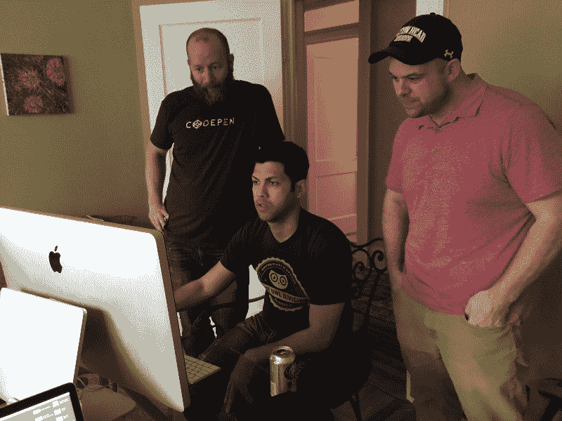
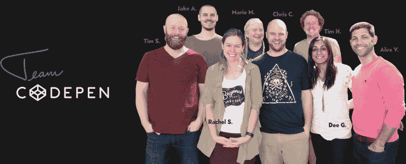

# 线与线之间:对 CodePen & CSS-Tricks fame 的克里斯·科伊尔的采访

> 原文：<https://www.freecodecamp.org/news/between-the-wires-an-interview-with-chris-coyier-of-codepen-css-tricks-fame-f010517ad78e/>

作者:Preethi Kasireddy

# 线与线之间:对 CodePen & CSS-Tricks fame 的克里斯·科伊尔的采访

Chris enjoying the midwest

*我采访了前端知名协作“游乐场” [CodePen.io](http://codepen.io/) 的联合创始人、 [CSS-Tricks](https://css-tricks.com/) 的创始人，一个致力于教授所有网页设计和开发的网站，以及关于前端网页设计、开发和 UX 的直播播客* [商店脱口秀](http://shoptalkshow.com) *的联合主持人。*

#### 告诉我们一些关于你自己的事情——你在哪里长大，你的童年是怎样的？

我是一个纯粹的中西部人——正如我现在所坐的，我在威斯康星州密尔沃基，离我在威斯康星州麦迪逊长大的地方不远。

我有一个超级正常(至少是我的正常版本)的成长经历——一个住在小镇上的中产阶级家庭。我很小的时候就有了一台电脑，我的想法受到了鼓励，我有机会接受良好的教育并抓住了这个机会。我觉得卡片以一种有趣的方式为我排好了队。高中时，我选修了一门令我兴奋的编程课，最终我为此上了大学。

### 告诉我们你的第一次编程经历。

直到一次高中选修课，我才获得了合法的编程经验。我有一位名叫斯科特先生的老师，他对我产生了积极的影响。在他的课上，我学得最多的语言叫做 Turbo Pascal。斯科特先生教了我们一些基础知识，但他鼓励我们马上投入到真正的项目中去。我记得我工作的第一个重要产品只是一个生命游戏的 Pascal 版本。

这个游戏最终被发表在一本小杂志上，从那以后我完全被吸引住了。

#### 在你的播客中，你提到后来在大学里追求计算机科学学位，但最终转到了某种艺术专业。你能告诉我们这种转变吗？你的技能、兴趣和职业是如何发展的？

> “懒惰、自私和嫉妒让我转而从事艺术，但事实证明这是正确的选择。”

在经历了高中所有积极的经历后，当我上大学时，我立刻意识到我想主修计算机科学。这个学位叫做*管理计算机系统，*这应该是一个危险信号。不足为奇的是，它更多的是关于编程的商业方面。

我学的是我不感兴趣的语言，老师也不是特别投入。真是令人失望。它没有扼杀我成为一名程序员的梦想，但我确实对这个想法有点不抱幻想。尽管如此，我仍然是一个不折不扣的电脑迷。

与此同时，我和一个陶瓷专业的学生住在一起，他有一个很大的艺术学生社区。我会跟着他去艺术派对，我会和他一起去艺术大楼的工作室。我真的相信他的大学生活要比我的好得多。他找到了真正的激情，找到了更好的社区。老实说，我很嫉妒他的大学生活。

最终，我决定从计算机科学转向艺术。我有一种感觉，我在大学里学的东西没那么重要，生活最终会有结果的。

我的父母通常非常支持我，但当我告诉他们我放弃了计算机科学时，他们很生气。他们担心我放弃了我的大学生涯。但是，我径直走进行政办公室，告诉他们我要换工作了。

好消息是我马上就喜欢上了它。我喜欢它。这是我做过的最好的事情。我毕业于威斯康星大学白水分校，获陶艺学士学位。

Chris graduated with a BA in Ceramics

#### 艺术专业毕业后，从毕业到开始 CodePen，你都做了些什么？你是否有一堆工作要做，或者你是否知道自己想做什么？

> “事实证明，很难一头扎进去，然后被聘为设计师。我没有足够的信心。”

算是吧。那里有一个相当大的跨度。

当我离开大学时，我的恐惧变成了现实。我不知道我实际上要做什么。马上就有了找工作的动力，申请了一堆地方，但是一点经验都没有。

事实证明，很难一头扎进去，被聘为设计师。我没有足够的信心。

幸运的是，我妈妈从事印刷业，在镇上认识很多人。所以大学毕业后，我进入了数码印刷机。这是一项非常技术性的工作，而且以其独特的方式很有趣。我把设计变成金属板，印在印刷机上。这是一种艺术——你可以把它想象成印刷的 CSS，你把一个设计变成现实。所以，印刷和编程之间实际上是有联系的。

但是这并不有趣——我知道我不会以印刷为职业，因为我并不完全喜欢这样做。周围没有一个好玩的社区。这真的只是一份工作。

另外，我喜欢音乐。我在一个蓝草乐队演奏。有一天，我决定我们的乐队需要一个网站，这成了制作网站的借口。那时我开始意识到网络有多酷。我想跳进去。然后，幸运的是，在一个非常小的商店里有一个招聘没有经验的网页设计师的职位，我抓住了这个机会。我就是这样一夜之间成为专业网页设计师的。

#### 你也在一家被 SurveyMonkey 收购的公司工作。那是你决定离开威斯康星的时候吗？

没错。这是我跳过的部分。在麦迪逊的代理处工作后，我去了佛罗里达州坦帕的一家名为 Wufoo 的公司。我搬到那里和他们一起工作，这可能是我做过的最好的决定之一。

这是一个伟大的团队。我还是大家的朋友。他们在建造伟大的东西，他们深入思考他们在做什么，他们是如何工作的。他们对同事和顾客都很好。他们最终被 SurveyMonkey 收购，这被证明是一个积极的结果。

事实上，我在五福遇见了我的两位联合创始人亚历克斯·瓦兹奎和蒂姆·萨巴特。我们一起在那里工作，然后在 SurveyMonkey，现在他们是我在 CodePen 的联合创始人。我们已经一起工作很长时间了。

The founding team

#### 你是如何发现你想用 CodePen 解决的问题的？

嗯，实际上是在那个时候。我为该机构做了多年的网页开发人员。2007 年，我决定推出 CSS-Tricks。我学得很快，我真的很投入，我只是用 CSS-Tricks 作为媒介写下我所学的东西。今天还在。事实上，今天早上我发表了一篇关于 CSS-Tricks 的文章。

对于我使用 CSS-Tricks 的大部分工作，我会制作一个演示，把它放在一个文件夹中，然后通过 FTP 上传到 CSS-Tricks 服务器。然后，当我想展示演示时，我只需链接到我服务器上的文件夹。它工作得很好，但是它需要阅读的人查看源代码，或者使用开发工具，并四处挖掘，找出发生了什么。

最终，像 [JSbin](https://jsbin.com/) 和 [JSFiddle](https://jsfiddle.net/) 这样的工具使得观看演示、查看代码以及在演示播放和更改时更改代码成为可能。太天才了。

所以我一度认为我也可以做到。这是一个我能理解的项目。我想制作我自己版本的应用程序，我想自己管理它并控制它的功能。这就是 CodePen 背后的想法和火花。

#### 当开始做某事时，一个普遍的恐惧是害怕经济上不可持续。我们很想知道你是如何通过 CodePen 实现财务可持续发展的，这花了多长时间？

> “即使你做的事情失败了，你也学到了很多。”

CSS-Tricks 赚了一些钱，我写了一本关于 WordPress 的书，写得不错。所以，对我来说开始更容易。我的另外两位创始人蒂姆和亚历克斯也有一些积蓄可以依靠。

对我来说，科技似乎没有特别大的风险。即使你做的失败了，你也学到了很多，这使得你更容易被其他公司收购。

所以，我们推出了完全自举的 CodePen。我们唯一的支出是服务器成本，所以这是技术的另一个优势，与其他企业相比，你的成本相当低。

#### 当你第一次开始开发产品的时候，你脑子里有没有货币化的想法？如果不是，它在什么时候对您的战略变得重要了？

整个想法就是在某个时候赚点钱。所以，我们的计划是建立它，让它超级酷，然后有专业帐户。

我们在 2012 年 6 月推出了 CodePen 测试版，从免费增值模式开始，然后在同年 12 月推出了 PRO 计划。现在大部分仍在销售专业计划。

我们也做一些广告，因为我们有很多的观点。我们也有一个工作板工具。我们完全打算继续将 CodePen 货币化，但希望它仍然是一个很酷的免费增值产品，人们会为它付费，因为它提供了价值。

#### 你如何决定哪些功能应该是免费的，而不是专业的？你如何取得平衡呢？

> “货币化是最难考虑的事情，就是这样。[……]最后，我如何确定我们做出了正确的选择？我没有。”

货币化是最难考虑的事情。你也会得到很多相互矛盾的建议。太疯狂了。

我们决定提供的专业功能是我们认为用户需要的功能。

我们的专业功能之一是协作模式。这类似于 Google Docs，你可以在更高的计划中获得多达六个人的多个光标，并且你可以同时编码。人们用它来面试、一起工作、教学等。它花了很多精力来建造，所以对我们来说，收费似乎是很明显的事情。

对于我们的一些专业功能，我们环顾四周，看看其他人收费是多少。有了 GitHub 这样的东西，当你想要私人的东西时，他们会立刻向你收费。他们发现隐私对某些人来说很重要，并且可能以某种方式验证了这一点，所以这是我们决定在 CodePen 上收费的一个功能。

大约一年前，我们确实为 CodePen 筹集了资金。几年前，我们也曾和一些风投谈过。他们中的一个充满了建议，告诉我们忘记一切，让所有专业功能免费。他告诉我们，最重要的是让 CodePen 做到最好——人人都在使用的优质服务。

这在当时看起来很明智。我们认为他是对的——如果我们放弃所有的专业功能，我们可以获得一些重要的动力。我们认为人们会使用它，并以不同的方式思考它。

我们有一个分支机构准备让私人钢笔成为免费产品。我们正要发布它，但是我们退缩了。我们觉得在某种程度上我们在自残。我们正在考虑去掉用户不得不升级的一个原因，这是我们赚钱的唯一方法之一。

所以，我们发出了一份调查来衡量人们升级的原因。很多人说隐私。

我们的临阵退缩变成了彻底杀死那根树枝。如果我们这样做了，我们就会消除人们付钱给我们的一个主要原因。

最后，我如何确定我们做出了正确的选择？我不知道。我确信有一些选择会让我们比现在更成功。可能有同样多的人也会把事情搞砸。谁知道呢？

但是，风投的想法是建立它并出售它。但是我们对建造它感到兴奋。我们中没有人真正考虑过卖掉它。

#### 这是商业的一个困难部分，尤其是免费增值业务。免费增值业务要么大获成功，要么彻底失败。关键是你能不能搞清楚客户最关心的是什么，你应该收取什么费用。很少有企业能够在给予客户太多价值和太少价值之间找到平衡。

是啊，没错。从某种意义上说，CodePen 最酷的地方之一是它是一个社区。CodePen 有 100 万成员，他们相互交谈，相互见面。我们甚至有一对夫妇通过 CodePen 订婚了！我们在世界各地都有真实的会面。有些自由职业者团体是从 CodePen 开始的，他们的团队在 CodePen 上一起工作、聚会和操作。

这是一个给我们带来价值的社区。如果有人做了一些非常酷的东西，并把它放到 CodePen 上，这基本上是 CodePen 的免费广告。他们为自己的工作感到自豪，并与他人分享。这就是为什么我们的营销预算为零，因为人们为我们营销。

但是，如果有一些功能是我们非常努力开发的，那么收费就是对的。

我们最近在获得资金后雇佣了四个人。我们都在努力开发一个可能会被锁定在 PRO 下的新功能。有太多的工作要做。它需要大量的持续维护、更多的服务器和实际成本，因此有必要为此收费。

#### 你能给我们介绍一下构建 CodePen 的一天吗？

> “我们一直在努力为现有客户做好事。”

当然可以。我相信你们两个都从自己有趣的背景中知道，每天，我们都不知道会发生什么。唯一一致的就是沟通。我们生活懒散，总是有很多话题。

我们还必须确保倾听客户的心声。听他们的意思是报告错误，修复错误，诸如此类的工作。

我们必须在建设新事物和维护现有事物之间平衡我们的时间。我们总是努力为现有客户做好事。

我什么都做。我积极开发产品。我们雇佣的人可能比我花更多的时间在代码库上，但是我每天都在里面。我们太小了，没有任何结构。没有任何管理人员或任何东西，所以每个人都在代码库中工作、交谈、写电子邮件、写博客和提供支持。那是生命中的一天。

#### 在构建 CodePen 的过程中，你犯了什么错误，你希望永远不要再犯？

> “很难知道你所做的决定是否正确。也许我做了一个完全错误的决定，而我甚至还不知道。”

很多人都在为此挣扎。我现在正在纠结，我们之前也谈过，但是很难知道你做的决定是不是正确的决定。也许我做了一个完全错误的决定，我甚至还不知道。不能 A/B 考过去。

差点让我们所有的专业功能免费，我很高兴我们没有这样做。但是很难说。

我们接受了风投，但也许我们只会做生活方式的生意，这似乎是风投最不想听到的。没有人想听这个。幸运的是，我们从 Wufoo 最初的两位创始人那里拿到了钱。他们是朋友，我们正努力为他们做正确的事，但他们并没有强迫我们追求巨大的增长。

当我们与真正的风投交谈时，我们可以看出他们对我们的发展轨迹不感兴趣。我们希望增长，但我们对拿大把的钱、让一切免费、试图被像 Adobe 这样的公司收购不感兴趣。

但这是一个错误吗？也许我们应该找一些风险投资，也许我们已经准备好这么做了，但我没有把一切都搞砸。我不知道。

#### 你能谈谈你在创建 CodePen 时经历的一两个困难时期，以及你是如何克服这些困难的吗？

> “你必须建立一家人们关心的公司。我认为这对我们雇佣的人、一起工作的人和喜欢一起工作的人都很重要。他们需要的不仅仅是一张打卡和一些选项的承诺。”

斗争是真实的。我们早期的斗争之一就是决定到底要不要这样做。我们有些人有家庭，我们都有责任。离开 SurveyMonkey 这样一份舒适的工作并不容易，尤其是公司做得这么好，股票期权也不错。你 10 点钟起床，整天吃虫子软糖。你为什么要留下那个？

但是，我们现在已经过了那个阶段。

如果我完全诚实的话，我们现在正经历一段困难时期。我们增加到九个人，这是一个很大的变化。我不是经理，但我在努力掌舵。这需要非常不同的技能。这需要理解我们的员工，并给予他们所需要的。有些人比其他人需要更多的反馈，有些人需要独处。我知道我在那些事情上犯了错误。

你必须建立一个人们关心的公司。我认为这对我们雇佣的人、一起工作的人和喜欢一起工作的人都很重要。他们需要的不仅仅是一张打卡和一些选项的承诺。我们试图找出如何给他们更多的目的。

我已经提到了即将推出的这个大功能，但我不能承诺什么，也不能告诉你什么。如果事情没完没了或者没有按计划进行，我不喜欢把人搞得筋疲力尽。承诺你做不到的事情是没有好处的。

不过这个特性很重要。这花了很长时间才弄清楚，而且左右都有阻挡者。我认为，有时候，当我们没有取得应有的进步时，一些道德问题就会出现。有几个我们已经定好但没有定的日期，我知道这让人们很失望。

我们没有失败，人们没有放弃。但这是一个艰难的时期。不过，我怀疑会有结果的。

#### 你认为 CodePen 的成功结果是什么？

> “我非常乐意继续在这里工作，老实说，我希望我们能永远这样做。如果这是我做过的最后一份工作，我也无所谓。”

我希望我们能继续前进。我们没有追求惊人增长和销售的创业梦想。一般来说，对于使用产品的人来说，这不会有好结果。我们宁愿继续打造我们想要存在的产品，并加入我们想要成为其中一员的社区。

我可以想象十年后还在这里工作。我真的很喜欢。我认为这是一个伟大的想法，我们有一个未来令人兴奋的想法列表。我也喜欢 CodePen 周围的社区。我非常渴望能继续在这里工作，老实说，我希望我们能永远这样做下去。如果这是我做过的最后一份工作，我没意见。这就是我认为的成功。

但是，如果我们可以天空火箭现在，我会下来。我希望我们比现在更努力，因为我想继续招人。不过，我们没有那么多钱。我希望我们的团队最终能扩大一倍或两倍。我想成为一名经理。我从未有过这样的机会，我希望有一天能有这样的机会。

#### 作为创始人，你经历过职业倦怠吗？

> “社区帮助我，我周围的人帮助我……我有爱好，我去度假。我有足够多的全面的生活，我不认为我是一个疲惫的高风险者。”

不像有些人那样极端。最近，职业倦怠是一个热门话题。真正的倦怠是放弃，你不再做任何事。我从来没有完全耗尽精力。

我认为我在那方面是幸运的。社区帮助我，我周围的人帮助我。我很幸运，我有多个项目。我有 CodePen，但我也从事 CSS-Tricks，我有一个播客，在那里我可以和人们交谈。

Chris enjoys working on his podcast CodePen Radio

我有爱好，我去度假。我有足够的全面的生活，我不认为我是一个高风险的倦怠。

### 你如何与远程团队建立文化？

> “积极性对 CodePen 来说也非常重要，我们的团队乐于接受这一点。[……]在这里感觉安全、舒适，好的社区就是这样诞生的。”

我可能想太多了。我喜欢给人以赞美。我喜欢作为一个团队把事情说出来，并找到那些小的教学时刻。文化来自于此——来自于你作为一个团队思考如何处理一种情况以及为什么这样做的时刻。我也鼓励人们关注行业新闻，并发表自己的意见。这些都是文化建设的时刻。

The CodePen team hard at work

积极性对 CodePen 来说也非常重要，我们的团队欣然接受。我们从不释放负面情绪，我们从不打击对方，尤其是在公开场合。我们有包容的精神。这对我至关重要。在这里感觉安全，舒适，好的社区就是这样诞生的。

### 谁是你的编程英雄？

> “我很难随便看看业内的人，就认为他们是编程英雄。[……]我心目中的英雄是我直接共事的人。”

当你直接与某人一起工作，并在日复一日的基础上体验他们的天才时，他们会觉得自己是世界上最好的程序员，这也是我一直以来的感受。

我很难随便看行业内的人，就认为他们是编程英雄。从某种意义上说，他们当然是英雄。我可以看到他们的成就，并留下深刻的印象，但这不是针对个人的。对我来说，他们不像每天和我一起工作的人那样真实。

我们聘用的蒂姆·霍尔曼(Tim Holman)来自 Tumblr。他在那里的时候做了很多令人惊奇的事情，但是在他开始和我们一起工作之前，他已经是一个有名的程序员了。他是如此聪明的一个人。他不在乎技术，他只在乎他造的东西好用。他不在乎我们突然切换反应过来，他只在乎我们做出来的东西很酷。

另一名新员工雷切尔·史密斯在一家令人难以置信的广告公司工作。她真是个天才。她就像我们队里的贵宾。她的生产力和她所经历的挣扎令人惊讶。令人钦佩。她是一个绝对不可思议的程序员和人。

我们雇的另一个人叫杰克·阿尔博，也是个天才。我希望我的大脑像他的大脑一样工作。

实际上，我很纠结。有时候我觉得自己是 CodePen 最没用的人。我仍然在其他方面增加价值，但我不像他们那样有用。

所以，是的，我的英雄是我直接共事的人。他们是我的英雄。

The CodePen team

捐款支持本项目:[https://opencollective.com/betweenthewires](https://opencollective.com/betweenthewires)

这个项目得到了 frontendmasters.com、T2、egghead.io 和 T4 的赞助。

Our sponsors.

请推荐一位您希望听到其声音的制造商，并填写此[表格](https://goo.gl/forms/XhR1IyLXJHNMljcp1)。

在 Twitter 上向 between the wies 发送反馈。