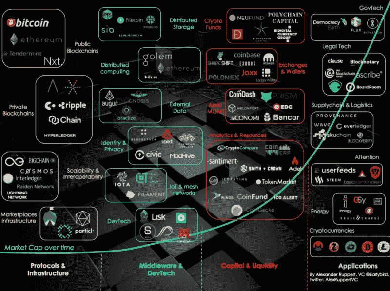
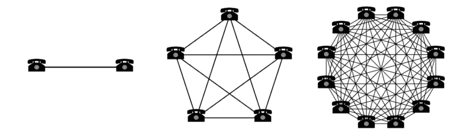
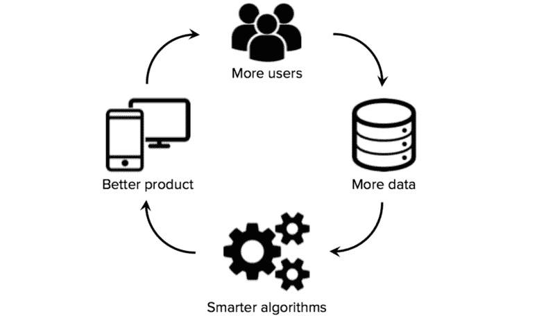
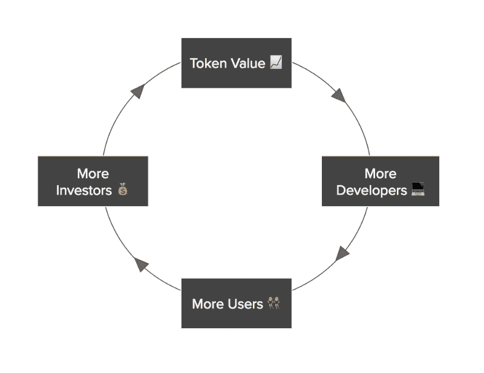

# 令牌网络效应

> 原文：<https://www.freecodecamp.org/news/token-network-effects-a-new-business-model-for-a-decentralized-web-6cde8b4e862/>

迈克尔·卡纳帕拉科恩

# **令牌网络效应**

#### 去中心化网络的新商业模式

[Crypto Ecosystem](https://medium.com/birds-view/mapping-the-decentralized-world-of-tomorrow-5bf36b973203?mc_cid=2a1bdd790c&mc_eid=7da9426d1d)

> “如果比特币流行起来，买一些比特币可能是有意义的。如果有足够多的人以同样的方式思考，这将成为一个自我实现的预言。”—2009 年在中本聪

今天，开发人员正在为分散式 web(也称为 web 3 或第五代协议 T1)构建基础设施。与 20 世纪 90 年代类似，他们正在构建跨计算能力、存储和数据的相同基础架构。

但这一次，它是去中心化的、私有的、更安全的。这就把控制权还给个人。

令牌是开源领域出现的一种新的商业模式。通过 ICO(首次发行硬币)出售代币是一种新的融资方式。如果项目成功，它的代币将会升值，给早期使用者带来丰厚的回报。

这些 ico 现在已经超过了区块链项目的风险投资。就在本周，Bancor 从 10，885 名买家那里筹集了 1.5 亿美元，成为迄今为止最大的 ICO。从这个角度来看，特斯拉在 IPO 中筹集了 2.26 亿美元来制造自动驾驶汽车。

代币是一种加密货币，用于改善产品和补偿网络中的所有参与者。例如，[假人](https://blog.golemproject.net/the-economics-of-the-golem-network-token-d64c1a50b1d5)是一个分散的 AWS EC2，用户将他们的 CPU 出租给其他用户。GNT 令牌是与假人网络交互所必需的。代币的数量将不得不适应不断增长的交易数量，从而增加 GNT 的需求和价格，并加速网络效应。

随着人工智能等技术的每一次进步，网络效应都在进化，以匹配这些创新。

### **网络效应**

网络效应的概念很简单:随着越来越多的人使用网络，网络变得越来越有价值。

最著名的例子是电话系统——当每个人都有电话时，拥有一部电话的价值就增加了。

正如我之前[写的](https://medium.com/personal-growth/16-mental-models-for-founders-and-leaders-25c3724a5208)，利用网络效应达到临界质量的公司会导致赢家通吃的市场——这是初创公司的圣杯。

网络效应的一个症状是当一家或两家公司占据 80%的市场份额，导致[幂律分布](https://en.wikipedia.org/wiki/Power_law)。网络效应创造了这种赢家通吃的动态(想想脸书、优步和 Airbnb)。

随着企业扩大网络和市场，它们会创建保护性的护城河，它们的竞争优势会进一步锁定用户。人们很难完全离开这个网络——因为他们已经投资了这个网络，这个网络把他们和其他人联系在一起。

### **数据网络效应**

随着时间的推移，网络效应随着技术的进步而发展。例如，今天我们有数据网络效应——建立数据生态系统并利用机器学习来创造更好的产品体验的平台。

[Data Network Effects](https://medium.com/@muellerfreitag/10-data-acquisition-strategies-for-startups-47166580ee48)

“当你的产品(通常由机器学习驱动)随着从用户那里获得更多数据而变得更加智能时，就会产生数据网络效应。”
*——[马特图尔克](http://mattturck.com/the-power-of-data-network-effects/)*

这已经被网飞(利用你的观看历史来做出更明智的推荐)和 Instagram(利用你的参与模式来创建更好的照片流)成功地实现了。

### **令牌网络效应**

随着去中心化网络和区块链的引入，这一景观现在已经发展到包括我所说的“令牌网络效应”

Joel Monego 写了关于 [fat 协议](http://www.usv.com/blog/fat-protocols)的文章，解释了令牌如何激励协议的采用。我将把这篇文章的重点放在如何将令牌增值与网络增长联系起来，从而加速反馈循环，创造出价值数万亿美元的赢家通吃协议。

> 代币网络将网络参与者联合起来，为一个共同的目标而努力——网络的发展和代币的增值——[克里斯·迪克森](https://medium.com/@cdixon/crypto-tokens-a-breakthrough-in-open-network-design-e600975be2ef)

Token Network Effects

当网络的增长与代币的升值相一致时，代币网络效应就会出现。随着网络的发展，代币为平台增加了价值，并加速了网络效应。

最成功的项目将令牌与网络发展的核心行动联系起来。通过调整所有利益相关者的激励机制，项目可以达到逃逸速度并跨越集权组织。

### **飞轮**

代币的潜在魔力是将所有利益相关者的激励结合起来，以*持有*代币。

在这个飞轮中，令牌随着项目效用的增加而增值。只要生态系统中的每个人都相信有价值，令牌就很难降到零。生态系统的每一个参与者现在都联合起来增加代币的价值。

这种关系增加了代币的价值，因为对代币的需求超过了有限的供给，并且抬高了代币的价格。这些市场力量使项目能够资助更多的开发(更多的开发者、企业家、矿工、参与者等)，从而创造更好的项目。

项目不会建立在不知名的网络上，没有项目网络也不会发展。为了启动网络，项目将网络的部分所有权给予早期采用者。这种新的所有权模式解决了最初的先有鸡还是先有蛋的问题。然后，这些用户使用令牌在平台上进行交易或对决策进行投票(通过[利害关系证明](https://bitcoinmagazine.com/articles/what-proof-of-stake-is-and-why-it-matters-1377531463/))。

有了利害关系的证明，用户将在项目的治理中有更多的发言权。这一决策过程使项目变得更加可行，因为它促进了有益于生态系统中所有参与者的行为。然后，用户被激励持有他们的令牌，这反过来推高了令牌的价格。

由于该项目的持续成功，它成为对投资者有吸引力的投资。目前的投资者也持有他们的代币，预期未来价格上涨，进一步限制供应。新投资者推高了对代币的需求，从而推高了代币的价格。

这使得项目的开发速度提高了 10 倍。通过分散自治组织(DAO)，令牌现在允许项目与数百万营销人员、数千开发人员和数百名企业家合作。以前只为拥有数十亿美元的大公司保留的东西现在可以下放。执行速度将成为这种新型组织的重要竞争优势和护城河。

我最喜欢的例子是[破折号](https://www.dash.org/)。在 Dash 的早期，生态系统仍然需要基础设施:移动钱包、exchange 采用等来刺激采用。Dash 决定将一部分采矿奖励转移到一个基金中。然后，用户可以向该基金提出项目，然后 masternode 网络中的令牌持有者将对这些项目进行投票。Dash 凭空创造了一个 VC 基金，并称之为区块链的[分权治理。它现在开始被其他项目和协议所采用。如今，该基金每月支持构建 Dash 生态系统的项目超过 75 万美元。](https://www.dash.org/governance/)

其他例子包括 STEEM 和最近与[亲戚](http://avc.com/2017/05/kin/)宣布的东西 [Kik](https://kin.kik.com/) 。Steemians 已经承担起建立第三方生态系统的责任，甚至资助了一个[广告牌](https://themerkle.com/steem-blogger-raises-thousands-of-dollars-to-fund-real-world-billboard-campaign/)来推广这个平台。

从这些例子中可以看出，令牌网络效应允许飞轮加速，并随着网络变大而变得更强。它推动项目达到临界质量，由于令牌网络效应，导致赢家通吃的动态。

理解令牌网络效应对于评估项目和协议的发展至关重要。没有它，这些项目中的大多数只是众筹机制，没有利用去中心化的力量。

区块链是自互联网以来世界历史上最重大的发明。这些项目或协议中的一个将成为达到临界质量的最快“公司”。当这种情况发生时，确保你 [HODL](http://www.urbandictionary.com/define.php?term=hodl) ！

[*Michael Karnjanaprakorn*](http://mikekarnj.com)*是 [Skillshare](http://skillshare.com) 和[图灵资本](http://turing.capital)的创始人。*