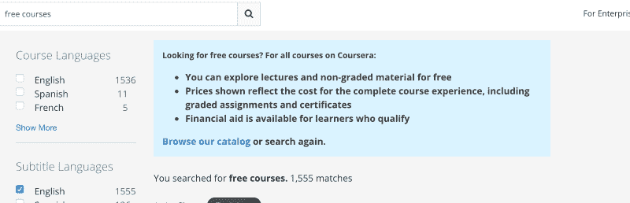
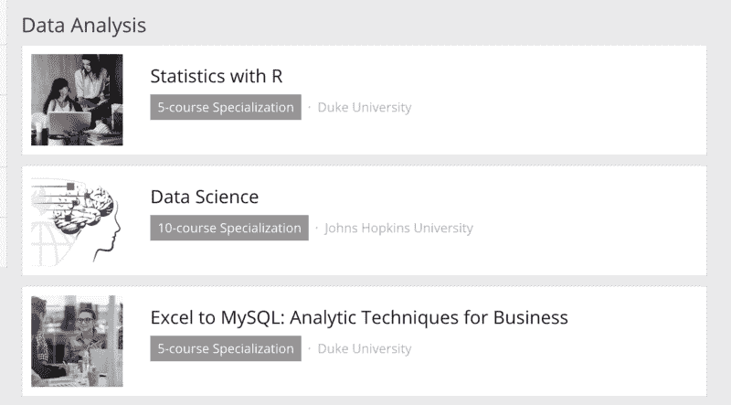
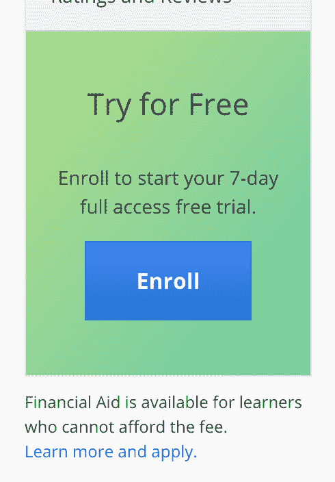
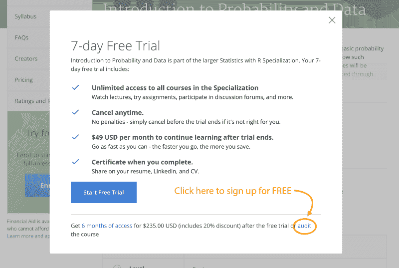

# 如何免费报名 Coursera 课程

> 原文：<https://www.freecodecamp.org/news/how-to-sign-up-for-coursera-courses-for-free-98266efaa531/>

在中央课程中心，我经常被问到的一个问题是:【Coursera 的课程真的是免费的吗？

Coursera 的用户界面旨在将学习者推向 Coursera 的付费课程。对于平台上哪些内容实际上是免费的，以及如何注册，新的学习者经常感到困惑。

因为我已经回答过这个问题几百次了，所以我决定写一篇文章来澄清这个问题。我也会试着回答一些关于 Coursera 的基本问题，并随着 Coursera 政策和 UI 的变化定期更新这篇文章。

如果你打算向某人推荐 Coursera，也许你也可以向他们推荐这篇文章。

### Coursera 是什么？

Coursera Homepage

Coursera 是一家在线教育提供商，提供来自世界各地顶尖大学的在线课程，俗称“MOOCs”或大规模开放在线课程。

目前，Coursera 拥有来自全球 29 个国家的 150 个这样的大学合作伙伴。这些合作伙伴包括[斯坦福](https://www.class-central.com/university/stanford)、[杜克](https://www.class-central.com/university/duke)、[宾夕法尼亚](https://www.class-central.com/university/penn)、[普林斯顿](https://www.class-central.com/university/princeton)、[密歇根](https://www.class-central.com/university/umich)、[北京](https://www.class-central.com/university/pku)、[巴黎 HEC](https://www.class-central.com/university/hec)。Coursera 还开始与 IBM、谷歌和普华永道等公司合作，这些公司在 Coursera 的平台上推出在线课程。

### 能免费拿到 Coursera 证书吗？

在 Coursera 早期，证书是免费的。不幸的是，你现在无法获得完成 [Coursera 课程](https://www.class-central.com/provider/coursera)的免费证书。MOOC 提供商全面叫停[为完成在线课程的学生提供](https://www.class-central.com/report/moocs-started-completely-free-now/)免费证书。

### Coursera 还是免费的吗？

是也不是，Coursera 上的课程肯定有几门是只收费的。这些例子包括[工程领导者的写作技能](https://www.class-central.com/mooc/7433/coursera-writing-skills-for-engineering-leaders)或[谷歌的计算、存储和安全与谷歌云平台](https://www.class-central.com/mooc/7783/coursera-computing-storage-and-security-with-google-cloud-platform)。在这一点上，我不确定有多少这样的课程。

在我写这篇文章的时候，绝大多数课程都有一些“免费”的元素——大部分视频都是免费观看的，但是如果你想获得分级作业和证书，你需要付费。

如果你在 Coursera 的网站上搜索*免费课程*，你会在搜索结果的顶部看到一张便利贴，上面基本上写着我提到的内容。然而，Coursera 仍然有一些课程，甚至是评分作业都是完全免费的。

Search results for “free courses” on Coursera

### 记得查账

Coursera 称获得课程的免费部分为“旁听课程”。我第一次接触到审计这个概念是在我去乔治亚理工学院的时候，在那里我获得了计算机科学硕士学位。我在印度获得了本科学位，那里没有审计的概念。

这里是一所大学的常见问题的快速定义

> 旁听课程允许学生在没有分数或学分的情况下上课。

因此，当你试图免费注册 Coursera 课程时，请查找单词 *audit* 。我们将在下面用截图解释如何注册 Coursera 的审计模式，但 Coursera 一直在调整他们的用户界面或测试不同的迭代，所以 Coursera 网站上你屏幕上的内容可能与下面呈现的不同。

### 如何免费报读 Coursera 课程？

#### **找到课程页面—** *您只能通过个人课程页面免费报名*

Coursera 有两个主要产品:在线课程和专业课程。

专业化基本上由一系列在线课程组成，旨在让您掌握某个特定的主题。一些专业有一个顶石项目作为序列中的最后一门课程。并非所有课程都是专业化的一部分，但大多数新推出的课程都是专业化的一部分。

一些大约 12 周的旧课程已经转换为专业化形式，原始课程分成多个课程。

当你在 Coursera 上浏览/搜索课程时，你会注意到搜索结果中专业和课程混杂在一起。对于专业，您将在名称下方看到给定专业中的课程数量。你还会注意到，专业课程在排名中比普通课程更靠前。

Specializations in Coursera’s catalog

专业页面不允许您注册他们的个人课程。如果您单击“注册”按钮，您将只能选择支付专业化认证费用。

要免费注册，你需要找到个人课程页面。不幸的是，尽管它列出了专业化中的课程，专业化页面并没有链接到单独的课程。

如果您向下滚动一点，您将会看到专业课程的列表。要访问课程页面，复制课程名称并粘贴到 Coursera 的搜索栏中。

更好的是，你可以在中央课堂上搜索课程—[https://www.class-central.com/search](https://www.class-central.com/search)。我们还会向您展示 Coursera 上没有的类似课程的结果。

### 在课程页面注册

在这一点上，我假设你在你感兴趣的课程的 Coursera 课程页面上，并且你已经登录了 Coursera。

Coursera 有两种不同的盈利模式供用户购买课程的非免费部分。

第一种是简单明了的模式:为个别课程购买证书。在这种情况下，一旦你点击“注册”，你会看到两个选项，其中一个(“全课程，无证书”)允许你免费注册(如下图)。

有些课程可能没有“完整课程”选项(例如，分级作业在付费墙后面)。在这种情况下，第二个选项将显示为“审计”选择“审核”，然后点击“继续”免费注册。

第二种货币化方法是基于每月订阅的模式。通过支付每月订阅费(每月 39 美元起)，您可以访问作为专业化一部分的所有课程的高级功能。一旦您停止支付套餐费用，您的访问权限就终止了。

如果您登录 Coursera，并且在某个专业课程的课程页面上，您会看到绿色背景包围的蓝色“注册”按钮。它上面会有“免费试用”的文字。注意:这个被绿色包围的按钮只对已经登录 Coursera 的用户显示。价格信息不会显示给未登录的学员。

单击“注册”后，您应该会看到一个弹出窗口，提示您注册免费试用(如下所示)。在弹出窗口的右下角，您会看到一个小的“审计”链接。点击链接免费注册该课程。你可以观看视频，参与论坛讨论，但不能参与评分作业。

我希望这个指南对你有用。如果你发现指南的任何部分令人困惑，请告诉我，我会更新指南使其更加清晰。另外，如果你发现 Coursera 的课程不符合上述模式，请发表评论。