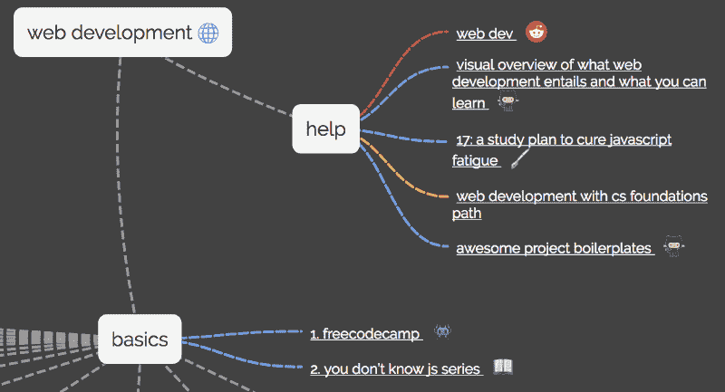
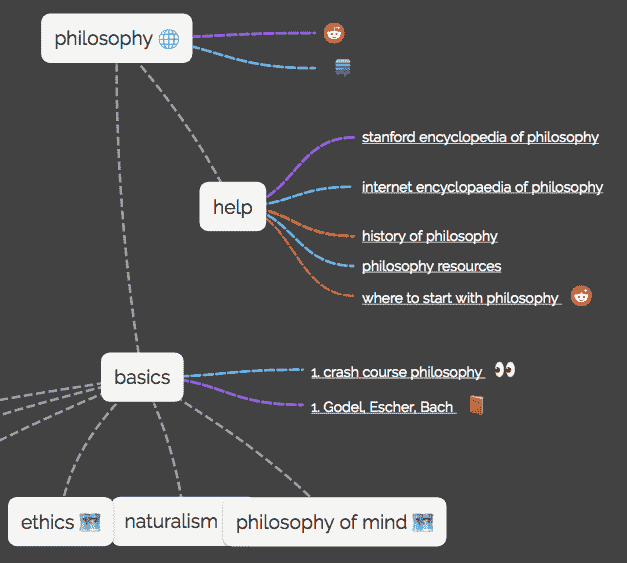
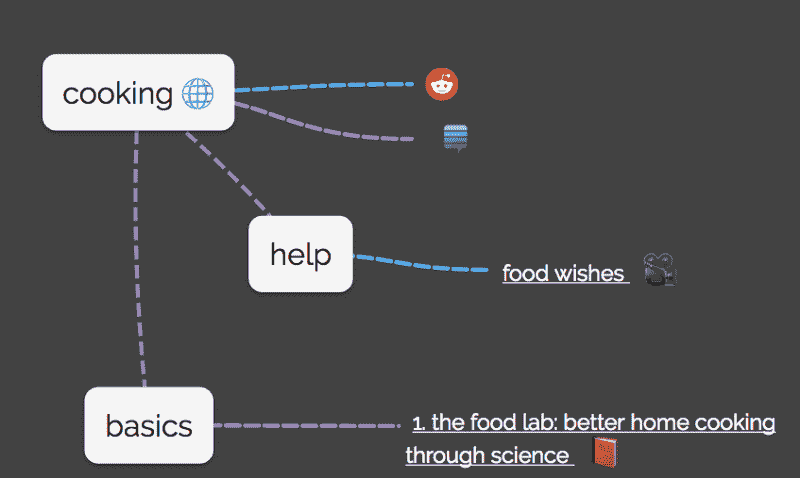

# 一个开源搜索引擎，将帮助你学习几乎任何东西

> 原文：<https://www.freecodecamp.org/news/an-open-source-search-engine-that-will-help-you-learn-pretty-much-anything-3c206c688457/>

一个开发团队刚刚发布了一个开源搜索引擎，它将向你展示如何学习几乎任何东西。它的工作原理是将资源聚集成“思维导图”

以下是他们对[网络开发](https://fcc.im/2s3KiaD)的部分想法:

Their web development map

他们有思维导图，上面有学习各种科目和技能的资源，比如[哲学](https://learn-anything.xyz/philosophy):

他们的一些思维导图比其他的更加充实，但是所有的都在开源社区的开发中。

你可以[查看他们的实时应用](https://fcc.im/2slGogs)或者[在 GitHub](https://fcc.im/2s3Hxq2) 上开始他们的开源项目。

### 以下是其他三个值得你花时间去做的链接:

1.  掌握 Chrome 开发工具:下一级前端开发技术( [6 分钟阅读](https://fcc.im/2s3WFnd))
2.  如何用 Python 和 BeautifulSoup ( [8 分钟阅读](https://fcc.im/2rbTSHc))抓取网站
3.  Node.js 子进程:你需要知道的一切( [13 分钟阅读](https://fcc.im/2teuFNg)

### 想到这一天:

> “我认为这是一个新功能。不要告诉任何人这是一场意外。”—拉里·沃尔

### 今日趣事:

周六早上的谷类早餐。

### 今日学习小组:

萨拉热窝自由营

编码快乐！

–昆西·拉森，自由代码营的老师

如果你从这些邮件中获得了价值，请考虑[支持我们的非营利组织](http://bit.ly/donate-to-fcc)。