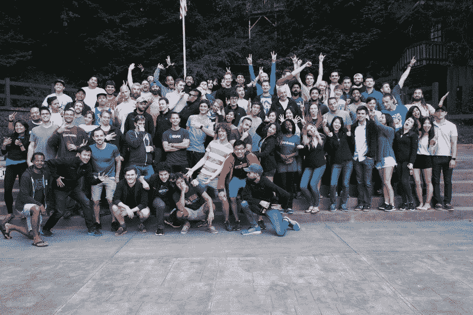

# 如何加入数字货币行业

> 原文：<https://www.freecodecamp.org/news/how-to-join-the-digital-currency-industry-fe8508bc5d64/>

作者琳达·谢

# 如何加入数字货币行业

我最常被问到的一个问题是如何在区块链行业起步。这是一个有趣又令人兴奋的地方。在与比特币基地相处了 3 年后，以下是我的建议和资源:

Some of my awesome coworkers at Coinbase

**建议**

1.  因为你相信技术而加入。你可能会对数字货币感兴趣，因为比特币和以太网的价格一直在飙升。然而请记住，新技术经历[炒作周期](http://www.gartner.com/technology/research/methodologies/hype-cycle.jsp)是很自然的。我在 2014 年 6 月加入比特币基地，当时比特币价格从 650 美元下跌，并在 250 美元的区间停留了一年多。虽然看到价格最近持续攀升令人兴奋，但我在数字货币领域工作的内在动机是基于对技术及其影响的热情。否则，在经济停滞期间，离开会很有吸引力。考虑一下，如果你要加入这个领域的一个组织，如果数字货币价格暴跌 80%，你会留下吗？
2.  做你的研究。这似乎是显而易见的，适用于所有行业，然而，许多来找我讨论比特币基地公司职位的人都缺乏对该公司的基本了解。过去，我收到过申请人的询问，他们认为比特币基地直接开发并拥有比特币区块链。首先花时间研究技术，然后研究每个公司用这项技术做什么。与此同时，这一领域中有许多项目缺乏技术优势，并且正在利用这一领域中大量容易获得的资金。在了解项目的技术和团队方面，做自己的研究是很重要的。
3.  明确你想加入什么类型的组织。对于那些只告诉我他们想在区块链工作的人，我通常持怀疑态度。“区块链”这个词很模糊，根据我的经验，人们通常不理解它的意思。例如，你想在一个许可的账本上工作，在以太坊上开发，加入像比特币基地这样的初创公司，还是加入像 IBM 这样的大公司？每个公司都有非常不同的文化、使命和团队，所以要确保你知道哪一个最适合你。
4.  对不同的角色持开放态度。如果您不是开发人员，那么您有兴趣申请的组织中的职位可能会比较少。考虑利用你的技能来扮演不同的角色。例如，我的背景是经济和金融，但我想加入比特币基地，所以我愿意填补他们需要的任何角色。我先是从合规部门开始，后来转到了产品管理部门——这两个职位都与我最初的背景无关，但我仍然从每个职位中学到了很多，并且非常享受。*更新:也请参见我的同事[约翰伊](https://www.freecodecamp.org/news/how-to-join-the-digital-currency-industry-fe8508bc5d64/undefined)在下面[回复](https://medium.com/@johnyi275/re-being-open-to-new-roles-youre-absolutely-right-51cb1f646829)中对此的建议。*
5.  通过参与项目积累经验。如果你对一个项目或数字货币充满热情，在许多情况下，如果该项目是开源的，你可以直接做出贡献，而无需获得全职职位。例如 [Monero](https://getmonero.org/get-started/contributing/) 是一种有趣的加密货币，可以在技术和非技术领域使用你的[贡献](https://getmonero.org/getting-started/contribute)。这有助于提升你在这个行业的经验，并有可能带来巨大的人脉。

**资源**

1.  [**以太坊**](https://www.reddit.com/r/ethereum/) **。你可以通过 Reddit 找到工作，这听起来很奇怪，但以太坊有一个强大的 Reddit 社区。你可以了解新兴项目和人们对它们的看法，发布空缺职位，并对技术进行基础研究。**
2.  [**Smith+Crown**](https://www.smithandcrown.com)**提供关于数字货币项目的详细且高质量的报告。你可以看看这些报告，以便更好地了解你对哪些最感兴趣。**
3.  **[**ICO Alert**](https://www.icoalert.com) 列出了过去的、正在进行的和即将进行的项目众筹销售。已经筹集资金或计划经常筹集资金的项目将利用新资金增加招聘。你可以直接去项目的网站看看有没有空缺的职位。如果没有，如果你对他们正在做的事情超级有热情，直接联系他们也无妨。**
4.  **Ethlance 有招聘广告，招聘希望在以太网获得报酬的人。他们不会从你的收入中提成，它是在以太坊区块链运行的，所以你已经在支持这个空间了。**
5.  ****您当地的数字货币聚会。**我经常参加[硅谷以太坊聚会](https://www.meetup.com/EthereumSiliconValley/)，我是[旧金山以太坊开发者聚会](https://www.meetup.com/SF-Ethereum-Developers/)的组织者。聚会上有许多开发人员在他们的项目上需要帮助。这是认识业内其他人的好地方。你也可以通过成为组织者来尝试更多的参与。你将有更多的时间与开发人员交流，了解他们在做什么。**

****正在招聘的组织****

**以下是我密切关注的一些正在招聘的组织。**

*   **[0x](https://medium.com/0x-project/0x-is-laying-the-foundation-for-the-token-economy-eb2cc3b070d0) —以太坊令牌分散交换协议*(声明:我是 0x 的顾问)***
*   **阿拉贡(Aragon)—一个创建和管理分散组织的平台**
*   **[占卜](https://augur.net/careers.html) —一个预测市场的平台**
*   **[比特币基地](https://www.coinbase.com/careers) —轻松买卖数字货币的平台*(声明:我是比特币基地的产品经理)***
*   **ConsenSys —一个在以太坊上构建分散应用的风险制作工作室**
*   **[达摩](https://blog.dharma.io/introducing-dharma-a-decentralized-protocol-for-peer-to-peer-lending-9922964fa8c5) —一个分散的点对点借贷协议**
*   **假人——一个创造分散式超级计算机的项目**
*   **[uPort](https://angel.co/uport/jobs) —利用以太坊搭建的自主身份平台**

**我希望这个指南对学习如何加入数字货币行业有所帮助。祝你搜索顺利！**

**感谢[威尔·沃伦](https://medium.com/u/2b16f05dc65e)审阅这篇文章。**