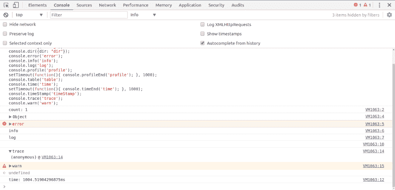
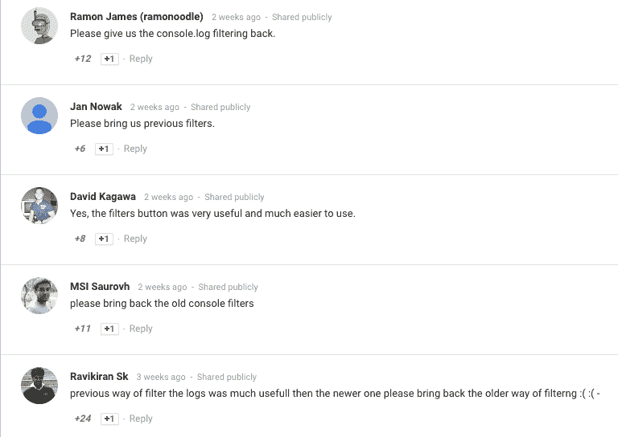
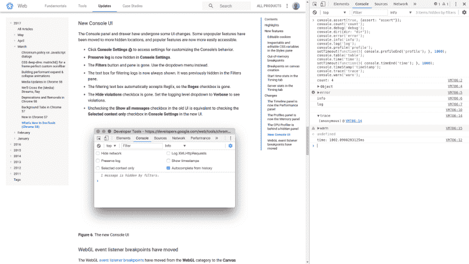
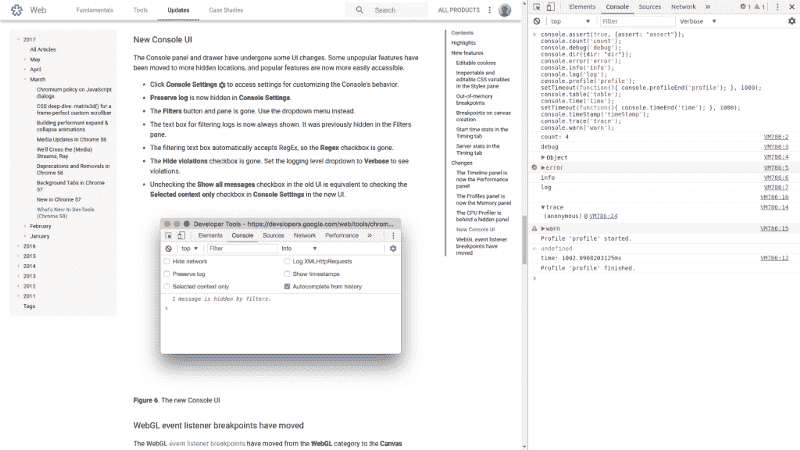
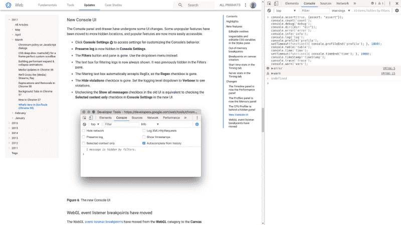
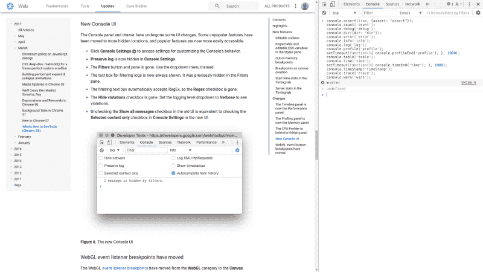

# Google Chrome 可能在你不知情的情况下破坏了你的测试

> 原文：<https://www.freecodecamp.org/news/google-chrome-might-have-broken-your-tests-without-you-even-knowing-about-it-9d9130a6fd0c/>

罗伯特·阿克塞尔森

# Google Chrome 可能在你不知情的情况下破坏了你的测试


我的同事刚刚发现，Chrome 58(4 月 19 日发布)在其 Chrome 开发工具中静默了所有 console.debug()输出。

怎么会？通过对**控制台 UI** 进行更改，从基于控制台方法类型的过滤改为基于级别的过滤。

引入等级本身并不是一件坏事。但谷歌也选择默认停止显示所有控制台输出。现在你只能看到“信息”及以下级别。



根据您的项目，不再能够通过只显示一个控制台方法的输出来进行过滤也可能是一件大事。

仅以`console.log()`为例。如果您正在处理一个包含数百种不同类型输出的大型项目，这就特别麻烦了。

从发布说明的评论部分[可以看出，这并没有被开发者很好的接受。](https://developers.google.com/web/updates/2017/03/devtools-release-notes)



### 测试失败

这意味着如果你的应用或项目依赖于`console.debug()`级别的输出进行测试，你的测试可能已经失败了一个多月，而你甚至没有注意到。

所有这些都没有谷歌的弹出警告。

通过让日志默认为非详细，我相信 Google 已经打破了最佳实践，犯了一个巨大的错误。

此外，删除了只显示基于特定控制台方法的输出的功能，导致了许多开发人员工作流程的恶化。

### 自己测试一下吧

我在 Chrome 开发工具中用以下控制台方法做了一些测试:

```
console.assert(true, {assert: "assert"});console.count('count');console.debug('debug');console.dir({dir: "dir"});console.error('error');console.info('info');console.log('log');console.profile('profile');setTimeout(function(){ console.profileEnd('profile'); }, 1000);console.table('table');console.time('time');setTimeout(function(){ console.timeEnd('time'); }, 1000);console.timeStamp('timeStamp');console.trace('trace');console.warn('warn');
```

你可以简单的复制粘贴到 Chrome Dev Tools 的控制台中，点击回车，改变过滤级别，看看哪个级别显示的是什么。

### 一些截图来说明

下面是一些截图来说明等级之间的区别。请特别注意默认“信息”级别的第一个屏幕截图，以及“3 个项目被隐藏”的事实



Chrome 58, Chrome Dev Tools Console output, level “Info”.



Chrome 58, Chrome Dev Tools Console output, level “Verbose”.



Chrome 58, Chrome Dev Tools Console output, level “Warnings”.



Chrome 58, Chrome Dev Tools Console output, level “Errors”.

### 有什么想法吗？

你怎么看待这种变化？谷歌做出这样的改变有错吗？或者你认为这是对“控制台用户界面”的整体改进吗？请在下面留下评论。

*本文最初发表在[“Hello，I Love Code”](http://helloilovecode.com/)上，作者是 [Robert Axelsen](http://rob.ee/) ，他是一名 JavaScript 开发人员、Meetup 组织者和欧洲奥地利的开源爱好者。*

*你可以在 [Twitter](https://twitter.com/Robert_Axelsen) 上与罗伯特联系，或者通过[访问他的网站来更好地了解他。](http://rob.ee/)*