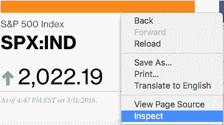
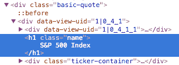
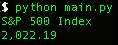
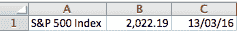

# 如何用 Python 和 BeautifulSoup 刮网站

> 原文：<https://www.freecodecamp.org/news/how-to-scrape-websites-with-python-and-beautifulsoup-5946935d93fe/>

贾斯汀·叶克

# 如何用 Python 和 BeautifulSoup 刮网站


互联网上的信息比任何人一生所能吸收的都多。您需要的不是访问这些信息，而是收集、组织和分析这些信息的可扩展方式。

你需要网络抓取。

网络抓取会自动提取数据，并以一种你容易理解的格式呈现出来。在本教程中，我们将重点关注其在金融市场中的应用，但网络抓取可以用于各种各样的情况。

如果你是一个狂热的投资者，每天获得收盘价可能是一件痛苦的事情，尤其是当你需要的信息是在几个网页上找到的时候。我们将通过构建一个 web scraper 从互联网上自动检索股票指数来简化数据提取。


### 入门指南

我们将使用 Python 作为我们的抓取语言，以及一个简单而强大的库 BeautifulSoup。

*   对于 Mac 用户，OS X 中预装了 Python，打开终端，输入`python --version`。您应该看到您的 python 版本是 2.7.x。
*   Windows 用户请通过[官网](https://www.python.org/downloads/)安装 Python。

接下来，我们需要使用 Python 的包管理工具`pip`来获得 BeautifulSoup 库。

在终端中，键入:

```
easy_install pip
pip install BeautifulSoup4
```

**注意**:如果无法执行上述命令行，可以尝试在每行前面加上`sudo`。

### 基础知识

在我们开始进入代码之前，让我们了解 HTML 的基础知识和一些抓取规则。

**HTML 标签**
如果你已经理解了 HTML 标签，可以随意跳过这一部分。

```
<!DOCTYPE html>  
<html>  
    <head>
    </head>
    <body>
        <h1> First Scraping </h1>
        <p> Hello World </p>
    <body>
</html>
```

这是 HTML 网页的基本语法。每个`<tag>`在网页里面服务一个块:
1。`<!DOCTYPE html>` : HTML 文档必须以类型声明开头。
2。HTML 文档包含在`<html>`和`</html>`之间。
3。HTML 文档的元和脚本声明在`<head>`和`</head>`之间。
4。HTML 文档的可见部分在`<body>`和`</body>`标签之间。
5。标题由`<h1>`到`<h6>`标签定义。
6。段落用`<p>`标签定义。

其他有用的标签包括超链接的`<a>`、表格的`<table>`、表格行的`<tr>`和表格列的`<td>`。

此外，HTML 标签有时带有`id`或`class`属性。属性`id`为一个 HTML 标签指定了一个惟一的 id，这个值在 HTML 文档中必须是惟一的。`class`属性用于为同一个类的 HTML 标签定义相同的样式。我们可以利用这些 id 和类来帮助我们定位我们想要的数据。

关于 HTML [标签](http://www.w3schools.com/html/)、 [id](http://www.w3schools.com/tags/att_global_id.asp) 和[类](http://www.w3schools.com/html/html_classes.asp)的更多信息，请参考 W3Schools [教程](http://www.w3schools.com/)。

**刮削规则**

1.  你应该在刮之前检查网站的条款和条件。请仔细阅读关于合法使用数据的声明。通常情况下，你搜集的数据不应该用于商业目的。
2.  不要用你的程序过于激进地从网站请求数据(也称为垃圾邮件)，因为这可能会破坏网站。确保你的程序以合理的方式运行(比如像人一样运行)。每秒请求一个网页是很好的做法。
3.  网站的布局可能会不时改变，所以请确保重新访问网站，并根据需要重写代码

### 检查页面

让我们以[彭博引用](http://www.bloomberg.com/quote/SPX:IND)网站的一页为例。

作为一个跟踪股票市场的人，我们希望从这个页面获得指数名称(标准普尔 500)及其价格。首先，右键单击并打开浏览器的检查器来检查网页。



试着把你的光标放在价格上，你会看到一个蓝色的方框围绕着它。如果您单击它，将在浏览器控制台中选择相关的 HTML。


从结果可以看出，价格在 HTML 标签的几个层次里面，分别是`<div class="basic-quote">` → `<div class="price-container up">` → `<div class="price">`。

同样，如果你悬停并点击名称“标准普尔 500 指数”，它在`<div class="basic-quote">`和`<h1 class="name">`内。



现在，借助于`class`标签，我们知道了数据的唯一位置。

### 跳入代码中

既然我们知道了数据在哪里，我们就可以开始编写 web scraper 了。立即打开您的文本编辑器！

首先，我们需要导入我们将要使用的所有库。

```
# import libraries
import urllib2
from bs4 import BeautifulSoup
```

接下来，为页面的 url 声明一个变量。

```
# specify the url
quote_page = ‘http://www.bloomberg.com/quote/SPX:IND'
```

然后，利用 Python urllib2 来获取所声明的 url 的 HTML 页面。

```
# query the website and return the html to the variable ‘page’
page = urllib2.urlopen(quote_page)
```

最后，将页面解析成 BeautifulSoup 格式，这样我们就可以使用 BeautifulSoup 来处理它。

```
# parse the html using beautiful soup and store in variable `soup`
soup = BeautifulSoup(page, ‘html.parser’)
```

现在我们有了一个变量`soup`，包含页面的 HTML。我们可以从这里开始编写提取数据的部分。

还记得我们数据的独特层次吗？BeautifulSoup 可以帮助我们进入这些图层，用`find()`提取内容。在这种情况下，由于 HTML 类`name`在这个页面上是唯一的，我们可以简单地查询`<div class="name">`。

```
# Take out the <div> of name and get its value
name_box = soup.find(‘h1’, attrs={‘class’: ‘name’})
```

有了标签之后，我们可以通过获取它的`text`来获取数据。

```
name = name_box.text.strip() # strip() is used to remove starting and trailing
print name
```

同样，我们也可以得到价格。

```
# get the index price
price_box = soup.find(‘div’, attrs={‘class’:’price’})
price = price_box.text
print price
```

当您运行该程序时，您应该能够看到它打印出了标准普尔 500 指数的当前价格。



### 导出到 Excel CSV

现在我们有了数据，是时候保存它了。Excel 逗号分隔格式是一个不错的选择。它可以在 Excel 中打开，因此您可以轻松地查看和处理数据。

但是首先，我们必须导入 Python csv 模块和 datetime 模块来获取记录日期。将这些行插入到导入部分的代码中。

```
import csv
from datetime import datetime
```

在代码的底部，添加将数据写入 csv 文件的代码。

```
# open a csv file with append, so old data will not be erased
with open(‘index.csv’, ‘a’) as csv_file:
 writer = csv.writer(csv_file)
 writer.writerow([name, price, datetime.now()])
```

现在，如果您运行您的程序，您应该能够导出一个`index.csv`文件，然后您可以用 Excel 打开它，您应该会看到一行数据。



因此，如果你每天运行这个程序，你将能够轻松获得标准普尔 500 指数价格，而无需翻遍网站！

### 更进一步(高级用途)

**多个指数**
所以刮一个指数对你来说还不够吧？我们可以尝试同时提取多个指数。

首先，将`quote_page`修改成一个 URL 数组。

```
quote_page = [‘http://www.bloomberg.com/quote/SPX:IND', ‘http://www.bloomberg.com/quote/CCMP:IND']
```

然后我们把数据提取代码改成一个`for`循环，这个循环会逐个处理 URL，把所有数据以元组的形式存储到一个变量`data`中。

```
# for loop
data = []
for pg in quote_page:
 # query the website and return the html to the variable ‘page’
 page = urllib2.urlopen(pg)

# parse the html using beautiful soap and store in variable `soup`
 soup = BeautifulSoup(page, ‘html.parser’)

# Take out the <div> of name and get its value
 name_box = soup.find(‘h1’, attrs={‘class’: ‘name’})
 name = name_box.text.strip() # strip() is used to remove starting and trailing

# get the index price
 price_box = soup.find(‘div’, attrs={‘class’:’price’})
 price = price_box.text

# save the data in tuple
 data.append((name, price))
```

此外，修改保存部分以逐行保存数据。

```
# open a csv file with append, so old data will not be erased
with open(‘index.csv’, ‘a’) as csv_file:
 writer = csv.writer(csv_file)
 # The for loop
 for name, price in data:
 writer.writerow([name, price, datetime.now()])
```

重新运行程序，你应该能够同时提取两个指数！

### 高级刮削技术

BeautifulSoup 非常简单，非常适合小规模的网页抓取。但是，如果您对更大范围的数据搜集感兴趣，您应该考虑使用以下替代方法:

1.  [Scrapy](http://scrapy.org/) ，一个强大的 python 抓取框架
2.  尝试将您的代码与一些公共 API 集成在一起。数据检索的效率远高于抓取网页。例如，看看[脸书图形 API](https://developers.facebook.com/docs/graph-api) ，它可以帮助你获得脸书网页上没有显示的隐藏数据。
3.  当数据变得太大时，考虑使用数据库后端，如 MySQL T1。

### 采用干法


DRY 代表“不要重复自己”，试着像[这个人](http://www.businessinsider.com/programmer-automates-his-job-2015-11)一样自动化你的日常任务。其他一些可以考虑的有趣项目可能是跟踪你的脸书朋友的活跃时间(当然是在他们同意的情况下)，或者在论坛上抓取一个主题列表并尝试自然语言处理(这是目前人工智能的热门话题)！

如有任何问题，欢迎在下方留言。

**参考文献**
[http://www . Greg reda . com/2013/03/03/web-scraping-101-with-python/](http://www.gregreda.com/2013/03/03/web-scraping-101-with-python/)
[http://www . analyticsvidhya . com/blog/2015/10/beginner-guide-web-scraping-beautiful-soup-python/](http://www.analyticsvidhya.com/blog/2015/10/beginner-guide-web-scraping-beautiful-soup-python/)

*这篇文章最初发表在海拔实验室的[博客](http://altitudelabs.com/blog/)上，作者是我们的软件工程师[伦纳德·莫](https://medium.com/@leonardmok)。 [Altitude Labs](http://altitudelabs.com) 是一家软件代理公司，专注于个性化、移动优先的 React 应用。*