# 走向无服务器:如何在云中运行你的第一个 AWS Lambda 函数

> 原文：<https://www.freecodecamp.org/news/going-serverless-how-to-run-your-first-aws-lambda-function-in-the-cloud-d866a9b51536/>

亚当·瓦特

# 走向无服务器:如何在云中运行你的第一个 AWS Lambda 函数

十年前，云服务器抽象出了物理服务器。现在，“无服务器”正在抽象出云服务器。

技术上来说，服务器还在。你只是不再需要管理它们了。

无服务器的另一个好处是你不再需要让服务器一直运行。“服务器”会在你需要它的时候突然出现，然后在你用完它的时候消失。现在，您可以考虑功能而不是服务器，并且您的所有业务逻辑现在都可以存在于这些功能中。

对于 AWS Lambda 函数，这被称为触发器。Lambda 函数可以通过不同的方式触发:HTTP 请求、上传到 S3 的新文档、预定的作业、AWS Kinesis 数据流或来自 AWS 简单通知服务(SNS)的通知。

在本教程中，我将向您展示如何设置自己的 Lambda 函数，另外，我还将向您展示如何在 AWS Cloud 中设置 REST API，同时编写最少的代码。

请注意，无服务器的优缺点取决于您的具体使用情况。因此，在本文中，我不会告诉您无服务器是否适合您的特定应用，我只是向您展示如何使用它。

首先，你需要一个 AWS 账户。如果你还没有账户，可以在这里开一个免费的 AWS 账户[。AWS 有一个免费层，足以满足您对本教程的需求。](https://aws.amazon.com/free)

我们将编写函数 isPalindrome，它检查传递的字符串是否是回文。

上面是一个 JavaScript 实现的例子。这里是 Github 上 gist 的[链接](https://gist.github.com/AWattNY/1fae83d8de8756c9d9b946e36307e8fc85695ae4458c4c2239558c)。

回文是一个单词、短语或序列，向后读和向前读是一样的，为了简单起见，我们将这个函数仅限于单词。

正如我们在上面的片段中看到的，我们获取字符串，分割它，反转它，然后连接它。如果字符串和它的倒数相等，则该字符串是回文，否则该字符串不是回文。

### 创建 isPalindrome Lambda 函数

在这一步中，我们将前往 AWS 控制台创建 Lambda 函数:

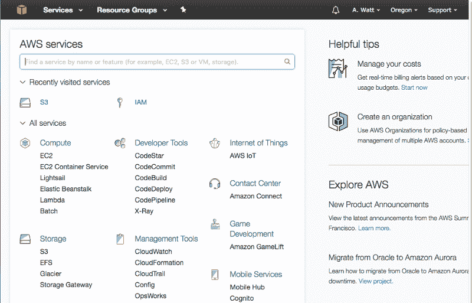

在 AWS 控制台中，转到 Lambda。

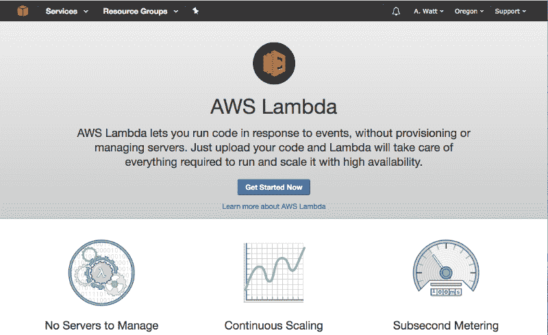

然后按“立即开始”

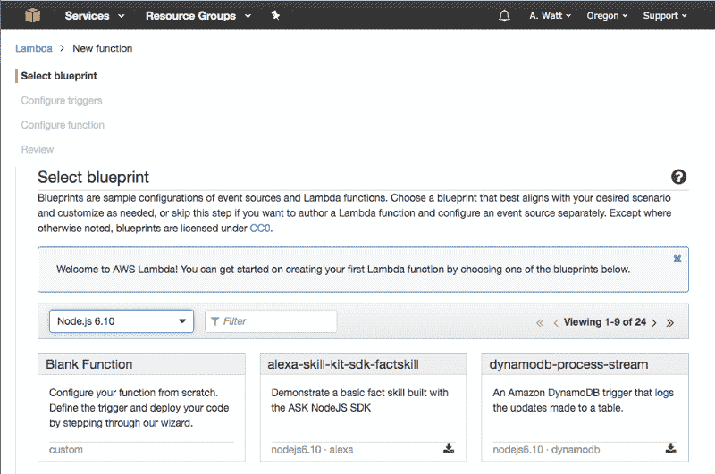

对于运行时，选择 Node.js 6.10，然后按“空白函数”

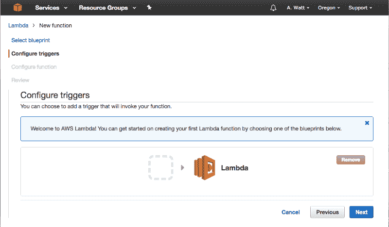

跳过此步骤并按“下一步”

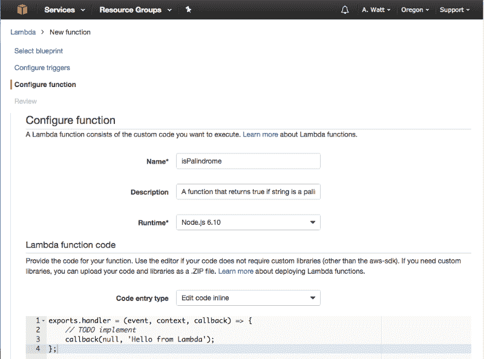

对于 isPalindrome 中的 Name type，对于 description，请键入新 Lambda 函数的描述，或者留空。

正如你在上面的[要点](https://gist.github.com/AWattNY/1b4eda8b807702c0fa9700c4a130fbf7)中看到的，Lambda 函数只是一个我们作为模块导出的函数，在本例中，命名为 handler。该函数有三个参数:事件、上下文和一个回调函数。

回调将在 Lambda 函数完成时运行，并将返回一个响应或错误消息。对于空白的 Lambda 蓝图，响应被硬编码为字符串“Hello from Lambda”。对于本教程，因为没有错误处理，所以您将只使用 Null。在接下来的几张幻灯片中，我们将仔细研究事件参数。

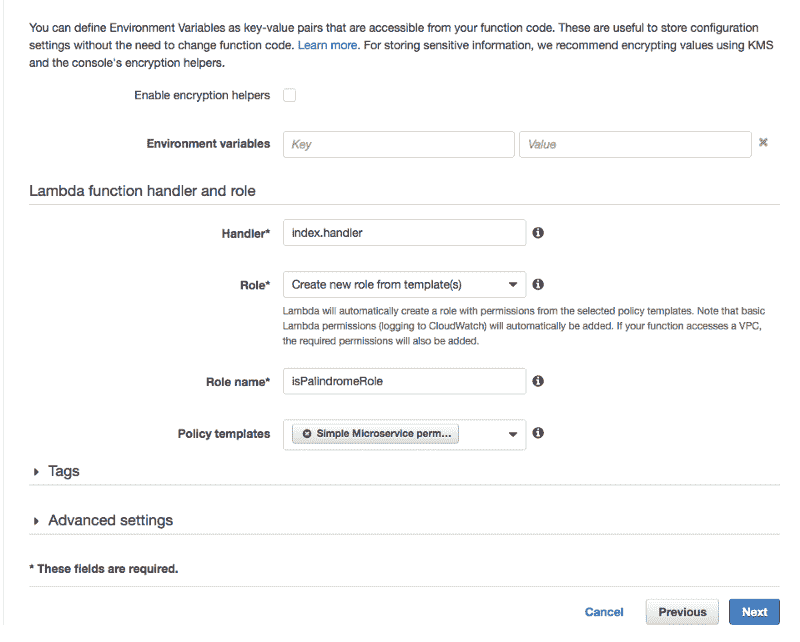

向下滚动。对于角色，选择“从模板创建新角色”，对于角色名称，使用 isPalindromeRole 或您喜欢的任何名称。

对于策略模板，选择“简单微服务”权限。

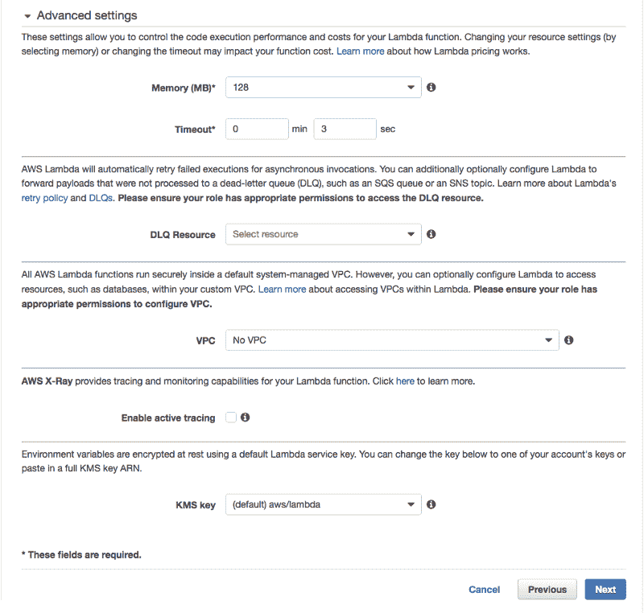

对于内存来说，128 兆对于我们简单的功能来说绰绰有余。

至于 3 秒超时，这意味着——如果函数在 3 秒内没有返回——AWS 将关闭它并返回一个错误。三秒钟也是绰绰有余。

保留其他高级设置不变。

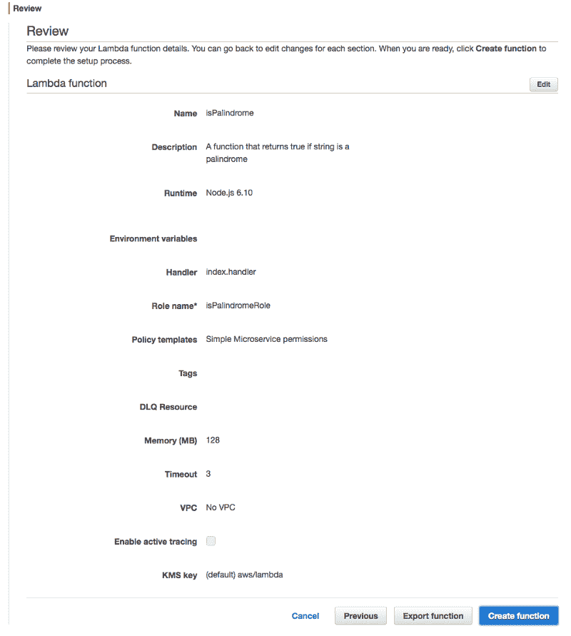

按“创建功能”

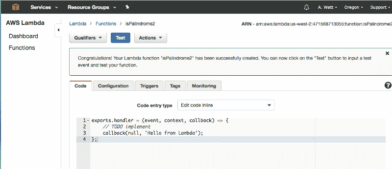

祝贺您，您已经创建了您的第一个 Lambda 函数。要测试它，请按“测试”

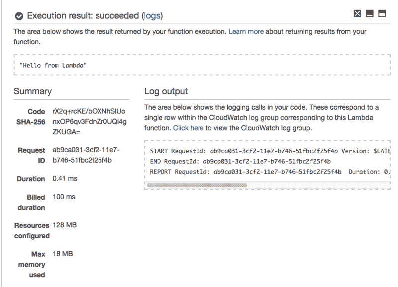

如您所见，您的 Lambda 函数返回硬编码的响应“Hello from Lambda”

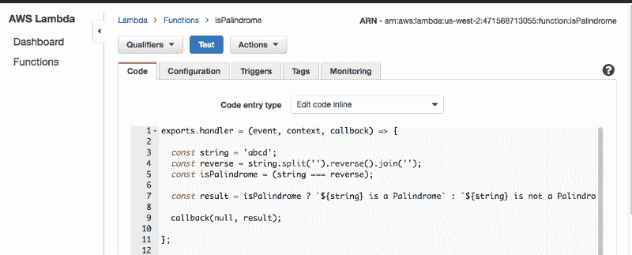

现在将 isPalindrome.js 中的代码添加到 Lambda 函数中，但是使用`callback(null, result)`代替`return result`。然后在第 3 行添加一个硬编码的字符串值`abcd`，并按“测试”

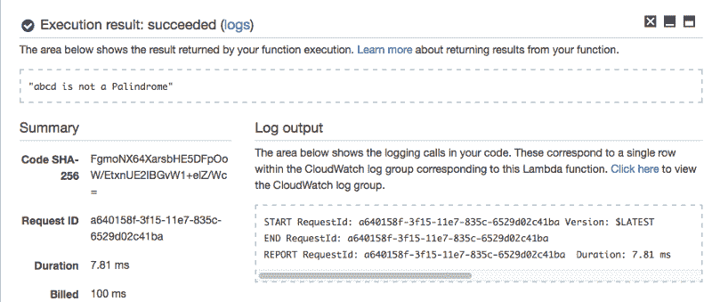

Lambda 函数应该返回“abcd 不是回文。”

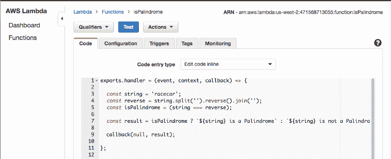

对于硬编码的字符串值“racecar”，Lambda 函数返回“racecar 是一个回文。”

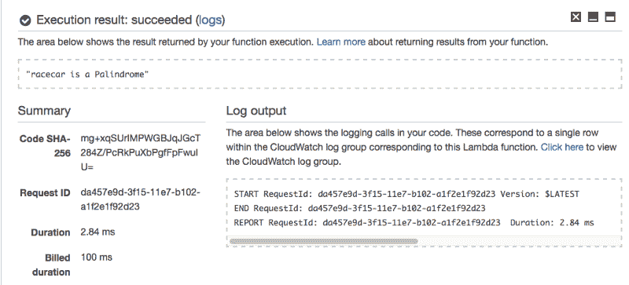

到目前为止，我们创建的 Lambda 函数表现正常。

在接下来的步骤中，我将向您展示如何触发它并使用 HTTP 请求向它传递一个字符串参数。

如果您在使用 Express.js 这样的工具之前已经从头构建了 REST APIs，那么上面的[片段](https://gist.github.com/AWattNY/50741f8601289b5b6d560d4776fb6162)应该对您有意义。首先创建一个服务器，然后逐个定义所有的路由。

在这一节中，我将向您展示如何使用 AWS API 网关做同样的事情。

### 创建 API 网关

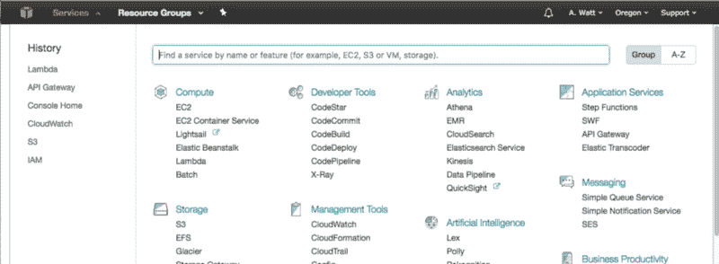

进入你的 AWS 控制台，点击“API 网关”

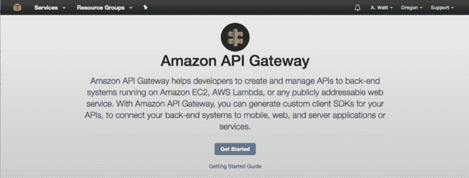

然后按“开始”

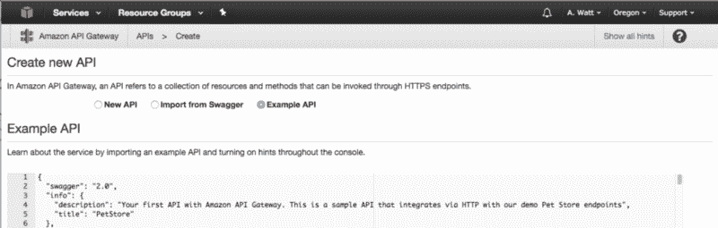

在创建新 API 仪表板中，选择“新建 API”

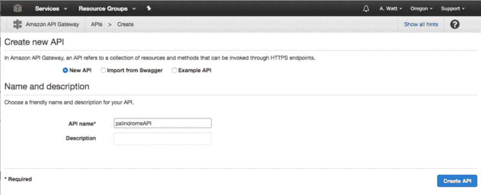

对于 API 名称，使用“回文 API”对于描述，键入新 API 的描述，或者留空。

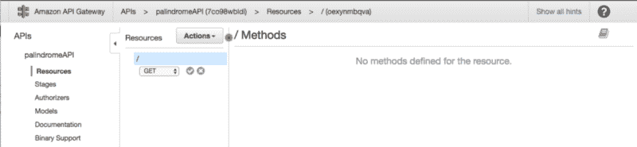

我们的 API 将是一个简单的 API，并且只有一个 GET 方法用于与 Lambda 函数通信。

在“操作”菜单中，选择“创建方法”将出现一个小的子菜单。继续选择 GET，然后单击右边的复选标记。

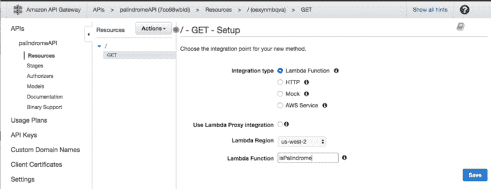

对于集成类型，选择 Lambda 函数。

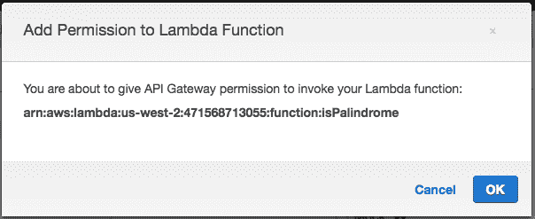

然后按“确定”

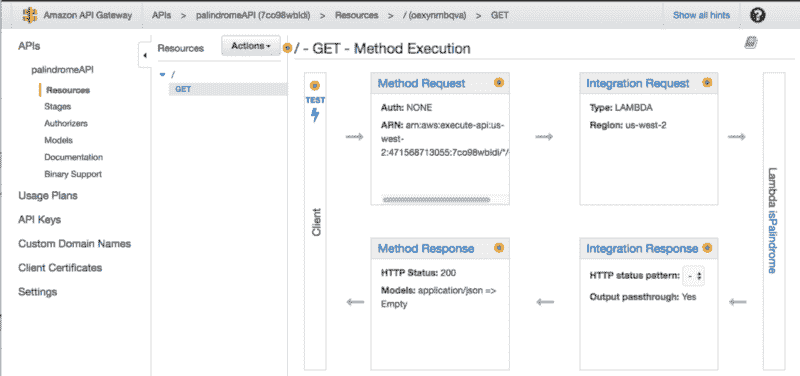

在获取方法执行屏幕中，按“集成请求”

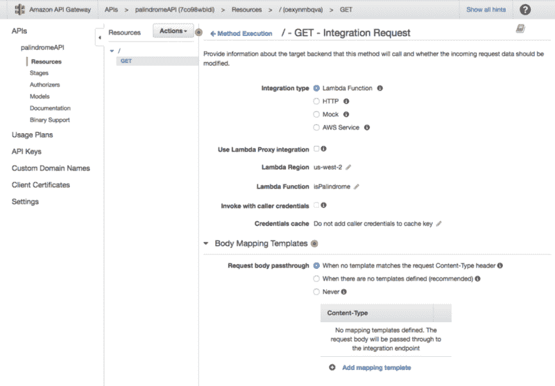

对于集成类型，确保选择了 Lambda 函数。

对于请求正文传递，选择“当没有定义模板时”，然后对于内容类型，输入“应用程序/json”。

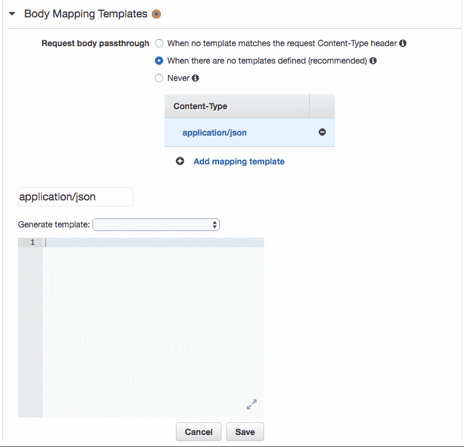

在空白处添加如下所示的 JSON 对象。这个 JSON 对象定义了参数“string ”,它允许我们使用 HTTP GET 请求将字符串值传递给 Lambda 函数。这类似于在 Express.js 中使用`req.params`。

在接下来的步骤中，我们将看看如何将字符串值传递给 Lambda 函数，以及如何从函数内部访问传递的值。

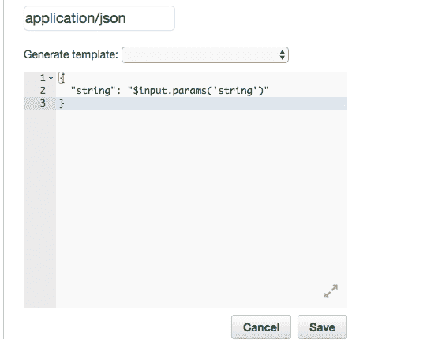

该 API 现在可以部署了。在“操作”菜单中，单击“部署 API”

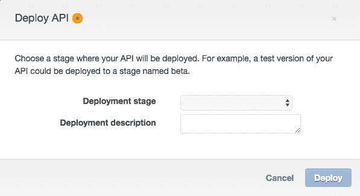

对于部署阶段，选择“[新阶段]”。

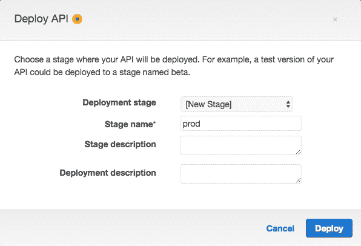

艺名用“prod”(是“production”的简称)。

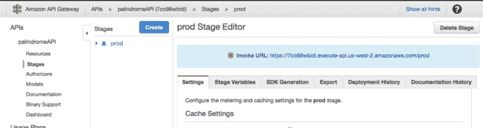

现在已经部署了 API，调用 URL 将用于通过 HTTP 请求与 Lambda 进行通信。如果您还记得，除了回调之外，Lambda 还接受两个参数:事件和上下文。

要向 Lambda 发送一个字符串值，您需要获取函数的调用 URL 并添加到它上面`?string=someValue`，然后可以使用`event.string`从函数内部访问传递的值。

通过删除硬编码的字符串值并用如下所示的`event.string`替换它来修改代码。

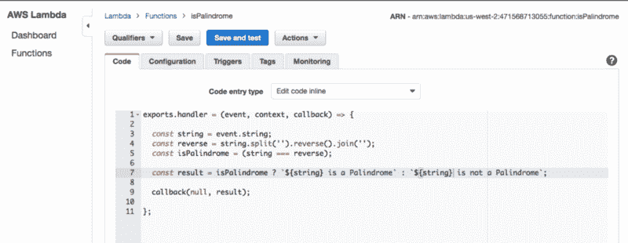

现在在浏览器中获取您的函数的调用 URL 并添加`?string=abcd`来通过浏览器测试您的函数。

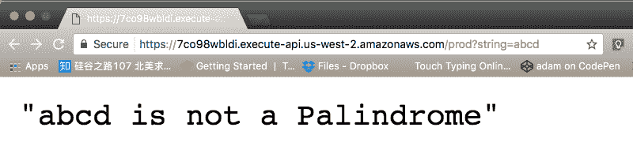

你可以看到 Lambda 回复说 abcd 不是回文。现在对赛车做同样的事情。

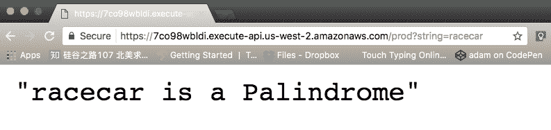

如果你愿意，你也可以使用 Postman 来测试你新的 isPalindrome Lambda 函数。Postman 是测试你的 API 端点的一个很棒的工具，你可以在这里了解更多。

为了验证它的有效性，这里有一个回文:

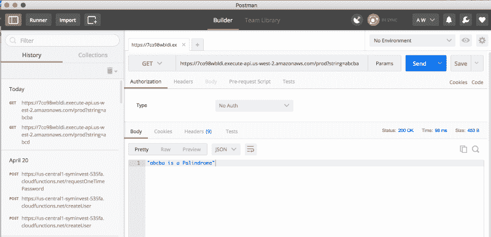

这里有一个非回文:

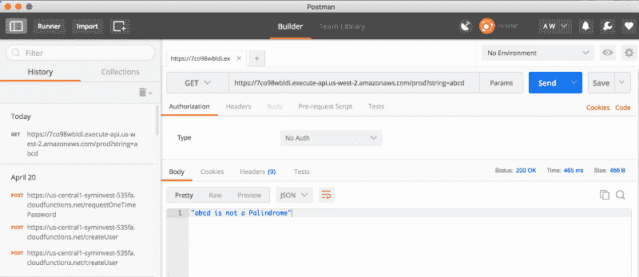

祝贺您——您已经设置并部署了自己的 Lambda 函数！

感谢阅读！