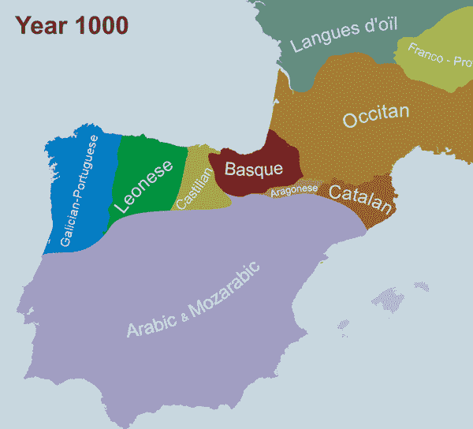
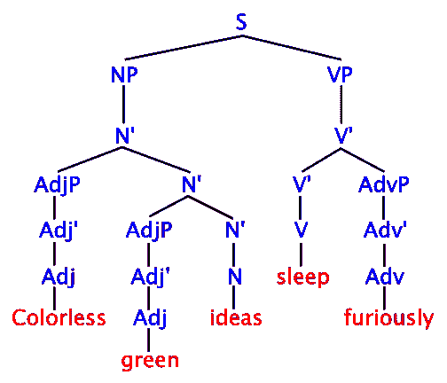
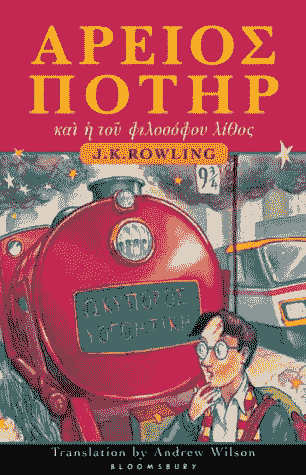

# 如果公司像面试编码员一样面试翻译会怎样？

> 原文：<https://www.freecodecamp.org/news/welcome-to-the-software-interview-ee673bc5ef6/>

何塞·阿吉纳加

# 如果公司像面试编码员一样面试翻译会怎样？

Welcome to the Tower of Babel. We require you to speak all languages known by the humankind. By the way, how do you feel about doing translations for free over the weekend? — Image credit: Wikipedia

候选人: 这是面试的地方吗？

**:是的，早上好，史密斯女士，请坐，我们正恭候您的光临。我知道你在申请高级技术翻译的工作。对吗？**

*这是正确的。我会说法语、西班牙语、意大利语和德语，在过去的 7 年里，我翻译过技术和学术文件。我目前专注于医学论文的翻译，但正如你在我的简介中看到的，我已经完成了所有种类的翻译。*

*太好了。你似乎具备这个职位的所有要求和经验。现在，像往常一样，我们想测试你对语言学的一些理解，只是为了确保你有基本的知识。*

*我知道你正在找人翻译医药产品的说明书和标签，对吗？*

*的确如此。我们只寻找最好的 A 级球员，他们在工作的所有要求方面都有坚实的基础。*

*没错。那么…我们可以开始了吗？*

*是的，让我们开始吧，我这里有一些针对这个职位的介绍性问题。第一个问题:711 年到 1492 年间阿拉伯人入侵伊比利亚半岛对西班牙语有什么影响？*

*你说什么？*

*你要我重复这个问题吗？又来了，穆斯林是如何入侵伊比利亚半岛的——*

*不，这很好，这只是让我大吃一惊，我以为会有更多与工作相关的东西，但我其实知道。由于伊斯兰教在七世纪早期征服了伊斯帕尼亚，以及在西班牙南部直到收复失地之前说阿拉伯语的人的存在，西班牙语从阿拉伯语中获得并改编了许多词汇。例如，西班牙语中国际象棋的单词“ajedrez”来自الشطرنج (ash shatranj)。*

*

History of the Spanish Language, just in case you need it for your next interview — credits to [Wikipedia](https://en.wikipedia.org/wiki/History_of_the_Spanish_language)* 

*出色的回答，正是我在问卷中的答案，你甚至因为给出了一个例子而获得了额外的分数。第二个问题:这位作者创造了“无色的绿色想法疯狂地睡觉”，作为语法正确但语义无意义的句子的例子。*

*这是个问题吗？*

*是的，当然。*

*抱歉，我没注意到我们在做危险游戏。诺姆·乔姆斯基？*

*很好，他在哪本书里写了这个例子？*

*什么？我不知道，我在大学的时候学过乔姆斯基，现在我主要专注于不需要——*

*真遗憾。《句法结构》,写于 1957 年。哦，好吧，事实上我们只有大多数新毕业生能回答这个问题。*

*我想知道为什么…*

*

If you invert the following tree, it will still make no sense — credits to [Wikipedia](https://en.wikipedia.org/wiki/Colorless_green_ideas_sleep_furiously#/media/File:Syntax_tree.svg)* 

**对。下一个问题:单词“父亲”、“父亲”、“瓦特”分别来自拉丁语、英语和德语；我们可以看到在某些情况下“p”演变成了“v”，但在其他情况下演变成了“f”。另一方面,“鱼”、“鱼”和“鱼”这些词—**

*很抱歉打断您，但在我们继续之前，我能问一下这些问题与实际工作有什么关系吗？工作描述说你正在寻找一名技术翻译，到目前为止，你还没有测试我的翻译能力，而是只专注于语言学。*

*是的，我能看出困惑。你看，我们正在寻找最好的翻译，而且大公司已经证明，能够最好地完成这项工作的人在翻译所基于的科学方面有非常坚实的基础，例如语言学和古典文学。*

*当然，我有拉丁语和古希腊语的学士学位和语言学的硕士学位，但是在过去的几年里我没有做过任何学术工作。*

*哦，所以你有资格回答这些问题。*

*是的，但是在过去的几年里，我没有做过任何需要那种特定知识的研究或工作。你是否在语言学中需要深入了解的特定领域进行研究或改进？*

*不，我们为客户做医药翻译。*

*很好，那我们为什么不测试一下我的翻译能力呢？我很确定你有一些例子，我可以翻译出来，对吗？*

*哦，是的，好主意，那我们接着做书面练习吧。请跟我到下面的白板前，拿一支记号笔，我们将做一些翻译练习来评估您的技能。*

*白板？*

**是的，这里有以下文字，请翻译:**

> *ΠΕΡΙ ΤΟΥ ΠΑΙΔΟΣ ΤΟΥ ΕΠΙΒΙΟΝΤΟΣ*

*…那是古希腊语。*

**是的，没错。**

*你需要为这份工作翻译古希腊语吗？*

**哈哈，当然不是。**

*那么，为什么…你知道吗，算了，我们这样吧。你有字典可以借我翻译一下吗？*

*哦，这个练习的目标是能够直接翻译它，就在白板上，别无他物。如果你需要，你可以用铅笔和纸。*

*等等，什么？为什么？即使是正常的翻译，我也总是有一本字典来支持我的一两个单词，为什么你要测试古希腊语而手边没有一本古希腊语字典呢？*

**没错，大公司的研究表明—**

*你做梦去吧。给我一点时间好吗？我想我在哪里见过这条短信。让我…“活着的孩子？”*

**是的！干得好！**

*那是……那是《哈利·波特》里的吗？*

*

You know, in case you want to brush up your Ancient Greek — credit to [Amazon](https://www.amazon.com/Harry-Potter-Philosophers-Stone-Ancient/dp/158234826X)* 

*哦，不，那是来自“破解翻译面试:150 个语言学问题和解决方案”的答题纸*

*不，我的意思是，这是从哈利波特书，第一章。就是这个标题。*

*我怎么会知道？我不是翻译。*

*我知道，我只是指出这样一个事实，它来自一个非常著名的文本，可能很容易被人们认出来。*

*没错，但这很好，不是吗？这意味着人们为这样的面试问题做好了准备。*

*是的，照本宣科的面试问题。听着，我真的不习惯当场回答问题，我通常有一些时间来想出最好的翻译方法。*

*我明白了。嗯，在我们愿意聘用的候选人中，我们还会考虑其他因素。你赢过什么跨校比赛吗？*

*请你再说一遍。*

*是的，你知道，翻译比赛。那就是你把一堆文件翻译成梵文，扔一些饮料和比萨饼，邀请各地的翻译人员把自己关起来 48 小时，看谁能最快地翻译这些文件。有时他们会增加免费奖品来增加趣味。你赢过这些吗？*

*不，我没有参加过任何“翻译比赛”。*

*太遗憾了，我们真的在寻找跨公司的赢家。*

*请不要再说反式化合物了。*

*好的，顺便问一下，你的书法怎么样？*

*我的书法技巧？*

*是的，我的意思是，你知道我们是一家大公司，但我们的团队是一家独立的创业公司，所以有时我们不仅让我们的翻译做翻译，还会写一些东西，完美的候选人会有出色的书法。*

*所以你只想让同一个人做两个人的工作？除此之外，你在候选人身上还寻找什么，包装产品的人？*

**是的！我们称之为全包翻译。**

*唉…你提到了一些关于团队作为一个创业公司工作的事情？那是什么意思？*

*这意味着我们做到了敏捷。一切都是扁平的结构，除了薪水和职责。我们有一个翻译大师，在 Sprints 中协调所有其他翻译。*

*翻译大师？听起来很棒。翻译大师会说几种语言？如果我们被困在翻译或其他事情上，我们能从他那里得到帮助吗？*

*哦，他实际上只会说英语，嗯，有时候我们不太明白他的意思。他是澳大利亚人，所以他的口音有时很难掌握，但是，嘿，他是敏捷认证的，非常擅长组织他人，并跟踪每个人的翻译。*

*你不是认真的吧。你在采访中问我古希腊语，我的经理甚至不知道那是什么？你能给我一个很好的理由来说明为什么这是一个值得工作的好公司吗？*

*在这里，你将学到在其他公司学不到的东西，同时还能对世界产生巨大影响。你会做一些有意义的事情，你永远不会感到无聊。这是一个超高速增长的环境，在许多领域都有快速发展的机会。*

*…你翻译药品标签。*

*是的，我们正在改变世界，一次一个标签。*

*给自己的提示:当我们给这位候选人发送拒绝信时，一定要附上对他们没有任何用处的模糊反馈，这样可以避免任何诉讼。*