# 如何用 PHP & MySQL 从头开始构建一个项目管理应用程序

> 原文：<https://www.freecodecamp.org/news/build-a-simple-project-management-application-from-scratch-in-php-5c0f886d8560/>

作者理查德

# 如何用 PHP & MySQL 从头开始构建一个项目管理应用程序


试图找到一个项目管理应用程序是一项令人生畏的任务:你想要一个具有强大功能的系统，并且你必须得到同事的认可。大多数时候，你最终会得到一个臃肿的系统，里面充满了你永远不会用到的特性。

好消息是，事实证明自己从头开始造一个并不困难。阅读完本教程后，您应该在不到一个小时的时间内拥有一个干净的、设计良好的项目管理应用程序。

### 什么是项目管理应用程序？

项目管理应用程序是用于项目规划、资源分配、项目组件跟踪和变更管理的软件系统。

在本教程中，我们将用 PHP 构建一个简单的项目管理系统，员工和经理可以用它在项目利益相关者之间进行协作和交流。

### 什么是项目管理应用程序？

我们将创建一个简单且易于定制的 PM 系统来跟踪项目，包括里程碑、任务、时间、成本等。由于每个项目都是独一无二的，本教程仅仅意味着构建一个应用程序基础；您应该能够根据自己的需求轻松扩展它。

**在我们的项目管理应用程序中，员工将能够:**

*   查看他们的任务
*   登录工作时间

**经理将能够:**

*   管理项目
*   管理里程碑
*   管理任务
*   管理成本和工时
*   管理员工资源

### 项目管理系统的组成部分

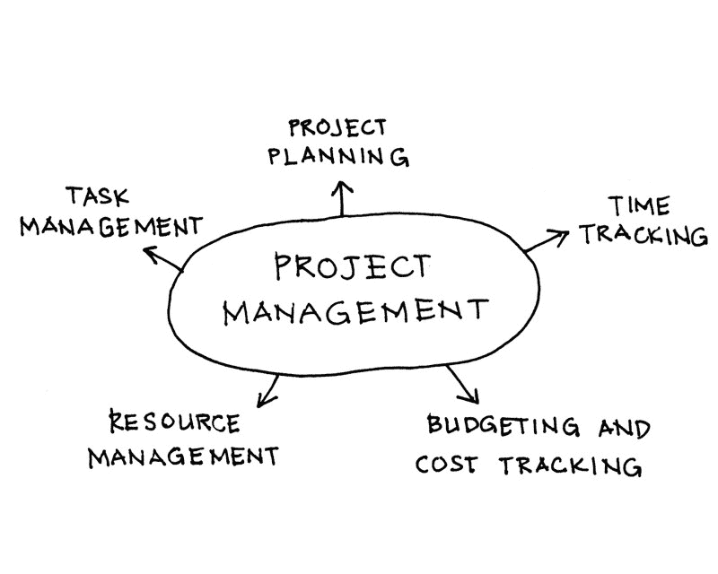

Building blocks of a typical project management system

以下是项目管理系统的主要功能:

*   **项目规划**:为了定义项目进度，项目经理可以使用软件来绘制项目任务，并直观地描述任务交互。
*   **任务管理**:允许项目经理创建和分配任务，确定截止日期，并生成状态报告。
*   资源管理:定义职责——谁应该做什么。
*   **预算和成本跟踪**:一个好的项目管理应用程序有助于预算报告以及利益相关者查看、通知和更新成本。
*   **时间跟踪**:软件必须有能力跟踪所有任务花费的时间，并为第三方顾问维护记录。

### 系统需求

*   PHP 5.3 以上
*   MySQL 或 MariaDB
*   phpGrid

### 创建项目管理数据库

我们将从创建项目管理数据库开始。我们将使用的主要表格有:

*   **客户** —客户公司数据
*   **联系人** —客户联系人数据。一个客户可以有一个或多个联系人。
*   **项目** —项目信息
*   **里程碑** —项目里程碑
*   **任务** —项目任务
*   **小时** —每项任务花费的时间
*   **成本** —任务的成本
*   **用户** —用户数据；一个人可以是雇员，也可以是经理

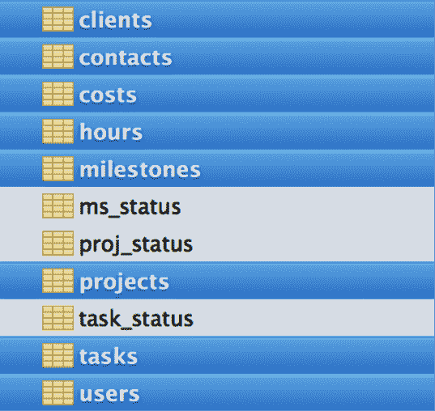

其他表([查找表):](https://www.quora.com/In-database-what-are-lookup-tables)

*   **ms_status**
*   **项目状态**
*   **任务状态**

#### 完整的数据库模式图

数据库模式是表示整个数据库的逻辑视图的结构:表、视图、主键和外键。数据库模式包括所有实体以及它们之间的关系。

下面是我们简单的项目管理应用程序的数据库图。每个表中的 key 符号表示表的主键，而放大镜表示将表链接到数据库中另一个表(查找表)的外键。

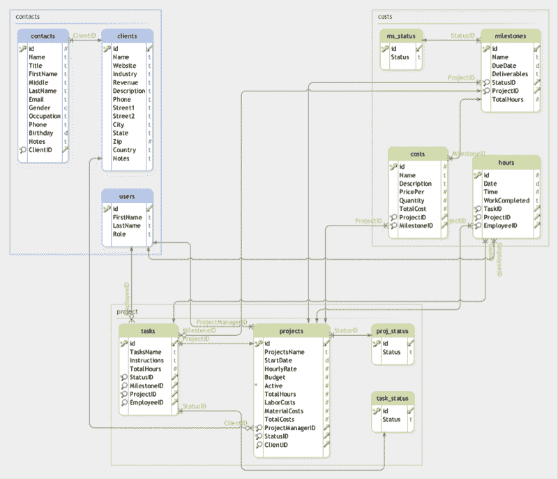

#### 简单安装

一旦了解了数据库的表结构，从本教程的 GitHub repo 中获取[**simple _ pm _ install . sql**](https://github.com/phpcontrols/phpgrid-project-management/blob/master/db/simple_pm_install.sql)SQL 脚本，然后使用 MySQL Workbench 或 Sequel Pro 等 MySQL 工具执行 SQL 脚本。这将创建一个名为`simple_pm`的新数据库和我们在本教程中需要的表。

### 设置 phpGrid

我们简单的项目管理包含许多数据网格。DataGrid 是一个类似电子表格的数据表，它显示代表数据库表中的记录和字段的行和列。数据网格为最终用户提供了在网页上读写数据库表的能力。

为了创建数据网格，我们使用了来自 [phpGrid](https://phpgrid.com/) 的数据网格工具。我们之所以使用工具而不是从头开始构建网格，是因为用 php 开发 DataGrid 通常非常繁琐，而且容易出错。phpGrid DataGrid 库将为我们处理所有内部数据库 **CRUD(创建、移除、更新和删除)**操作，用最少的代码提供更快更好的结果。

要安装 phpGrid，请按照下列步骤操作:

1.  解压缩 phpGrid 下载文件。
2.  将 phpGrid 文件夹上传到`**phpGrid**`文件夹。
3.  通过配置`**conf.php**`文件完成安装。

在我们开始编码之前，我们必须在 phpGrid 配置文件' conf.php '中包含以下信息。以下是数据库连接设置的示例:

```
define(‘PHPGRID_DB_HOSTNAME’, ‘localhost’); define(‘PHPGRID_DB_USERNAME’, ‘root’); define(‘PHPGRID_DB_PASSWORD’, ‘’); define(‘PHPGRID_DB_NAME’, ‘custom_pm’); define(‘PHPGRID_DB_TYPE’, ‘mysql’);
```

*   **PHPGRID_DB_HOSTNAME** — web 服务器 IP 或主机名
*   **PHPGRID_DB_USERNAME** —数据库用户名
*   **PHPGRID_DB_PASSWORD** —数据库密码
*   **PHPGRID_DB_NAME** —数据库名称
*   **PHPGRID_DB_TYPE** —数据库的类型
*   **PHPGRID_DB_CHARSET** —在 MySQL 中总是“utf8”

### 页面模板


我们的页面将由一个标题、**菜单**、**正文**和**页脚**组成。我们将从创建一个可重用的页面模板开始，而不是重复创建相同的页面元素。

#### head.php

这是一个基本的 HTML5 模板头；它包括一个到自定义样式表的链接，该样式表将在后面的步骤中创建。

#### menu.php


注意`$_GET['currentPage']`的用法。每个页面将设置一个值，该值将在顶部菜单栏上突出显示当前页面的名称。

在菜单样式的`**style.css**`中包含以下代码；它会将上面的无序列表转换成一个菜单。

#### footer.php

仅仅包括我们在标题中打开的元素的结束标记:

### 我们完整的可重复使用的页面模板

主要内容将放在章节标题之后。

### 项目管理主页


我们面向经理的项目管理应用程序有四个页面:

*   **客户端**
*   **客户详细信息**
*   **项目**
*   **项目详情**

**客户端**页面显示一个客户端列表，该列表带有指向单个客户端详细信息的链接(**客户端详细信息**页面)。

**项目**页面显示正在管理的项目列表，并带有项目详细信息的链接(**项目详细信息**页面)。

#### 设计模型

这是我们的项目管理应用程序设计模型，供管理一个或多个项目并将任务分配给员工的项目经理使用。

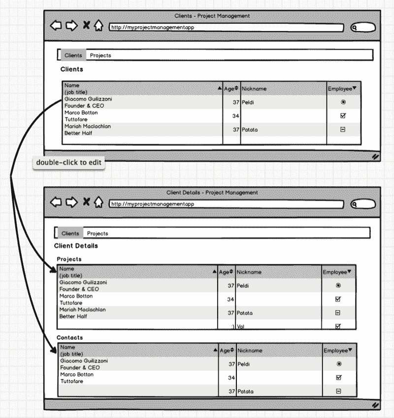

#### 客户

当经理登录项目管理系统时，他看到的第一个页面是 **Clients** 页面，其中包含公司的完整列表。

下面的代码会给我们一个客户列表。

*   第一行通过传递 SELECT SQL 语句创建一个 phpGrid 对象，该语句的主键为`**id**`，后跟数据库表的名称–`**clients**`。
*   第二行从主键“id”创建一个动态 URL 它使用了一个名为`**set_col_dynalink()**`的函数。这个函数根据动态值设置特定的列来显示 HTML 超链接 URL。如果主键“id”的值为 100，它将显示一个类似于`**client-details.php?id=100**`的 URL，该 URL 向下钻取客户端详细信息页面。
*   第三行`[**enable_edit()**](https://phpgrid.com/documentation/enable_editedit/)`，使数据网格可编辑，所有 CRUD(创建、读取、更新、删除)操作现在都可以访问。
*   最后一行调用`[**display()**](https://phpgrid.com/documentation/display/)`函数在屏幕上呈现数据网格。

使用这些功能，您可以在下面找到更多演示:

[**显示动态 URL | phpGrid**](https://phpgrid.com/example/display-dynamic-url/)
[*从上面的例子中，我们了解到 phpGrid 可以使用 set_col_link()方法显示简单、静态的 URL。不过是…*phpgrid.com](https://phpgrid.com/example/display-dynamic-url/)[**CRUD PHP Datagrid(可编辑的 Datagrid)* | PHP grid**](https://phpgrid.com/example/edit-datagrid/)
[*PHP Datagrid 默认是不可编辑的。只需调用 enable_edit()就可以启用编辑。威拉。*phpgrid.com](https://phpgrid.com/example/edit-datagrid/)

#### 客户详细信息

从**客户端**页面，客户端名称有一个超链接，单击该超链接会重定向到该客户端的**客户端详细信息**页面。

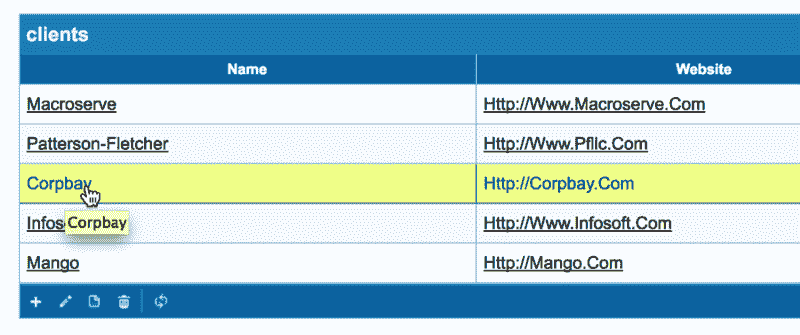

从**客户端详细信息**页面，我们需要获得作为 URL 参数传递的客户端 ID。

在我们的应用程序中，客户机 ID 应该总是一个整数。因此，我们使用 PHP `[**intval()**](http://php.net/manual/en/function.intval.php)`函数来确保客户机 ID 作为整数返回。

下面的代码使用过滤函数`[**set_query_filter()**](https://phpgrid.com/documentation/set_query_filterwhere/)`显示与当前`$clientId`相关联的项目。此外，我们用`[**enable_edit()**](https://phpgrid.com/documentation/enable_editedit/)`函数使数据网格可编辑；phpGrid 将为我们处理任何 CRUD 操作。

**客户详情>项目** cts

您可能注意到，我们再次使用相同的函数`**set_col_dynalink()**`，使用项目 ID 创建到**项目细节**表的超链接。接下来我们将进入`**project-details.php**`页面。

```
<h4>Projects</h4>
```

**客户详情>联系方式**联系方式

在**项目**数据网格下，使用相同的功能`[**set_query_filter()**](https://phpgrid.com/documentation/set_query_filterwhere/)`和`[**enable_edit()**](https://phpgrid.com/documentation/enable_editedit/)`显示与`$clientid`相关的联系人列表。

#### 联系人

#### 项目

现在，让我们构建**项目**页面。

**项目**页面显示了被管理项目的列表。它与**客户**页面非常相似，除了数据库表是“项目”，超链接有 URL `**project-details.php**`而不是`**client-details.php**`。

#### 项目详情

在**项目**页面中，每个项目名称都有一个超链接，点击后会重定向到每个单独的**项目详细信息**页面。

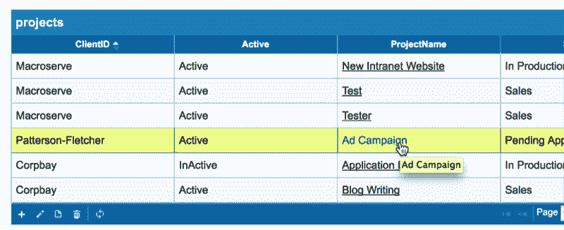

从**项目细节**页面，我们检索 URL 参数的项目 ID。

眼熟吗？因为确实是！这应该是因为**项目**和**项目细节**几乎都遵循在**客户**和**客户细节**页面中使用的相同编码模式；其实没有那么多惊喜。

**项目详细信息**页面由以下网格组成，所有网格都被从 URL 参数中获得的`$projectId`过滤。

*   **里程碑**
*   **任务**
*   **小时**
*   **费用**

#### 里程碑

里程碑标志着项目时间表中的重大事件。在这里，我们可以通过过滤值`$projectId`很容易地显示一个项目的所有里程碑。项目经理拥有修改里程碑所需的访问权限。

同样，我们可以轻松地过滤和显示当前项目的任务列表。

我想你现在可能已经找到窍门了。下面是剩下的两个数据网格的代码。

### 员工页面

我们现在可以进入本教程的最后一部分，即**员工**页面。员工可以登录查看分配给他们的活动项目任务，跟踪任务时间和成本。他们的职责很简单:监控任务并记录任何特定项目任务的工作时间。

### 设计模型

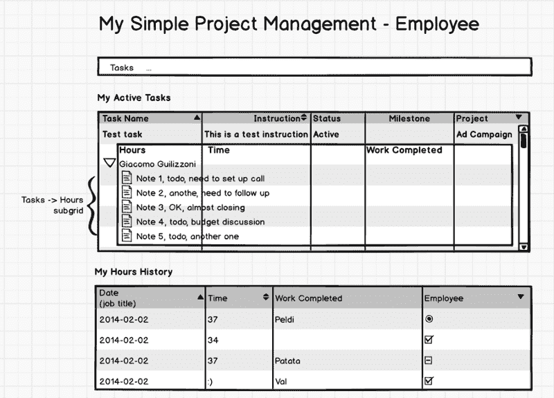

#### 菜单

**员工**页面只有一个菜单项:**任务**。


#### 我的活动任务

页面的第一部分显示了分配给当前员工的活动任务列表。每个任务都有当前员工报告的小时数；这是使用 [phpGrid 子网格](https://phpgrid.com/example/subgrid/)的理想情况。

我们还需要使用`[**set_query_filter()**](https://phpgrid.com/documentation/set_query_filterwhere/)`来只显示状态值为“2”的活动任务，并且只针对当前员工。

出于演示目的，我们将雇员 ID 硬编码为 2。在现实世界的应用程序中，应该使用 [PHP 会话](http://php.net/manual/en/book.session.php)来存储和检索雇员 ID 值。

然后，我们为当前员工创建活动的**任务**数据网格。请注意过滤器功能。

一旦我们为活动任务定义了网格，我们就创建一个数据网格来记录当前员工报告的小时数。

最后，`[**set_subgrid()**](https://phpgrid.com/documentation/set_subgrid/)`使得**小时**数据网格成为**任务**数据网格的子网格。在**小时**子网格中的链接字段是第二个参数“TaskID”，在主网格**任务**中，它是第三个参数“id”。

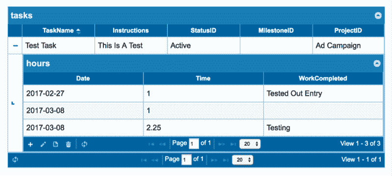

#### 我的小时历史记录

最后，我们希望显示一个只读的数据网格，使用当前员工的 **Hours** 表中的数据进行查看。

注意，我们使用了一个名为`[**set_jq_gridName()**](https://phpgrid.com/documentation/set_jq_gridname/)`的函数。你可以在这里找到更多的文档[。该函数为数据网格设置唯一的对象名。默认情况下，phpGrid 使用数据库表名作为其内部对象名。因为在上一部分中我们已经从**小时**表中创建了一个数据网格，所以我们必须为第二个**小时**数据网格设置一个唯一的名称。](https://phpgrid.com/documentation/set_jq_gridname/)

### 应用程序截图

#### 经理

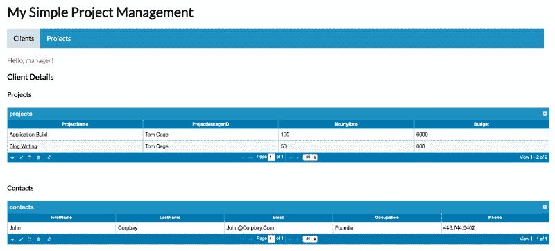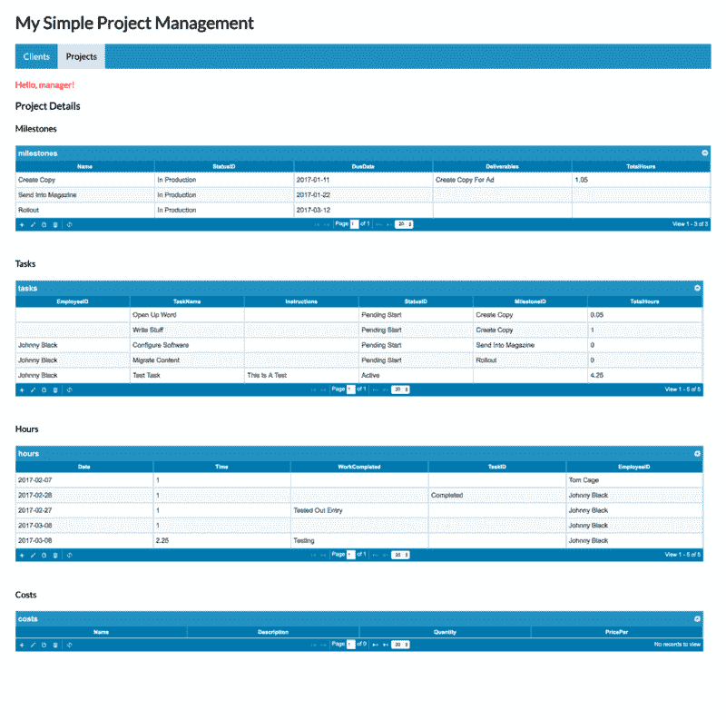

#### 雇员

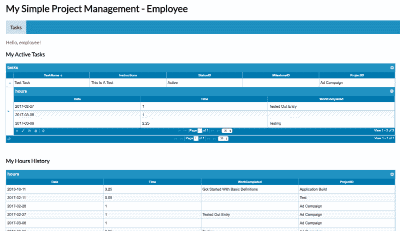

### 现场演示

[以经理身份登录](https://www.phpdatagrid.com/apps/phpgrid-project-management/manager/clients.php) | [以员工身份登录](https://www.phpdatagrid.com/apps/phpgrid-project-management/employee/tasks.php)

### 下载源代码

[**PHP controls/PHP grid-项目管理**](https://github.com/phpcontrols/phpgrid-project-management)
[*PHP grid-项目管理— phpGrid 完整项目管理演示应用*github.com](https://github.com/phpcontrols/phpgrid-project-management)

### 感谢阅读。如果你喜欢这篇文章，请点击那个按钮。帮助其他人找到它，并在 Twitter 上关注我。

