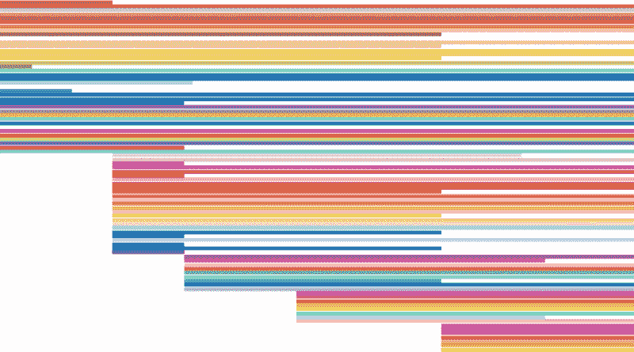
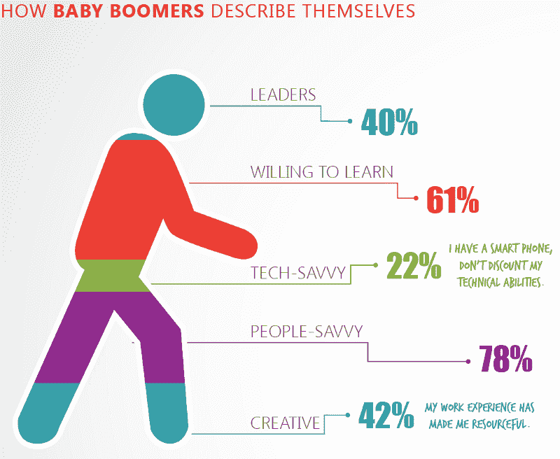
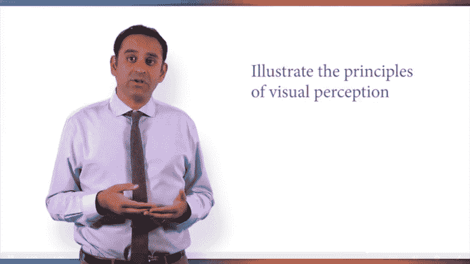
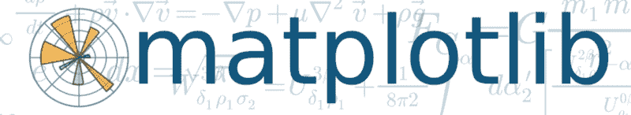

# 互联网上所有数据可视化课程的概述

> 原文：<https://www.freecodecamp.org/news/an-overview-of-every-data-visualization-course-on-the-internet-9ccf24ea9c9b/>

大卫·文丘里

# 互联网上所有数据可视化课程的概述

[History of Crayola Colors](https://public.tableau.com/en-us/s/gallery/history-crayola-colors) by Stephen Wagner via Tableau Public.

一年前，我退出了加拿大最好的计算机科学项目之一。我开始利用在线资源创建自己的[数据科学硕士项目](https://medium.com/@davidventuri/i-dropped-out-of-school-to-create-my-own-data-science-master-s-here-s-my-curriculum-1b400dcee412#.5fwwphdqd)。我意识到，我可以通过 edX、Coursera 和 Udacity 来学习我需要的一切。我可以更快、更有效地学习它，而且只需要很少的费用。

我现在几乎完成了。我参加了许多数据科学相关的课程，并旁听了更多课程的部分内容。我知道有哪些选择，以及准备成为数据分析师或数据科学家的学员需要哪些技能。几个月前，我开始创建一个由评论驱动的指南，为数据科学中的每个学科推荐最佳课程。

对于本系列的第一个指南，我为初学数据科学家推荐了几个[编码类](https://medium.freecodecamp.com/if-you-want-to-learn-data-science-start-with-one-of-these-programming-classes-fb694ffe780c#.42hhzxopw)。然后是[统计和概率课](https://medium.freecodecamp.com/if-you-want-to-learn-data-science-take-a-few-of-these-statistics-classes-9bbabab098b9#.p7pac546r)。然后是[对数据科学](https://medium.freecodecamp.com/i-ranked-all-the-best-data-science-intro-courses-based-on-thousands-of-data-points-db5dc7e3eb8e#.5qdvv8dui)本身的介绍。

### 现在谈谈数据可视化。

对于这个指南，我花了 10 多个小时试图识别截至 2017 年 3 月提供的每一个在线数据可视化课程，从它们的教学大纲和评论中提取关键信息，并汇编它们的评级。为了完成这个任务，我求助于开源课程中央社区及其数千个课程评级和评论的数据库。

Class Central’s [homepage](https://www.class-central.com/).

自 2011 年以来， [Class Central](https://www.class-central.com/) 创始人[达瓦尔·沙阿](https://www.class-central.com/@dhawal)比世界上任何人都更关注在线课程。Dhawal 亲自帮我整理了这个资源列表。

### 我们如何选择要考虑的课程

每门课程必须符合三个标准:

1.  **课程的大部分必须集中在*解释性*数据可视化上。**例如，考虑到数据准备是数据可视化流程的一个重要组成部分，数据准备的覆盖范围是允许的。涵盖不太相关主题的课程(例如统计建模)被排除在外。更多关于*的解释性*区别见下文。
2.  必须按需提供或每隔几个月提供一次。
3.  **它必须是一个互动的在线课程，所以没有书籍或只读教程**。虽然这些都是可行的学习方法，但本指南主要关注课程。

我们相信我们涵盖了所有符合上述标准的著名球场。由于 Udemy 上似乎有数百门课程，我们选择只考虑评论最多和评分最高的课程。不过，我们总有可能错过一些东西，所以如果我们漏掉了一门好课程，请在评论区告诉我们。

### 我们如何评估课程

我们收集了中央课堂和其他复习网站的平均评分和复习次数，以计算每门课程的加权平均评分。我们阅读文本评论，并使用这些反馈来补充数字评级。

我们根据**两个**因素做出主观教学大纲判断，第一个因素优先于第二个因素:

1.  **数据可视化理论的覆盖面。是否解释了可视化选择的动机？课程只教工具吗？下一节将详细介绍这一点。**
2.  **所选数据可视化工具的覆盖范围。**课程是否有效教授常用可视化工具(Tableau、ggplot2、Seaborn 等。)?学生有机会练习这些技能吗？没有给出工具选择的偏好。

[Tableau](https://www.tableau.com/) and [ggplot2](http://ggplot2.org/) are common data visualization tools.

### 为什么优先考虑可视化理论

没有有效可视化的基础知识，掌握一个特定的工具是浪费。此外，根据不同的设置，工具通常可以互换。

更重要的是，做好数据可视化比大多数人想象的要复杂。从计划阶段到执行阶段都需要深思熟虑。选择正确的图表、平衡复杂性和混乱性、利用[前注意属性](https://www.csc2.ncsu.edu/faculty/healey/PP/)等等，数据可视化既是一门艺术也是一门科学。很容易出错，有时还会出错(见下文)。

He’s 243% baby boomer. An example of data visualization gone wrong, courtesy of [WTF Visualizations](http://viz.wtf/post/59697293967/hes-243-baby-boomer).

### 探索性与解释性可视化

正如印第安纳大学教授 Yong-Yeol Ahn 的[所描述的](https://github.com/yy/dviz-course/wiki/Exploratory-vs.-explanatory-visualization),*解释性*数据可视化的目的是交流见解和信息，而*探索性*可视化的目的是发现隐藏的模式。

本文重点介绍**解释性**数据可视化课程。因此，像 Udacity 的[R](https://www.class-central.com/mooc/1478/udacity-data-analysis-with-r)数据分析课程(完全是一门探索性课程)被排除在本文之外。题目很重要；没有足够的课程来证明一篇独立的文章。这将在本系列的总结文章中简要介绍。

### 有时需要编码经验

下面列出的一些课程需要课程教学语言中的基本编码技能。如果你几乎没有编程经验，我们在本系列第一篇文章中的建议——数据科学的[编程](https://medium.freecodecamp.com/if-you-want-to-learn-data-science-start-with-one-of-these-programming-classes-fb694ffe780c#.ld31z08y5)课程的最佳介绍——将是一个很好的开始。Python 和 R 课程都有涉及。

### 缺少审查数据

与本系列中的其他文章相比，缺少符合上述标准的数据可视化课程的综述数据。目前还没有*明确的*最佳数据可视化课程。因此，下面的建议不像以前的文章那样具有决定性。一如既往，但特别是在这里，尝试选择最适合你的需要。

### 我们挑选的最佳数据可视化课程是…

*   [加州大学戴维斯分校在 Coursera 上开发的 Tableau 专业化数据可视化](https://click.linksynergy.com/fs-bin/click?id=SAyYsTvLiGQ&subid=&offerid=467035.1&type=10&u1=cc-medium-career-guide-dataviz&tmpid=18061&RD_PARM1=https%3A%2F%2Fwww.coursera.org%2Fspecializations%2Fdata-visualization)

…包含以下五门课程:

*   [用 Tableau 可视化的基础知识](https://www.class-central.com/mooc/6808/coursera-fundamentals-of-visualization-with-tableau)
*   【Tableau 的基本设计原则
*   [带表格的视觉分析](https://www.class-central.com/mooc/7621/coursera-visual-analytics-with-tableau)
*   [创建仪表盘和用 Tableau 讲故事](https://www.class-central.com/mooc/6806/coursera-creating-dashboards-and-storytelling-with-tableau)
*   【Tableau 项目的数据可视化

基于本文的评估标准，加州大学戴维斯分校的 Tableau 专业化数据可视化拥有理论和工具覆盖范围的最佳组合。它像其他课程一样深入理论。虽然掌握 Tableau 不是重点，但是有机会通过演练和期末专题来练习 Tableau。这是一个相当新的专业(2016 年末)，在用于本次分析的评论网站上，这些课程之间只有一个 **4** 星级。

Govind Acharya、Hunter Whitney 和 Suk Brar 是导师。阿查里亚是加州大学戴维斯分校的首席分析师。Whitney 和 Brar 是受人尊敬的行业专家。他们拥有数十年的数据可视化经验，这些经验通过课程内容清楚地传达出来。这些视频制作精良。

Coursera 上的专业化时间表估计为 22 周，每周承诺从 3 到 8 小时不等。正如一些评论者和我在 Coursera 的经历所指出的，这些估计肯定太高了。目前有免费(单独审核每门课程)和付费(为专业化付费)两种选择。

Coursera 上几位著名的评论者指出了以下几点:

> 他们不仅告诉你如何做可视化设计，还告诉你为什么(生理学，原理)。我强烈推荐这门课。

> 伟大的课程——防范可视化准备中的一些微妙陷阱。

> 虽然是一个非常基础的 Tableau 使用介绍，本课程提供了一个广泛而有趣的背景，应该证明是有用的任何人寻求加强他们的可视化基础知识的理解。

University of California, Davis’ [Coursera page](https://www.coursera.org/ucdavis).

[Govind Acharya](https://www.coursera.org/instructor/govind-acharya) and [Hunter Whitney](https://www.coursera.org/instructor/hunter-whitney) are instructors for the [Data Visualization with Tableau Specialization](https://click.linksynergy.com/fs-bin/click?id=SAyYsTvLiGQ&subid=&offerid=467035.1&type=10&u1=cc-medium-career-guide-dataviz&tmpid=18061&RD_PARM1=https%3A%2F%2Fwww.coursera.org%2Fspecializations%2Fdata-visualization).

### 可视化理论和 R，边做边学

*   DataCamp 使用 ggplot2 实现数据可视化

…有三个部分:

*   [使用 ggplot2 进行数据可视化(第 1 部分)](https://www.datacamp.com/courses/data-visualization-with-ggplot2-1?tap_a=5644-dce66f&tap_s=93618-a68c98)
*   [使用 ggplot2 进行数据可视化(第二部分)](https://www.datacamp.com/courses/data-visualization-with-ggplot2-2?tap_a=5644-dce66f&tap_s=93618-a68c98)
*   [使用 ggplot2 进行数据可视化(第三部分)](https://www.datacamp.com/courses/data-visualization-with-ggplot2-part-3?tap_a=5644-dce66f&tap_s=93618-a68c98)

另一个很好的选择是 DataCamp 的 ggplot2 系列的数据可视化，特别是如果你想学习 R，更具体地说是 [ggplot2](http://ggplot2.org/) 。涵盖了大量的理论，这是合适的，因为 ggplot2 的灵感来自[的图形语法](http://www.springer.com/gp/book/9780387245447)。工具覆盖面和实践也令人印象深刻——离开这些课程后，您将会非常了解 R 及其古怪的语法。用于此分析的评论网站上没有这些课程的评论。

这三门课程的讲师是 Rick Scavetta，他是一名生物学家、车间培训师、自由数据科学家和科学工艺的联合创始人。DataCamp 的混合教学风格利用视频(由 Scavetta 主演)和基于文本的教学，通过浏览器内的代码编辑器提供大量示例。视频、文本和代码内容都得到了很好的润色。

所有三门课程的预计时间加在一起为 16 个小时。每门课程的第一章都是免费的。完全访问需要 DataCamp [订阅](https://www.datacamp.com/pricing)，目前为每月 29 美元或每年 300 美元。

以下[代言](http://flowingdata.com/2016/02/18/learn-the-basics-of-ggplot2-interactively/)来自 RStudio 首席科学家 [Hadley Wickham](http://hadley.nz/) 和 ggplot2 创作者:

> 我强烈推荐 Rick Scavetta 的《用 ggplot2 实现数据可视化》。它很好地介绍了 ggplot2。您将学习基础理论，并在 DataCamp 的在线学习环境中动手实践。

DataCamp’s logo.

### **优秀讲师的 Tableau 实用介绍**

基里尔·叶列缅科和超级数据科学团队在 Udemy 上制作的 Tableau 10 系列，包括:

*   [Tableau 10 A-Z:数据科学实践 Tableau 培训！](https://click.linksynergy.com/fs-bin/click?id=SAyYsTvLiGQ&subid=&offerid=323058.1&type=10&tmpid=14538&u1=cc-career-guide-dataviz&RD_PARM1=https%3A%2F%2Fwww.udemy.com%2Ftableau10%2F)
*   [Tableau 10 高级培训:数据科学大师 Tableau](https://click.linksynergy.com/fs-bin/click?id=SAyYsTvLiGQ&subid=&offerid=323058.1&type=10&u1=cc-career-guide-dataviz&tmpid=14538&RD_PARM1=https%3A%2F%2Fwww.udemy.com%2Ftableau10-advanced%2F)

由基里尔·叶列缅科教授，SuperDataScience 的 Tableau 10 系列是一个有效的实践介绍。它主要关注工具覆盖率(Tableau ),而不是数据可视化理论。叶列缅科是这些指南中最受好评的导师之一，对他的课程一直给予积极的评价。A-Z 课程是高级培训课程的先决条件。在 3，724 条评论中，该系列课程的加权平均评分为 4.6 星。

该系列有 17 个小时的视频内容。每门课程的费用取决于 Udemy 的折扣，但这些折扣很常见，只需 10 美元就能买到。

几位著名的评论家指出:

这太棒了。我每天都使用 Tableau，但它是对我不使用的一些项目的极好复习，也是参加 Tableau 认证专家考试的很好的学习辅助。基里尔和团队干得好！

Kirill 是一位优秀的教师，学习这门课程的学生将会清楚地看到为什么他有几十门课程和成千上万的学生——他能够在真实的商业环境中教授复杂的技能，并循序渐进地这样做，从而将同时教授基础知识和具体应用的复杂任务结合起来。

### 竞争

让我们看看其他备选方案，按评级降序排列。

[用 Python 进行交互式数据可视化& Bokeh](https://click.linksynergy.com/fs-bin/click?id=SAyYsTvLiGQ&subid=&offerid=323058.1&type=10&u1=cc-medium-career-guide-dataviz&tmpid=14538&RD_PARM1=https%3A%2F%2Fwww.udemy.com%2Fpython-bokeh%2F) (Ardit Sulce/Udemy):工具聚焦(Python 和 Bokeh)。包括关于创建 web 应用程序的部分。七个小时的视频。费用视 Udemy 折扣而定，折扣是常见的。它在 103 条评论中的加权平均评分为 **4.6** 星。

[信息可视化(IVMOOC)](https://www.class-central.com/mooc/627/information-visualization) (印第安纳大学/独立):非常详细地涵盖了理论和多种工具。令人印象深刻的真实项目。尽管给课程管理人员发了电子邮件，注册还是没有成功。整整 12 周的研究生课程。免费。它在 2 篇评论中的加权平均评分为 **4.5** 星。

Indiana University offers [Information Visualization (IVMOOC)](https://www.class-central.com/mooc/627/information-visualization).

[Tableau for 初学者——获得认证加速你的职业生涯](https://click.linksynergy.com/fs-bin/click?id=SAyYsTvLiGQ&subid=&offerid=323058.1&type=10&u1=cc-medium-career-guide-dataviz&tmpid=14538&RD_PARM1=https%3A%2F%2Fwww.udemy.com%2Ftableau-accelerate-your-career-and-get-certified%2F) (Lukas Halim/Udemy):工具聚焦(Tableau)。四个小时的视频。费用视 Udemy 折扣而定，折扣是常见的。它在 649 条评论中的加权平均评分为 **4.5** 星。

[用 Power BI 分析和可视化数据](https://www.class-central.com/mooc/5156/edx-analyzing-and-visualizing-data-with-power-bi)(微软/edX):工具聚焦(Power BI)。为投资于微软生态系统的企业用户量身定制。[微软数据科学专业项目证书](https://www.edx.org/microsoft-professional-program-certficate-data-science)的一部分。预计六周内每周两到四个小时。可免费购买经过验证的证书。它在 117 条评论中获得了 **4.5** 星的加权平均评分。

[用 Excel 分析和可视化数据](https://www.class-central.com/mooc/4480/edx-analyzing-and-visualizing-data-with-excel) (Microsoft/edX):工具聚焦(Excel)。为投资于微软生态系统的企业用户量身定制。[微软数据科学专业项目证书](https://www.edx.org/microsoft-professional-program-certficate-data-science)的一部分。预计六周内每周两到四个小时。可免费购买经过验证的证书。它在 972 条评论中获得了 **4.5** 星的加权平均评分。

Microsoft offers two data visualization courses on edX: [Analyzing and Visualizing Data with Power BI](https://www.class-central.com/mooc/5156/edx-analyzing-and-visualizing-data-with-power-bi) and [Analyzing and Visualizing Data with Excel](https://www.class-central.com/mooc/4480/edx-analyzing-and-visualizing-data-with-excel).

[数据用 D3.js 可视化数据最简单的方法](https://click.linksynergy.com/fs-bin/click?id=SAyYsTvLiGQ&subid=&offerid=323058.1&type=10&u1=cc-medium-career-guide-dataviz&tmpid=14538&RD_PARM1=https%3A%2F%2Fwww.udemy.com%2Fdata-visualize-data-with-d3js-the-easy-way%2F)(无限技能/Udemy):工具聚焦(D3.js)。四个小时的视频。费用视 Udemy 折扣而定，折扣是常见的。它在 262 条评论中的加权平均评分为 **4.4** 星。

[用 Python 和 Matplotlib 实现数据可视化](https://click.linksynergy.com/fs-bin/click?id=SAyYsTvLiGQ&subid=&offerid=323058.1&type=10&u1=cc-medium-career-guide-dataviz&tmpid=14538&RD_PARM1=https%3A%2F%2Fwww.udemy.com%2Fdata-visualization-with-python-and-matplotlib%2F) (Stone River eLearning/Udemy):工具聚焦(Python 和 Matplotlib)。六个小时的视频。费用视 Udemy 折扣而定，折扣是常见的。它在 92 条评论中的加权平均评分为 **4.4** 星。

[数据分析:可视化和仪表盘设计](https://www.class-central.com/mooc/5388/edx-data-analysis-visualization-and-dashboard-design)(代尔夫特理工大学/edX):工具(Excel)和业务焦点。预计六周内每周四到六个小时。可免费购买经过验证的证书。它在 5 次评论中的加权平均评分为 **4.2** 星。

[大数据:数据可视化](https://www.class-central.com/mooc/5423/futurelearn-big-data-data-visualisation)(昆士兰科技大学/FutureLearn):平衡理论/工具聚焦。接触各种工具。从 2017 年 8 月开始。预计时间表为三周内每周两小时。免费，可购买“升级版”。它有一个 **4** 星级超过 1 评论。

[数据可视化与 Tableau 沟通](https://www.class-central.com/mooc/4297/coursera-data-visualization-and-communication-with-tableau)(杜克大学/Coursera):工具(Tableau)与业务聚焦。部分 [Excel to MySQL:商业专业化分析技术](https://click.linksynergy.com/fs-bin/click?id=SAyYsTvLiGQ&subid=&offerid=467035.1&type=10&tmpid=18061&u1=cc-medium-career-guide-dataviz&RD_PARM1=https%3A%2F%2Fwww.coursera.org%2Fspecializations%2Fexcel-mysql)。预计五周内每周六至八小时。提供免费和付费选项。它在 9 篇评论中的加权平均评分为 **3.67** 星。

[数据可视化](https://www.class-central.com/mooc/2737/coursera-data-visualization)(伊利诺伊大学香槟分校/Coursera):理论聚焦。[数据挖掘专业](https://click.linksynergy.com/fs-bin/click?id=SAyYsTvLiGQ&subid=&offerid=467035.1&type=10&u1=cc-medium-career-guide-dataviz&tmpid=18061&RD_PARM1=https%3A%2F%2Fwww.coursera.org%2Fspecializations%2Fdata-mining)的一部分。预计时间表为四周内每周四至六小时。提供免费和付费选项。它在 22 条评论中的加权平均评分为 **3.14** 星。

[Data Visualization](https://www.class-central.com/mooc/2737/coursera-data-visualization) is offered by University of Illinois at Urbana-Champaign on Coursera.

[数据可视化与 D3.js](https://www.class-central.com/mooc/2898/udacity-data-visualization-and-d3-js) (Udacity):平衡理论/工具聚焦。D3.js 指令感觉“不完整”和“不合适”预计时间为七周。免费。它在 6 条评论中的加权平均评分为 **2.83** 星。

[数据管理与可视化](https://www.class-central.com/mooc/4184/coursera-data-management-and-visualization)(卫斯理大学/Coursera):平衡理论/工具聚焦。涵盖多种工具(Python 和 SAS)。卫斯理大学[数据分析和解释专业](https://click.linksynergy.com/fs-bin/click?id=SAyYsTvLiGQ&subid=&offerid=467035.1&type=10&u1=cc-medium-career-guide-dataviz&tmpid=18061&RD_PARM1=https%3A%2F%2Fwww.coursera.org%2Fspecializations%2Fdata-analysis)的一部分。预计四周内每周四到五个小时。提供免费和付费选项。它在 6 条评论中的加权平均评分为 **2.67** 星。

[应用绘图、制图&Python 中的数据表示](https://www.class-central.com/mooc/6670/coursera-applied-plotting-charting-data-representation-in-python)(密歇根大学/Coursera):平衡的理论和工具焦点。提供免费和付费选项。它在 4 篇评论中获得了 **2** 星的加权平均评级。

截至 2017 年 3 月，以下课程没有复习。

[Tableau 中的数据可视化](https://www.class-central.com/mooc/7164/udacity-data-visualization-in-tableau) (Udacity):理论聚焦，覆盖面极佳。简单的工具覆盖(表格)。主要是基于文本的教学和多项选择测验。Udacity 的[数据分析师 Nanodegree](https://www.class-central.com/certificate/data-analyst-nanodegree--nd002) 和[商业预测分析 Nanodegree](https://www.udacity.com/course/predictive-analytics-for-business--nd008) 的一部分。当用视频来补充文本时，这门课程很可能会进入前三名。预计时间为三周。免费。

[构建数据可视化工具](https://www.class-central.com/mooc/7176/coursera-building-data-visualization-tools)(约翰霍普金斯大学/Coursera):工具聚焦(R 和 ggplot2)。JHU[的一部分精通 R 专业](https://click.linksynergy.com/fs-bin/click?id=SAyYsTvLiGQ&subid=&offerid=467035.1&type=10&u1=cc-medium-career-guide-dataviz&tmpid=18061&RD_PARM1=https%3A%2F%2Fwww.coursera.org%2Fspecializations%2Fr)的软件开发。预计时间表为四周内每周两小时。提供免费和付费选项。

[面向所有人的数据可视化](https://www.class-central.com/mooc/8003/edx-data-visualization-for-all)(三一学院/edX):理论聚焦。预计时间表为六周内每周三小时。可免费购买认证证书。

[用高级 Excel 进行数据可视化](https://www.class-central.com/mooc/6855/coursera-data-visualization-with-advanced-excel) (PwC/Coursera):工具聚焦(Excel)。普华永道[数据分析和展示技能的一部分:普华永道方法专业化](https://click.linksynergy.com/fs-bin/click?id=SAyYsTvLiGQ&subid=&offerid=467035.1&type=10&tmpid=18061&u1=cc-medium-career-guide-dataviz&RD_PARM1=https%3A%2F%2Fwww.coursera.org%2Fspecializations%2Fpwc-analytics)。预计时间表为四周内每周三到四小时。提供免费和付费选项。

[交流商业分析结果](https://www.class-central.com/mooc/7031/coursera-communicating-business-analytics-results)(科罗拉多大学博尔德分校/Coursera):理论和商业焦点。科罗拉多州玻尔得[商业训练营专业化](https://click.linksynergy.com/fs-bin/click?id=SAyYsTvLiGQ&subid=&offerid=467035.1&type=10&tmpid=18061&u1=cc-medium-career-guide-dataviz&RD_PARM1=https%3A%2F%2Fwww.coursera.org%2Fspecializations%2Fdata-analytics-business)数据分析的一部分。预计时间为四周。提供免费和付费选项。

[通过数据可视化讲述故事](https://www.dataquest.io/course/storytelling-data-visualization) (Dataquest):主要是工具焦点(Python、Matplotlib 和 Seaborn)。估计时间表不清楚。大部分是免费的，但是完全进入需要一个[订阅](https://www.dataquest.io/subscribe)。

[数据可视化学习路径](http://shop.oreilly.com/category/learning-path/data-visualization.do) (O'Reilly):平衡的工具/理论重点。涵盖 D3.js .多个导师。十五个小时的内容。免费十天免费试用。

[面向开发者的数据可视化](https://www.pluralsight.com/courses/data-visualization-developers) (Dan Appleman/Pluralsight):理论聚焦。为开发者量身定制。两个小时的内容。免费十天免费试用。

以下四门课程由蜂巢媒体的比尔·山德创建，在琳达网站上提供。它们是按发布日期的时间顺序排列的。

[数据可视化基础](https://www.lynda.com/Design-Infographics-tutorials/Data-Visualization-Fundamentals/153776-2.html)(比尔·山德/琳达):理论聚焦。四个小时的内容。免费十天免费试用。

[设计数据可视化](https://www.lynda.com/Illustrator-tutorials/Designing-Data-Visualization/175720-2.html) (Bill Shander/Lynda):理论聚焦。包括创建一个具体的项目，从概念到数据分析到设计和执行。四个小时的内容。免费十天免费试用。

[数据分析师的数据可视化](https://www.lynda.com/Excel-tutorials/Data-Visualization-Data-Analysts/178123-2.html) (Bill Shander/Lynda):理论聚焦。为数据分析师量身定制。两个小时的内容。免费十天免费试用。

[数据可视化讲故事要领](https://www.lynda.com/Excel-tutorials/Data-Visualization-Storytelling-Essentials/435230-2.html)(比尔·山德/琳达):理论聚焦。两个小时的内容。免费十天免费试用。

R 中的可视化，从初级到高级 (Nathan Yau/FlowingData):为期四周的课程。[需要订阅](https://flowingdata.com/membership/)。

以下四门课程由 DataCamp 提供。如上所述，DataCamp 的混合教学风格利用视频和基于文本的教学，通过浏览器内的代码编辑器提供大量示例。

[R 中的数据可视化](https://www.datacamp.com/courses/data-visualization-in-r?tap_a=5644-dce66f&tap_s=93618-a68c98) (DataCamp):平衡理论/工具聚焦。覆盖基本 R 图形。预计四个小时。完全访问需要订阅。

[Python 数据可视化简介](https://www.datacamp.com/courses/introduction-to-data-visualization-with-python?tap_a=5644-dce66f&tap_s=93618-a68c98) (DataCamp):工具聚焦(Python、Matplotlib、Seaborn)。预计四个小时。完全访问需要订阅。

Matplotlib is a Python 2D plotting library covered in DataCamp’s [Introduction to Data Visualization with Python](https://www.datacamp.com/courses/introduction-to-data-visualization-with-python?tap_a=5644-dce66f&tap_s=93618-a68c98).

[带散景的交互式数据可视化](https://www.datacamp.com/courses/interactive-data-visualization-with-bokeh?tap_a=5644-dce66f&tap_s=93618-a68c98) (DataCamp):工具聚焦(Python 和散景)。预计四个小时。完全访问需要订阅。

[用 ggvis 进行 R 中的数据可视化](https://www.datacamp.com/courses/ggvis-data-visualization-r-tutorial?tap_a=5644-dce66f&tap_s=93618-a68c98) (DataCamp):平衡理论/工具聚焦。涵盖 R 和 ggvis。预计四个小时。完全访问需要订阅。

### 包装它

这是六个系列中的第四个，涵盖了让您进入数据科学领域的最佳在线课程。我们在[第一篇](https://medium.freecodecamp.com/if-you-want-to-learn-data-science-start-with-one-of-these-programming-classes-fb694ffe780c#.fhrn45v3c)中讲述了编程，在[第二篇](https://medium.freecodecamp.com/if-you-want-to-learn-data-science-take-a-few-of-these-statistics-classes-9bbabab098b9#.p7pac546r)中讲述了统计和概率，在[第三篇](https://medium.freecodecamp.com/i-ranked-all-the-best-data-science-intro-courses-based-on-thousands-of-data-points-db5dc7e3eb8e#.5qdvv8dui)中介绍了数据科学。该系列的其余部分将涵盖其他数据科学核心能力。接下来是机器学习。

[**如果你想学习数据科学，从这些编程课程中的一个开始**](https://medium.freecodecamp.com/if-you-want-to-learn-data-science-start-with-one-of-these-programming-classes-fb694ffe780c)
[【medium.freecodecamp.com】](https://medium.freecodecamp.com/if-you-want-to-learn-data-science-start-with-one-of-these-programming-classes-fb694ffe780c)[**如果你想学习数据科学，从这些统计课程中的几个开始**](https://medium.freecodecamp.com/if-you-want-to-learn-data-science-take-a-few-of-these-statistics-classes-9bbabab098b9)
[medium.freecodecamp.com](https://medium.freecodecamp.com/if-you-want-to-learn-data-science-take-a-few-of-these-statistics-classes-9bbabab098b9)[**我在网上列出了每一个数据科学入门课程，基于成千上万个数据点**](https://medium.freecodecamp.com/i-ranked-all-the-best-data-science-intro-courses-based-on-thousands-of-data-points-db5dc7e3eb8e)
[*medium.freecodecamp.com*](https://medium.freecodecamp.com/i-ranked-all-the-best-data-science-intro-courses-based-on-thousands-of-data-points-db5dc7e3eb8e)

*最后一篇文章将是这些文章的总结，加上其他关键主题的最佳在线课程，如数据争论、数据库，甚至软件工程。*

*如果您正在寻找数据科学在线课程的完整列表，您可以在 Class Central 的[数据科学和大数据](https://www.class-central.com/subject/data-science)主题页面上找到它们。*

*如果你喜欢读这篇文章，可以看看 [Class Central](https://www.class-central.com/) 的其他作品:*

*这里有 250 门常春藤盟校的课程，你现在就可以在网上免费选修
[*布朗大学、哥伦比亚大学、康奈尔大学、达特茅斯大学、哈佛大学、宾夕法尼亚大学、普林斯顿大学和耶鲁大学的 250 门 MOOCs 课程。*medium.freecodecamp.com](https://medium.freecodecamp.com/ivy-league-free-online-courses-a0d7ae675869)*

*如果你对我错过的课程有什么建议，请在回复中告诉我！*

*如果您觉得这很有帮助，请单击？所以更多的人会在媒体上看到它。*

**这是我在中央课堂上发表的[原创文章](https://www.class-central.com/report/best-data-visualization-courses/)的浓缩版，我在其中加入了进一步的课程描述、教学大纲和多篇评论。**