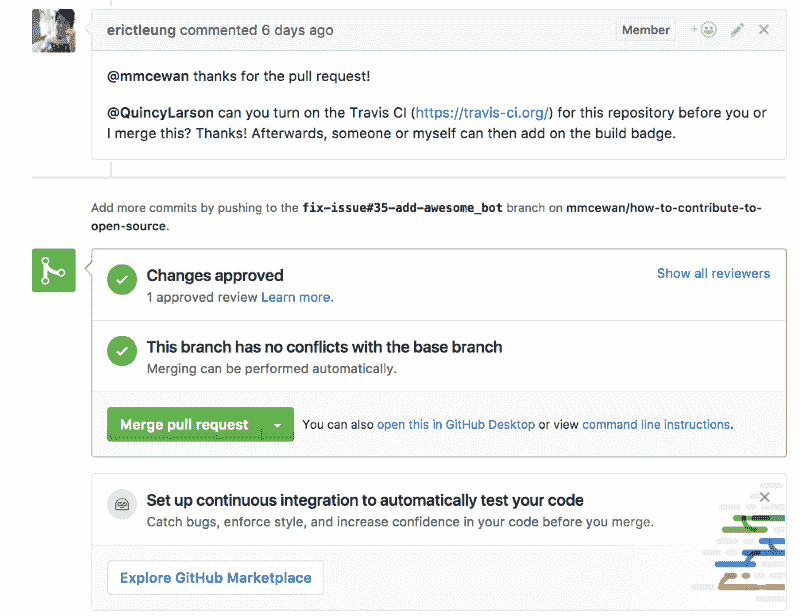
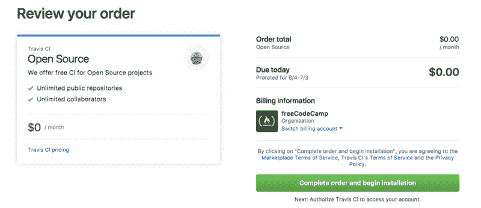
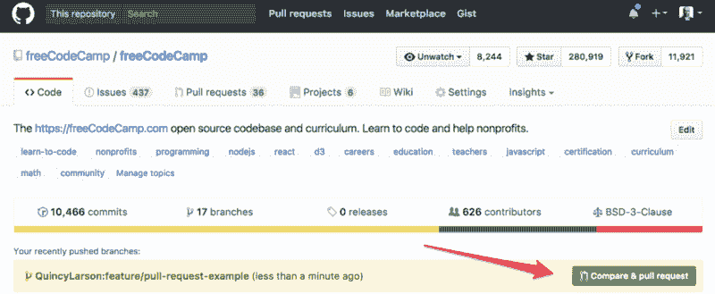
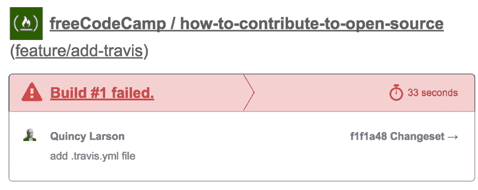
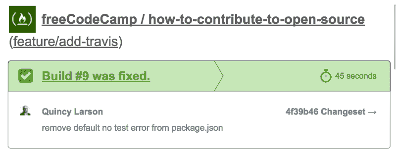
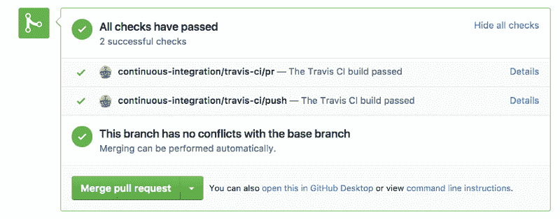

# 如何使用 Travis CI 和 ESLint 在错误触及您的代码库之前阻止它们

> 原文：<https://www.freecodecamp.org/news/how-to-stop-errors-before-they-ever-hit-your-codebase-with-travis-ci-and-eslint-7a5a6b1fcd4a/>

单个 JSON 文件中一个放错位置的逗号就能毁掉您的应用程序。但前提是你允许。

防止这种情况发生的最好方法是在错误被您的代码库接受之前捕捉到它。这意味着测试。对于像 JSON 这样的文件格式，它也意味着林挺。

我将带您了解如何在 GitHub 存储库上设置 Travis CI 和 ESLint，这样您就可以在 pull 请求进入您的代码库之前检测到它们中的林挺错误。

但首先，我要回顾一下我是如何学会做这件事的。

在医学院，他们有一个叫做[看一个，做一个，教一个](https://www.ncbi.nlm.nih.gov/pmc/articles/PMC4785880/)的学习过程:

*   看某人做手术
*   自己做那个手术
*   教别人如何做这个手术

我在我们的一个仓库里设置了 Travis CI + ESLint。然后 [Eric Leung](https://github.com/erictleung) 让我在另一个存储库上做这件事。现在我在教你怎么做。

看一个，做一个，教一个。

在这种情况下， [Eric Leung](https://github.com/erictleung) 要求我配置 Travis CI，以便 [Mark McEwan](https://github.com/mmcewan) 可以安装 awesome_bot。



您会注意到，在 pull 请求的底部，GitHub 包含了一个小横幅，鼓励我们使用他们新推出的 Marketplace 建立持续集成(CI)。这是一个完美的起点。

### 步骤 1:在 GitHub 市场中安装 Travis CI



Travis CI 是免费和开源的。所以你可以从菜单上选择，然后通过结账程序。

### 步骤 2:创建一个新的分支

如果您已经[将存储库](https://help.github.com/articles/cloning-a-repository/)克隆到您的本地计算机上，那么您可以创建一个新的分支，方法是在您的终端中打开存储库并键入:

```
git checkout -b feature/add-travis
```

### 步骤 3:创建一个. gitignore 文件(如果你还没有的话)

在您的终端中键入以下内容:

```
touch .gitignore
```

然后打开。gitignore 文件，并添加下面一行:

```
node_modules
```

转眼间。现在，您不会意外地将任何 npm 包文件提交到您的存储库中。

### 步骤 4:初始化 npm(如果你还没有初始化的话)

你需要为 ESLint 使用 npm。在您的终端中，运行:

```
npm init
```

现在你要回答很多问题。如果你很着急，你可以通过反复点击回车键来接受默认的答案。

```
This utility will walk you through creating a package.json file.
It only covers the most common items, and tries to guess sensible defaults.

See `npm help json` for definitive documentation on these fields
and exactly what they do.

Use `npm install <pkg>` afterwards to install a package and
save it as a dependency in the package.json file.

Press ^C at any time to quit.
package name: (how-to-contribute-to-open-source) 
version: (1.0.0) 
description: 
entry point: (index.js) 
test command: 
git repository: (https://github.com/FreeCodeCamp/how-to-contribute-to-open-source.git) 
keywords: 
author: 
license: (ISC)
About to write to /Users/michaelq/web/how-to-contribute-to-open-source/package.json:

{
  "name": "how-to-contribute-to-open-source",
  "version": "1.0.0",
  "description": "This is a list of resources for people who are new to contributing to open source.",
  "main": "index.js",
  "scripts": {
    "test": "echo \"Error: no test specified\" && exit 1"
  },
  "repository": {
    "type": "git",
    "url": "git+https://github.com/FreeCodeCamp/how-to-contribute-to-open-source.git"
  },
  "author": "",
  "license": "BSD-3-Clause",
  "bugs": {
    "url": "https://github.com/FreeCodeCamp/how-to-contribute-to-open-source/issues"
  },
  "homepage": "https://github.com/FreeCodeCamp/how-to-contribute-to-open-source#readme"
}

Is this ok? (yes) 
```

现在，您的存储库中已经有了一个 package.json 文件。

### 步骤 5:安装 ESLint 和你的林挺软件包

根据存储库中文件的类型，您可以安装各种不同的林挺软件包。我正在做的库是[如何为开源做贡献](https://github.com/freeCodeCamp/how-to-contribute-to-open-source)(给它一个⭐️，？).

它目前使用的唯一文件是 Markdown 文件，但是我们不可避免地会在某个时候添加 JSON。所以我包含了 Markdown 和 JSON ESLint 包。

下面是我在终端中运行的命令，以便使用 npm 安装所有这些组件:

```
npm install --save-dev eslint eslint-plugin-json eslint-plugin-markdown
```

请注意，`--save-dev`部分会将这些包添加到您的存储库的 package.json 文件中。

### 步骤#6:创建并配置您的。eslintrc 文件

在您的终端中，键入:

```
touch .eslintrc
```

然后用你最喜欢的代码编辑器打开它。以下是 JSON 和 Markdown 的情况:

```
{
  "plugins": [
    "json",
    "markdown"
  ]
}
```

### 步骤 7:创建并配置您的. travis.yml 文件

在您的终端中，键入:

```
touch .travis.yml
```

然后用你最喜欢的代码编辑器打开它。这是我的样子:

```
language: node_js

node_js:
  - '6'

before_install: if [[ `npm -v` != 3* ]]; then npm i -g npm@3; fi

cache:
  directories:
    - node_modules

sudo: false
```

### 步骤 8:更新 package.json 文件

在第 4 步中，您的`npm initialize`命令创建了一个 package.json 文件。当您这样做时，npm 默认将下面一行添加到`“scripts”`对象中:

```
"echo \"Error: no test specified\" && exit 1"
```

这一行将导致 Travis CI 的构建失败。所以还是换成更有意义的吧。

下面是我的 package.json 文件在用三个新脚本替换了那一行之后的样子:

```
{
  "name": "how-to-contribute-to-open-source",
  "version": "1.0.0",
  "description": "This is a list of resources for people who are new to contributing to open source.",
  "main": "index.js",
  "dependencies": {},
  "devDependencies": {
    "eslint": "^3.19.0",
    "eslint-plugin-json": "^1.2.0",
    "eslint-plugin-markdown": "^1.0.0-beta.6"
  },
  "scripts": {
    "lint": "eslint . --ext .json --ext .md",
    "pretest": "npm run lint",
    "test": "echo \"No tests\""
  },
  "repository": {
    "type": "git",
    "url": "git+https://github.com/FreeCodeCamp/how-to-contribute-to-open-source.git"
  },
  "author": "",
  "license": "BSD-3-Clause",
  "bugs": {
    "url": "https://github.com/FreeCodeCamp/how-to-contribute-to-open-source/issues"
  },
  "homepage": "https://github.com/FreeCodeCamp/how-to-contribute-to-open-source#readme"
}
```

注意 Travis CI 有两种方法可以运行测试。默认使用`npm test`。但是另一种方法是在`package.json`文件中使用它。你可以在这里阅读更多关于这个[的内容。](https://docs.travis-ci.com/user/languages/javascript-with-nodejs/#Default-Test-Script)

还要注意，在您的`package.json`文件中，您可以通过添加一个带有`pre`前缀的新脚本来定义您希望 npm 在运行其他脚本之前首先运行的脚本，就像我们在这里对在`test`之前运行的`pretest`所做的那样。

### 步骤 9:准备，提交，然后推送

在您的终端中，存放您的新文件:

```
git add .gitignore
git add .travis.yml
git add .eslintrc
git add package.json
```

并提交:

```
git commit -m "add and configure Travis CI and ESLint"
```

然后推送至 GitHub 上你自己的分支库。

```
git push origin feature/add-travis
```

### 步骤#10:在 GitHub 的用户界面中打开一个拉请求

GitHub 有一个很好的功能，它可以检测你最近的推送，并帮助你创建拉取请求。导航到 GitHub 上的存储库，浏览它的 pull 请求工作流。



### 步骤#11:验证构建是否通过

好的——关键时刻到了！

根据您的要求，特拉维斯·CI 应该立即开始工作。如果失败了，它会给你发一封电子邮件说:



您可以查看日志并尝试找出失败的原因。

一旦您修复了它，它将向您发送另一封电子邮件，如下所示:



pull 请求界面看起来会像这样——表明您的所有测试和 ESLint 流程都已通过。



### 第十二步:派对！

如果你在家一起玩，祝贺你！拿起你选择的饮料，拍拍自己的背。现在，您将能够在合并请求之前检测出请求中的林挺错误。你的整个团队也可以轻松一点了。

从这里开始，您可以继续逐步添加更多的测试，而 Travis CI 将一直待命，准备尽职尽责地为您运行这些测试。这就是开源的力量！

感谢您的阅读，祝您编码愉快！

我只写编程和技术。如果你在推特上关注我，我不会浪费你的时间。