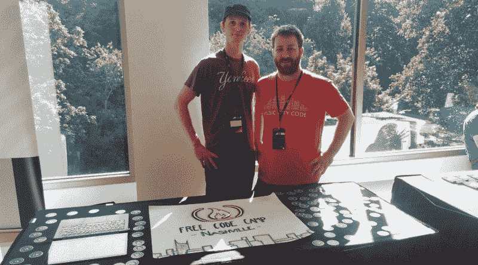

# 纳什维尔自由代码营会议摘要

> 原文：<https://www.freecodecamp.org/news/freecodecamp-nashville-june-meetup-recap-4670c7cea526/>

塞斯·亚历山大

# 纳什维尔自由代码营会议摘要

在最近的一次 freeCodeCamp 会议上，一小群露营者聚在一起解决一些编码挑战，我们谈论工作。

利兰提出了项目的范围。几个小时后，人们很容易偏离主题，与最初开始的工作相去甚远。

我们分享了一些关于如何保持专注和保持在项目范围内的技巧。很多时候，在完成一个项目后，我们会学到一些东西，这使得实现我们真正想做的事情变得更加容易。所以有时候，当你长途跋涉穿过泥泞的道路，却发现你不知道有免费班车可以让你更快更方便地到达目的地时，会更加沮丧。

我们集思广益，帮助安迪解决了他遇到的复选框问题。我们调用`checked` ( [MDN](https://developer.mozilla.org/en-US/docs/Mozilla/Tech/XUL/Property/checked) )返回 true 或 false，它抛出一个错误，抱怨不能在 null 上被调用。

我们详细讨论了工作前景。Phillip 正在寻找工作，但没有 1-3 年的专业经验，这似乎是所有 Jr. Developer 角色目前都在寻找的。我们都同意这是一个没有意义的第 22 条军规。

人际关系网似乎是在这个行业获得第一份工作的关键。对于一个公司来说，有一个可以证明你的技能的高级开发人员来冒这个险是非常必要的。我们讨论了黑客排名以及 T2 的一些招聘人员在简历缺失时打开大门的有用性。

我们从马特那里知道了关于 CHINGU 的事情。这是一个有趣的项目，旨在让自学 web 开发的人加入志趣相投的人群中，以更快的方式提升自己。

我能够找到他们发送给新团队的“欢迎”文档，这是一个有趣的框架。我很想看看一个人是如何被真正执行的，但我现在不想参与其中。我已经够忙的了。对于其他人来说，这是一个很好的选择，看看他们如何加快他们的进度。

我分享了一些我们这个周末接触到的关于音乐城市代码的资源。纳什维尔的技术专家联盟(又名 TechFed)正在进行一件令人敬畏的事情。我鼓励每个人在他们的网站上注册。

如果你想更多地参与纳什维尔的科技活动，那就去参加科技活动吧。网络是无价的。另外，[完整开发者播客](http://completedeveloperpodcast.com/)是一对很酷的家伙。他们每周和每两个月运行一次播客(这意味着一个月两次，对吗？)开发者 meetup。订阅然后去看看他们的聚会。

我们期待纳什维尔自由代码营有更大的作为。我们正在建造一个更大的会议室。此外，一些可能的赞助，这将使我们做得更多，并保持一个小的预算。我们收到了很多来自音乐城市代码参与者的积极反馈。我们还发现，纳什维尔软件学校(Nashville Software School)将 freeCodeCamp 作为一个资源共享给那些想学习更多编码知识的人。

最后，非常祝贺我们自己的组织者戴夫，他在这个周末获得了他的第一次开发演出！另一个例子表明，人们可以在没有 CS 学位和没有参加训练营的情况下过渡到 web 开发。坚持和努力是有回报的。

你可以在我的博客上阅读更多关于我的编码之旅[。](https://itzsaga.github.io/)