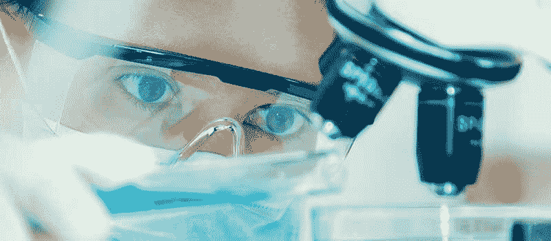

# 区块链和人工智能正在彻底改变这 10 个行业

> 原文：<https://www.freecodecamp.org/news/blockchain-and-ai-are-revolutionizing-these-10-industries-92b07fd12bcd/>

作者:姚

# 区块链和人工智能正在彻底改变这 10 个行业

这篇文章是由&和 TOPBOTS 的作者[卡琳·弗利斯瓦瑟](http://www.topbots.com/author/karinflieswasser/)合作编辑的。

越来越多的组织希望采用区块链技术来替代数据存储。随着大量数据分布在区块链分类账中，对人工智能数据分析的需求也在增长。

人工智能和区块链的结合通过重塑经济和信息交换，推动了第四次工业革命的到来。

从医疗保健到政府，人工智能和区块链的有力结合正在缓慢但肯定地改变着各个行业。以下是这两种技术可以发挥巨大作用的 10 个行业。

### 1.精确医学

谷歌 DeepMind 正在为医疗数据开发一个[审计系统。区块链将使系统保持](https://www.wired.com/2017/03/google-deepminds-untrendy-blockchain-play-make-actually-useful/)[安全](https://www.wired.com/2017/02/moving-patient-data-messy-blockchain-help/)和[可共享](http://catalyst.nejm.org/decoding-blockchain-technology-health/)，而人工智能将允许医务人员获得从患者档案中提取的医疗预测分析。

该项目的目的是为了患者的利益促进信息交流。但它也可以为医务人员提供改变游戏规则的见解。

错误率低于 2%，AI 可以在医疗机构提供的数据海洋中产生有价值的可靠见解。

DeepMind 的区块链技术已经在 NHS 数据上进行了[测试，其人工智能应用正在被部署，以发现 Moorfields 眼科医院退化性眼病的警告信号。](https://www.theverge.com/2017/3/16/14932764/deepmind-google-uk-nhs-health-data-analysis)

### 2.智能能源，智能建筑

绿色环保的人工智能和区块链帮助[减少能源浪费](https://www.memoori.com/innovative-startups-bring-ai-blockchain-smart-buildings/)并优化能源贸易。

例如，管理建筑物的人工智能系统可以通过计算居民的存在和数量、季节甚至交通信息等因素来监督能源使用。

为了提供能源，分布式区块链技术被用于生产者和消费者之间透明和经济高效的交易，而机器学习算法甚至可以研究交易以估计价格。

区块链与人工智能相结合，大大加快了房地产相关交易流程，否则在合同获得批准之前，这些交易流程可能会经过太多的渠道。

### 3.不再有血钻

IBM Watson 正在试验人工智能和区块链的联合优势。他们的研究团队正在利用区块链技术开发 Everledger，以解决钻石行业的欺诈问题。

他们正在将其与认知分析相结合，后者在区块链环境中大量“交叉检查”法规、记录、供应链和物联网数据。

与 DAO(去中心化自治组织)结合，注入人工智能的区块链甚至可以完全自治，能够即时适应环境的变化。

### 4.公共科学

学术界的[抽屉问题](https://bitcoinmagazine.com/articles/how-blockchains-can-further-public-science-1457972964/)发生在研究人员不公布“无结果”实验的时候。重复的实验和知识的缺乏接踵而至，践踏了科学话语。

为了解决这个问题，可以将实验数据存储在一个公开的区块链中。在我们看来，增加数据分析可以帮助识别元素，如相同的实验发生了多少次，或者某个实验的可能结果是什么。

路德系统公司首席执行官 hos sein Kakavand[预测](http://www2.caict.ac.cn/zscp/qqzkgz/qqzkgz_zdzsq/201702/P020170217552542388789.pdf)一旦区块链技术公司处理的“智能合同”需要以半自动方式运行的更智能的“节点”，人工智能也将在公共科学中发挥更大的作用。

智能合同模拟合同协议，可以有广泛的应用，也可以在公共科学领域，当学者们接受知识转移的区块链时。

### 5.网络安全 2.0

当人工智能和区块链放在一起时，它们提供了抵御网络攻击的双重屏障。

可以训练机器学习算法[自动进行实时威胁检测](http://www.topbots.com/financial-services-institutions-artificial-intelligence-cybersecurity/)，并不断学习攻击者的行为，从而加厚恶意软件检测盔甲。

与此同时，去中心化的区块链消除了集中式数据库固有的弱点，要求网络攻击者挑战不止一个而是几个入口。

人工智能和区块链共同闪耀的另一个领域是[大规模数据泄露](http://www.techworld.com/security/uks-most-infamous-data-breaches-3604586/)。很难识别哪些数据可能已经被攻击者毒害或修改。对数据保险库使用区块链和人工智能可以让人确定入侵发生的时间。

### 6.数字版权

数字化将复杂的数字权利引入了知识产权管理领域。但当聪明的 AI 学习游戏规则时，它可以识别违反国际版权法的演员。

至于知识产权合同管理，区块链技术使艺术家和作者的即时支付方式。艺术家伊莫金·希普最近建议,区块链可以帮助音乐人简化创造性合作并再次赚钱。

像威瑞森和 Ujo Music 这样的公司依靠区块链来审核许可证和分发产品，Ujo Music 利用以太坊区块链平台来分发歌曲。

### 7.计算金融

在透明信息对金融服务的信任至关重要的情况下，智能合约也可能占据中心位置。金融交易可能不再依赖人类“清算代理”相反，它们变得自动化了，表现得更好更快。

但由于对交易的信心仍然取决于人，人工智能可以监控人类的情绪，并预测最佳的交易环境。因此，[算法交易](http://www.nanalyze.com/2016/08/artificial-intelligence-algorithmic-trading/)可以由基于与情绪相关的投资模式进行交易的算法驱动。

### 8.BaaS 软件

计算机软件之母微软的目标是在云中提供最好的 BaaS——区块链即服务——平台。

微软正在云计算平台 Azure 中整合 BaaS 模块，用户可以为其创建 T2 测试环境。区块链的创建和测试成本更低，而且在 Azure 中，它们带有可重用的模板和构件。

BaaS 模块不是由微软编码的，而是基于公共以太坊区块链平台，该平台拥有广泛的开发人员基础，可以很好地融入 Azure 的开发人员基础。与一些区块链平台不同，以太坊可以与 Azure 互操作。

像 IBM 这样的竞争对手也提供 BaaS 产品。

### 9.自动驾驶车辆

尽管汽车正在成为车轮上的数据源，拥有自动驾驶、聊天机器人和智能导航，但不是每个人都能够立即负担得起人工智能驾驶的汽车。

汽车租赁是第二个最好的选择，区块链科技可以承诺[通过减少参与人数、综合所有数据和提供审计跟踪来简化租赁过程](https://www.youtube.com/watch?v=IgNfoQQ5Reg)。

### 10.电子政务

虽然像北约和联合国这样的全球性组织不会消失，但区块链技术和人工智能都可以为直接民主的发展做出贡献。

区块链和人工智能可以在全球范围内传输大量数据，跟踪电子投票程序并公开显示，以便公民可以实时参与。

民主地球基金会，一个渴望黑掉民主的组织，正加入直接民主的行列。它向政治中介挥手告别，因为它提倡开源软件、对等网络和智能合同。

该组织还希望打击虚假身份，并在政治领域重新树立个人责任感。

### 挑战依然存在

虽然区块链和人工智能结合起来具有巨大的跨行业颠覆性潜力，但所有新兴技术都面临着巨大的挑战。

你可以阅读更多关于广泛采用区块链面临的 6 大挑战以及人工智能中深度学习方法的 T2 限制的信息。

**这篇文章最初发表于[TOPBOTS.com](http://www.topbots.com/combination-ai-blockchain-revolutionize-10-industries/?utm_medium=article&utm_source=medium&utm_campaign=blockchain-ai-industries)。**

喜欢你所阅读的东西？加入 [TOPBOTS](http://www.topbots.com/bot-news-pro-newsletter/?utm_medium=article&utm_source=medium&utm_campaign=newsletter) 社区，获取最好的机器人新闻&独家行业内容。