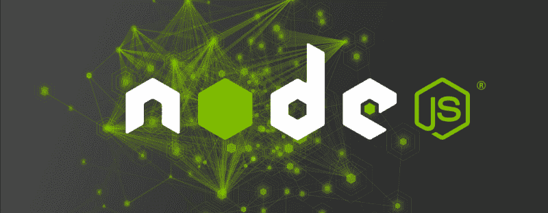
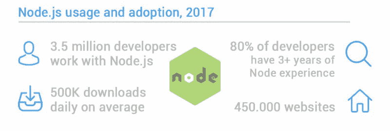
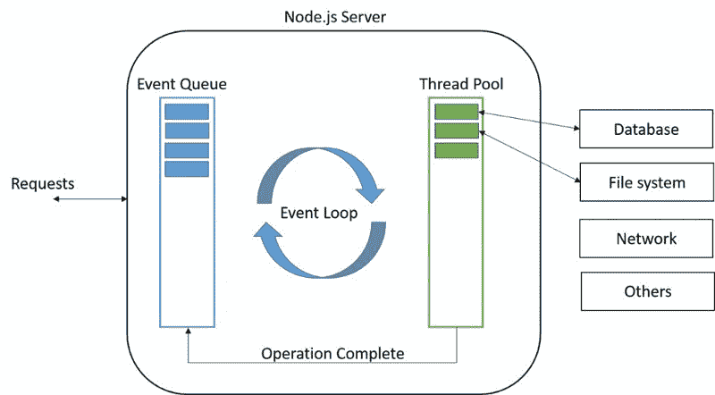
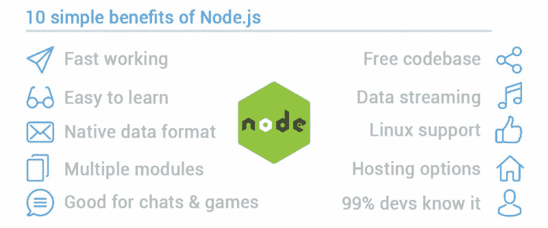
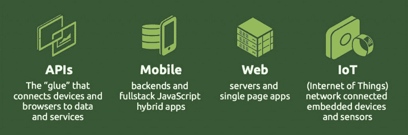

# Node.js 到底是什么，为什么要用？

> 原文：<https://www.freecodecamp.org/news/what-exactly-is-node-js-and-why-should-you-use-it-8043a3624e3c/>

作者:达里娅·库尔科娃

# Node.js 到底是什么，为什么要用？

JavaScript 作为编程语言和数据格式(JSON)彻底改变了 web 开发。将 Node.js 与它集成在一起，既可以在服务器上做事情，也可以在浏览器中做事情，这是最近的趋势。这两句话，我们觉得还得加以说明和解释，让大家去把握。所以在这篇文章中，我们将讨论**为什么**使用 Node.js，**Node.js 的用途**和使用 node . js 的**顶级例子**。

当然，这是程序员/编码员的技术问题，有些人可能觉得这种语言不太容易理解。考虑到这一点，我们将尽量使它变得轻松一些，并且用更人性化的语言说话。我们只想解释一下**是什么让 Node.js 变得伟大**以及所有的宣传都是为了什么。

首先，这种称赞是当之无愧的，因为 Node 无疑简化了任何构建 web 应用程序的人的工作。经过几十年的 web 请求/响应范式，拥有**实时双向通信**是一种福气。这是服务器和客户端之间的通信。反过来，这也是在服务提供者(服务器)和服务请求者(客户端)之间分配工作负载的模型。

到目前为止在船上吗？很好，现在有一些关于 Node.js 需求的统计信息。它是目前使用中增长最快的语言，并且它排在十大最想要的开发人员技能中。Node.js 的使用主要是针对全栈，前端，后端。

### Node.js 是什么？

正如我们之前在[最佳 Node.js 示例](https://thinkmobiles.com/blog/node-js-app-examples/)中提到的那样， **Node.js 是一个 JavaScript 运行时环境**。但有人可能会问，那是什么？运行时环境是指构建和运行软件应用程序的基础设施。在这种情况下，用 JavaScript 构建应用程序。我们来看看 Node.js 定义版本有哪些。

该公司自己将 Node.js 描述为“构建在 Chrome V8 引擎上的 JavaScript 运行时”。维基百科称“Node.js 是一个开源的、跨平台的代码执行环境”。根据 TechTarget 的说法，它是
“一个旨在构建服务器端应用的开发平台”。而 PCMag 告诉我们 Node.js 是“一个拥有自己的 web 服务器以便更好控制的平台”。这当然足以抓住主旨。

简短的总结如下:

*   Node.js 是一个服务器框架，并且是免费的
*   它可以在 Windows、Linux、Mac OS 等平台上运行
*   Node.js 在服务器上使用 JavaScript

Node.js 是如何工作的？举一个在服务器上打开文件的简单任务，顺序应该是:

*   任务进入文件系统
*   系统为下一个请求做好准备
*   当打开并读取文件时，系统会将内容发送给客户端

换句话说，使用 Node.js，您不必等待，可以继续执行下一个任务。这也是它如此高效的原因之一。现在，什么是 Node.js 文件:

*   它包含任务，并在设置事件时执行它们
*   事件是指有人试图访问服务器
*   应该在服务器上启动文件
*   文件有。js '扩展

最后但同样重要的是，你能用 Node.js 做什么？

*   生成动态内容
*   在服务器上创建、打开和读取或删除文件
*   收集和修改数据库中的数据

### 为什么使用 Node.js

现在是时候做一个关于为什么、谁、什么时候和为了什么的测验了。那么为什么要用 Node.js 呢？或许，它的创造者和创始人瑞安·达尔能给我们带来启示。他说，最大的优势是这种 JavaScript 语言不阻塞 I/O——即输入/输出通信方法。然而，在这里，开发人员社区有两种观点。一些人认为，有很多 CPU 周期的应用程序会崩溃。其他人说这根本没什么大不了的，因为节点代码在小进程中工作。

另一个好处是**单线程事件循环**，它负责从外部请求中提取 I/O。简单地说，这意味着 Node.js 在开始时启动事件循环，处理输入，并开始操作顺序。对探索它感兴趣的开发极客可以阅读 [Node.js 事件循环](https://nodejs.org/en/docs/guides/event-loop-timers-and-nexttick/)。

Crafter Software 的 Jim Hirschauer 对为什么使用 Node.js 做了一些思考。我们认为它们突出了 Node.js 的本质和优势:

1.  谷歌 JavaScript 引擎
    翻译:结果是快速和可扩展的网络应用。
2.  对于服务器端应用
    的意思，Node.js 是一个事件驱动的编程模型，其中的流程是由某些事件(用户动作、消息等)决定的。).
3.  更容易和可扩展的
    也就是说，制作像优步或特雷罗这样的[应用，并在多 CPU 服务器上扩展。](https://thinkmobiles.com/how-make-taxi-app/)
4.  每进程和跨服务器
    翻译:Node.js 可以在单个进程的基础上扩展，将负载分散到多核服务器上。

我们意识到，这似乎有点困难。因此，请看使用 Node.js 的一致性好处的总结。

#### 使用 Node.js 的 10 个主要原因

*   对于初学者开发者很好，JavaScript 简单易学，丰富的框架(Angular，Node，Backbone，Ember)
*   这很快，由于谷歌创新技术和事件循环
*   能够在数据库中以本机 JSON(对象表示法)格式保存数据
*   多个模块(NPM、咕噜等。)和支持社区
*   适合创建实时应用，如聊天和游戏
*   单一自由代码库
*   适用于数据流，例如音频和视频文件
*   由 Linux 基金会，以及 PayPal，Joylent，微软，沃尔玛赞助
*   广泛的托管选项
*   JavaScript 是运行时间最长的语言，99%的开发人员都懂一些

嗯，这应该能让你更清楚一些。但是等等，你知道 NASA 也用 Node.js 吗？

### 谁使用它:节点案例

Node.js 显示出令人难以置信的速度(每年使用量增长接近 100%)，已经成为 web 应用的通用平台。PayPal、Walmart 等公司也将 Node 用于企业应用。节点社区内正在形成的趋势是微服务、实时应用和物联网(IoT)。但稍后会详细介绍。

截至 2017 年初，Node.js 拥有近 400 万用户，肯定不缺乏与其合作的顶级公司。例如，我们之前提到的 NASA 是关于什么的？嗯，这是事实。该机构与 UTC Aerospace Systems 合作设计了用于实时数据处理的端到端系统。它被用在宇航员的宇航服中，并且是用 Node.js 构建的。

如果你读过我们之前关于使用 Node.js 的顶级公司的帖子，你就已经知道网飞、微软、优步等等。尽管这远非所有伟大的例子。 [Capital One](https://www.facebook.com/capitalone) ，一个巨大的金融公司，因为**短 [Node.js 开发](https://thinkmobiles.com/nodejs-development/)周期**而用 Node.js 经营着无数的项目。像 [Fusion Marketing](https://thisisfusion.com/) 这样的广告公司创造了互动的客户体验。零售业的沃尔玛、运输业的优步、谷歌、Twitter、GoDaddy、sky catch……可能要花几个小时才能全部介绍完。

还有一系列 Node.js 企业对话，每一集都致力于一个单独的 Node.js 用例。比如这个，Groupon 软件工程总监 Adam Geitgey 谈到这个平台是如何帮助他们扩张的。

Groupon 使用 Node.js 的结果之一是页面加载时间减少了 50%。怎么样！让我们再多谈谈 Node.js 的成功案例。

### Node.js 成功案例:Groupon、Skycatch & Lowe's

Groupon 用从 Ruby on Rails 移植过来的 Node.js 重建了自己的网站。尽管 Ruby 还不错，但随着时间的推移，维护一个有新更新的网站变得越来越困难。选择 Node.js 有很多原因:它支持可扩展项目，提供更好的性能，并能容忍旧的 Ruby 代码。在过程的最后，团队甚至发布了几个自制的 JavaScript 库: [Gofer](https://github.com/groupon/gofer) 和 [Node cached](https://github.com/groupon/node-cached) 。总而言之，Groupon 现在在很多方面使用 Node.js:

*   对于后端服务
*   对于 API 的集成层
*   对于客户的应用程序和网站
*   大约 70 个自己的 Groupon 应用

**Skycatch** 是一家从事商用无人机数据的数据公司。虽然创建原始 SQL 既困难又漫长，但 Skycatch 允许以更简单的方式完成它，并简化从网站提取数据。 **Andre Deutmeyer** 和由 20 名开发人员组成的团队的任务是快速设计并向客户交付数据。他们选择了 Node.js 并沉浸在胜利中，比如:

*   可扩展选项更好，因为前端和后端之间的障碍消失了
*   Node.js 后端服务被服务器上的前端语言所容忍
*   由于 AWS Lambda 也在使用 Node.js，它允许专注于开发应用程序，而不是基础设施

Rick Adam 是劳氏公司 25 名开发人员的团队领导，他的任务是管理表示层的应用程序。早在 2007 年，为了重建一个完整的应用程序，该公司选择了 Node.js，因为在那个时候，即使是应用程序文本中的微小变化也需要对整个应用程序进行修补，而 Node.js 在这方面提供了灵活性。这一选择导致了以下结果:

*   web 和 API 请求的积极代理(加上巨大的增长潜力)
*   Node.js 的异步模型提供了一个提升应用功能和更好的 UX 的机会
*   完美的表现
*   一些前端技能也用在后端编程中

### Node.js 是做什么用的

与 Node.js 一样，用户可以在服务器上使用 JavaScript，这意味着用户可以在浏览器之外编写 JavaScript。此外，Node.js 与 JavaScript 具有相同的优势。而且是基于事件的。这是 Node.js 坚定不移的三个目标。

我们可以构建快速的实时应用程序，如聊天、上传系统或任何必须响应大量请求的应用程序。我们现在已经知道了，对吧？

那么 Node.js 实际上可以用来做什么呢？什么时候使用 Node.js，它有什么用途？嗯，这里有一些你可以向客户提及的用法，以及 Node.js 可以用来做什么的例子。

*   **流式数据**
    如文件实时上传，文件边上传边编码，建立数据层间代理。
*   **单页面应用**
    现代 web 应用，重在客户端处理。积极的响应时间和服务器与客户端之间的数据共享非常适合这类应用。
*   **Web 应用**
    经典 Web 应用在服务器端，使用 Node.js 来承载 HTML。这方面的一个主要好处是更多的 SEO 友好的内容。
*   **聊天/ RTAs**
    轻量级实时应用，如[消息应用](https://thinkmobiles.com/how-make-messaging-app/)界面、Twitter、聊天软件。一个经典的聊天是 Node.js 使用的一个很好的例子。简单，数据密集型，跨多个设备。
*   **API**
    **REST/JSON 编程接口，并通过它公开数据库或 web 服务。不用担心系统之间的转换。**
*   ****代理**
    部署 Node.js 作为代理，以非阻塞方式处理连接。非常适合使用外部服务的应用程序，导出和导入大量数据。**
*   ****仪表盘**
    Web 应用或系统监控仪表盘，支持跟踪用户操作。Node.js 还可以为您实时可视化这样的交互。**

****

### **5 个鲜为人知的 Node.js 用途**

**然而，Node.js 正在快速发展，不仅仅是 web 应用程序构建成为可能。查看这些仍在制作中的替代 Node.js 项目。**

1.  **[NodeOS](http://node-os.com/) :构建在 Linux 之上的操作系统，JavaScript 作为主要运行时，NPM 作为打包管理器。**
2.  **[Node-Webkit](https://github.com/nwjs/nw.js):Node . js 应用程序的运行时环境。简单的应用打包流程-压缩、添加信息和跨平台部署。**
3.  **[Log.io](http://logio.org/) :日志监控工具，使用 Socket.io 库。您所关注的所有变化，您都可以在浏览器中实时跟踪。**
4.  **[Nodecast](https://github.com/mauimauer/nodecast) :一款将图像和视频从手机发送到 PC 的应用。灵感来自谷歌 Chromecast。**
5.  **[Nexe](https://github.com/nexe/nexe) :通过创建单个可执行文件来分发 Node.js 应用程序的实用程序。尽管它目前只能在 Linux 和 MacOS X 上运行。**

**亲爱的斯多葛派读者们，这还不是全部。企业级的业务和项目也在拥抱 Node.js。**

### **Node.js for enterprise**

**我们已经提到了沃尔玛、贝宝和网飞。**快速交付和迭代**是 Node.js 能够实现的，也是它脱颖而出的原因。顶级开发人员，喜欢所有新鲜事物，可以用 JavaScript 做任何事情，比如 Node.js 的高性能。一个著名的例子是现任 PayPal 副总裁的 Bill Scott 在面临职业选择时的选择。**

> **当你可以去 Paypal 做 Node.js 的时候，为什么要去脸书做 PHP 呢**

**那么，为什么企业都选择 Node.js 呢？**减少页面加载时间，易于维护，减少服务器数量**可能会有一些答案。此外，一种新的 Node.js 架构类型，称为**微服务**，有助于处理企业软件的大量更改。在这种方法下，您可以从较小的部分创建应用程序，并分别开发这些部分。对整体功能没有损害。**

**也有开发者倾向于全栈统一解决方案。实际上，与 Node.js 一起使用的 4 大技术是:**

*   **表达**
*   **蒙戈**
*   **jQuery**
*   **角度 JS**

**Node.js 有哪些潜在的应用领域？**

*   **媒体**
*   **支付网关**
*   **电子商务**
*   **社会化媒体**
*   **企业网络应用**
*   **移动应用的后端/API**

**基本上，任何使用 Node.js 的企业都可以:雇佣更少的开发人员，使用更少的服务器，减少页面加载时间。关于这一点的更多想法，你可以观看下一个视频，在那里， [Nodesource](https://nodesource.com/) 的 CTO 和架构师经理谈论 Node.js。**

### **Node.js 在生产中的注意事项**

**我们 Nodeland 之旅的最后一件事是关于运行这个工具集的一些实用建议。我们应该从流程管理器开始部署应用程序。为了让你的生活更容易，使用 NPM，PM2，Adios，Strongloop 或任何其他 Node.js 生产管理器。**

****不要用 Node.js 做 CPU 很重的 apps】编程像人工智能(AI)、视频编码软件，以及这类加载处理器的软件，最好用另一种方案。Node.js 有 1.5 Gb 的内存限制，但是您可以将集群应用于将进程分成更小的进程。****

**Node.js 服务器不太适合计算和数据密集型任务。因此，最好将这样的任务拆分成**微服务**并单独部署。**

****不要通过端口 80** 运行一个 Node.js app **。在应用程序前使用反向代理，例如 Nginx。通过这种方式，您可以保护服务器免受互联网流量的影响，并分散负载平衡。****

****出于安全考虑，安装 SSL** 。始终使用反向代理，检查 SSL 中的漏洞并修复可能的问题。不时做些基本的安全检查。不要使用过时版本的 Node.js 和 Express。**

**在应用部署之前考虑基础设施和架构。专家建议在专用网络(VPN) 中开发一个应用**，这样你就可以只允许可信的连接。****

### **结论**

**你可能会问一个反问:我们究竟为什么要对 Node.js 倾注心血？答案很简单——我们喜欢 Node.js 和 JavaScript。在 **ThinkMobiles** ，我们喜欢使用这种语言开发网络和移动应用。我们喜欢 Node.js 是因为它的易用性和速度，以及跨平台的特性。**

**感谢您的阅读。如果你喜欢留一些？。**

**如果你想了解更多，请点击查看[。](https://thinkmobiles.com/blog/)**