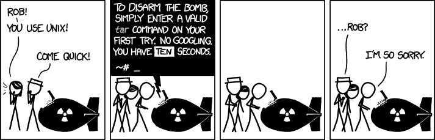

# 不要谷歌，不要学习:为什么搜索有时比了解更好

> 原文：<https://www.freecodecamp.org/news/google-not-learn-not-why-searching-can-be-better-than-knowing-79838f7a0f06/>

杰里米·冈特

# 不要谷歌，不要学习:为什么搜索有时比了解更好

Credit: Unsplash.com

几个月前，我阅读了家乡 freeCodeCamp 学习小组的一些帖子。我看到了一个有趣的帖子。

一名营员表达了她对不能立即提出解决方案的沮丧，并质疑这是否会变得更容易。在帖子的最后，她哀叹需要在谷歌上寻找答案——好像这是一件可耻的事情。

我清楚地记得当时那种感觉。我生自己的气，因为我不能根据需要快速地写出代码。我觉得用谷歌搜索答案是失败的标志。在我看来，这意味着我无法像程序员一样思考。

快进 18 个月，我现在是一名全栈软件工程师。我花了相当多的时间向谷歌寻求日常工作的帮助。当我在 StackOverflow 中寻找解释时，我不再认为这是一个弱点。这实际上是我解决问题的第一步。

那么是什么导致了这种心态的改变呢？很多事情。但是这里有一些重要的见解。

### 洞察力#1:记忆一切是浪费你的时间和脑力

不相信我？看看 Quora 上的这个问题，数百名其他程序员都用[回答了这个问题](https://www.quora.com/Do-developers-memorize-all-tags-classes-and-functions)。

不够好，不如引用一句你可能听说过的人的话:

> "永远不要背你能查到的东西."——阿尔伯特·爱因斯坦

这不是我轻易得出的结论。在花了几个小时研读博客并与专业开发人员交谈后，我终于意识到一些意想不到的事情:我们行业中的佼佼者不会有条不紊地浏览和记忆文档。事实上，大多数人都懒得去记忆他们不需要的东西。

The rare situation where you would actually need to have memorized syntax. Comic by [XKCD](https://xkcd.com/).

想想你在母语中认识的所有单词。我敢打赌，你知道的单词比你日常使用的要多得多。如果你忘记了一个单词的意思，你会怎么做？问问 Siri 或者打开字典，继续你的一天。你不会坐在那里，因为记不住一个单词而责备自己。

让我用一个小故事来阐明我的意思。

去年 12 月，我在凤凰城的 CSSDay 上听了一个小组讨论，当时我听到一个小组成员给出了一个我不止一次听到的提示:

> “只背你每天用的东西。其他的，只要背熟怎么查就行了。”

这个概念，以及它的内在化，对我作为一名开发人员的信心和进步是一个最大的帮助。

在我旅程的早期，我努力去保留任何东西。概念、语法、最佳实践，它们都难以理解。我一直认为自己是一个聪明的人，学东西很快，但我真的相信我遇到了人生中第一个智力挑战，我可能无法征服。

然后我有了一个疯狂的想法:“不要再关心如何写它，只需要专注于理解它应该做什么。”我不再强调语法，开始愉快地写出大量的伪代码。然后，一旦我觉得我已经充实了解决方案的核心部分，我就去搜索引擎了！

这正是我所希望的效果。我不再把学习时间花在努力记住用什么方法把一个项目添加到数组的末尾，或者 Javascript 对象文字中的键是否需要像它的 JSON 对应物一样用引号括起来(它不需要)。

我没有绞尽脑汁去记住方法名，而是专注于我需要执行什么动作。当我想在数组的开头添加一个项目时，我发现用谷歌搜索“在数组的开头添加项目”比用我自己的记忆来区分`shift()`、`unshift()`和`pop()`更容易。

除了减少了从自己的头脑中寻找答案的时间之外，它还有其他一些明显的好处:

1.  我发现自己掌握新语言的速度比我想象的要快得多，因为这些概念在每一种语言中都可以找到，而且
2.  我意识到我对这些概念的理解正在迅速加深。这在很大程度上要归功于强迫自己多读一些关于这个话题的文章，从而减少了技术债务。

除了前面提到的积极因素，这是我所希望的结果，还有另一个我完全没有预料到的巨大好处。

### 洞察力#2:你可以从别人的错误中学习，而自己不必犯那些错误

当你开始在谷歌上搜索你所面临的问题的答案时，你很快就会发现你不是唯一一个需要处理这个问题的人，其他人也会对同一个问题提出截然不同的解决方案。

通读一些关于堆栈溢出的不同问题和解决方案，将会开阔你的眼界，让你了解不同的思维方式，或者可能会突出你自己的方法中的缺陷。

这样做，你给自己一个机会向其他更有经验的开发人员学习，看看他们是如何解决问题的。这种洞察力是无价的。

我不再搜索博客帖子或堆积溢出的问题，目的是找到一个确切的解决方案。现在，我做这些事情是为了学习不同的思考问题的方法。

### 通过搜索，你会学到更多

我真的在给我的大脑编程，让它从我自己以外的角度来解决问题。我通过理解别人会如何写东西，并把他们的知识和我的结合起来，让自己变得更好。他们的奋斗成为我的胜利。

你知道吗？它工作起来… *非常好*。在 2015 年 5 月开始走上成为一名程序员的道路后，我在 2016 年 9 月接受了我的第一个职位，即全栈软件工程师。

在不到 18 个月的时间里，我已经从对 HTML 非常基本的理解，到用 Ruby on Rails 编写 Ansible 脚本、后端 API，以及使用 React 创建前端组件。

从这个词的任何定义来看，我都不认为自己是一个高级程序员，但我对自己快速学习新概念的能力更有信心，并且能够在运行中搜索语法而不会错过任何一个节拍。

很少有程序员会在第一次看到方法名或函数调用时记住它们。更少的人会仅仅依靠他们的记忆来面对日常工作中的挑战。

我能给你的最好的建议是，永远不要害怕承认你不知道的事情，并使用任何必要的手段来纠正它。

治愈无知的方法只有一个，那就是不断提问。