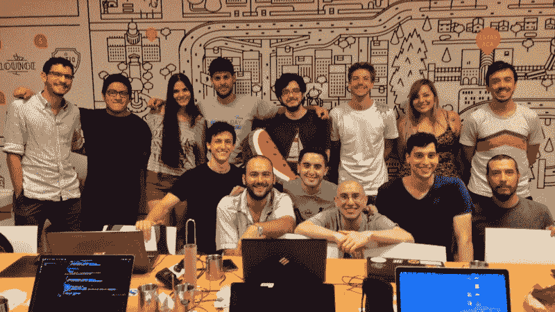

# 摩托车团伙黑客如何偷走价值 450 万美元的吉普牧马人

> 原文：<https://www.freecodecamp.org/news/how-motorcycle-gang-hackers-stole-4-5-million-worth-of-jeep-wranglers-464cfc4ec268/>

一个南加州摩托车团伙发现了一种侵入吉普牧马人的方法。他们的技术包括创造电子钥匙，这样他们基本上就可以上车离开。

这听起来像是《绝命毒师》中的情节，但它确实发生了。该团伙利用这种技术盗窃了 150 辆吉普车，最终被抓获。

他们是这样做的:

1.  他们骑着马在加利福尼亚四处寻找新型号的吉普牧马人。一旦他们发现一辆看起来很容易被偷的车，他们就会走上前去，透过挡风玻璃读取它的车辆识别号码(VIN)。
2.  然后，他们在一个数据库中查找车辆识别号，该数据库包含吉普牧马人的替换密钥。
3.  他们将使用这些代码中的一个来创建一个可以用来打开吉普车的物理钥匙。
4.  然后，当周围没人时，他们会骑到吉普车上。他们会利用一个设计缺陷，让他们从外面打开吉普车的引擎盖。这将触发警报，但他们可以从引擎盖下关闭吉普车的喇叭和闪烁的前灯。此时，唯一的警报信号是吉普车闪烁的尾灯。
5.  然后他们会用定制的钥匙打开汽车。
6.  最后，他们会将一台掌上电脑插入吉普车的车载诊断系统端口。使用他们从数据库中窃取的第二个代码，他们将编写第二把钥匙，用于启动汽车。

[这里有一段视频](https://fcc.im/2qC3NFZ),讲述了窃贼走向一辆吉普牧马人，关掉它的警报，然后跳上车，随随便便地开走——这一切只用了 90 秒。

你可以在这里阅读关于这个[的整篇文章。](https://fcc.im/2rlkCpE)

### 以下是其他三个值得你花时间去做的链接:

1.  互联网上最好的数据科学课程，根据您的评论进行排名( [12 分钟阅读](https://fcc.im/2qCenMW))
2.  我从我的第一个#100DaysOfCode ( [7 分钟阅读](https://fcc.im/2rloKpL))中学到了什么
3.  一个开发者的女儿问:用这四块乐高积木你能建造出最高的建筑是什么？( [2 分钟读数](https://fcc.im/2rqfxyl))

### 想到这一天:

> “在网上获得正确答案的最好方法是不要问一个问题；就是贴错答案。”——坎宁安定律(由维基的发明者沃德·坎宁安提出)

### 每日一图:

一家以开发商命名的咖啡馆。([图像信用](https://www.reddit.com/r/ProgrammerHumor/comments/6ea670/new_cafesnack_bar_that_opened_up_in_my_schools/)

### 今日学习小组:

布宜诺斯艾利斯自由代码营

编码快乐！

–昆西·拉森，自由代码营的老师

如果你从这些邮件中获得了价值，请考虑[支持我们的非营利组织](http://bit.ly/donate-to-fcc)。