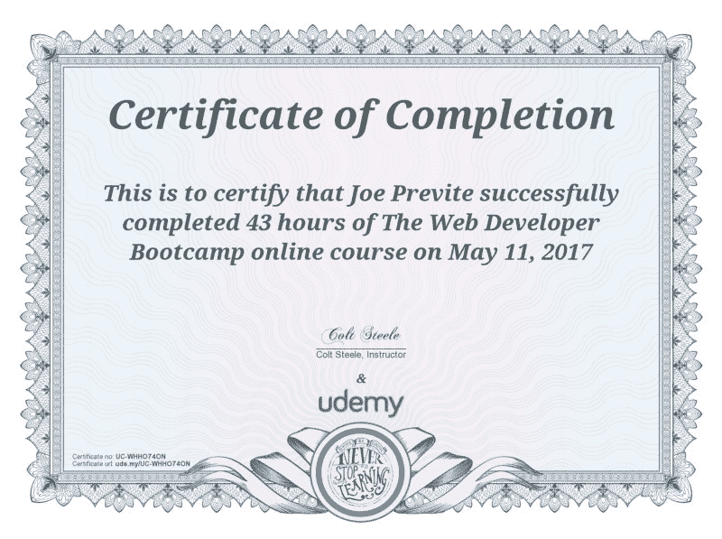

# 我从我的第一个# 100 天代码中学到了什么

> 原文：<https://www.freecodecamp.org/news/what-i-learned-from-my-first-100daysofcode-13ac805ff0a9/>

5 月 17 日，我完成了第一轮#100DaysOfCode。如果你没听说过， [#100DaysOfCode](https://twitter.com/search?q=%23100DaysOfCode&src=tyah) 是由 [Alexander Kallaway](https://www.freecodecamp.org/news/what-i-learned-from-my-first-100daysofcode-13ac805ff0a9/undefined) 为对编码感兴趣的人发起的一项挑战或运动。挑战的基础是你公开承诺每天编码至少 100 天。如果你想了解更多，亚历克斯写了一篇文章描述它[在这里](https://medium.freecodecamp.com/join-the-100daysofcode-556ddb4579e4)。

2016 年 12 月我决定认真学习编程，当时我发现了 [freeCodeCamp](http://freecodecamp.com/) 。我会在 2017 年初开始#100DaysOfCode 挑战，以此开始新的一年，但我也开始了研究生院的第二个学期，不知道我是否能投入到挑战中。

从 12 月到 2 月，我每周都在写越来越多的代码，之后我决定加入这个挑战。我听说这个挑战有一个强大的社区，我知道我想快速提高我的编码技能。还有什么比每天编码更好的方法呢？

### 我的统计

数字是惊人的，所以我想我应该从基本的数据开始:

*   编码总时数:126.5 小时
*   每天花费的平均时间:1.3 小时
*   最长一天:4.2 小时|| 250 分钟
*   错过的总天数:1 天
*   获得的证书:柯尔特·斯蒂尔的 Udemy 网络开发者训练营
*   fCC 在 100 天结束时的进展:基本算法—截断字符串

### 我是如何修改规则的

在我解释我的改变之前，我必须说我真的很尊重 Alex 和他通过创建#100DaysOfCode 运动制定的规则。然而，我决定修改两条规则:

1.  “在接下来的 100 天里，我将每天至少编码 **30 分钟**。”
2.  “花在做辅导、在线课程和其他类似资源上的时间**将计入本次挑战的**。”

我决定将第一条规则从 1 小时改为 30 分钟的原因是因为我在二月和五月之间有很多事情要做。我把时间分配在三份兼职工作上，每份兼职工作 1-20 小时/周，两个研究生班，以及组织一次暑期留学旅行。我的盘子看起来满满的，但是我必须想出如何为编码和这个挑战腾出空间。在一个条件下改变这个规则似乎是公平的:*编码的总小时数=== 100+小时数*

我修改了第二条规则，因为我是从#CodeNewbie 开始的。由于我的学习方式和有限的时间，我需要教程、在线课程和其他资源。我同意 Alex 和社区其他人的观点，真正的学习发生在你开发自己的项目的时候。然而，我是那种从这些课程和辅导中受益的人，因为它给了我自信，这是我独立创业所需要的。

### **我在纠结什么**

我艰难地通过了 freeCodeCamp 挑战和 30 分钟内无法解决的编码问题。我记得自己当时不知所措地想，“有这么多东西要学，我怎么能对自己的技能有信心呢？”

在 freeCodeCamp 的初期，我很难解决问题。我会尝试 30 分钟到 1 小时的挑战，如果我不能解决，我会有一种挫败感。我感到焦虑。为什么我不能足够快地弄明白？我做错了什么，为什么我的代码不起作用？

我不会自己解决问题，我会在论坛上四处看看，然后立即寻求帮助，而不是再挣扎一会儿。我不太欣赏这种挣扎，所以没有坚持到底。我很快放弃了，并试图根除任何不适。

这感觉就像是我在欺骗自己——欺骗自己不去感受学习一门困难学科所带来的痛苦。我想不用投入时间和精力就能获得知识。

有时候我觉得自己进步很快，有时候我认为完成一项编程挑战是不可能的。然而，#100DaysOfCode 迫使我每天进步，学习新的东西。

### **我学到了什么**

我觉得在这 100 天里，我学到了很多很难用语言表达的关于网络开发的知识。如果我把它归结为两个主要的教训，那就是这两个:

#### 你必须愿意奋斗

你可能知道，学习编码并不容易，但是如果你用心去做，这是可以实现的。第一个月是艰难的，但在结束时，我感到自己的能力有所提高。

慢慢地，我开始对 HTML、CSS 和 JavaScript 有了更强的理解。我开始把概念之间的点点滴滴联系起来，把我学到的东西和我每天浏览的网站上看到的东西联系起来。当我阅读与编码相关的媒体文章或博客帖子时，我感到一种新的理解感，因为人们写了我正在学习的东西。我的自信心增强了，因为我开始相信很快我就能在这个领域开始职业生涯。

其中一个困难是知道代码第一次运行时不会总是没有错误。我已经学会降低对我能多快学会一个概念或编写一个项目的期望，知道最终结果不应该是奖励。回报是奋斗和你从经历中获得的东西。

总会有那么一天，你觉得自己碰壁了，走不动了。我学会了告诉自己，“下一次，会成功的”，并在寻求帮助之前，再坚持一会儿。通过使用这种心态，我找到了一种总是保持积极并战胜逆境的方法。

#### *知识和专业技能会随着时间而到来*

编程领域有很多东西要学。什么都学是不可能的，但是如果你坚持下去，你可以在几个领域变得知识渊博。这是我从其他开发者和在这个领域有经验的人那里观察到的。这不会一蹴而就。他们投入了成百上千个小时来达到专业水平。当然，我们也必须这样做。

没有“快速致富”的公式。这需要勇气和奉献。我原本计划在挑战结束前完成前端证书，但我多次改变路线，没有达到那个目标。如果我有更多的时间，或者如果我抓紧的话，我可能已经完成了。我意识到速度不是这里的关键。关键是要学会编码，而且要深入学习。如果你跳来跳去没关系，只要你不断地学习和向上移动。在这个领域没有一条“正确”的道路。

最后，我提醒自己，如果我想把这作为我的职业领域，捷径不会让我受益。我成功的唯一途径是掌握这些信息，并能够在未来运用它们。我选择不关注最终结果，而是关注旅程——不管路途有多长。

### 关键要点

我从经历和完成#100DaysOfCode 挑战中获得的主要收获是:

让编码成为一种习惯 —如果你让编码成为一种习惯，你会学到更多，比你只是偶尔编码进步得更快。

学会热爱奋斗——如果你不能享受编程的痛苦，当你着手解决复杂的问题时，你将会面临更多的困难。

**社区至关重要** —永远不要低估社区的力量。如果没有 [Twitter、](https://twitter.com/search?q=%23100daysofcode&src=tyah) [freeCodeCamp](https://forum.freecodecamp.com/) 、 [CodeNewbie](http://www.codenewbie.org/podcast) 和 [Chingu](https://tropicalchancer.github.io/projectus/) 上的支持社区，我是不会完成这个挑战的。

如果你正在考虑#100DaysOfCode 挑战，但担心没有时间，那就调整你的挑战规则。我保证每天至少锻炼 30 分钟，但结果平均下来只有一小时多一点。是的，100 天听起来很多，但你会收获很多好处。如果你真的想学习编码，我强烈建议你接受这个挑战。如果这还没有说服你，在 Twitter 上搜索#100DaysOfCode，看看所有参与的人。

我写这篇反思的希望是，它给了你足够的洞察力去面对挑战，并且你感到有动力去承担它！

附:如果你还没听说，Chingu 组织是由一个 fCC 的露营者发起的，目的是创建一个更小的社区，模仿你可能从新兵训练营得到的东西。目前为止已经加入了两个，怎么推荐都不够！你可以在这里了解更多[。](https://goo.gl/zMRf7w)

### 链接

*   我的 [#100DaysOfCode Github 日志](https://github.com/jjprevite/100-days-of-code)
*   官方 [#100DaysOfCode Github Repo](https://github.com/Kallaway/100-days-of-code) 供你叉
*   柯尔特·斯蒂尔的 Web 开发者训练营 Udemy 课程
*   Chingu 团队六月注册页面

