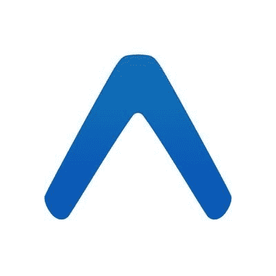
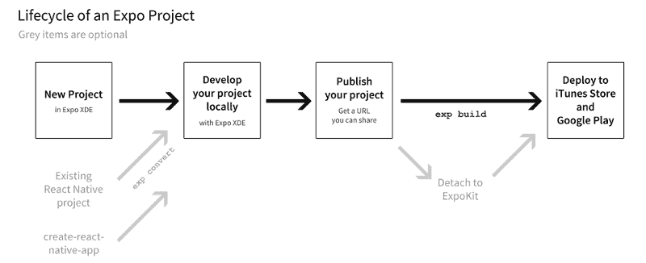

# 连线之间:Quora 联合创始人查理·契弗访谈

> 原文：<https://www.freecodecamp.org/news/between-the-wires-an-interview-with-entrepreneur-and-founder-charlie-cheever-4c95d45f4384/>

薇薇安·克伦威尔

# 连线之间:Quora 联合创始人查理·契弗访谈

Charlie Cheever, taken by Vivian Cromwell

我采访了查理·契弗，他是 [expo.io](https://expo.io/) 的创始人。Expo 的使命是让 web 开发人员只需用 JavaScript 编写一次应用程序，就能构建出真正的本地应用程序，既能在 iOS 上运行，也能在 Android 上运行。它是[开源](https://blog.expo.io/open-sourcing-the-exponent-client-9b37634c13d7)、[免费](https://blog.expo.io/exponent-is-free-as-in-and-as-in-1d6d948a60dc)并使用 React Native。

之前，查理共同创立了 Quora ，并在脸书的平台团队工作。

#### 告诉我们一些关于你童年的事情，以及你在哪里长大的。

我在宾夕法尼亚州的匹兹堡长大。我一直喜欢电脑游戏。在我三年级的时候，有一天我爸爸带我去图书馆，我拿了一本名为*如何制作自己的电脑游戏*的书。第一页说你必须知道如何用 BASIC 编程，所以我回去找了另一本关于 BASIC 编程的书。我会去学校，在苹果 II 上输入书中的程序，慢慢地我开始对它们做一些小的改动。

当我上高中时，我参加了卡耐基梅隆大学的一个名为安德鲁的飞跃的暑期项目。这是一个免费的暑期项目，教你基本的复杂性理论和一些编程。真的很有趣。我真的很喜欢用电脑或计算器制作东西，并与人分享。对我来说，知道自己想做什么很容易。

最终，我去了哈佛，学习计算机科学。然后，我去了亚马逊工作，有一天我收到了一封来自脸书的招聘邮件，因为我曾是创始人们选修的一门课程的助教。我遇到了两个学校的朋友，大卫·费特曼和安德鲁·博斯沃思，他们告诉我他们要离开微软去脸书工作。我想如果他们这么做了，也许这是个好主意。所以，我给他们的招聘人员发了电子邮件，我得到了这份工作，并于 2006 年开始工作，成为一名软件工程师。当时，脸书只有大约 10 到 12 名工程师。我创建了脸书开发者平台，这是一个在很多方面都非常成功的游戏平台。

我最终离开了脸书，开始在 Quora 工作。我真的很想开一家公司。尽管脸书非常有趣，也是一个工作的好地方，但我觉得是时候开始自己的事业了。

然后，我在大约两年前开始了 [Expo](https://expo.io/) 。

#### 什么是世博会？

Expo logo

Expo 是一个[免费](https://blog.expo.io/exponent-is-free-as-in-and-as-in-1d6d948a60dc) [开源](https://blog.expo.io/open-sourcing-the-exponent-client-9b37634c13d7)平台，让网络和移动开发者能够快速构建和迭代在 iOS 和 Android 上都能运行的高质量原生应用。Expo 的核心是围绕 [React Native](https://facebook.github.io/react-native/) 建立的，这是一项在脸书发明的技术，用于脸书主要应用 Instagram 等的部分应用。React Native 也受到了 Airbnb、沃尔玛和特斯拉等其他大公司的信任。

使用 Expo，您可以为 iOS 和 Android 上可用的组件和 API 编写具有本机性能的 JavaScript。 [Expo SDK](https://docs.expo.io/versions/v17.0.0/sdk/index.html#expo-sdk) 包括运行时、React 原生 API 以及音频、视频、认证、通知等附加组件。这意味着你可以花更多的时间只写 JavaScript，因为 iOS 和 Android 之间有更多的代码共享。

[XDE](https://expo.io/tools) (世博开发环境)为你打理 React 原生版本。如果你愿意，你可以继续使用旧版本，或者升级到新版本，而不必担心破坏更改或重建应用程序二进制文件。

您可以通过一个简单的 URL 共享您正在构建的应用程序，该 URL 可以从 Expo 客户端应用程序打开。当您准备好发布到 app store 时，只需将您的应用程序编译成二进制文件并部署即可。你还可以在几秒钟内“空中下载”更新你的应用程序(是的，这是苹果允许的！)

Expo 还提供了一个基于浏览器的工具，名为 [Snack](http://snack.getexpo.io/) ，类似于 JSFiddle，但用于 React 原生应用。可以去 [snack.expo.io](https://snack.expo.io/) ，开始原型制作。您可以在浏览器中预览或在手机上打开。当你准备好了，用一个简单的网址与你的朋友和同事分享。

所有这些都可以通过 Expo 客户端实现，因为用 Expo 构建的应用程序使用相同的本地运行时。大多数时候，你不需要在你的机器上安装 Xcode 或者 Android Studio 来使用 Expo。但是，当你需要用你自己的本地库来扩展它时，你总是可以[分离到 ExpoKit](https://docs.expo.io/versions/v17.0.0/guides/detach.html) 并在任一 iDE 中打开你的项目。

Expo project lifecycle.

我们热衷于让移动开发变得更容易，让每个人都可以使用。您可以在 [expo.io](https://expo.io/) 了解更多信息。

#### 是什么促使你创建 Expo？

我们的使命，在一个高层次上，是从根本上缩短人们头脑中的愿景和他们完成的产品之间的距离。

当我在 Quora 做移动应用的时候，即使有优秀的开发者和设计师在开发，也要花九到十个月的时间来完成一个应用。我们不得不使用 webview 让一切跨平台，但他们总是觉得有点偏离。你不太可能获得性能优势，也不太可能制作出原生应用能做到的酷炫动画。在做了几乎一生的 web 开发之后，这种感觉从根本上倒退了。总得有人来解决这个问题。所以，我休息了一段时间，开始和詹姆斯·伊德一起工作，探索让它变得更好的方法。

我们从 HTML5 和 web 技术开始，但它有内在的局限性——我们认为它还不够好。但是我们深信网络模式，这是生产力方面的一大进步。我们建立了这个名为“Ion”的整个系统，这是一个愚蠢的名字，因为已经有了 [Ionic](https://ionicframework.com/) 框架。

但我们没有推出 Ion，只是用它做了几个 app。然后 React Native 出来了，它几乎完全一样，除了后面有 20 个团队，而不是两个。我们基本上决定停止在 Ion 上的工作，开始在 React Native 的基础上开发我们想要的其他东西。

#### 对于初创公司的创始人来说，最有回报的时刻往往是你的产品以一种意想不到或创新的方式被使用的时候。世博会也是这样吗？

如果你进入 Expo 客户端应用程序，会有一个新的项目选项卡，它会向你显示最后十个项目

有人按了“发布”键。这真的很酷，现在有足够多的人使用它，你通常会看到至少 1-2 个有趣的项目。令人兴奋的是，我发现了一些我不知道人们在世博会上建造的东西，比如泰国的一家电子商店。

#### 作为创建者，请带我们了解建造 expo.io 的一天。

如果算上我，我们现在有十个人。除了温哥华的布伦特和西雅图的 T2【本外，他们大多数都在湾区。他们每隔几周就来拜访一次。他们喜欢他们所在的地方，我们也喜欢他们，所以我们让它发挥作用。

Slack 是我们团队的重心，因为我们是分布式的。我们还结束了与我们平台上的开发人员的密切合作，他们中的一些人是特定项目的承包商。例如，住在班加罗尔的 Satyajit 帮助我们画素描。这意味着我们有很大的灵活性。每个人的工作时间都不一样，很多地方的决策都不用咨询产品经理。

#### **为什么开发者产品很难赚钱？世博会是如何做到这一点的？**

开发人员的产品很难赚钱，原因有几个。一个是有很多人有动力让开发过程或工具变得更好。它类似于内容，也很难从中赚钱，因为很多人愿意写它是因为其他原因，如品牌或声誉。

开发人员工具通常属于这一类。有很多人喜欢制作它们或者以开源的方式制作它们，也许他们中的一些人想制作开源工具来使一个平台更受欢迎或者出于招聘的原因。

对我们来说有意义的不是从平台本身赚钱。这些工具是开源的，这真的很重要，因为我们想要吸引的开发人员和我们想要使用的工具都是开源的。你可以弄清楚其中发生了什么，如果有问题，你可以发送补丁。担心的话可以做个安全审计。收取任何费用都很奇怪。

我们的部分使命是向孩子们开放移动软件开发。有时我想，如果我现在是 13 或 14 岁，我和我的朋友们都坐在我们的手机周围，我会想办法为我们制作一些很酷的东西来玩。但是如果你为此收费，你就把渴望学习的孩子排除在外了。他们没有信用卡，他们的父母也不太可能给他们钱买他们可能不懂的东西。

从这个角度来说，它对我来说是有意义的，这是一种类似于 Twitch 和 YouTube 的商业模式。YouTube 上传视频不收费，Twitch 流媒体不收费。但是如果他们帮你赚钱，他们可以从中分一杯羹。

所以，我希望如果我们能帮助开发商赚钱，那么我们将有一个小的提成方式。但在很大程度上，我希望它永远免费和开源。如果我们能够帮助人们在我们的平台上建立可持续发展的业务，那么我们有很多方法可以维持自己。

#### 你能谈谈你在建设世博会期间经历的一两个非常困难的时期吗？

我觉得前方会有非常困难的时期，但是我们对我们的使命充满热情，所以到目前为止还没有感觉到困难。我知道这将需要很长时间，并且前面会有很多挑战，但在过去的几个月里，我们执行得非常好，并推出了一些好的拼图，使我们的信息更加清晰。

部分原因是因为开发人员有很多方式进入不同的状态，所以我们有很多问题的答案，但是，很难解释我们所做的一切。如果你用 React Native 开始一个项目，你会得到这个像 IOS 和这个 Android 的文件夹，里面有你所有的 JavaScript 源代码，如果你没有写任何原生的 IOS 或 Android 代码，你只有 JavaScript，我们有一个融合脚本。它有点不稳定，因为有很多不同的方法可以对你的项目进行修改。

我们现在的重点是帮助新人加入。

我们有一个伟大的团队，我们一起工作得很好，所以这很有趣。我们团队中的许多人都是 React 原生开源项目的积极贡献者，在 Expo 工作是完全能够在那个领域工作的一种方式。在 React Native repo 工作的那类人是关心移动应用程序如何构建以及移动开发的那类人。当 Expo 的愿景是让构建移动软件更容易、更快、更容易时，他们产生了共鸣。他们通常是对开发方式最有想法的人。

#### 世博会的下一站是什么？

我们将非常努力地工作，成为启动任何新的 React 原生项目的最标准、最直接、最好的方式。我们还想增加更多的本机模块功能。

我在 React Native 社区群中发布了使用 Expo 的 10 个理由，其中之一是 Expo 只是普通的 React Native，外加一些其他东西。例如，React 原生开发者面临的最大挑战之一不仅是自己进行定期升级，而且许多第三方模块没有得到更新，而是停留在旧版本上，例如一些真正定制的蓝牙或后台位置。因为 React 本地库实际上每隔几周就会发布新版本，所以很多本地库很难跟上变化的步伐。

我们明年的另一个重点是为人们提供移动所需的构建模块。我不喜欢网络的一点是，也许是因为网络最初是作为制作文档的一种方式，本质上是流动的文本，也许是一些图像，加上矩形来展示它，还有表格。这很好，但这正是 1994 年世界所需要的。

如果你想想人们喜欢在手机上做什么，那就是大量的图像、视频、流媒体、滑动、喜欢和播放声音。这是一种更加触觉化和多媒体化的体验。我们努力成为想制作移动软件的人的合适的构建模块。我们今天可能没有所有的答案，但这是我们来年的目标方向。

#### 除了创业之外，你还有哪些爱好或兴趣？

实际上，在过去的两年里，我一直在不停地听很多瑞恩·亚当斯的音乐，我想我比过去更关心政治，只是因为今年我觉得它很重要，这是我一生中从未有过的。

我在匹兹堡长大，所以我是一个[企鹅](https://en.wikipedia.org/wiki/Pittsburgh_Penguins)、[钢人](http://www.steelers.com/)、[海盗](https://www.mlb.com/pirates)的球迷。企鹅队去年在圣何塞赢得了斯坦利杯，我亲眼目睹了这一切，这很酷。

Pittsburgh Penguins

[捐款支持本项目](https://opencollective.com/betweenthewires)。

这个项目得到了来自[frontendmasters.com](https://frontendmasters.com/)、 [egghead.io](https://egghead.io/) 、[微软 Edge](https://www.microsoft.com/en-us/windows/microsoft-edge) 和[谷歌开发者](https://developers.google.com/)的赞助。

Our sponsors.

要推荐一位您希望听到其声音的制造商，请填写此[表格](https://goo.gl/forms/XhR1IyLXJHNMljcp1)。

您也可以在 Twitter 上向 betweenthewires 发送反馈。