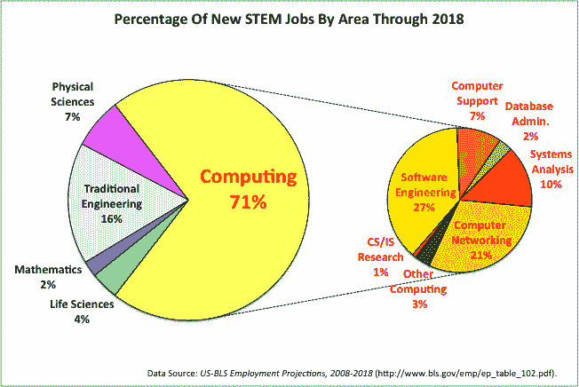

# 为什么计算机专业的人这么少？

> 原文：<https://www.freecodecamp.org/news/why-do-so-few-people-major-in-computer-science-6c2c08272405/>

香港的科技作家 Dan Wang 写了一篇博客文章，探究为什么很少人获得计算机科学学位。而且没错——比研究其他理工科领域的人少多了。

以下是对这一现象最常见的解释，以及他认为这些解释不充分的原因:

1.  计算机科学很难。但是这并不一定比其他科学和工程领域更难，其中许多领域都越来越受欢迎。
2.  **做开发者不需要 CS 学位**。但它肯定会帮助你进入大型科技公司——比其他专业更有帮助。
3.  人们在考虑专业时并不那么受市场驱动。但有证据表明，越来越多的人进入了增长领域，如医疗保健。所以这也不能完全解释为什么更多的人不是主修计算机科学。

他继续探索了总共 11 个可能的影响因素。但是，这些因素中没有一个能完全解释为什么学习计算机科学的人如此之少，即使有那么多高薪、高声望的开发人员工作。

无论如何，如果你现在在大学，或者打算马上开始，我强烈推荐你主修计算机科学。

编程确实是大多数新工作的所在，随着越来越多的工作由机器完成，这一趋势将会加速。

我只写编程和技术。如果你在推特上关注我，我不会浪费你的时间。？