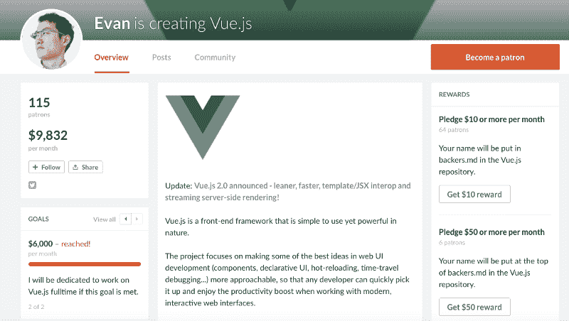
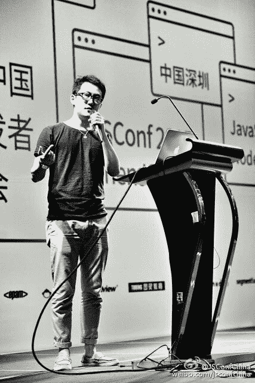

# 电线之间:访 Vue.js 创始人尤雨溪

> 原文：<https://www.freecodecamp.org/news/between-the-wires-an-interview-with-vue-js-creator-evan-you-e383cbf57cc4/>

薇薇安·克伦威尔

# 电线之间:访 Vue.js 创始人尤雨溪

我采访了 vuejs.org 的创造者尤雨溪，他是一个流行的渐进式 JavaScript 框架。Evan 全职从事 Vue 的工作，资金来自 Patreon 的竞选活动。此前，他曾在谷歌和流星工作。

*这篇文章最初由[的](http://betweenthewires.org/2016/11/03/evan-you/)发布在[的](http://betweenthewires.org)网站上，这是一个采访那些构建开发者产品的人的系列。*

#### 告诉我们一点关于你的童年和你在哪里长大的。

好的，我出生在中国，我的家乡叫无锡。它是一个中等城市，紧挨着上海。其实我去上海读高中三年，来回通勤。高中毕业后，我去美国上大学。我想我很早就接触到了计算机，但我并没有太多地参与编程。我对游戏更感兴趣，我在高中时确实经常玩 Flash，因为我真的很喜欢那些交互式讲故事的体验。

Evan with his first computer, 1996

#### 你的第一次编程经历是什么？

> “JavaScript 吸引了我，因为它能够构建一些东西，并立即与世界分享。你把它放到网上，得到一个网址，你可以用浏览器把它发给任何人。这正是网络和 JavaScript 吸引我的地方。”

当我在美国上大学时，老实说，我不知道我想做什么，我主修工作室艺术和艺术史。当我即将毕业时，我意识到很难找到一份工作室艺术和艺术史的工作。

我想也许我可以去读一个更符合我兴趣的硕士课程，并发展更多的技能。我去了帕森斯，读的是设计与技术美术硕士。这是一个非常酷的项目，因为每个人都是一半设计一半开发。他们教你开放框架、处理、算法动画等东西，你还必须设计应用和界面。

帕森斯并没有教很多 JavaScript，但是我被 JavaScript 吸引了，因为它能够构建一些东西，并立即与世界分享。你把它放到网上，得到一个网址，你可以用浏览器把它发给任何人。这正是网络和 JavaScript 吸引我的地方。

当时， [Chrome 实验](https://www.chromeexperiments.com/)刚刚发布，我完全被震住了。我立即跳入 JavaScript 并开始自己学习，并开始构建类似于 Chrome 实验的东西。我把这些东西放在我的文件夹里，然后不知何故被谷歌创意实验室的招聘人员拿走了。我加入了 T2 五人计划 T3 的一部分。创意实验室每年都会招聘五名新毕业生。它基本上是一个小团队，有一个文案，一个创意技术专家，一个平面设计师，一个战略家和一个通配符。

#### 好的，你是什么时候或者如何发现你试图用 Vue.js 解决的当前问题的？

我在谷歌的工作涉及到大量的浏览器原型制作。我们有这个想法，我们想尽快得到一些具体的东西。有些项目当时用的是[角](https://angular.io/)。对我来说，Angular 提供了一个很酷的东西，那就是数据绑定和一种数据驱动的处理 DOM 的方式，所以你不需要亲自接触 DOM。它也带来了所有这些额外的概念，迫使你按照它想要的方式来构建代码。对于我当时的用例来说，它感觉太重了。

我想，如果我能提取出我真正喜欢的棱角的部分，造出真正轻量级的东西，而不涉及所有额外的概念，会怎么样？我也很好奇它的内部实现是如何工作的。我开始这个实验只是想复制这个最小的特性集，比如声明性数据绑定。基本上 Vue 就是这样开始的。

我致力于它，并觉得它有潜力，因为我喜欢自己使用它。我花了更多的时间，打包妥当，给它起了个名字，叫做 [Vue.js](http://vuejs.org) 。那是 2013 年。后来我想，“嘿，我在这上面花了很多时间。也许我应该与他人分享，这样他们至少可以从中受益，或者他们可能会觉得有趣。”

2014 年 2 月，这就是我第一次将它作为一个实际项目发布的方式。我把它放在 Github 上，并发送了一个链接到黑客新闻，它实际上被投票到了首页。它在那里呆了几个小时。后来我[写了](http://blog.evanyou.me/2014/02/11/first-week-of-launching-an-oss-project/)一篇文章分享第一周的使用数据和我学到的东西。

那是我第一次看到人们去 Github 并主演一个项目。我想我在第一周得到了几百颗星。我当时超级兴奋。

#### 如果你必须列出一些定义 Vue 与其他框架相比的核心东西，你会说什么？

我认为，就现有的所有框架而言，Vue 可能是最类似于 [React](https://facebook.github.io/react/) 的，但从更广泛的意义上来说，在所有框架中，我自己创造的术语是一个渐进的框架。这个想法是，Vue 是由这个核心组成的，它只是数据绑定和组件，类似于 React。它解决了一系列非常集中、有限的问题。与 React 相比，Vue 更注重可接近性。确保懂得 HTML、JavaScript 和 CSS 等基础知识的人能够尽快掌握。

在框架层面上，我们试图用一个非常精简的核心来构建它，但是当你构建更复杂的应用程序时，你自然需要解决额外的问题。例如路由，或者如何处理跨组件通信，在更大的应用程序中共享状态，然后你还需要这些构建工具来模块化你的代码库。你如何组织风格，以及你的应用程序的不同资产？许多更完整的框架，如 [Ember](http://emberjs.com/) 或 [Angular](https://angularjs.org/) ，他们试图对你将要遇到的所有问题坚持己见，并试图将一切都构建到框架中。

这是一种交换。你对用户用例的假设越多，那么框架最终能够承受的灵活性就越小。或者把一切都留给 React 等生态系统——React 生态系统非常非常有活力。有很多伟大的想法涌现出来，但也有很多搅动。Vue 试图选择一个中间地带，在那里核心仍然作为一个非常小的功能集暴露出来，但我们也提供这些可增量采用的部分，如路由解决方案、状态管理解决方案、构建工具链和 CLI。它们都是官方维护的，有很好的文档记录，旨在协同工作，但您不必全部使用它们。我认为这可能是 Vue 作为一个框架，与众不同的最大原因。

#### 你是如何通过 Vue.js 实现财务可持续发展的？

> “我在为这些人创造价值，所以从理论上讲，如果我能以某种金融形式收集这些价值，那么我应该能够养活自己。”

我在为这些人创造价值，所以从理论上讲，如果我能以某种金融形式收集这些价值，那么我应该能够养活自己。这变得很复杂，因为考虑到 JavaScript 生态系统的工作方式，人们很难预先支付 JavaScript 框架。

Vue 拥有非常活跃的用户群。许多 Vue 用户来自 Laravel 社区，他们也是非常热情友好的人。我就想，众筹行得通吗？我只是想在[帕特里翁](https://www.patreon.com/)身上试试这个想法。实际上，[丹·阿布拉莫夫](https://twitter.com/dan_abramov)，React-Hot-Loader 和 Redux 的创造者，之前也在 Patreon 上做过一个小广告。这才是我真正感兴趣的。我大概知道有多少人在用 Vue。假设有 10000 个用户。如果他们中有 1%的人愿意每月给我 10 美元，那就了不起了。

Evan’s Patreon campaign

今年二月，我发起了一场 Patreon 运动，分为两部分。一部分是针对使用 Vue 的个人。通常他们只是愿意放弃一小笔钱，就像给我买咖啡一样。然后是另一个阵营，有实际的商业实体，比如初创企业或咨询公司，他们用 Vue 构建了一些东西。对他们来说，重要的是要看到 Vue 是长期保持的。这让他们安心，因为他们知道他们的资金支持将使 Vue 更可持续，他们可以放心地长期使用它。

它的另一个方面是帕特里翁奖励。如果公司愿意赞助我们，那么我可以把他们的标志放在 vuejs.org 的赞助商页面上。它提高了社区的意识。帕特里翁基金的一半来自个人，其中一人每月赞助 2000 美元。当我尝试的时候，我不知道它是否会起作用，但是结果证明它是起作用的。当我在 Patreon 上每月有 4000 美元的时候，我想我已经成为全职员工了，现在我的月薪已经超过了 9800 美元。

#### 说服他们赞助你花了很长时间吗？他们会怀疑吗，比如，你只是一个年轻的框架，你可能坚持不了六个月？

当我开始 Patreon 活动时，Vue 已经显示出非常强劲的增长。在 2015 年初，Vue 在很大程度上仍然只是一个随机的开源项目，但 Laravel 社区开始全面使用 Vue。我觉得如果我不能从中赚到钱，那就没有意义了。

我要特别感谢[引人注目的](https://www.strikingly.com)，这是一家总部位于上海的初创企业。他们非常积极地参与中国的 JavaScript 和 Ruby 社区。他们实际上并不经常使用 Vue，但他们每月都有资金用于赞助开源项目。他们是六个月来第一个每月 2000 美元的赞助者。

这在早期非常有帮助。此外,[Laravel 的创作者 Taylor Otwell](http://taylorotwell.com/) 也赞助 Vue。他从 100 英镑开始，增加到 200 英镑，随着时间的推移增加到 500 英镑。

#### 你提到你能够得到赞助是因为它发展得如此之快。你需要做市场营销吗？还是有机生长的？

我会说营销中没有任何真金白银。我没有买广告什么的。大部分是，只是写一些博文。很多时候我只是在管理 Twitter 账户。我想差不多就是这样了。偶尔我会在媒体上写一篇文章。

#### 你最终在国际市场获得了巨大的吸引力，这可能是非常独特的。我们很想听听它是如何发生的，以及在吸引美国以外的开发者方面的一些挑战和最佳实践。

JSConf China, 2015

中国市场是独特的。我是中国人，我非常喜欢中国的 JavaScript 社区。很多人知道 Vue，因为他们知道我。我们把整个 Vue 文档翻译成了非常好的中文，这对 Vue 在中国的采用帮助很大。很多用户也知道，“嘿，这个库的作者是中国人。”他们只是自然地倾向于至少检查一下，但我认为这在早期阶段帮助很大。Vue 刚刚开始被中国越来越多的公司使用，包括阿里巴巴、腾讯和百度的团队。这些都是中国价值数十亿美元的公司。React 在中国也很受欢迎。

在中国有一个 Quora 克隆叫[知乎](http://zhihu.com)，人们在那里问各种各样的随机问题，我为他们回答了很多 JavaScript 和 Vue.js 相关的问题。

#### 对于不容易与国际社区接触或沟通的公司、初创公司或开源项目，你有什么建议吗？

我猜语言障碍可能是最难的部分。这个想法是，如果你不真正致力于推动中国的东西，那么没有人会注意到它，除非你像 React 一样大。你需要一个会说中文的人，一个会说中文的人来做这件事。

另一个有趣的事情是，实际上有许多来自世界其他地区的用户，如意大利、西班牙、葡萄牙和日本。一些最积极的贡献者来自日本。他们在翻译文件时非常非常细致。

#### 你在创建 Vue 的时候有没有犯过你希望永远不要再犯的错误？

> “我必须以某种方式彻底重新思考这个问题，但我认为这就是软件开发的方式，因为你永远不会从第一次尝试就做对任何事情。”

嗯，我知道，可能有不少。迄今为止，Vue 已经被彻底改写了两次。很明显，我重写了它，因为最初的实现有问题，而这些问题是渐难解决的。就好像每六个月我都会查看六个月前的代码库。我会说，哇。这到底是怎么回事？

我必须以某种方式彻底重新思考这个问题，但我认为这就是软件开发的方式，因为你不可能从第一次尝试就做对任何事情。

构建 Vue 的旅程也是一个开发者成长的旅程，因为随着时间的推移，我必须添加新功能，维护它，修复 bug，并确保整个生态系统正确地协同工作。它只是很自然地让你接触到作为软件工程师会遇到的所有问题。这只是一个学习的过程。

#### 你在使用 Vue 时遇到过情感上的或非技术性的困难吗？

> “不会有一个真正的框架能让所有人都满意。更重要的是，让真正喜欢你的框架的人感觉更好。专注于你认为在你的框架中最有价值的东西，确保你做得很好，而不是担心你和别人相比如何。”

肯定有过。竞争压力很大。当 Vue 还相对不为人知的时候，那种压力是不存在的，因为任何曝光都是好的。人们不会让你达到某个标准。但随着 Vue 变得越来越大，人们自然开始将 Vue 与 Angular 或 React 等东西进行比较，他们指出一些事情，如“嘿，React 做得更好。Angular 在这方面做得更好。”

这给你带来了很大的压力，和所有的大家伙竞争会很有压力。尤其是现在我全职做这个。Vue 在生态系统中的生存能力基本上与我的表现直接相关。

但是最近我刚刚看了《榆树》的作者埃文·恰普利基的一次演讲，他谈到了他在《榆树》工作时也有类似的压力。React 上面有 [Om](https://github.com/omcljs/om) ，ClojureScript 接口。有 [PureScript](http://www.purescript.org/) ，有其他 JavaScript 语言的函数编译，他也担心 Elm 如何与这些库竞争。

后来，他与 Python 的作者 Guido 交谈，Guido 给了他建议，他说，“只要做好工作就行了。”背后的想法是 Python 也有这个问题。它与许多动态语言竞争，如 Ruby、JavaScript、Perl，并且它也在相同的问题域中。最终所有这些语言都获得了成功，他们有自己专门的社区在使用它们，享受这些语言。

人们喜欢不同的语言是有原因的。类似于 JavaScript 框架，人们喜欢不同的框架是有原因的。不会有一个真正的框架让所有人都满意。更重要的是，让真正喜欢你的框架的人感觉更好。专注于你认为在你的框架中最有价值的东西，确保你做得很好，而不是担心你和别人相比如何。

#### 你认为 Vue.js 的成功结果是什么？

这是一个很难回答的问题，因为 Vue.js 的范围肯定是随着时间的推移而增加的。我们现在有了这个完整的框架生态系统，并且我们还在扩展探索像 Weex 这样的东西，它将 Vue 组件呈现到原生 UI 上。

我也非常关心 Vue 的平易近人部分，它植根于一种信念，即技术应该让更多的人能够创造东西。

#### 下面几个只是编程之外的好玩的问题。除了编程，你还有什么其他爱好或兴趣？

动漫，我看了很多漫画。如果你还没有注意到，Vue 的发布是用动漫名字来命名的。它始于. 09，每一个大版本的代码名称都以一个字母递增。2.0 是 G 也就是壳中鬼。f 其实是留给 1.1 的。1.0 是福音战士。

Illustration drawn by a Japanese Vue user to celebrate the 1.0 release (codenamed Evangelion)

Celebration illustration for Vue 2.0 (codenamed Ghost in the Shell)

我确实喜欢卡拉 ok。

#### 你最感兴趣的顶尖技术或趋势是什么？

通用技术。这很奇怪，因为我对 AR 或 VR 的东西不是很感兴趣。我很想说一些更贴近开发者的东西。类似于吉列尔莫现在对[和](https://zeit.co/now)所做的事情。开发人员为开发人员构建工具，以及这些工具的开发人员体验，这也是用户体验，但对于开发人员工具而言。

#### 你心目中的编程英雄是谁？如果你有的话。

显然 [TJ Holowaychuck](https://twitter.com/tjholowaychuk) 和 [Guillermo Rauch](https://twitter.com/rauchg) 。我不是计算机专业的。我基本上只是通过随机的在线资源和书籍来学习编程，但我学习的一个重要方式是通过阅读其他人的代码。看 TJ 的代码，总觉得真的很优雅。我想到了这个词，这个词对我影响很大。TJ 对我来说绝对是个英雄。

这个项目得到了来自[frontendmasters.com](https://frontendmasters.com/)、 [egghead.io](https://egghead.io/) 、[微软 Edge](https://www.microsoft.com/en-us/windows/microsoft-edge) 和[谷歌开发者](https://developers.google.com/)的赞助。

Our sponsors.

[捐款支持本项目](https://opencollective.com/betweenthewires)。

要推荐一位您希望听到其声音的制造商，请填写此[表格](https://goo.gl/forms/XhR1IyLXJHNMljcp1)。

您也可以在 Twitter 上向 betweenthewires 发送反馈。