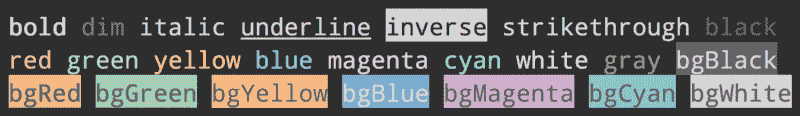
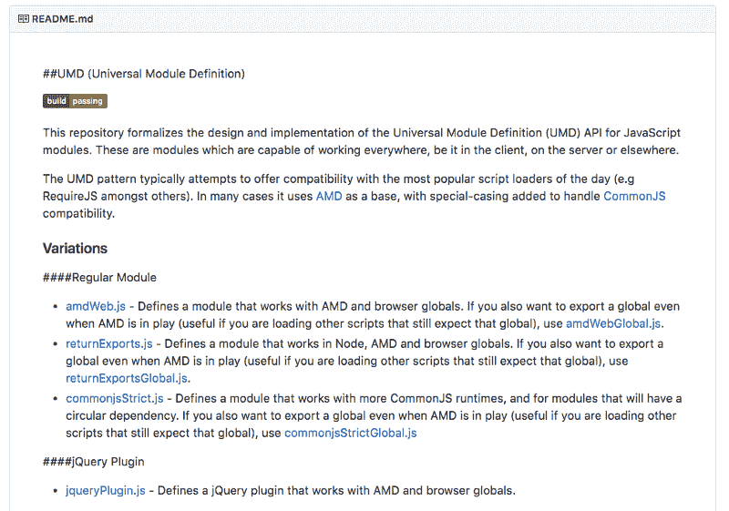
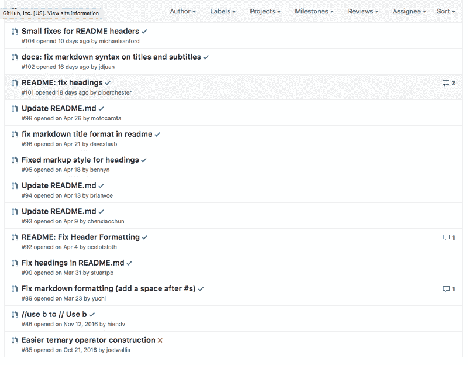

# 刻意练习:我从阅读 docco 中学到了什么

> 原文：<https://www.freecodecamp.org/news/deliberate-practice-what-i-learned-from-reading-docco-7884b5979c6c/>

作者安东尼·吴

# 刻意练习:我从阅读 docco 中学到了什么

Becoming an Open Sourcerer: docco

我在浏览开源项目，试图找到下一个我要研究的项目。我发现了`underscore`和它的[注释源代码](http://underscorejs.org/docs/underscore.html)。

带注释的源代码让我吃惊。页面的右边是源代码。页面的左边是解释每个代码块的注释。这是我自己阅读源代码时无法获得的知识。我想知道是什么产生了这个漂亮的文档并找到了`docco`。

### docco 是什么？

是一个“有文化的编程风格的文档生成器”它是一个获取你的源代码并创建注释文档的程序。

注意`docco`只生成文档的布局。来自源代码的注释充当了注释。

### 如何使用 docco？

我有一个惊人的功能，我想为它创建文档。我加入了描述性的评论，作为我的注解。

要用`docco`，我就用`npm install — save-dev docco`本地安装。

`docco`命令接受文件名，它将为文件名生成文档。我的程序保存为`app.js`，所以我将运行`./node_modules/.bin/docco app.js`。

这就是创建[带注释的源代码](https://newyork-anthonyng.github.io/articles/deliberate_practice/002_docco/tutorial/docs/app.html)的全部工作！

默认情况下，`docco`会将所有生成的文档放到一个新的`docs` 目录中。你可以配置`docco`使用不同的 CSS 或者不同的布局。[看看这个`linear`布局的注释代码](https://newyork-anthonyng.github.io/articles/deliberate_practice/002_docco/tutorial/linearDocs/app.html)。

看看`docco`的 [README.md](https://github.com/jashkenas/docco) 看看你还能定制什么。

我将开始使用`docco`来开始注释我工作的所有未来开源项目。

### 什么是识字编程？

有了[识字编程](https://en.wikipedia.org/wiki/Literate_programming)，你想用通俗易懂的语言表达你的程序逻辑。一个人应该能够像读一本书一样通读它，了解正在发生的事情。

这意味着文档应该遵循与程序逻辑相同的顺序，而不是与源代码相同的顺序。我们按照令编译器满意的顺序编写程序。有时候，这个顺序和我们程序的逻辑不一样。

所以，`docco`并没有产生真正意义上的有文化的编程文档。`docco`按照与源代码相同的顺序生成文档。但是，我仍然认为这个带注释的源代码是有价值的。可以把它想象成你的代码的伪代码。

### 把东西拆开，然后再组装起来

当开始了解一个新项目时，投入时间建立一个反馈回路。它可能正在设置测试套件，以便您可以编辑源代码并查看哪里出了问题。它可能会找到一种快速的方法，从您的终端运行源代码来查看您的控制台日志。我不会开始浏览源代码，直到你有办法创建这个反馈循环。

这就是为什么测试驱动开发对我来说如此有效和令人愉快。您可以立即看到您的代码在做什么。没有反馈环，你将在黑暗中编码。

我通过运行`node docco.js app.js`在我的终端上运行`docco`的源代码，其中`app.js`是一个虚拟文件。通过运行这个命令，我能够看到我的`console.log`的结果。[这是我漂亮的源代码](https://github.com/newyork-anthonyng/articles/blob/master/deliberate_practice/002_docco/docco.js)的样子，有超过 150 行我自己的注释。

### 从事你经常使用的项目

肯特·多兹写了一篇关于为开源项目做贡献的伟大文章。他的建议是只做你经常使用的项目。这就是我如何选择我从事的项目。我决定创建我自己版本的`docco`,因为这是我自己想要使用的东西。

我也决定不使用`docco`本身，因为它的维护似乎已经死了。最近一次是两年前吗？是否存在多年前遗留下来的陈旧的未决问题？是否有很多被忽略的拉取请求？这些都是很好的迹象，表明这个项目可能已经死亡或无人维护。

最重要的是，我想为学习体验创建并发布 [docco-lite](https://www.npmjs.com/package/@newyork.anthonyng/docco-lite) 。

### 浏览器之外也有很棒的库

我专注于前端世界。我知道我不缺少可用的库和框架。我不知道前端世界之外还有令人惊叹的库。

这里有一些`docco`用过的很棒的库。

#### 1.fs-extra

`[fs-extra](https://github.com/jprichardson/node-fs-extra)`是文件系统(fs)模块的增强版本。创建目录和文件非常酷，而不是创建`<d` iv > ' `s an` d < h1 >的

#### 2.指挥官

`[commander](https://github.com/tj/commander.js)`是一个创建命令行界面的库。

#### 3.白垩

让你设计你的终端字符串？

Beautiful chalk output

#### 4.highlightjs

`[highlightjs](https://highlightjs.org/)`可以用一串代码创建 HTML。有了这个 HTML 输出，您可以添加 CSS 来样式化您的代码片段。

### JavaScript 模板

在大会的训练营中，我在花式 Angular/React 之前学会了车把。Handlebars 是一种简单的 JavaScript 模板语言，它将 JavaScript 放到 HTML 中。如果你有一个简单的项目，有时一个简单的模板语言就足够了。使用 React 的开销可能没有意义。

过去一年，我一直在 React 工作。使用 JavaScript 模板的简单和强大让我吃惊。`underscore`库提供了一种使用 JavaScript 模板的简单方法。

如果你想在你的模板中包含 JavaScript，使用`<%` % >。

如果您希望 JavaScript 呈现为文本，请使用`<%=` % >(注意等号(=)。

您甚至可以在 JavaScript 模板中使用 for 循环。

现在让我们用`underscore`的`template`方法把它们放在一起。

我们不需要 webpack、Babel 或虚拟 DOM。建立网页的美好时光？。

### 创造有价值的公关

为开源项目做贡献应该为某人提供价值。您可以通过修复错误、添加功能或更新文档来帮助他人。你可以通过在一个项目中学习新的东西来帮助自己。

但是要确保你正在做的工作没有白费。

看一看 [UMD 仓库](https://github.com/umdjs/umd)。

README.md from UMD repository

我们可以在 README.md 中看到一些 Markdown 格式问题。这将是一个创建 Pull 请求来解决此问题的绝佳机会。

但是在我们这样做之前，让我们检查一下我们的努力没有白费。让我们来看看未完成的拉取请求。

Pull Requests for UMD repository

请注意，有 11 个未完成的拉请求修复了同一件事情。

人们如此关心这个项目以至于修改它的文档，这真是太棒了。但是创建第 12 个 Pull 请求来修复 README.md 对任何人都没有帮助。

在创建一个 Pull 请求来添加一个新特性或修复一个 bug 之前，也可以这么说。你应该先在 Github 上创建一个问题。这个特性可能不需要，所以花在拉请求上的时间是一种浪费。您发现的错误可能实际上是您自己代码中的错误，而不是库源代码中的错误。

制造问题也有助于避免重复其他开源者所做的工作。在创建新问题之前，查看其他未解决和已解决的问题，以确保该问题尚未解决。

### 通过识字编程降低障碍

降低为开源项目做贡献的门槛是很有价值的。当开始一个开源项目时，有许多令人生畏的因素。

目录结构是什么？我需要下载什么来设置我的环境？要理解程序逻辑，我需要具备哪些基础知识？

行为准则是开源项目中的一个重要元素(参见[脸书的行为准则](https://code.facebook.com/pages/876921332402685/open-source-code-of-conduct)作为例子)。我希望带注释的源代码也能成为未来项目的主要内容。

你对带注释的源代码有什么看法？这是你希望在更多的项目中看到的吗？下面留言评论！

*看看我的[注释 docco 代码](https://newyork-anthonyng.github.io/articles/deliberate_practice/002_docco/tutorial/docs/annotatedDocco.html)。