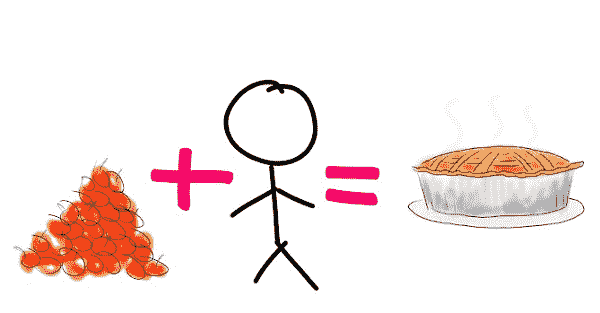
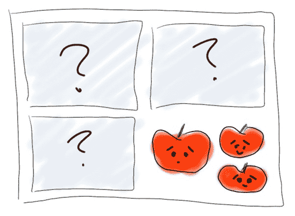
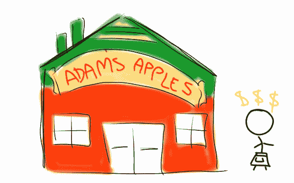

# 使用 apple pie 了解 Array.prototype.reduce()和递归

> 原文：<https://www.freecodecamp.org/news/understanding-array-prototype-reduce-and-recursion-using-apple-pie-f60cde58ea51/>

我很难理解 JavaScript 中的`reduce()`和递归，所以我写了这篇文章来解释它(嘿，看，递归！).这些概念与做苹果派有一些相似之处。我希望你觉得我的例子既有用又美味。

给定一个包含嵌套数组的数组:

```
var arr = [1, [2], [3, [[4]]]]
```

我们想生产这个:

```
var flat = [1, 2, 3, 4]
```

### 使用 for 循环和 if 语句

如果我们知道我们将遇到的嵌套数组的最大数量(本例中有 4 个)，我们可以使用`for`循环遍历每个数组项，然后使用`if`语句检查该项本身是否是一个数组，等等…

```
function flatten() {
    var flat = [];
    for (var i=0; i<arr.length; i++) {
    if (Array.isArray(arr[i])) {
        for (var ii=0; ii<arr[i].length; ii++) {
        if (Array.isArray(arr[i][ii])) {
            for (var iii=0; iii<arr[i][ii].length; iii++) {
            for (var iiii=0; iiii<arr[i][ii][iii].length; iiii++) {
                if (Array.isArray(arr[i][ii][iii])) {
                flat.push(arr[i][ii][iii][iiii]);
                } else {
                flat.push(arr[i][ii][iii]);
                }
            }
            }
        } else {
            flat.push(arr[i][ii]);
        }
        }
    } else {
    flat.push(arr[i]);
    }
    }
}

// [1, 2, 3, 4]
```

…这很有效，但是很难读懂，也很难理解。此外，它只有在您知道要处理多少嵌套数组的情况下才能工作，您能想象必须调试这种混乱的情况吗？！(咦，我觉得哪里多了一个`i`。)

### 使用 reduce

JavaScript 有一些方法可以让我们的代码更简洁、更容易理解。其中一个是`reduce()`，看起来像这样:

```
var flat = arr.reduce(function(done,curr){
    return done.concat(curr);
}, []);

// [ 1, 2, 3, [ [ 4 ] ] ]
```

代码少了很多，但是我们还没有处理一些嵌套数组。让我们首先一起浏览一下`reduce()`,看看它做了什么，看看我们将如何纠正它。

> *Array.prototype.reduce()*

> *reduce()方法对一个累加器和数组中的每个元素(从左到右)应用一个函数，将其缩减为单个值。*T2【MDN

这并不像看起来那么复杂。让我们把`reduce()`想象成一个失业的开发者(AI 拿走了所有的开发工作)拿着一个空篮子。我们叫他亚当。亚当现在的主要功能是从一堆苹果中取出苹果，把它们擦亮，然后一个一个地放进篮子里。这篮亮晶晶的苹果注定会成为美味的苹果派。这是一项非常重要的工作。



Apples plus human effort equals pie. Not to be confused with apple-human-pie, which is less appetizing.

在我们上面的例子中，那堆苹果就是我们的数组，`arr`。我们的篮子是`done`，累加器。`done`的初始值是一个空数组，我们在 reduce 函数的末尾将其视为`[]`。亚当现在发光的苹果，你猜对了，是`curr`。一旦 Adam 处理了当前的苹果，他就将它放入篮子中(`.concat()`)。当苹果堆里没有更多的苹果时，他把那篮擦得锃亮的苹果还给我们，然后回家找他的猫去了。

### 使用 reduce 递归处理嵌套数组

这一切都很好，现在我们有了一篮子抛光的苹果。但是我们仍然有一些嵌套数组要处理。回到我们的类比，假设苹果堆中的一些苹果在盒子里。每个盒子里可以有更多的苹果，和/或更多的盒子里装着更小更可爱的苹果。



Adorable, slightly skewed apples just want to be loved/eaten.

下面是我们希望我们的苹果处理函数/Adam 做的事情:

1.  如果那堆苹果是一堆苹果，从那堆里拿一个苹果。
2.  如果苹果是苹果，擦亮它，把它放在篮子里。
3.  如果苹果是一个盒子，打开盒子。如果盒子里有一个苹果，请转到步骤 2。
4.  如果盒子中包含另一个盒子，请打开这个盒子，然后转到步骤 3。
5.  当这堆苹果没有了，给我们一篮闪亮的苹果。
6.  如果那堆苹果不是一堆苹果，那就把它还回去。

实现这一点的递归归约函数是:

```
function flatten(arr) {
  if (Array.isArray(arr)) {
  return arr.reduce(function(done,curr){
    return done.concat(flatten(curr));
    }, []);
  } else {
    return arr;
  }
}

// [ 1, 2, 3, 4 ]
```

忍耐一下，我会解释的。

> ***递归***

> 函数调用自身的行为。递归用于解决包含更小的子问题的问题。递归函数可以接收两个输入:基本情况(结束递归)或递归情况(继续递归)。T2【MDN

如果你检查我们上面的代码，你会看到`flatten()`出现了两次。第一次出现时，它告诉亚当如何处理这堆苹果。第二次，它告诉他如何处理他现在拿着的东西，在是苹果的情况下提供指示，在不是苹果的情况下提供指示。需要注意的是，这些指令是我们从开始的原始指令的*重复——这就是递归。*

为了清楚起见，我们将逐行分解:

1.  `function flatten(arr) {` -我们命名我们的整体函数，并指定它将接受一个参数`arr`。
2.  `if (Array.isArray(arr)) {`——我们检查提供的“arrgument”(我知道，我很搞笑)来确定它是不是一个数组。
3.  `return arr.reduce(function(done,curr){` -如果前一行为真，自变量是数组，我们要对其进行归约。这是我们的递归情况。我们将对每个数组项应用以下函数…
4.  意想不到的剧情转折出现了！我们要应用的函数就是我们所在的函数。通俗地说:从头开始。
5.  `}, []);` -我们告诉我们的 reduce 函数从一个空的累加器(`done`)开始，然后结束。
6.  这解决了第 2 行的 if 语句。如果提供的参数不是数组…
7.  `return arr;` -返回`arr`是什么。(希望是个可爱的苹果。)这是我们打破递归的基本情况。
8.  `}` -结束 else 语句。
9.  `}` -结束整体功能。

我们完事了。我们已经从 24 行、4 层深度嵌套的`for`循环解决方案发展到更简洁的 9 行递归 reduce 解决方案。Reduce 和 recursion 一开始看起来有点难以理解，但是一旦你掌握了它们，它们将会是有价值的工具，可以节省你未来的努力。

不要担心亚当，我们失业的开发人员。在这篇文章中出现后，他受到了如此多的关注，以至于他开设了自己的人工智能管理的苹果派工厂。他很开心。



+1 for you if you saw that one coming.

*感谢阅读！你可以在我的博客上找到更多解释食物编码概念的文章。*