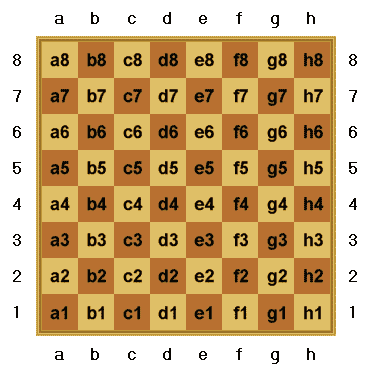

# 使用 Node.js 和 Seneca 编写象棋微服务，第 1 部分

> 原文：<https://www.freecodecamp.org/news/follow-the-rules-with-seneca-b3cf3d08fe5d/>

(这是由三部分组成的系列的第一部分[ [第二部分](https://medium.com/@jefflowery/follow-the-rules-with-seneca-ii-c22074debac)、[第三部分](https://medium.com/@jefflowery/writing-a-chess-microservice-using-node-js-and-seneca-part-3-ab38b8ef9b0a))

我已经开始考虑微服务了。到目前为止，我认为它是一种可伸缩性模式，忽略了它背后的函数式编程原则。

国际象棋的[规则可以很容易的分解成微服务。它们既不是随机的，也不是不明确的，这非常适合编写小型的、无状态的服务来处理不同部分的移动。](https://www.chess.com/learn-how-to-play-chess)

在这篇文章中，我将介绍我创建的几个服务，它们决定了在一个空棋盘上，一个棋子的合法走法。我们将使用 Node.js 的微服务工具包 [Seneca framework](http://senecajs.org/) ，因为它很直观，并且有很好的文档记录。

### 设置塞内卡

[Seneca](http://senecajs.org/getting-started/) 是使用 npm 安装的 Node.js 模块:

`npm install seneca`

此外，我们将依靠全球安装的 [mocha/chai](http://chaijs.com/api/bdd/) 模块进行测试，以展示功能。

### 找到所有合法的移动

实际上没有必要维护一个棋盘的内存表示，只需要在一个 8x8 坐标网格上维护棋子和它们的位置。[代数符号](https://en.wikipedia.org/wiki/Algebraic_notation_(chess))常用来描述棋盘上的坐标，其中文件用字母表示，等级用数字表示:



View from White side of board

对于是白色的玩家，最右边的底角是 h1；黑色是 a8。b2 上的车移动到方格 f2，将被表示为 Rb2-f2。

### 原始动作

我将**原始移动**定义为一个棋子不受其他棋子*或棋盘边缘*阻碍时的移动。最后一点可能看起来很奇怪，但它允许我构建一个 15x15 的运动遮罩，然后将其截断以适应 8x8 的电路板。一个叫[的家伙几年前就提出了类似的想法。](https://en.wikipedia.org/wiki/Procrustes)

国王、王后、主教和车沿着对角线和/或队列移动，所以我将为这四个棋子的移动使用一个服务。卒有独特的移动特征，所以一个特殊的服务将被用于他们。骑士也是一样，因为他们可以跳过棋子，而不沿着队列或队伍移动。

例如，一辆车可以在一个 15x15 的棋盘上沿任意行列移动 7 格。类似的规则也适用于主教和女王。国王在任何方向都被限制在一个方格的范围内(阉割是个例外，我会在以后的帖子里讨论)。

我将使用一个`ChessPiece`类来保存关于每个棋子的类型和位置的信息。现在它不会扮演太重要的角色，但是以后当我扩展服务所覆盖的规则的范围时，它会扮演太重要的角色。

### 第一次服务:车，主教，皇后和国王移动

在 Seneca 中，通过`role` 和`cmd`调用服务。`role`类似于一个类别，`cmd`命名一个特定的服务。正如我们将在后面看到的，服务可以通过附加参数进一步指定。

使用`seneca.add()`添加服务，并通过`seneca.act()`调用服务。我们先来看看服务，首先(来自 Movement.js):

```
 this.add({
        role: "movement",
        cmd: "rawMoves",
    }, (msg, reply) => {
        var err = null;
        var rawMoves = [];

        var pos = msg.piece.position;

        switch (msg.piece.piece) {
        case 'R':
            rawMoves = rankAndFile(pos);
            break;
        case 'B':
            rawMoves = diagonal(pos);
            break;
        case 'Q':
            rawMoves = rankAndFile(pos)
                .concat(diagonal(pos));
            break;
        case 'K':
            rawMoves = rankAndFile(pos, 1)
                .concat(diagonal(pos, 1))
            break;
        default:
            err = "unhandled " + msg.piece;
            break;
        };

        reply(err, rawMoves);
    });
```

现在让我们看看测试如何调用服务(movesTest.js):

```
 var Ba1 = new ChessPiece('Ba1');
        seneca.act({
            role: "movement",
            cmd: "rawMoves",
            piece: Ba1
        }, (err, msg) => {...});
```

注意，除了`role`**`cmd`之外，还有一个`piece` 的说法。这与`role`和`cmd`都是服务接收的`msg` 参数的属性。但是，在调用服务之前，您必须告诉 Seneca 要使用哪些服务:**

```
`var movement = require(‘../services/Movement’)
const seneca = require('seneca')({
        log: 'silent'
    })

 .use(movement);`
```

**一个主教在 a1 方格的原始招式在`msg` 接到*回*的发球中；**

**[ { file:' ` '，rank: '0' }，
{ file: 'b '，rank: '2' }，
{ file:` '，rank: '2' }，
{ file: 'b '，rank: '0' }，
{ file: '_ '，rank: '/' }，
{ file: 'c '，rank: '3' }，
{ file: '_ '，rank: '3' }，
{ file: 'c '，rank:/' }，
{ file: '^'，rank:'。'}，
{文件:' d '，等级:' 4' }，
{文件:'^'，等级:' 4' }，
{文件:' d '，等级:'。'}，
{文件: ']'，秩: '-' }，
{文件:' e '，秩:' 5' }，
{文件:']'，秩:' 5' }，
{文件:' e '，秩:'-' }，
{文件:' \\ '，秩:'，' }，
{文件:' f '，秩:' 6' }，
{文件:' \\ '，秩:' 6' }，
{文件:' f '，秩:'，' }，]
{文件:' g '，等级:'+' }，
{文件:' Z '，等级:' *' }，
{文件:' h '，等级:' 8' }，
{文件:' Z '，等级:' 8' }，
{文件:' h '，等级:' *' } ]**

**注意，这里列出了一些怪异的方块！这些是从 8x8 板上“掉下来”的位置，稍后将被另一个服务淘汰。**

#### **刚刚发生了什么？**

**用`role=”movement”`和`cmd=”rawMoves”`定义了一个服务。当稍后调用`act()`时，act 请求的参数与处理这些参数的服务相匹配(这被称为服务的**模式**)。如前所述以及下一个示例所示，`role` 和`cmd` 不一定是确定被调用服务的唯一参数。**

### ****下一个服务:卒和骑士****

**兵向前移动一格，除非他们在原来的格上，在这种情况下，他们可以向前移动一格或两格。当棋子不是空棋盘上唯一的棋子时，它还可以有其他的走法，但那是以后的事了。卒总是从第二列开始，并且永远不能后退。**

**骑士以 L 型模式移动。在我们想象的以骑士为中心的 15x15 棋盘中，总会有八种可能的走法。**

**我将编写两个服务(一个用于卒，另一个用于骑士)并将它们放在一个模块中(SpecialMovements.js):**

```
`module.exports = function specialMovement(options) {
  //...
      this.add({
        role: "movement",
        cmd: "rawMoves",
        isPawn: true
    }, (msg, reply) => {
        if (msg.piece.piece !== 'P') {
            return ("piece was not a pawn")
        }

        var pos = msg.piece.position;

        const rawMoves = pawnMoves(pos);
        reply(null, rawMoves);
    });

    this.add({
        role: "movement",
        cmd: "rawMoves",
        isKnight: true
    }, (msg, reply) => {
        if (msg.piece.piece !== 'N') {
            return ("piece was not a knight")
        }

        var rawMoves = [];
        var pos = msg.piece.position;

        rawMoves = knightMoves(pos);
        reply(null, rawMoves);
    });
}`
```

**参见服务中的`isPawn` 和`isKnight` 参数？传递给塞内卡`add()`的第一个对象被称为**服务模式**。所发生的是，Seneca 将调用具有最具体的*模式匹配的服务。为了调用正确的服务，我需要将`isPawn:true`或`isKnight:true`添加到 act 请求中:***

```
`var movement = require('../services/Movement')
var specialMovement = require('../services/SpecialMovement')

const seneca = require('seneca')({
        log: 'silent'
    })
    .use(specialMovement)

...

var p = new ChessPiece('Pe2');
        seneca.act({
            role: "movement",
            cmd: "rawMoves",
            piece: p,
...

isPawn: true
        }, (err, msg) => {...}

...
 var p = new ChessPiece('Nd4');
        seneca.act({
            role: "movement",
            cmd: "rawMoves",
            piece: p,

isKnight: true
        }, (err, msg) => {`
```

### **合法行动**

**我们基本的合法移动服务将过滤掉所有不在文件 a-h 或 1-8 级的平方位置。合法移动服务将作为服务有效负载的一部分，用一个`ChessPiece`实例直接调用。合法移动服务然后将调用原始移动服务来获取移动掩码。遮罩将被截断到棋盘的边缘，结果将是可以合法游戏的正方形位置。**

```
 `this.add({
        role: "movement",
        cmd: "legalSquares",
    }, (msg, reply) => {
        const isPawn = msg.piece.piece === 'P';
        const isKnight = msg.piece.piece === 'N';

        this.act({
            role: "movement",
            cmd: "rawMoves",
            piece: msg.piece,
            isPawn: isPawn,
            isKnight: isKnight
        }, (err, msg) => {
            const squared = [];

            msg.forEach((move) => {
                if (move.file >= 'a' && move.file <= 'h') {
                    if (move.rank >= 1 && move.rank <= 8) {
                        squared.push(move)
                    }
                }
            })

            reply(null, squared);
        });
    })`
```

**`legalSquares` 服务首先调用`rawMoves` 服务。这为我们提供了通过`msg`参数传递的任何作品的 15x15 移动蒙版。不过，重要的是，通过将这两个片段中的任何一个的`isKnight` 或`isPawn` 模式字段设置为真来调用正确的服务…如果两个都为假，那么将调用 K、Q、B、R 的“常规”`rawMoves` 服务。**

**一旦原始移动被检索，然后`legalSquares` 服务移除无效的位置并返回剩余的位置。因此，如果我用 Na1 处的片段调用服务，我会得到:**

```
`[ { file: ‘c’, rank: ‘2’ }, { file: ‘b’, rank: ‘3’ } ]`
```

**如果改为我传入 Rd4，legalSquares 返回:
[ {文件:' c '，等级:' 4' }，
{文件:' d '，等级:' 5' }，
{文件:' e '，等级:' 4' }，
{文件:' d '，等级:' 3' }，
{文件:' b '，等级:' 4' }，
{文件:' d '，等级:' 6' }，
{文件:' f '，等级:' 4' }，
{文件:' d '，等级:' 2' }。
{文件:' g '，等级:' 4' }，
{文件:' d '，等级:' 1' }，
{文件:' d '，等级:' 8' }，
{文件:' h '，等级:' 4' } ]**

**这有点难以破译，但包含了沿 4 级的所有文件和沿 d 级的所有文件(相信我！).**

**暂时就这样吧！在以后的文章中，我将回顾处理阻碍移动的友军棋子的服务，然后处理潜在的敌方棋子的捕获。进一步的服务将处理规则的阉割，*顺道，*检查，将死，和僵局。**

**所有源代码都可以在[这里](https://github.com/JeffML/ms-chess)找到。**

**继续本系列的[第 2 部分。](https://medium.com/@jefflowery/follow-the-rules-with-seneca-ii-c22074debac)**