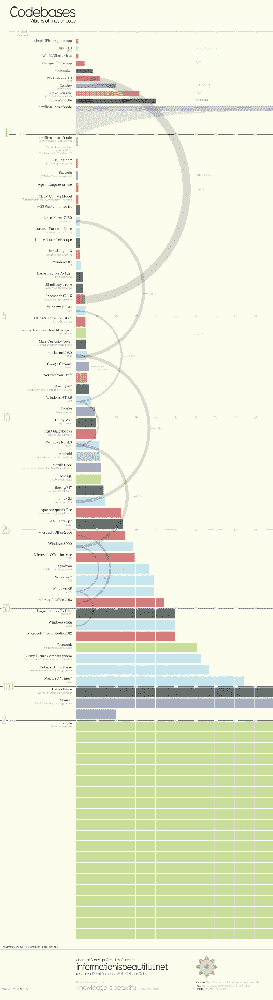

# 历史上最大的代码库

> 原文：<https://www.freecodecamp.org/news/the-biggest-codebases-in-history-a128bb3eea73/>

这是历史上最大的代码库的图表，以代码行数来衡量:

Infographic courtesy of [Information is Beautiful](https://fcc.im/2qlhEj1)

如你所见，谷歌拥有迄今为止最大的代码库。所有 20 亿行代码都放在一个代码库中。

但它不是 Git 存储库。谷歌[使用自己的版本控制系统](https://fcc.im/2rRzwDZ)，该系统是专门为其 62，000 名员工(其中约 1/3 是开发人员)高效协作而设计的。

“最大的 Git 存储库”的殊荣属于微软，他们今天宣布他们的 Windows Git 存储库具有:

*   大约 350 万个文件
*   产生大约 300 大小的 Git repo
*   4，000 名工程师在 440 个分支机构中每天生成 1，760 个“实验室构建”，外加数千个拉式请求验证构建。

你可以在这里阅读关于 Windows 团队如何用 Git 管理这种复杂性的所有内容:( [11 分钟阅读](https://fcc.im/2qdxiBT))

### 以下是其他三个值得你花时间去做的链接:

1.  Elise 如何在全职工作的同时学习编码，并获得了她的第一份 web 开发工作——以及她在这个过程中学到的东西( [2 分钟阅读](https://fcc.im/2qhH0yQ))
2.  如何摆脱编码教程的窠臼( [5 分钟阅读](https://fcc.im/2qlkJiY))
3.  极端生产力的黑暗面，以及如何回到光明中( [8 分钟阅读](https://fcc.im/2qXqwNr))

额外收获:如何使用`setInterval`和`setTimeout`在 JavaScript 中创建基于时间的事件( [3 分钟观察](https://www.youtube.com/watch?v=kOcFZV3c75I)

### 想到这一天:

> "网络钓鱼是一个主要问题，因为人类的愚蠢真的是无药可救."—迈克·丹塞格利奥

### 今日趣事:

网络漫画作者[提交漫画](https://fcc.im/2qQKcUV)

### 今日学习小组:

圣保罗自由代码营

编码快乐！

–昆西·拉森，自由代码营的老师

如果你从这些邮件中获得了价值，请考虑[支持我们的非营利组织](http://bit.ly/donate-to-fcc)。