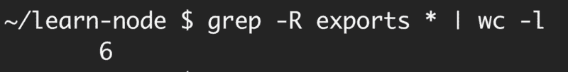
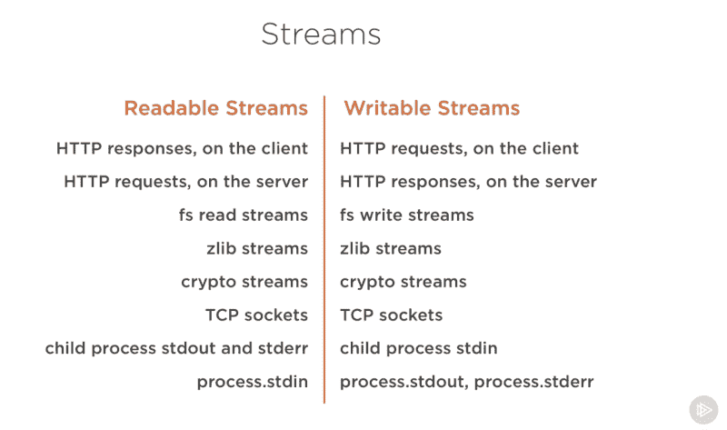
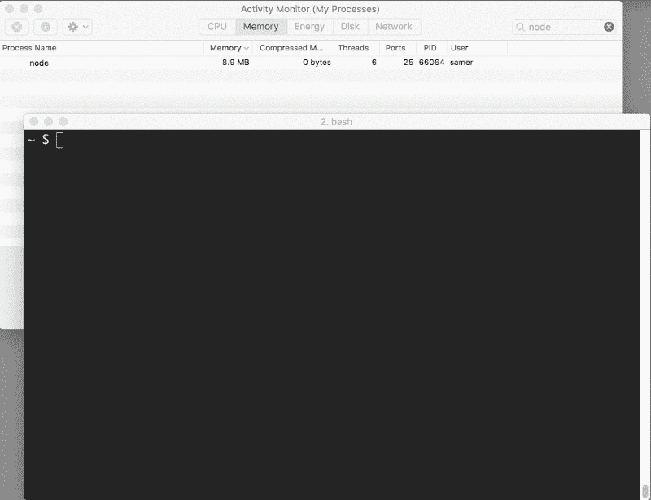
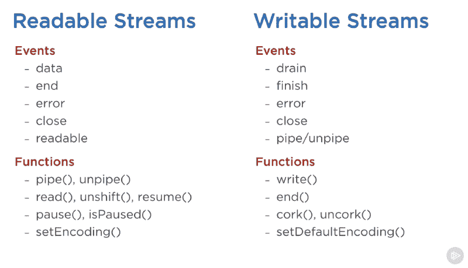
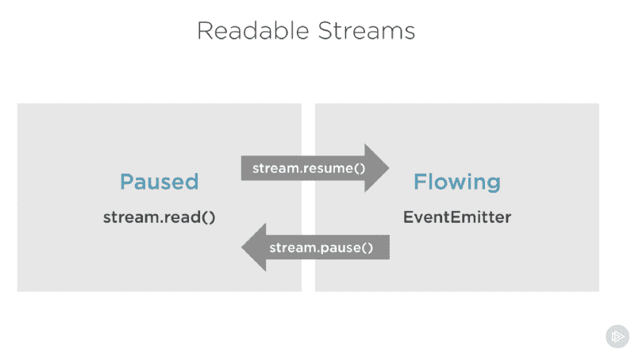
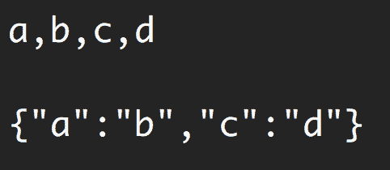

# Node.js Streams:您需要知道的一切

> 原文：<https://www.freecodecamp.org/news/node-js-streams-everything-you-need-to-know-c9141306be93/>

> **更新:**这篇文章现在是我的书《Node.js Beyond The Basics》的一部分。
> 
> 阅读本内容更新版本更多关于节点在【jscomplete.com/node-beyond-basics】**。**

**Node.js 流以难以使用和更难理解而闻名。好吧，我有好消息告诉你——情况不再是这样了。**

**多年来，开发人员创建了大量的包，唯一的目的就是使流的使用更加容易。但是在本文中，我将重点关注本机 [Node.js 流 API](https://nodejs.org/api/stream.html) 。**

> **"流是节点的最佳和最被误解的想法."
> 
> —多米尼克·塔尔**

### **到底什么是流？**

**流是数据的集合，就像数组或字符串一样。不同之处在于，流可能不会一下子全部可用，并且它们不需要适合内存。这使得 streams 在处理大量数据或来自外部数据源的数据时非常强大，每次处理一大块数据。**

**然而，流不仅仅是处理大数据。它们也给了我们代码的可组合性。就像我们可以通过管道传输其他较小的 linux 命令来编写强大的 Linux 命令一样，我们可以在 Node with streams 中做完全相同的事情。**

**

Composability with Linux commands** 

```
`const grep = ... // A stream for the grep output
const wc = ... // A stream for the wc input

grep.pipe(wc)`
```

**Node 中的许多内置模块都实现了流式接口:**

**

Screenshot captured from my Pluralsight course — Advanced Node.js** 

**上面的列表有一些本地 Node.js 对象的例子，它们也是可读和可写的流。其中一些对象既是可读的又是可写的流，如 TCP 套接字、zlib 和加密流。**

**请注意，这些对象也密切相关。虽然 HTTP 响应在客户机上是可读的流，但在服务器上是可写的流。这是因为在 HTTP 的情况下，我们基本上是从一个对象(`http.IncomingMessage`)中读取，然后写入另一个对象(`http.ServerResponse`)。**

**还要注意当涉及到子流程时，`stdio`流(`stdin`、`stdout`、`stderr`)具有相反的流类型。这为从主流程`stdio`流到这些流的管道连接提供了一种非常简单的方法。**

### **一个流实例**

**理论很棒，但往往不是 100%有说服力。让我们来看一个例子，它展示了在内存消耗方面，流可以给代码带来的不同。**

**让我们先创建一个大文件:**

```
`const fs = require('fs');
const file = fs.createWriteStream('./big.file');

for(let i=0; i<= 1e6; i++) {
  file.write('Lorem ipsum dolor sit amet, consectetur adipisicing elit, sed do eiusmod tempor incididunt ut labore et dolore magna aliqua. Ut enim ad minim veniam, quis nostrud exercitation ullamco laboris nisi ut aliquip ex ea commodo consequat. Duis aute irure dolor in reprehenderit in voluptate velit esse cillum dolore eu fugiat nulla pariatur. Excepteur sint occaecat cupidatat non proident, sunt in culpa qui officia deserunt mollit anim id est laborum.\n');
}

file.end();`
```

**看看我用什么创建了那个大文件。一个可写的流！**

**`fs`模块可用于通过流接口读写文件。在上面的例子中，我们通过一个可写的流用一个循环向那个`big.file`写一百万行。**

**运行上面的脚本会生成一个大约 400 MB 的文件。**

**这里有一个简单的节点 web 服务器，专门为`big.file`服务:**

```
`const fs = require('fs');
const server = require('http').createServer();

server.on('request', (req, res) => {
  fs.readFile('./big.file', (err, data) => {
    if (err) throw err;

    res.end(data);
  });
});

server.listen(8000);`
```

**当服务器收到请求时，它将使用异步方法`fs.readFile`提供大文件。但是，嘿，这并不像我们阻止了事件循环或任何事情。一切都很棒，对吧？对吗？**

**好吧，让我们看看当我们运行服务器、连接到服务器并在这样做的同时监控内存时会发生什么。**

**当我运行服务器时，它开始使用正常的内存量，8.7 MB:**

****

**然后我连上了服务器。注意消耗的内存发生了什么变化:**

****

**哇——内存消耗跃升至 434.8 MB。**

**我们基本上是在将整个`big.file`内容写到响应对象之前将它放在内存中。这是非常低效的。**

**HTTP 响应对象(上面代码中的`res`)也是一个可写的流。这意味着，如果我们有一个表示`big.file`内容的可读流，我们就可以将这两个流通过管道相互传输，并且在不消耗大约 400 MB 内存的情况下获得几乎相同的结果。**

**Node 的`fs`模块可以使用`createReadStream`方法为我们提供任何文件的可读流。我们可以通过管道将它传递给响应对象:**

```
`const fs = require('fs');
const server = require('http').createServer();

server.on('request', (req, res) => {
  const src = fs.createReadStream('./big.file');
  src.pipe(res);
});

server.listen(8000);`
```

**现在当你连接到这个服务器时，神奇的事情发生了(看看内存消耗):**

****

**发生了什么事？**

**当客户端请求那个大文件时，我们一次传输一个数据块，这意味着我们根本不在内存中缓冲它。内存使用增加了大约 25 MB，仅此而已。**

**你可以把这个例子推到极限。用 500 万行而不是 100 万行重新生成`big.file`,这将使文件超过 2 GB，这实际上大于 Node 中的默认缓冲区限制。**

**如果您试图使用`fs.readFile`来提供该文件，默认情况下，您根本不能这样做(您可以更改限制)。但是使用`fs.createReadStream`，向请求者传输 2 GB 的数据完全没有问题，而且最好的是，进程内存使用量大致相同。**

**准备好学习流了吗？**

> **这篇文章是我关于 Node.js 的 Pluralsight 课程的一部分。我在那里用视频格式报道了类似的内容。**

### **流 101**

**Node.js 中有四种基本的流类型:可读、可写、双工和转换流。**

*   **可读流是可以从中消费数据的源的抽象。这方面的一个例子是`fs.createReadStream`方法。**
*   **可写流是数据可以写入的目的地的抽象。这方面的一个例子是`fs.createWriteStream`方法。**
*   **双工流既可读又可写。TCP 套接字就是一个例子。**
*   **转换流基本上是一个双工流，可用于在写入和读取数据时修改或转换数据。一个例子是使用 gzip 压缩数据的`zlib.createGzip`流。您可以将转换流视为一个函数，其中输入是可写的流部分，输出是可读的流部分。您可能还会听到被称为“T1”到“T2”的转换流**

**所有流都是`EventEmitter`的实例。它们发出可用于读写数据的事件。然而，我们可以使用`pipe`方法以更简单的方式使用流数据。**

#### **管道法**

**这是你需要记住的一句妙语:**

```
`readableSrc.pipe(writableDest)`
```

**在这简单的一行中，我们将可读流的输出(数据源)作为可写流的输入(目的地)。源必须是可读的流，目标必须是可写的流。当然，它们也可以都是双工/转换流。事实上，如果我们通过管道连接到一个双工流，我们可以像在 Linux 中那样链接管道调用:**

```
`readableSrc
  .pipe(transformStream1)
  .pipe(transformStream2)
  .pipe(finalWrtitableDest)`
```

**`pipe`方法返回目标流，这使我们能够完成上面的链接。对于流`a`(可读)、`b`、`c`(双工)和`d`(可写)，我们可以:**

```
`a.pipe(b).pipe(c).pipe(d)

# Which is equivalent to:
a.pipe(b)
b.pipe(c)
c.pipe(d)

# Which, in Linux, is equivalent to:
$ a | b | c | d`
```

**`pipe`方法是使用流的最简单的方法。通常推荐使用`pipe`方法或者使用带有事件的流，但是避免混合使用这两种方法。通常当你使用`pipe`方法时，你不需要使用事件，但是如果你需要以更定制的方式使用流，事件将是一个好办法。**

#### **流事件**

**除了从可读的流源读取和向可写的目的地写入之外，`pipe`方法还会自动管理一些事情。例如，它处理错误、文件结束以及一个流比另一个流慢或快的情况。**

**但是，流也可以直接与事件一起使用。下面是简化的事件等价代码，说明了`pipe`方法主要用来读写数据的功能:**

```
`# readable.pipe(writable)

readable.on('data', (chunk) => {
  writable.write(chunk);
});

readable.on('end', () => {
  writable.end();
});`
```

**以下是可读写流可以使用的重要事件和函数的列表:**

**

Screenshot captured from my Pluralsight course - Advanced Node.js** 

**事件和函数有某种联系，因为它们通常一起使用。**

**可读流中最重要的事件是:**

*   **`data`事件，每当流将一大块数据传递给消费者时就会触发该事件**
*   **`end`事件，当流中没有更多的数据被使用时发出。**

**可写流中最重要的事件是:**

*   **`drain`事件，这是可写流可以接收更多数据的信号。**
*   **`finish`事件，当所有数据都刷新到底层系统时发出。**

**可以将事件和函数结合起来，以定制和优化流的使用。为了使用可读的流，我们可以使用`pipe` / `unpipe`方法，或者`read` / `unshift` / `resume`方法。要使用一个可写的流，我们可以将它作为`pipe` / `unpipe`的目的地，或者只使用`write`方法写入它，并在完成后调用`end`方法。**

#### **可读流的暂停和流动模式**

**可读流有两种影响我们消费它们的方式的主要模式:**

*   **它们可以处于**暂停**模式**
*   **或者在**流动**模式下**

**这些模式有时被称为拉模式和推模式。**

**默认情况下，所有可读流都以暂停模式启动，但在需要时可以很容易地切换到流动模式，然后再切换回暂停模式。有时，切换会自动发生。**

**当可读流处于暂停模式时，我们可以使用`read()`方法按需从流中读取，但是，对于处于流动模式的可读流，数据是连续流动的，我们必须侦听事件来消耗它。**

**在流动模式中，如果没有消费者可以处理数据，数据实际上可能会丢失。这就是为什么当我们有一个流动模式的可读流时，我们需要一个`data`事件处理程序。事实上，只需添加一个`data`事件处理程序就可以将暂停的流切换到流动模式，删除`data`事件处理程序就可以将流切换回暂停模式。这样做是为了向后兼容旧的节点流接口。**

**要在这两种流模式之间手动切换，可以使用`resume()`和`pause()`方法。**

**

Screenshot captured from my Pluralsight course — Advanced Node.js** 

**当使用`pipe`方法消费可读流时，我们不必担心这些模式，因为`pipe`会自动管理它们。**

### **实现流**

**当我们在 Node.js 中讨论流时，有两个主要的不同任务:**

*   ****实现**流的任务。**
*   ****消耗**他们的任务。**

**到目前为止，我们只讨论了消费流。还是落实一些吧！**

**流实现者通常是那些`require`模块的实现者。**

#### **实现可写流**

**要实现一个可写的流，我们需要从流模块中使用`Writable`构造函数。**

```
`const { Writable } = require('stream');`
```

**我们可以用很多方法实现一个可写的流。例如，如果我们愿意，我们可以扩展`Writable`构造函数**

```
`class myWritableStream extends Writable {
}`
```

**然而，我更喜欢更简单的构造方法。我们只是从`Writable`构造函数中创建一个对象，并传递给它一些选项。唯一需要的选项是一个`write`函数，它公开了要写入的数据块。**

```
`const { Writable } = require('stream');

const outStream = new Writable({
  write(chunk, encoding, callback) {
    console.log(chunk.toString());
    callback();
  }
});

process.stdin.pipe(outStream);`
```

**这个 write 方法有三个参数。**

*   **除非我们以不同的方式配置流，否则块**通常是一个缓冲区。****
*   **在这种情况下，需要使用**编码**参数，但通常我们可以忽略它。**
*   ****回调**是我们在处理完数据块后需要调用的函数。它标志着写入是否成功。若要发出失败信号，请使用错误对象调用回调。**

**在`outStream`中，我们简单地将块作为一个字符串`console.log`并在其后调用`callback`而不出错以表示成功。这是一个非常简单并且可能不太有用的 *echo* 流。它会回应收到的任何东西。**

**要使用这个流，我们可以简单地将它与`process.stdin`一起使用，这是一个可读的流，所以我们可以将`process.stdin`通过管道传输到我们的`outStream`。**

**当我们运行上面的代码时，我们输入到`process.stdin`中的任何内容都将使用`outStream` `console.log`行被回显。**

**这不是一个非常有用的实现流，因为它实际上已经被实现和内置了。这非常等同于`process.stdout`。我们可以将`stdin`通过管道连接到`stdout`，我们将通过这一行得到完全相同的回声特征:**

```
`process.stdin.pipe(process.stdout);`
```

#### **实现可读的流**

**为了实现一个可读的流，我们需要`Readable`接口，并从它构造一个对象，并在流的配置参数中实现一个`read()`方法:**

```
`const { Readable } = require('stream');

const inStream = new Readable({
  read() {}
});`
```

**有一种简单的方法来实现可读流。我们可以直接`push`我们希望消费者消费的数据。**

```
`const { Readable } = require('stream'); 

const inStream = new Readable({
  read() {}
});

inStream.push('ABCDEFGHIJKLM');
inStream.push('NOPQRSTUVWXYZ');

inStream.push(null); // No more data

inStream.pipe(process.stdout);`
```

**当我们`push`一个`null`对象时，这意味着我们想要发出信号表明流中不再有任何数据。**

**为了使用这个简单的可读流，我们可以简单地将它通过管道传输到可写流`process.stdout`。**

**当我们运行上面的代码时，我们将从`inStream`读取所有数据，并将其回显到标准输出。很简单，但也不是很高效。**

**我们基本上是在将数据流*发送到`process.stdout`之前，将数据流中的所有数据都推送到这里。更好的方法是当消费者要求时，按需推送数据*。我们可以通过在配置对象中实现`read()`方法来做到这一点:****

```
*`const inStream = new Readable({
  read(size) {
    // there is a demand on the data... Someone wants to read it.
  }
});`*
```

***当在可读流上调用 read 方法时，实现可以将部分数据推送到队列中。例如，我们可以一次按下一个字母，从字符代码 65(代表 A)开始，每次按下都递增:***

```
*`const inStream = new Readable({
  read(size) {
    this.push(String.fromCharCode(this.currentCharCode++));
    if (this.currentCharCode > 90) {
      this.push(null);
    }
  }
});

inStream.currentCharCode = 65;

inStream.pipe(process.stdout);`*
```

***当消费者正在读取一个可读的流时，`read`方法将继续启动，我们将推送更多的字母。我们需要在某个地方停止这个循环，这就是为什么当 currentCharCode 大于 90(代表 Z)时，if 语句会推送 null。***

***这段代码相当于我们开始时使用的更简单的代码，但是现在当消费者需要时，我们会按需推送数据。你应该一直这么做。***

#### ***实现双工/转换流***

***使用双工流，我们可以用同一个对象实现可读和可写的流。就好像我们继承了两个接口。***

***下面是一个结合了上面实现的两个可写和可读示例的双工流示例:***

```
*`const { Duplex } = require('stream');

const inoutStream = new Duplex({
  write(chunk, encoding, callback) {
    console.log(chunk.toString());
    callback();
  },

  read(size) {
    this.push(String.fromCharCode(this.currentCharCode++));
    if (this.currentCharCode > 90) {
      this.push(null);
    }
  }
});

inoutStream.currentCharCode = 65;

process.stdin.pipe(inoutStream).pipe(process.stdout);`*
```

***通过组合这些方法，我们可以使用这个双工流来读取从 A 到 Z 的字母，并且我们还可以使用它的回显功能。我们将可读的`stdin`流通过管道传输到这个双工流中以使用 echo 特性，并将双工流本身通过管道传输到可写的`stdout`流中以查看字母 A 到 z。***

***理解双工流的可读和可写端彼此完全独立地运行是很重要的。这仅仅是将两个特征组合成一个对象。***

***转换流是更有趣的双工流，因为它的输出是根据输入计算的。***

***对于一个转换流，我们不需要实现`read`或者`write`方法，我们只需要实现一个`transform`方法，它结合了这两个方法。它有`write`方法的签名，我们也可以用它来处理`push`数据。***

***下面是一个简单的转换流，它将您输入的任何内容转换成大写格式后都会回显:***

```
*`const { Transform } = require('stream');

const upperCaseTr = new Transform({
  transform(chunk, encoding, callback) {
    this.push(chunk.toString().toUpperCase());
    callback();
  }
});

process.stdin.pipe(upperCaseTr).pipe(process.stdout);`*
```

***在这个转换流中，我们像前面的双工流示例一样使用它，我们只实现了一个`transform()`方法。在该方法中，我们将`chunk`转换成大写版本，然后将该版本作为可读部分`push`。***

#### ***流对象模式***

***默认情况下，流需要缓冲区/字符串值。我们可以设置一个`objectMode`标志，让流接受任何 JavaScript 对象。***

***这里有一个简单的例子来说明。下面的转换流组合有助于将一串逗号分隔的值映射到 JavaScript 对象。于是`“a,b,c,d”`变成了`{a: b, c: d}`。***

```
*`const { Transform } = require('stream');

const commaSplitter = new Transform({
  readableObjectMode: true,

  transform(chunk, encoding, callback) {
    this.push(chunk.toString().trim().split(','));
    callback();
  }
});

const arrayToObject = new Transform({
  readableObjectMode: true,
  writableObjectMode: true,

  transform(chunk, encoding, callback) {
    const obj = {};
    for(let i=0; i < chunk.length; i+=2) {
      obj[chunk[i]] = chunk[i+1];
    }
    this.push(obj);
    callback();
  }
});

const objectToString = new Transform({
  writableObjectMode: true,

  transform(chunk, encoding, callback) {
    this.push(JSON.stringify(chunk) + '\n');
    callback();
  }
});

process.stdin
  .pipe(commaSplitter)
  .pipe(arrayToObject)
  .pipe(objectToString)
  .pipe(process.stdout)`*
```

***我们将输入字符串(例如，`“a,b,c,d”`)传递给`commaSplitter`，后者将一个数组作为它的可读数据(`[“a”, “b”, “c”, “d”]`)。在那个流上添加`readableObjectMode`标志是必要的，因为我们在那里推的是一个对象，而不是一个字符串。***

***然后，我们获取数组，并通过管道将其传输到`arrayToObject`流中。我们需要一个`writableObjectMode`标志来让这个流接受一个对象。它还会推送一个对象(映射到一个对象的输入数组),这就是为什么我们在那里也需要`readableObjectMode`标志。最后一个`objectToString`流接受一个对象，但推出一个字符串，这就是为什么我们只需要一个`writableObjectMode`标志。可读部分是一个普通的字符串(stringified 对象)。***

***

Usage of the example above*** 

#### ***节点的内置转换流***

***Node 有一些非常有用的内置转换流。即 zlib 和密码流。***

***下面是一个使用`zlib.createGzip()`流和`fs`可读/可写流创建文件压缩脚本的例子:***

```
*`const fs = require('fs');
const zlib = require('zlib');
const file = process.argv[2];

fs.createReadStream(file)
  .pipe(zlib.createGzip())
  .pipe(fs.createWriteStream(file + '.gz'));`*
```

***您可以使用这个脚本来 gzip 您作为参数传递的任何文件。我们将该文件的可读流通过管道传输到 zlib 内置转换流中，然后传输到新的 gzipped 文件的可写流中。简单。***

***使用管道很酷的一点是，如果需要的话，我们实际上可以将它们与事件结合起来。比方说，我想让用户在脚本运行时看到一个进度指示器，在脚本完成时看到一个“完成”消息。由于`pipe`方法返回目标流，我们也可以链接事件处理程序的注册:***

```
*`const fs = require('fs');
const zlib = require('zlib');
const file = process.argv[2];

fs.createReadStream(file)
  .pipe(zlib.createGzip())
  .on('data', () => process.stdout.write('.'))
  .pipe(fs.createWriteStream(file + '.zz'))
  .on('finish', () => console.log('Done'));`*
```

***因此，使用`pipe`方法，我们可以轻松地消费流，但是我们仍然可以在需要的地方使用事件来进一步定制我们与这些流的交互。***

***然而，`pipe`方法的伟大之处在于，我们可以用它来*一段一段地编写*我们的程序，以一种更具可读性的方式。例如，代替监听上面的`data`事件，我们可以简单地创建一个转换流来报告进度，并用另一个`.pipe()`调用替换`.on()`调用:***

```
*`const fs = require('fs');
const zlib = require('zlib');
const file = process.argv[2];

const { Transform } = require('stream');

const reportProgress = new Transform({
  transform(chunk, encoding, callback) {
    process.stdout.write('.');
    callback(null, chunk);
  }
});

fs.createReadStream(file)
  .pipe(zlib.createGzip())
  .pipe(reportProgress)
  .pipe(fs.createWriteStream(file + '.zz'))
  .on('finish', () => console.log('Done'));`*
```

***这个`reportProgress`流是一个简单的传递流，但是它也向标准输出报告进度。请注意我是如何使用`callback()`函数中的第二个参数将数据推入`transform()`方法的。这相当于先推送数据。***

***合并流的应用是无止境的。例如，如果我们需要在 gzip 之前或之后加密文件，我们需要做的就是按照我们需要的顺序通过管道传输另一个转换流。为此，我们可以使用节点的`crypto`模块:***

```
*`const crypto = require('crypto');
// ...

fs.createReadStream(file)
  .pipe(zlib.createGzip())
  .pipe(crypto.createCipher('aes192', 'a_secret'))
  .pipe(reportProgress)
  .pipe(fs.createWriteStream(file + '.zz'))
  .on('finish', () => console.log('Done'));`*
```

***上面的脚本压缩然后加密传递的文件，只有那些拥有秘密的人才能使用输出的文件。我们不能用普通的解压缩工具解压缩这个文件，因为它是加密的。***

***为了真正能够解压缩用上面的脚本压缩的任何内容，我们需要以相反的顺序对 crypto 和 zlib 使用相反的流，这很简单:***

```
*`fs.createReadStream(file)
  .pipe(crypto.createDecipher('aes192', 'a_secret'))
  .pipe(zlib.createGunzip())
  .pipe(reportProgress)
  .pipe(fs.createWriteStream(file.slice(0, -3)))
  .on('finish', () => console.log('Done'));`*
```

***假设传递的文件是压缩版本，上面的代码将从该文件创建一个读取流，将其通过管道传输到 crypto `createDecipher()`流(使用相同的秘密)，将其输出通过管道传输到 zlib `createGunzip()`流，然后将内容写回一个没有扩展名部分的文件。***

***这个题目我就说这么多。感谢阅读！下次见！***

***学习 React 还是 Node？签出我的图书:***

*   ***[通过构建游戏学习 react . js](http://amzn.to/2peYJZj)***
*   ***[Node.js 超越基础](http://amzn.to/2FYfYru)***