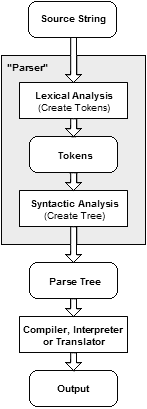
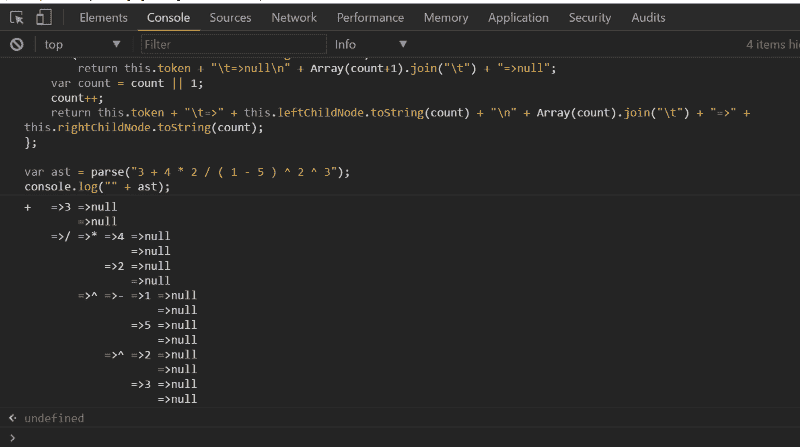

# 用 JavaScript 解析数学表达式

> 原文：<https://www.freecodecamp.org/news/parsing-math-expressions-with-javascript-7e8f5572276e/>

作者:Shalvah

# 用 JavaScript 解析数学表达式


不久前，我写了一篇关于用 Javascript 作为语言选择对数学表达式进行符号化的文章。我在那篇文章中构建的记号赋予器是我寻求使用 Javascript 或任何其他语言呈现和求解数学表达式的第一部分。在本文中，我将介绍如何构建下一个组件:解析器。

解析器的工作是什么？很简单。它解析表达式。(咄。)好吧，其实，[维基百科](https://en.wikipedia.org/wiki/Parsing#Parser)有一个很好的答案:

> 解析器是一种软件组件，它获取输入数据(通常是文本)并构建数据结构(通常是某种解析树、抽象语法树或其他层次结构)，给出输入的结构化表示，并在该过程中检查语法是否正确。解析之前或之后可以有其他步骤，或者这些步骤可以合并成一个步骤。解析器之前通常有一个单独的词法分析器，它从输入字符序列中创建标记

所以，本质上，这就是我们想要达到的目标:

```
math expression => [parser] => some data structure (we'll get to this in a bit)
```



Something like this (source: [codeproject.com)](https://www.codeproject.com/Articles/50377/Create-Your-Own-Programming-Language)

让我们稍微向前跳一下:“……解析器之前通常有一个单独的词法分析器，它从输入字符序列中创建标记”。这是我们之前构建的记号赋予器。因此，我们的解析器不会接收原始的数学表达式，而是接收一个令牌数组。所以现在，我们有:

```
math expression => [tokenizer] => list of tokens => [parser] => some data structure
```

对于记号赋予器，我们必须手动提出算法。对于解析器，我们将实现一个已经存在的算法，[调车场算法。](https://en.wikipedia.org/wiki/Shunting-yard_algorithm)还记得上面的“某数据结构”吗？有了这个算法，我们的解析器可以给我们一个数据结构，称为抽象语法树(AST)或表达式的替代表示，称为反向波兰表示法(RPN)。

### 反向波兰符号

我从 RPN 开始。再次从[维基百科](https://en.wikipedia.org/wiki/Reverse_Polish_notation)，RPN 是“一种数学符号，其中**每个操作符跟随其所有操作数**”。RPN 不是 3+4，而是 3+4。很奇怪，我知道。但规则是，运算符必须在所有操作数的之后**到来。**

当我们看一些更复杂的例子时，请记住这条规则。还要记住，一个操作的操作数可以是前一个操作的结果)。

```
Algebraic: 3 - 4                        RPN: 3 4 -
```

```
Algebraic: 3 - 4 + 5                    RPN: 3 4 - 5 +
```

```
Algebraic: 2^3                          RPN: 2 3 ^
```

```
Algebraic: 5 + ((1 + 2) × 4) − 3        RPN: 5 1 2 + 4 * + 3 -
```

```
Algebraic: sin(45)                      RPN: 45 sin
```

```
Algebraic: tan(x^2 + 2*x + 6)           RPN: x 2 ^ 2 x * + 6 + tan
```

因为运算符必须跟在其操作数之后，所以 RPN 也被称为*后缀记号*，我们的“常规”代数记号被称为*中缀*。

在 RPN 中如何评价一个表达式？我用了一个简单的算法:

> 从左到右阅读所有的记号，直到你看到一个操作符或函数。知道操作符/函数接受 n 个*参数(例如，for +，*n*= 2；对于* cos() *，* n *= 1)，用运算符/函数对前面最后的* n *个实参求值，用结果全部替换(运算符/函数+操作数)。像以前一样继续，直到没有需要读取的操作符/函数。唯一剩下的(文字或变量)令牌是你的答案。*

(这是一个简化的算法，假设表达式有效。表达式无效的几个标志是，如果你在末尾还有一个以上的记号，或者如果剩下的最后一个记号是一个操作符/函数。)

因此，对于像 5 1 2 + 4 * + 3 这样的情况:

```
read 5read 1read 2read +. + is an operator which takes 2 args, so calculate 1+2 and replace with the result (3). The expression is now 5 3 4 * + 3 -read 4read *. * is an operator which takes two args, so calculate 3*4 and replace with the result, 12\. The expression is reduced to 5 12 + 3 -read +. + is an operator which takes two args, so calculate 5+12, replace by the result, 17\. Now, we have 17 3 -read 3read -. - is an operator which takes two args, so calculate 17-3\. The result is 14.
```

希望你在我的 RPN 速成课上得了 A。真的吗？好了，我们继续。

### 抽象语法树

Wikipedia 在这里的定义可能对我们大多数人没有太大帮助:“用编程语言编写的源代码的抽象语法结构的树表示。”对于这个用例，我们可以把 AST 想象成一个数据结构，它表示表达式的数学结构。这是见多识广，我们来画个大概的图。我将从简单表达式 3+4 的 AST 开始:

```
 [+] /   \[3] [4]
```

每个`[]`代表树中的一个节点。所以你一眼就可以看出，这两个记号是由一个+操作符连接在一起的。

更复杂的表达式 5+((1+2)* 4)3:

```
 [-]          /   \        [+]    \___[3]          /  \ [5]__/   [*]         /   \        [+]  [4]       /   \       [1]  [2]
```

啊，一个可爱的小语法树。它完美地连接了所有的令牌和操作符。可以看到，计算这个表达式要容易得多——只需沿着树走就行了。

那么，为什么 AST 有用呢？它帮助您正确地表示表达式的逻辑和结构，使表达式更容易计算。例如，为了评估上面的表达式，在我们的后端，我们可以这样做:

```
result = binaryoperation(+, 1, 2)result = binaryoperation(*, result, 4)result = binaryoperation(+, 5, result)result = binaryoperation(-, result, 3)return result
```

换句话说，对于评估器/编译器/解释器遇到的每个操作符(或函数)节点，它检查有多少个分支，然后用操作符评估所有这些分支的结果。

好了，速成班结束了，现在回到我们的解析器。我们的解析器将把(标记化的)表达式转换成 RPN，然后转换成 AST。所以让我们开始实施吧。

### 调车场算法

下面是完整算法的 RPN 版本(来自我们的朋友 Wikipedia )并根据我们的标记器进行了修改:

> *当有令牌要读取时:*

> *1。读取令牌。姑且称之为`t`*

> *2。如果`t`是文字或变量，则将其推送到输出队列。*

> *3。如果`t`是一个函数，将它压入堆栈。*

> *4。如果`t`是一个函数参数分隔符(一个逗号)，将操作符从堆栈中弹出到输出队列中，直到堆栈顶部的标记是一个左括号。*

> *5。如果`t`是操作员:*

> *a .当操作符栈顶有一个操作符标记`o`，或者`t`是左结合的，优先级小于等于`o`，或者`t`是右结合的，优先级小于`o`，将`o`弹出操作符栈，放到输出队列；*

> 在迭代结束时，将`t`推到操作符堆栈上。

> *6。如果令牌是一个左括号，把它推到堆栈上。*

> *7。如果令牌是右括号，将操作符从堆栈中弹出到输出队列中，直到堆栈顶部的令牌是左括号。然后从堆栈中弹出左括号，但不要放到输出队列中。*

> *8。如果栈顶的令牌是一个函数，将它放入输出队列。*

> 当没有更多的令牌要读取时，将堆栈上的任何操作符令牌弹出到输出队列中。

> *退出。*

(补充说明:如果您阅读了以前的文章，我已经更新了可识别标记的列表，以包括函数参数分隔符，也称为逗号)。

上面的算法假设表达式是有效的。我这样做是为了在文章的上下文中容易理解。可以在维基百科上查看完整算法[。](https://en.wikipedia.org/wiki/Shunting-yard_algorithm)

你会观察到一些事情:

*   我们需要两个数据结构:一个**栈**保存函数和操作符，一个**队列**用于输出。如果您不熟悉这两种数据结构，这里有一个入门指南:如果您想从堆栈中检索一个值，您可以从最后一个放入的值开始，而对于队列，您可以从第一个放入的值开始。

```
// we'll use arrays to represent both of themvar outQueue=[];var opStack=[];
```

*   我们需要知道操作符的结合性。[结合律](https://en.wikipedia.org/wiki/Operator_associativity)简单地说就是在没有括号的情况下，包含几个同类运算的表达式的组合顺序。例如，2 + 3 + 4 从左到右进行规范化计算(2+ 3 =5，然后 5 + 4 =9)，因此+具有左结合性。相比之下，2 ^ 3 ^ 4，这是评估为 2 ^81，而不是 8 ^4.因此^具有右结合律。我们将在 Javascriptobject 中封装操作符的关联性:

```
var assoc = {  "^" : "right",  "*" : "left",  "/" : "left",  "+" : "left",  "-" : "left" };
```

*   我们还需要知道操作符的**优先级**。[优先级](https://en.wikipedia.org/wiki/Order_of_operations)是分配给操作符的一种排序，所以如果它们出现在同一个表达式中，我们可以知道它们应该以什么顺序被求值。具有较高优先级的运算符首先被求值。例如，*的优先级高于+，所以 2 + 3 * 4 的计算结果是 2 + 12，而不是 5 * 4，除非使用了括号。+和–具有相同的优先级，因此 3+5–2 可以被计算为 8–2 或 3+3。同样，我们将把运算符优先级打包到一个对象中:

```
var prec = {  "^" : 4,  "*" : 3,  "/" : 3,  "+" : 2,  "-" : 2 };
```

现在，让我们更新我们的`Token`类，这样我们可以通过方法轻松地访问优先级和结合性:

```
Token.prototype.precedence = function() {  return prec[this.value]; };  Token.prototype.associativity = function() {  return assoc[this.value]; };
```

*   我们需要一个允许我们**查看堆栈中的**(检查顶部的元素而不移除它)和一个允许我们**从堆栈中弹出**(检索并移除顶部的项目)的方法。幸运的是，Javascript 数组已经有了一个`pop()`方法，所以我们需要做的就是实现一个`peek()`方法。(记住，对于堆栈，顶部的元素是我们最后添加的。)

```
Array.prototype.peek = function() {  return this.slice(-1)[0]; //retrieve the last element of the array };
```

这就是我们所拥有的:

```
function tokenize(expr) {  ...   // just paste the tokenizer code here}
```

```
function parse(inp){ var outQueue=[]; var opStack=[];
```

```
Array.prototype.peek = function() {  return this.slice(-1)[0]; };
```

```
var assoc = {  "^" : "right",  "*" : "left",  "/" : "left",  "+" : "left",  "-" : "left" };
```

```
var prec = {  "^" : 4,  "*" : 3,  "/" : 3,  "+" : 2,  "-" : 2 };
```

```
Token.prototype.precedence = function() {  return prec[this.value]; };  Token.prototype.associativity = function() {  return assoc[this.value]; };
```

```
 //tokenize var tokens=tokenize(inp);
```

```
 tokens.forEach(function(v) {   ...   //apply the algorithm here });
```

```
 return outQueue.concat(opStack.reverse());  // list of tokens in RPN}
```

我不会深究算法的实现，以免让你厌烦。这是一项非常简单的任务，实际上是将算法逐字翻译成代码，所以在一天结束时，我们会看到:

`toString`函数只是将我们的 RPN 令牌列表格式化为可读格式。

我们可以测试我们的中缀到后缀解析器:

```
var rpn = parse("3 + 4 * 2 / ( 1 - 5 ) ^ 2 ^ 3");console.log(toString(rpn));
```

输出:

```
3 4 2 * 1 5 - 2 3 ^ ^ / +
```

RPN！！

### 是时候种树了

现在，让我们修改我们的解析器，使它返回一个 AST。

要生成 AST 而不是 RPN，我们需要做一些修改:

*   我们将创建一个对象来表示 AST 中的一个节点。每个节点有一个值和两个分支(可能是`null`):

```
function ASTNode(token, leftChildNode, rightChildNode) {   this.token = token.value;   this.leftChildNode = leftChildNode;   this.rightChildNode = rightChildNode;}
```

*   我们要做的第二件事是将输出数据结构改为堆栈。虽然实际的代码只是将行`var outQueue = []`改为`var outStack = []`(因为它仍然是一个数组)，但关键的变化在于我们对这个数组的理解和处理。

现在，我们的中缀到 AST 算法将如何运行？基本上，相同的算法，有一些修改:

1.  我们没有将文字或变量令牌推送到我们的`outQueue`上，而是将一个新节点推送到我们的`outStack`上，这个新节点的值就是令牌，它的分支是`null`
2.  我们没有从`opStack`中弹出一个操作符/函数令牌，而是用一个值为令牌的单个节点替换了`outStack`上的顶部两个节点，并将这两个节点作为其分支。让我们创建一个这样的函数:

```
Array.prototype.addNode = function (operatorToken) {  rightChildNode = this.pop();  leftChildNode = this.pop();  this.push(new ASTNode(operatorToken, leftChildNode, rightChildNode)); }
```

3.我们的解析器现在应该返回一个节点，即 AST 顶部的节点。它的两个分支将包含两个子节点，子节点的分支将包含子节点，以此类推，以递归方式进行。例如，对于像 3+4 * 2/(1–5)^ 2 ^ 3 这样的表达式，我们希望输出节点的结构是这样的(水平形式):

```
+ => 3 => null       => null  => / => * => 4 => null                 => null            => 2 => null                 => null       => ^ => - => 1 => null                      => null                 => 5 => null                      => null            => ^ => 2 => null                      => null                 => 3 => null                      => null
```

在上图中，= >表示节点的分支(顶部节点是左分支，底部节点是右分支)。每个节点有两个分支，树末端的节点都有它们的指向

因此，如果我们把所有这些放在一起，下面是我们得出的代码:

如果我们演示一下:

```
//a little hack I put together so it prints out in a readable formASTNode.prototype.toString = function(count) {   if (!this.leftChildNode && !this.rightChildNode)     return this.token + "\t=>null\n" + Array(count+1).join("\t") + "=>null";   var count = count || 1;   count++;   return this.token + "\t=>" + this.leftChildNode.toString(count) + "\n" + Array(count).join("\t") + "=>" + this.rightChildNode.toString(count);};
```

```
var ast = parse("3 + 4 * 2 / ( 1 - 5 ) ^ 2 ^ 3");console.log("" + ast);
```

结果是:



*Oh, beautiful tree!*

慢慢地，但肯定地，我们越来越接近理解是什么让编译器和解释器运行！不可否认，现代编程语言及其工具包的工作比我们到目前为止所看到的要复杂得多，但是我希望这是对它们的一个易于理解的介绍。正如许多人指出的那样，有一些工具可以自动生成标记化器和解析器，但是了解一些东西实际上是如何工作的通常会更好。

我们在本文和以前的文章中涉及的概念是计算机科学和语言理论领域中非常有趣的话题。关于它们，我还有很多要学习，如果你对它们感兴趣，我鼓励你继续研究。给我写封短信让我知道你的进展。和平！