# 使用自然语言处理比较巴西和美国的大学论文

> 原文：<https://www.freecodecamp.org/news/comparing-brazilian-and-us-university-theses-using-natural-language-processing-47196a2f9d64/>

作者德博拉·梅斯基塔

# 使用自然语言处理比较巴西和美国的大学论文


人们更有可能认为一流大学的学生写的论文比低(或没有)地位大学的学生写的论文更好。

但是作品有哪些不同呢？非名牌大学的学生怎样做才能写出更好的作品，变得更有名？

我很想回答这些问题，所以我决定只探索**两件事** **件事**:作品的主题和它们的性质。衡量一所大学的质量是一件非常复杂的事情，这不是我的目标。我们将使用自然语言处理来分析一些本科论文。我们将使用 tf-idf 提取关键词，并使用潜在语义索引(LSI)对论文进行分类。

### 数据

我们的数据集包含来自位于巴西的[伯南布哥联邦大学](https://en.wikipedia.org/wiki/Federal_University_of_Pernambuco) (UFPE)和位于美国的[卡耐基梅隆大学](https://en.wikipedia.org/wiki/Carnegie_Mellon_University)的本科计算机科学论文摘要。为什么选择卡内基梅隆大学？因为这是唯一一所我能找到本科毕业学生论文清单的大学。

《泰晤士报高等教育世界大学排名》称卡耐基梅隆大学的计算机科学项目排名第六，而 UFPE 大学不在此列。卡耐基梅隆大学在世界大学排名中位列第 23 位，UFPE 大学在第 801 位左右。

所有作品都是在 2002 年至 2016 年之间制作的。每篇论文包含以下信息:

*   论文标题
*   论文摘要
*   论文年份
*   论文发表的大学

卡耐基梅隆大学的论文可以在这里找到，伯南布哥联邦大学的论文可以在这里找到。

### 第一步——调查论文的主题

#### 提取关键词

为了得到论文的主题，我们将使用一个著名的算法 tf-idf。

#### tf-idf

tf-idf 做的是惩罚**在一个文档中大量出现**同时**在其他文档中大量出现**的词。如果发生这种情况，这个词就不是描述这篇文章的好选择(因为这个词也可以用来描述*所有的*文章)。让我们用[一个例子](https://en.wikipedia.org/wiki/Tf%E2%80%93idf)来更好地理解这一点。我们有两份文件:

文件 1:

```
| Term   | Term Count | |--------|------------| | this   |     1      | | is     |     1      | | a      |     2      | | sample |     1      |
```

和文档 2:

```
| Term    | Term Count | |---------|------------| | this    |     1      | | is      |     1      | | another |     2      | | example |     3      |
```

首先让我们看看发生了什么。单词 *this* 在两个文档中出现 1 次。这可能意味着这个词是中性的，对吗？

另一方面，单词*示例*在文档 2 中出现 3 次，在文档 1 中出现 0 次。有意思。

现在让我们应用一些数学知识。我们需要计算两件事:TF(术语频率)和 IDF(逆文档频率)。

TF 的等式为:

```
TF(t) = (Number of times that term t appears in the document) / (Total number of terms in the document)
```

所以对于术语*这个*和*的例子*，我们有:

```
TF('this',   Document 1) = 1/5 = 0.2TF('example',Document 1) = 0/5 = 0
```

```
TF('this',   Document 2) = 1/7 = 0.14TF('example',Document 2) = 3/7 = 0.43
```

IDF 的等式是:

```
IDF(t) = log_e(Total number of documents / Number of documents where term t is present)
```

为什么我们在这里使用对数？因为 tf-idf 是一个[启发式](https://en.wikipedia.org/wiki/Heuristic)。

> 直觉是，在许多文档中出现的查询术语不是好的鉴别器，并且应该给予比在少数文档中出现的查询术语更低的权重，并且该度量是这种直觉的启发式实现。斯蒂芬·罗伯逊

正如 [usεr11852](https://stats.stackexchange.com/users/11852/us%ce%b5r11852) 这里的[所解释的](https://stats.stackexchange.com/questions/161640/understanding-the-use-of-logarithms-in-the-tf-idf-logarithm):

> 所强调的方面是术语或文档的相关性不随术语(或文档)频率成比例增加。因此，使用次线性函数(对数)有助于消除这种影响。…非常大或非常小的值(例如非常罕见的单词)的影响也会被分摊。— [usεr11852](https://stats.stackexchange.com/questions/161640/understanding-the-use-of-logarithms-in-the-tf-idf-logarithm)

使用 IDF 的等式，我们得到:

```
IDF('this',   Documents) = log(2/2) = 0
```

```
IDF('example',Documents) = log(2/1) = 0.30
```

最后，TF-IDF:

```
TF-IDF('this',   Document 2) = 0.14 x 0 = 0TF-IDF('example',Document 2) = 0.43 x 0.30 = 0.13
```

我在每篇论文中使用了 tf-idf 算法中得分最高的 4 个单词。我使用了来自 [scikit-learn](http://scikit-learn.org/stable/) 的 CountVectorizer 和 TfidfTransformer。

你可以在这里看到代码为 [的 **Jupyter 笔记本。**](https://github.com/dmesquita/tdcfloripa2017/blob/master/extract_keywords.ipynb)

每篇论文有 4 个关键词，我使用了 [WordCloud](https://github.com/amueller/word_cloud) 库来可视化每个大学的单词。

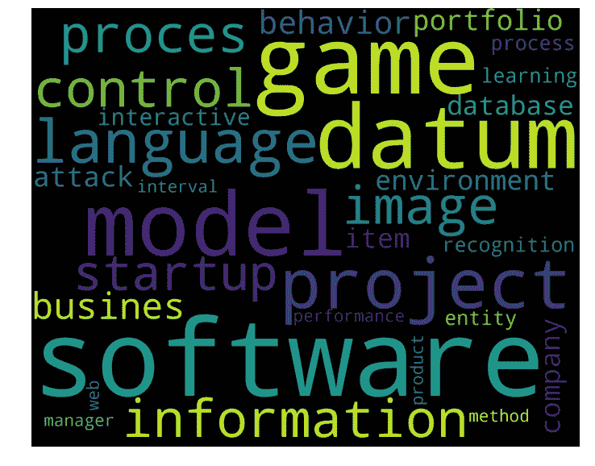

Keywords for UFPE


Keywords for Carnegie Mellon

### 主题建模

我用来探索两所大学论文主题的另一个策略是使用潜在语义索引的主题建模。

#### 潜在语义索引

该算法从 tf-idf 获取数据，并使用矩阵分解对主题中的文档进行分组。我们将需要一些线性代数来理解这一点，所以让我们开始。

#### 奇异值分解

首先，我们需要定义如何进行矩阵分解。我们将使用[奇异值分解](https://en.wikipedia.org/wiki/Singular_value_decomposition) (SVD)。给定一个矩阵 *M* 的维数*M×n*， *M* 可以描述为:

```
M = UDV*
```

其中 *U* 和 *V** 为[正交基](https://en.wikipedia.org/wiki/Orthonormal_basis) ( *V** 代表矩阵 *V* 的转置)。如果我们有两个东西(正规的+正交的)，标准正交基就是结果:

*   当所有向量的长度都是 1 时
*   当所有矢量相互正交时(它们形成 90 度角)

*D* 是对角矩阵(主对角线外的条目全为零)。

为了了解所有这些是如何一起工作的，我们将使用大卫·奥斯廷的这篇文章中精彩的几何解释。

假设我们有一个矩阵:

```
M = | 3 0 |    | 0 1 |
```

我们可以取平面中的一个点( *x* ， *y)* ，并使用矩阵乘法将其转换为另一个点:

```
| 3 0 |  . | x | = | 3x || 0 1 |    | y |   | y  |
```

这种转换的效果如下所示:

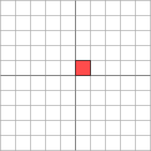

x,y before. Source: [http://www.ams.org/samplings/feature-column/fcarc-svd](http://www.ams.org/samplings/feature-column/fcarc-svd)


x,y after. Source: [http://www.ams.org/samplings/feature-column/fcarc-svd](http://www.ams.org/samplings/feature-column/fcarc-svd)

我们可以看到，平面被水平拉伸了 3 倍，而垂直方向没有变化。

现在，如果我们取另一个矩阵， *M':*

```
M' = | 2 1 |     | 1 2 |
```

效果是:


x,y before. Source: [http://www.ams.org/samplings/feature-column/fcarc-svd](http://www.ams.org/samplings/feature-column/fcarc-svd)

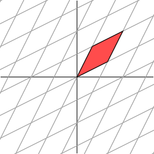

x,y after. Source: [http://www.ams.org/samplings/feature-column/fcarc-svd](http://www.ams.org/samplings/feature-column/fcarc-svd)

如何简单地描述这种变换的几何效果还不太清楚。然而，让我们将网格旋转 45 度，看看会发生什么。

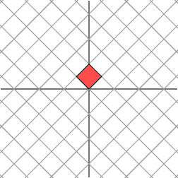

x,y before, in a grid through a 45 degree angle. Source: [http://www.ams.org/samplings/feature-column/fcarc-svd](http://www.ams.org/samplings/feature-column/fcarc-svd)

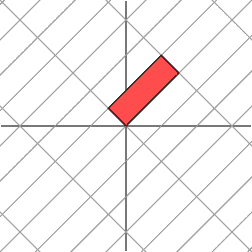

x,y after, in a grid through a 45 degree angle. Source: [http://www.ams.org/samplings/feature-column/fcarc-svd](http://www.ams.org/samplings/feature-column/fcarc-svd)

我们现在看到，这个新网格的变换方式与原始网格被对角矩阵变换的方式相同:**网格在一个方向上被拉伸了 3 倍**。

现在让我们使用一些定义。 *M* 是一个**对角矩阵**(主对角线外的条目都是零) *M* 和*M’*都是 [**对称**](https://en.wikipedia.org/wiki/Symmetric_matrix) (如果我们得到列并把它们作为新的行，我们将得到相同的矩阵)。

乘以一个**对角矩阵**产生一个[缩放](https://en.wikipedia.org/wiki/Scaling_(geometry))效果(通过一个比例因子放大或缩小对象的线性变换)。

> 我们看到的效果(对于 *M* 和*M’*都是相同的结果)是一种非常特殊的情况，这是由于矩阵*M’*是对称的。如果我们有一个对称的 2×2 矩阵，那么我们总是可以在域中旋转网格，这样矩阵就可以在两个方向上拉伸或者反射。换句话说，对称矩阵的行为类似于对角矩阵。大卫·奥斯汀

> “这是 2 x 2 矩阵奇异值分解的几何本质:对于任何 2 x 2 矩阵，我们可以找到一个正交网格，它被转换为另一个正交网格。”大卫·奥斯汀

我们将使用向量来表达这个事实:通过适当选择正交单位向量 *v1* 和 *v2* ，向量 *Mv1* 和 *Mv2* 是正交的。

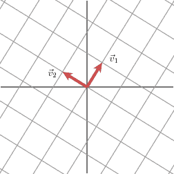

v1 and v2 in the original grid. Source: [http://www.ams.org/samplings/feature-column/fcarc-svd](http://www.ams.org/samplings/feature-column/fcarc-svd)

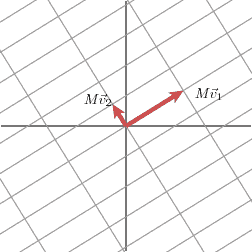

Mv1 and Mv2 in the new grid. Source: [http://www.ams.org/samplings/feature-column/fcarc-svd](http://www.ams.org/samplings/feature-column/fcarc-svd)

我们将用 *n1* 和 *n2* 来表示 *Mv1* 和 *Mv2* 方向的单位向量。由σ1 和σ2 表示的 *Mv1* 和 *Mv2* 的长度描述了网格在这些特定方向上拉伸的量。

现在我们有了几何本质，让我们回到公式:

```
M = UDV*
```

*   *U* 是一个矩阵，其列是矢量 *n1* 和 *n2* ( **新网格的单位矢量，**在 *v1* 和 v2 方向)
*   *D* 是对角矩阵，其元素为σ1 和σ2 ( **每个向量的长度**
*   *V** 是一个矩阵，它的列是 *v1* 和 *v2* ( **“旧”网格的向量**

现在我们对 SVD 的工作原理有了一点了解，让我们看看 LSI 是如何利用这种技术对文本进行分组的。正如伊恩·索伯罗夫在他的信息检索课程[幻灯片](https://www.csee.umbc.edu/~ian/irF02/lectures/12LSI.pdf)中展示的那样:

*   *U* 是用于**转换新文档**的矩阵
*   *D* 是对角矩阵，它赋予**维度**的相对重要性(我们稍后会详细讨论这些维度)
*   *V** 是 *k* 维度中 *M* 的**表示**

为了了解这是如何工作的，我们将使用两个领域(人机交互和图论)的文档标题。这些例子来自论文[潜在语义分析的介绍](http://lsa.colorado.edu/papers/dp1.LSAintro.pdf)。

```
c1: Human machine interface for ABC computer applications c2: A survey of user opinion of computer system response time c3: System and human system engineering testing of EPS
```

```
m1: The generation of random, binary, ordered trees m2: The intersection graph of paths in trees m3: Graph minors: A survey
```

第一步是用每个术语出现的次数创建一个矩阵:

```
| termo     | c1 | c2 | c3 | m1 | m2 | m3 | |-----------|----|----|----|----|----|----|| human     | 1  | 0  | 1  | 0  | 0  | 0  || interface | 1  | 0  | 0  | 0  | 0  | 0  | | computer  | 1  | 1  | 0  | 0  | 0  | 0  | | user      | 0  | 1  | 0  | 0  | 0  | 0  | | system    | 0  | 1  | 2  | 0  | 0  | 0  | | survey    | 0  | 1  | 0  | 0  | 0  | 1  | | trees     | 0  | 0  | 0  | 1  | 1  | 0  | | graph     | 0  | 0  | 0  | 0  | 1  | 1  | | minors    | 0  | 0  | 0  | 0  | 0  | 1  |
```

分解矩阵我们有这个(你可以使用这个[在线工具](http://www.bluebit.gr/matrix-calculator/default.aspx)来应用 SVD):

```
# U Matrix (to transform new documents)
```

```
-0.386  0.222 -0.096 -0.458  0.357 -0.105-0.119  0.055 -0.434 -0.379  0.156 -0.040-0.345 -0.062 -0.615 -0.089 -0.264  0.135-0.226 -0.117 -0.181  0.290 -0.420  0.175-0.760  0.218  0.493  0.133 -0.018  0.044-0.284 -0.498 -0.176  0.374  0.033 -0.311-0.013 -0.321  0.289 -0.571 -0.582 -0.386-0.069 -0.621  0.185 -0.252  0.236  0.675-0.057 -0.382  0.005  0.085  0.453 -0.485
```

给出维度相对重要性的矩阵:

```
# D Matrix (relative importance of dimensions)
```

```
2.672 0.000 0.000 0.000 0.000 0.0000.000 1.983 0.000 0.000 0.000 0.0000.000 0.000 1.625 0.000 0.000 0.0000.000 0.000 0.000 1.563 0.000 0.0000.000 0.000 0.000 0.000 1.263 0.0000.000 0.000 0.000 0.000 0.000 0.499
```

*M* 在 *k* 尺寸中的表示(在这种情况下，我们有 *k* 文件):

```
# V* Matrix (representation of M in k dimensions)
```

```
-0.318 -0.604 -0.713 -0.005 -0.031 -0.153 0.108 -0.231  0.332 -0.162 -0.475 -0.757-0.705 -0.294  0.548  0.178  0.291  0.009-0.593  0.453 -0.122 -0.365 -0.527  0.132 0.197 -0.531  0.254 -0.461 -0.274  0.572-0.020  0.087 -0.033 -0.772  0.580 -0.242
```

好了，我们有矩阵了。但是现在矩阵不是 2×2。我们真的需要这个术语文档矩阵的维数吗？所有维度对于每个术语和每个文档都是重要的特征吗？

让我们回到大卫·奥斯汀的例子。假设现在我们有 *M''* :

```
M'' = | 1 1 |      | 2 2 |
```

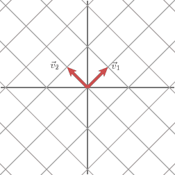

x,y before

现在 *M''* **不再是对称矩阵**。对于这个矩阵，σ2 的值为零。在网格上，相乘的结果是:

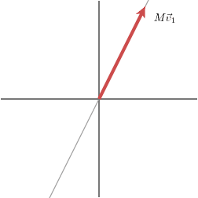

x,y after

我们知道，如果 D 的主对角线上的一个值是零**，则这一项不会出现在 M 的分解中。**

> 这样我们看到 *M* 的*秩*，也就是线性变换的图像的维数，等于非零值的个数。——[大卫·奥斯丁](http://www.ams.org/samplings/feature-column/fcarc-svd)

LSI 所做的是改变项的维数。

> 在原始矩阵中，项是 k 维的(k 是文档的数量)。新空间具有更低的维度，因此维度现在是倾向于在相同文档中同时出现的术语组。伊恩·索伯罗夫

现在我们可以回到例子。让我们创建一个二维空间。为此，我们将仅使用对角矩阵的两个值 *D* :

```
# D2 Matrix
```

```
2.672 0.000 0.000 0.000 0.000 0.0000.000 1.983 0.000 0.000 0.000 0.0000.000 0.000 0.000 0.000 0.000 0.0000.000 0.000 0.000 0.000 0.000 0.0000.000 0.000 0.000 0.000 0.000 0.0000.000 0.000 0.000 0.000 0.000 0.000
```

正如 [Alex Thomo](http://webhome.cs.uvic.ca/~thomo/) 在[本教程](http://webhome.cs.uvic.ca/~thomo/svd.pdf)中解释的，**术语**由 *U2 x D2* 的行向量表示( *U2* 是只有二维的*U*)**文档**由 *D2 x V2** ( *V2** 是只有二维的 *V** )的列向量表示。我们乘以 *D2* ，因为 *D* 是给出维度相对重要性的对角矩阵，记得吗？

然后我们通过这些乘法来计算每个词和每个文档的坐标。结果是:

```
human     = (-1.031, 0.440)interface = (-0.318, 0.109)computer  = (-0.922, -0.123)user      = (-0.604, -0.232)system    = (-2.031, -0.232) survey    = (-0.759, -0.988)trees     = (-0.035, -0.637)graph     = (-0.184, -1.231) minors    = (-0.152, -0.758)
```

```
c1        = (-0.850, 0.214)c2        = (-1.614, -0.458)c3        = (-1.905, 0.658)m1        = (-0.013, -0.321)m2        = (-0.083, -0.942)m3        = (-0.409, -1.501)
```

使用 matplotlib 对此进行可视化，我们有:

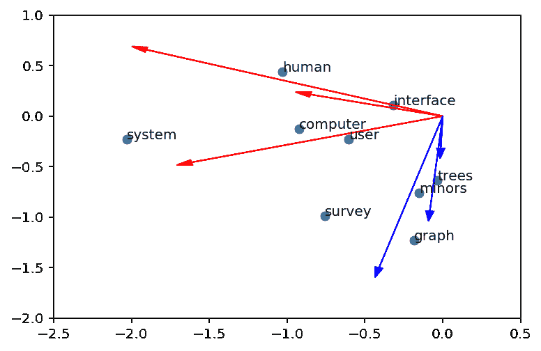

The result for each term and each document

很酷，对吧？红色的向量是人机交互文档，蓝色的向量是图论文档。

维数的选择呢？

> LSI 中保留的维数是一个经验问题。因为基本原理是原始数据不应该被完美地再生，而是应该找到一个最佳维度，这将导致对基本关系的正确归纳，选择一个最简洁地代表原始数据的真实方差的维度的习惯性因素分析方法是不合适的。— [来源](http://lsa.colorado.edu/papers/dp1.LSAintro.pdf)

在降维空间中计算的相似性度量通常(但不总是)是向量之间的余弦。

现在我们可以回到大学论文的数据集。我用的是 [gensim](https://radimrehurek.com/gensim/index.html) 的 [lsi 型号](https://radimrehurek.com/gensim/models/lsimodel.html)。我没有发现这些大学的作品有很多不同之处(所有的似乎都属于同一个集群)。最能区分大学作品的主题是这个:

```
y topic:[('object', 0.29383227033104375), ('software', -0.22197520420133632), ('algorithm', 0.20537550622495102), ('robot', 0.18498675015157251), ('model', -0.17565360130127983), ('project', -0.164945961528315), ('busines', -0.15603883815175643), ('management', -0.15160458583774569), ('process', -0.13630070297362168), ('visual', 0.12762128292042879)]
```

视觉上我们有:

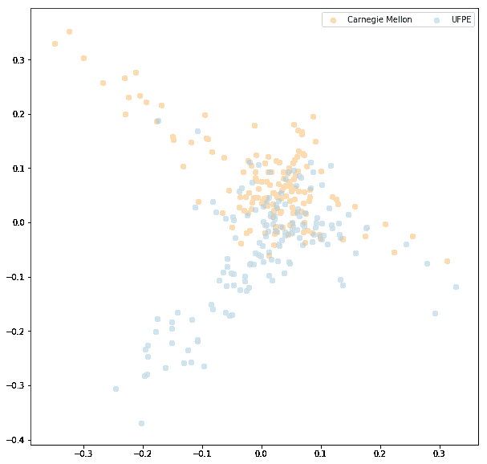

Visualization for topic y

在图像中， *y* 主题位于 y 轴上。我们可以看到，卡耐基梅隆大学的论文更多地与**、【对象】、【机器人】和【算法】**联系在一起，而 UFPE 大学的论文更多地与**、【软件】、【项目】和【商业】**联系在一起。

你可以在这里看到代码为 [的 **Jupyter 笔记本。**](https://github.com/dmesquita/tdcfloripa2017/blob/master/create_clusters.ipynb)

### 步骤 2——调查工程的性质

我总有这样的印象，在巴西，学生们写很多带有文献综述的论文，而在其他大学，他们很少写这样的论文。为了验证，我分析了论文的标题。

通常当一篇论文是一篇文献综述时，标题中会出现“研究”一词。然后，我拿走了所有论文的标题，并检查了每所大学出现次数最多的单词。结果是:

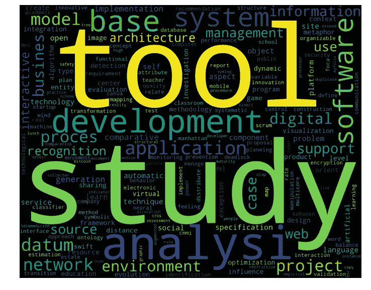

Words from titles of UFPE

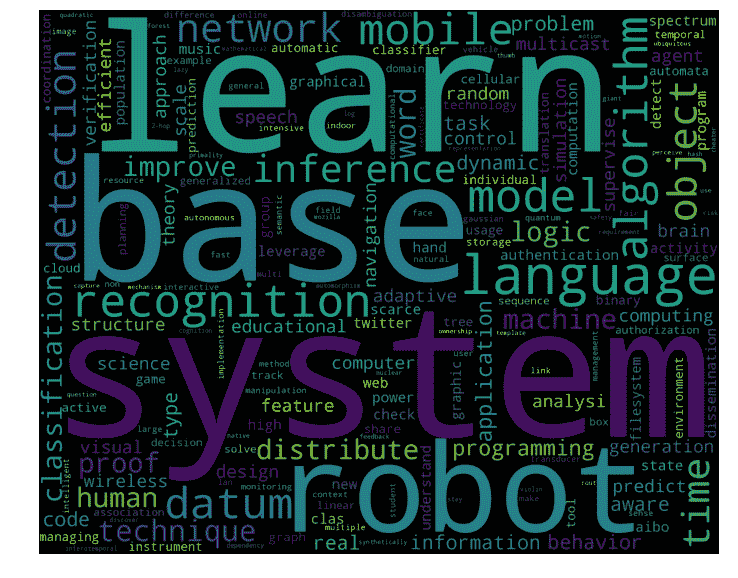

Words from titles of Carnegie Mellon

你可以在这里看到代码为 [的 **Jupyter 笔记本。**](https://github.com/dmesquita/tdcfloripa2017/blob/master/analyze_titles.ipynb)

### 调查的结果

我从这个简单的分析中得到的感觉是，这些作品的主题没有太大的不同。但是可以想象出每个机构的特色。伯南布哥联邦大学制作了更多与**项目和商业**相关的作品，卡耐基梅隆大学制作了更多与**机器人和算法**相关的作品。在我看来，这种专业的差异并不是什么坏事，它只是表明每个大学都在某些领域有所专长。

一个收获是，在巴西，我们需要创作不同的作品，而不仅仅是做文学评论。

我在做分析时意识到一件重要的事情(这并不是来自分析本身的发现)，那就是只有最好的论文是不够的。我开始分析，试图找出*为什么他们的作品比我们的好*以及我们能做些什么让*到达那里*和*变得更出名。*但是我觉得也许有一种方法可以让我们更好地展示我们的工作，并与他们交流更多的知识。原因是因为这可以迫使我们产生更多相关的文章，并根据反馈进行改进。

我也认为这对每个人都有好处，包括大学生和我们这些专业人士。这句话总结得很好:

> “做好人是不够的。为了被发现，你必须是可以被发现的。”— [奥斯汀·克莱恩](https://www.goodreads.com/work/quotes/25771145-show-your-work-10-ways-to-share-your-creativity-and-get-discovered)

就这些了，谢谢你的阅读！

如果您觉得这篇文章很有帮助，请点击？并与朋友分享。关注我，获取更多关于数据科学和机器学习的文章。