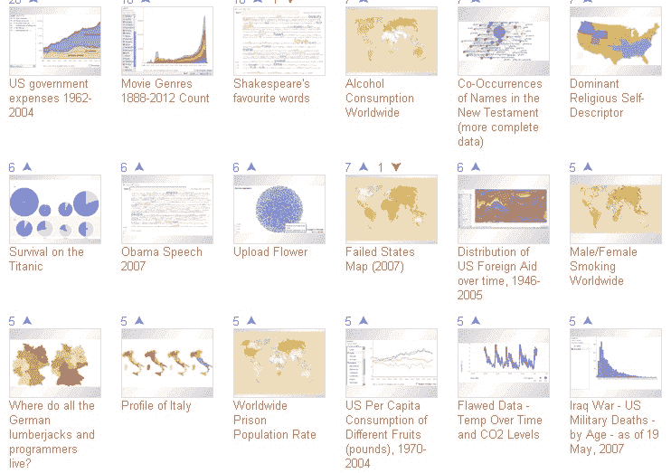
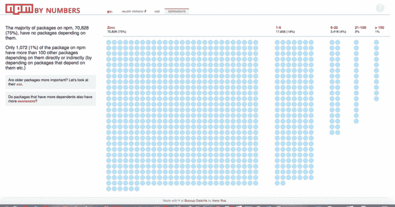
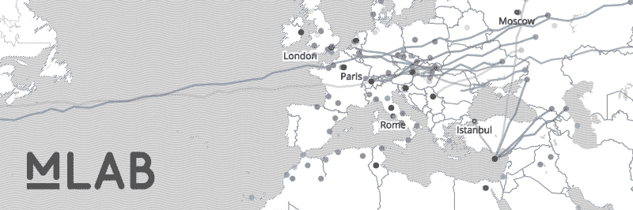
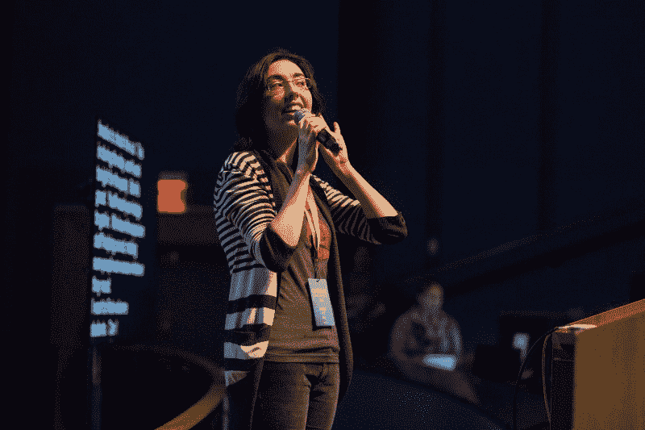
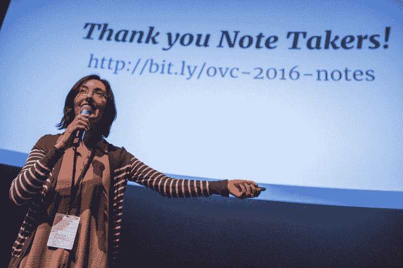
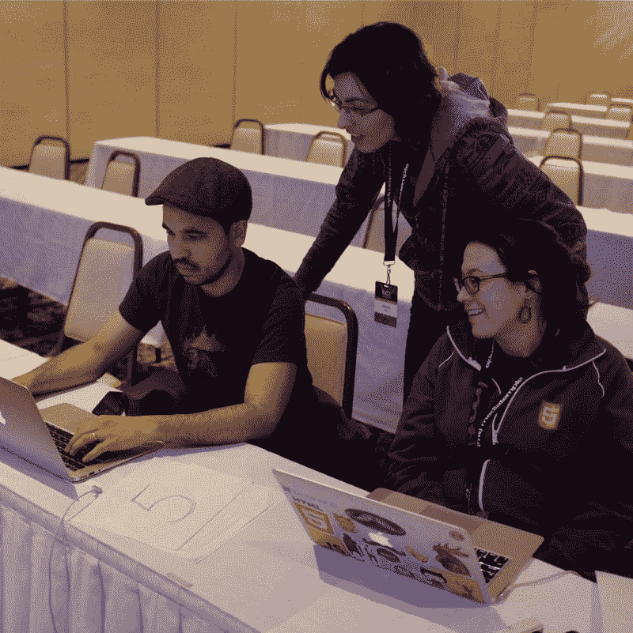
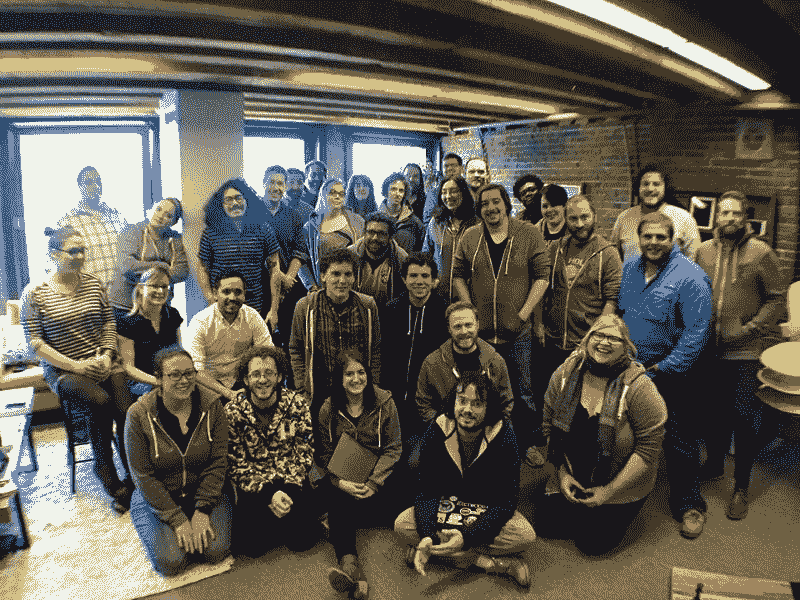

# 电线之间:数据可视化科学家艾琳·罗斯访谈

> 原文：<https://www.freecodecamp.org/news/between-the-wires-an-interview-with-data-visualization-scientist-irene-ros-a0f7d0fcf085/>

薇薇安·克伦威尔

# 电线之间:数据可视化科学家艾琳·罗斯访谈

我采访了艾琳·罗斯(Irene Ros ),她是 T2 大学数据可视化的创始主任，在那里她领导了与谷歌、卫报、世界经济论坛和哈佛医学院林肯中心等合作伙伴的可视化项目。Irene 还是 OpenVis Conf 的创始人和项目联合主席，这是一个为期两天的关于开放网络数据可视化的单场会议，已经进入第五个年头。

*这篇文章最初由[的](http://betweenthewires.org/2017/02/22/irene-ros/)发布在[的](http://betweenthewires.org)网站上，这是一个采访那些构建开发者产品的人的系列。*

#### 告诉我们一点关于你的童年和你在哪里长大的。

> “我是那种喜欢建造玩具屋，但并不真的玩洋娃娃的孩子。”

我出生在乌克兰的基辅。当我六岁的时候，我的父母搬到了以色列，我在那里住了十年。这是一个偶然的举动，但后来我在 16 岁的时候来到了美国。我的父母都工作，所以我大部分时间都是独自一人。

(Irene with Ded Moroz, Russian Santa Claus)

我从很小的时候就喜欢数学和科学，一个人在家的时候会做一些小的科学实验。令人惊讶的是我没有把房子烧掉。我是那种喜欢建造玩具屋，但不喜欢玩洋娃娃的孩子。

#### 告诉我们一点你的第一次编程经历。

我的第一次编程经历是在我九岁的时候。我有一个对电脑很感兴趣的表兄，每次我们去拜访他时，我总是围着他转。我的父母，感谢上帝，他们意识到电脑将会是一件大事，花了一大笔钱，他们几乎没有钱给我买一台。这是在 Windows 出现之前。我只有诺顿指挥官。表哥给了我这本《基础编程》的书，一切就是这么开始的。

我记得我用 BASIC 编写的第一批程序之一。它可以输出生日快乐歌的歌词。我真的很兴奋。

那是我能想到的第一个令人难忘的项目。我在以色列的高中有一个非常棒的科技项目，所以我早在九年级就开始上计算机科学课。这么早开始的结果是，编程成了我的一种思维方式，一种解决问题的方式。它只是一个工具。我很高兴能在早期接触到这些。我想这仍然是我热爱编程的某些方面的原因，比如代码重构、架构和组织。

#### 你是如何开始数据可视化工作的？

我对数据可视化的兴趣始于 Bocoup 之前。

我在马萨诸塞大学阿姆赫斯特分校学习计算机科学，后来作为一名工程师加入了 IBM。我真的很喜欢我的大学经历，但它非常侧重于理论和算法，我没有想到做一些美丽而迷人的东西是计算机科学家的一部分。

2007 年的一天，我碰巧去 IBM 听了一场演讲，主讲人是马丁·瓦滕伯格和 T2，他们在 IBM 研究院的协作用户体验组管理视觉交流实验室。在演讲中，他们展示了这个名为[多只眼睛](http://edutechwiki.unige.ch/en/IBM_Many_Eyes)的项目，这确实是超前的。这就像是数据可视化的 YouTube。你可以上传你的数据并选择一种可视化方法，然后你可以通过给人们发送一个链接来与他们分享。10 年前，它拥有我们对现代系统的一切期望——评论、重新混合、保存和分享特定的状态。

Many Eyes project from IBM, 2017

我被震撼了，因为这是我从未见过的东西。我在 IBM research 与 Martin 和 Fernanda 一起工作了三年，这是我通向数据可视化的大门。我在这个领域是自学的，但是在他们和其他同事的支持下，我学到了很多东西，也很感激他们在我身上投入的时间。

从一开始，我们就在为 web 创造东西，但当时在 IBM 导航开源许可过程是一个挑战(IBM 已经走了很长一段路)。我对浏览开源库、在本地修复问题或编写扩展变得足够舒适，但我还没有完全准备好制作 PRs(那时 Github 几乎不存在)。这似乎是一个为专家保留的遥远世界。我想成为那个专家，并且真的爱上了开源的重要性——它允许我把我的想法带到生活中，我想更多地参与进来。

一天，我在谷歌上搜索“开源波士顿”,出现了 Bocoup。我申请了，现在我在这里。

(趣闻:[http://boazsender . com/2012-10-30-how-bo coup-get-its-name . html](http://boazsender.com/2012-10-30-how-bocoup-got-its-name.html))

#### 五年前的数据可视化是什么样的？

> “尽管‘数据科学’经常被用作流行语，但它通过应用统计分析、预测建模和机器学习等技术，提高了人们对更批判地思考我们的数据的重要性的认识。”

我在 Bocoup 开始的时候， [D3.js 库](https://d3js.org/)还不存在。那是在每个新闻出版物都试图制作互动内容之前，除了纽约时报，它是这方面的真正领导者。

(NPM by numbers by Irene, using d3js. source: [http://npmbynumbers.bocoup.com/](http://npmbynumbers.bocoup.com/))

D3.js 基于我们领域的一本开创性的书，名为[Grammar of Graphics](https://www.amazon.com/Grammar-Graphics-Statistics-Computing/dp/0387245448)，它提供了一种通过原始“组件”分解和组装数据可视化的基本方法。许多成功的可视化库都是建立在这一基本原则之上的，例如 R. D3.js 中的 [ggplot](http://ggplot2.org/) 从根本上改变了这一领域——它使可视化创作者在工作中具有难以置信的创造力，并快速制作交互式内容。

当我开始从事数据可视化工作时，“数据科学”这个术语也不存在。这导致了大量的可视化，显示了数据的基本方面:计数、平均值等。尽管“数据科学”经常被用作流行语，但它通过应用统计分析、预测建模和机器学习等技术，提高了人们对更批判地思考我们的数据的重要性的认识。数据可视化是这一转变中的一个重要部分，因为它支持数据探索并改善了最终结果的沟通——我们对数据了解得越多，我们就能更好地提出问题。问题越有趣，答案越有趣，我们的视觉化也就越有趣。我要说的是，在这一点上，没有对统计学有一些基本了解的人不应该创建数据可视化。

#### 你在 Bocoup 做过的最激动人心的数据可视化项目是什么？

有这么多！

我最喜欢的是最近与[测量实验室](https://www.measurementlab.net/)和谷歌开源研究团队的合作。[测量实验室可视化](https://bocoup.com/work/measurement-lab)提供了一种探索全球最大的开放互联网性能数据集合的方式。这些数据是免费开放的，包括全球最大的开放互联网性能数据集。Measurement Lab 还提供可视化工具，因此人们可以跨时间和空间了解互联网性能。我们与他们合作开发他们的下一代可视化工具。

([https://bocoup.com/work/measurement-lab](https://bocoup.com/work/measurement-lab))

我喜欢他们的使命和他们令人惊叹的数据集，这可以追溯到 2009 年，并提供令人难以置信的国际报道。它的工作方式是任何人都可以通过他们的网站进行测试。如果你在美国和其他几个国家，如果你搜索“速度测试”，你实际上会得到一个界面，让你马上运行一个测量实验室测试。在这一点上，他们的方法比大多数其他速度测试更有效、更准确。

我们真的很兴奋，因为他们找到我们说，“我们有这个庞大的数据集，我们希望人们以一种非常动态的方式探索它，他们希望能够查看不同的时间跨度、位置或服务提供商。”这是一个非常有趣的设计问题，因为有如此多不同类型的利益相关者——Measurement Lab 的数据已经被政治倡导者和互联网研究人员使用，他们的目标非常不同。因为它太大了，人们很难处理原始数据——他们需要基础设施来处理它，还需要大量的技术知识。我们很感谢赞助这个项目的谷歌，它让我们可以无限制地访问他们的基础设施，进行数以亿计的测试，并把它们变成有用的、可在网上消费的东西。

> “我认为它真的抓住了我们媒体文化的很多方面，我们如何看待性别，以及我们选择表现性别的方式。”

我不得不提到的另一个项目叫做 [Stereotropes](http://stereotropes.bocoup.com/) 。这是我们几年前做的一个团队激情项目。我们过去(现在仍然)对文本分析和可视化非常感兴趣。我们遇到了一个名为[电视比喻](http://tvtropes.org/)的社区，它对电视和电影中的比喻进行分类和定义。最有趣的是，他们有两个主要与男性和女性角色相关的比喻列表，然后我们通过这些比喻描述中的形容词使用，试图更好地理解我们的文化是如何定义男性和女性角色的。

我们建立了一个非常有趣的探索工具，叫做 Stereotropes，让你探索这些比喻。例如，人们用“漂亮”这样的词来描述很多女性角色，或者用“强壮”来描述很多男性角色。我认为它真的捕捉到了很多关于我们的媒体文化，我们如何看待性别，以及我们选择表现性别的方式。

(source: [http://stereotropes.bocoup.com/](http://stereotropes.bocoup.com/))

我真的很喜欢这个项目。我们试图鼓励关于性别代表性的客观对话。我非常关心工程学中的女性这个主题。我们真的想为我们的观众提供一个工具，他们可以探索自己，看看这些差异和相似之处！

我们设法让许多与工程或数据可视化无关的人参与进来。这是我一直为之奋斗的事情——让真正不懂技术的人关心我做了什么。

#### 你在 5 年前创建了 OpenVis Conf，你能告诉我们关于它的情况吗？

OpenVis Conf 很大程度上是对我进入这个领域的个人经历的回应。因为是自学成才，所以经历了一些我觉得其他人没有必要经历的挣扎。例如，我看到了许多由我钦佩的人制作的美丽作品，但不知道如何制作。我很受启发，但也不确定如何创作出类似的好作品。我创建 OpenVis Conf 的目标是创建一个体现教学精神的社区空间——我们演讲者的每一次演讲都是为了教会我们的观众一些东西。我们希望人们带着他们知道如何进一步追求的 100 个想法离开会议。这些年来，我们的演讲者真正体现了这种价值观，我真的为我们制作的节目感到骄傲。

(Irene at OpenVis Conf)

我也为我们每年的多元化努力感到骄傲。我本人、我的项目联合主席 Lynn Cherny 和我们的项目委员会花了几十个小时从我们的社区收集和审查演讲。我们非常努力地创造一个多元化的演员阵容，涵盖多元化的许多定义:年龄、性别、种族和性取向。这是一项具有挑战性的任务，但五年来，我可以肯定地说，这只会让我们的项目一年比一年强。当我看到全是白人的&男性在其他会议上排队时，我会退缩，因为我知道他们根本没有做好工作。

今年是我们的五周年纪念，我们将举办一个盛大的庆祝活动。我们刚刚发布了我们的节目，我们真的迫不及待地想看到令人难以置信的阵容。

[**OpenVisConf 2017**](https://openvisconf.com/)
[*为期两天的关于 web 可视化数据实践的单赛道会议*openvisconf.com](https://openvisconf.com/)

#### 你能谈谈你经历过的一段困难时期，以及你是如何克服的吗？

> “加班，尤其是现在，我意识到那是一种特权——能够扔掉你的工作。我意识到，有时候创造一件东西只是朝着创造另一件东西又迈进了一步。”

作为一名年轻的开发人员，我遇到的最大的困难之一是，我非常依恋我的代码。我觉得我的代码和我做的东西是我的反映。我没能客观评价:“这个东西好还是这个东西不好？”

当时我的团队领导做了一件了不起的工作，帮助我解决了这个问题。我会做一些原型，然后花几个星期的时间做，然后他们会说:“我不认为这是可行的，让我们试试别的东西。”我会很受伤，我会把它当成个人的，感觉很失败。

加班，尤其是现在，我意识到那是一种特权——能够扔掉你的工作。我意识到，有时候创造一件东西只是迈向创造另一件东西的又一步。我最喜欢的事情就是制作一些东西的原型，然后有人指出它不好，因为他们看到了一些我看不到的东西。因此，我要去改进它，让它变得更好。作为一名开发人员，很难走出你的幻想，不把你的代码视为珍贵的东西，但代码只是一种工具，可以用来构建有用的东西或解决问题。就其本身而言，这没什么。

我真的很喜欢把设计活动作为我们在 Bocoup 工作的项目的一部分，因为产生许多想法，然后把它们扔出去，这真的很重要。我经常扔掉代码。我已经对自己编写的代码产生了某种程度的依恋。如果有人来找我说，“有更好的方法来做这件事。”我只会说，“谢谢”，并且很乐意重新开始或者重构我的代码。

这是一个痛苦的教训，但它真的把我从一套工具和一套实践中解放了出来。当我可以放手的时候，我真的成长为一名开发人员，尤其是在寻求帮助和反馈的时候。

有趣的是，我经常发现工程新手问的问题比那些已经在这个领域工作很久的人少得多。现在我可以一天问我的队友五个问题，因为我正在做一些事情，他们会花两秒钟给我一个答案，我可以继续我的生活。新的工程师往往需要更长的时间来真正解决问题，通常是靠他们自己。虽然令人钦佩，但这不是对他们时间的良好利用。例如，这是我在面试过程中非常注意的事情。

我想那对我来说是一个重大的发现时刻。不是一瞬间，是一个很长很长的过程。

#### 你如何帮助初级开发人员克服这一点？

> “和其他人一样，我也经历过很多失败，但我们建立了一家公司，在这里，失败是我们文化的重要组成部分。”

首先，我认为让团队和我们的客户明白失败是一种预期是非常重要的。我们努力快速失败，但是我们迭代一个想法并找到正确的答案真的很重要。为此，我们专门为设计、头脑风暴和原型设计留出时间。我们经常作为一个团队见面，互相提供对我们工作的评论，我们花很多时间讨论其他人的工作，以了解什么可行，什么不可行。

我认为以这种方式作为一个团队工作让我们为失败创造了一个安全的空间。我甚至不认为我们注意到它了。我们可能会为一个项目产生 30 个想法，很明显不是所有的想法都能实现，并且总是有一些关于改进设计的争论，但是目标总是一致的。我们想做一些伟大的事情，我们在一起。

在 Bocoup，建立反馈文化是我们非常重视的事情。和其他人一样，我也经历过很多失败，但我们建立了一家公司，在这里，失败是我们文化的重要组成部分。我们共同努力来识别它，克服它，并在这个过程中相互支持。

#### 对于 Bocoup 的数据可视化项目，您如何在开源和盈利之间取得平衡？

Bocoup 主要是一家咨询公司。人们来找我们帮助他们使用开放的技术和实践来解决他们的问题。我们构建工具、网站和应用程序。对于我的团队来说也是如此，人们来找我们，要么是因为他们需要帮助理解他们的数据，要么是因为他们需要帮助设计和构建正确的可视化，以传达一些东西，或者使他们的观众能够参与进来。

(Bocoup team pic)

我认为现代软件工程需要使用开源工具。很少有同等质量的商业等价物。我们的大多数客户都明白这一点，他们的工程团队当然也明白。对我们来说，使用开源堆栈使我们的客户能够构建可维护和可扩展的系统，可以拥有一个社区，并让他们的工程师感受到支持。

> “我认为开源不仅仅是开放代码。这也可以归结为在团队工作的方式上使用更开放的实践。”

就我们自己的贡献而言，作为一名工程师，你总是有将你的代码模块化的动力，并且能够制造可重用的组件。这自然会导致能够将您的部分工作作为单独的开源组件发布，或者将一些补丁贡献给开源项目。我的团队在我们的[可视化项目](https://bocoup.com/services/datavis)中与 D3 进行了广泛的合作，贡献了完整的社区[工具](http://bl.ocksplorer.org/)，当前的 D3 徽标，并创建了一个框架来组织用 D3 制作的可视化代码，用我们的[D3 . chart 来展示模块化的重要性](http://misoproject.com/d3-chart)。

我认为开源不仅仅是开放代码。这也归结于在你的团队工作的方式上使用更多的开放实践。我们中的许多人都曾在 Bocoup 从事过大型开源或客户项目。当你以这样一种分散的方式工作，与世界各地不同时区的许多人一起工作时，你必须变得非常擅长计划、记录、协调和沟通。我们将许多这样的实践带到现有的团队中，试图帮助他们更加有效。

#### 从技术和社区的角度来看，当今数据可视化领域的挑战是什么？

这不是一个新问题，而是我们将永远面临的挑战:美学和可用性之间存在紧张关系，如何将两者结合起来是一个具有挑战性的问题。我们已经看到了很多这样或那样做过头的例子，但是作为一个社区，我们有很多关于这个问题的对话。这是一个平衡，我们将继续航行。

还有一个数据素养问题。每个人都想创造一种从未使用过的新的可视化风格，这让每个人都有些震惊。这真的很酷，但你可能会给这个领域的 200 个人留下深刻印象，然后让其他人感到困惑，结果是，他们不会参与你所做的事情。我们正在创造的东西在工作吗？人们*了解我们在做什么吗？他们真的*参与了我们想要说的事情吗？我们正在制作的东西对任何人有帮助吗？**

我们没有一个很好的方法来评估什么在系统层面上起作用。我们有很多关于如何研究小组件的想法(比如特定的可视化风格等等)。，)但不是更大的系统。我认为这是一个有趣的问题，需要我们作为一个群体来解决。我们也没有一个很好的方法来确定什么时候我们做的东西失败了。我经常想到这一点，并希望看到这场辩论。

#### 编程之后你还有什么其他的爱好或兴趣？

实际上我是一名歌手；我一生都在唱歌，我真的很喜欢它。我也画一些。我喜欢创造性的追求，这些追求可能与电脑有关，也可能无关。充电就好。

了解有关 Irene 的更多信息:

网址:[http://ireneros.com](http://ireneros.com/)

推特:[https://twitter.com/ireneros](https://twitter.com/ireneros)

github:[https://github.com/iros](https://github.com/iros)

这个项目得到了来自[frontendmasters.com](https://frontendmasters.com/)、 [egghead.io](https://egghead.io/) 、[微软 Edge](https://www.microsoft.com/en-us/windows/microsoft-edge) 和[谷歌开发者](https://developers.google.com/)的赞助。

Our sponsors.

[捐款支持本项目](https://opencollective.com/betweenthewires)。

要推荐一位您希望听到其声音的制造商，请填写此[表格](https://goo.gl/forms/XhR1IyLXJHNMljcp1)。

您也可以在 Twitter 上向 betweenthewires 发送反馈。