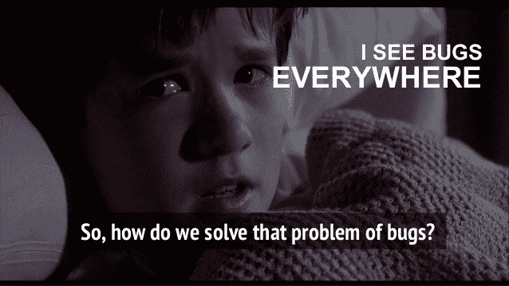
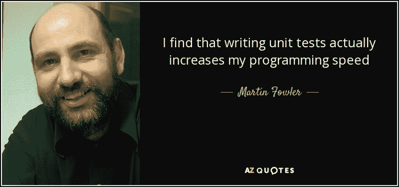
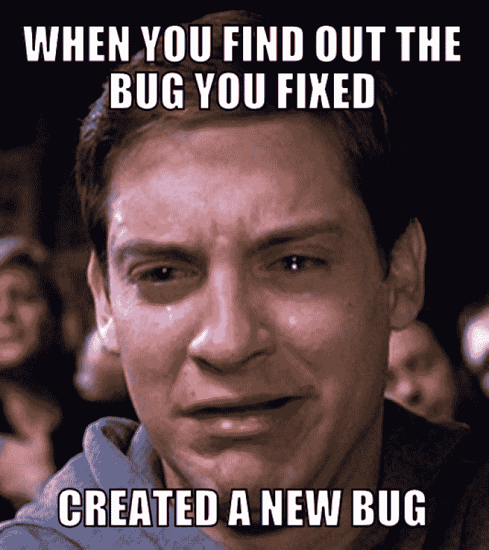
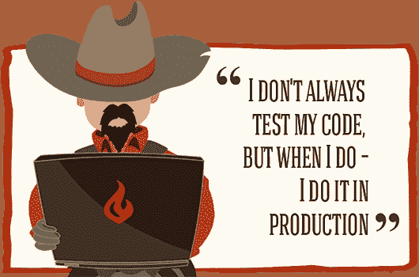
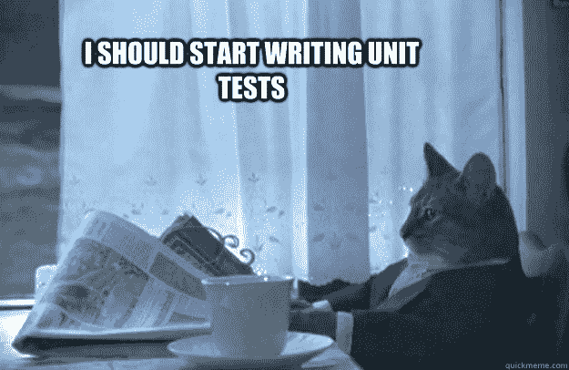

# 开发人员避免编写测试的两个最常见的原因

> 原文：<https://www.freecodecamp.org/news/2-most-frequent-reasons-why-developers-avoid-writing-tests-e13fc74ee2ab/>

*本帖最初发表在[媒体](https://medium.com/p/why-developers-avoid-writing-tests-until-its-too-late-912e326b5210)T3 上*

编写测试代表了软件开发中经常被忽视的几个阶段之一，尽管它可能是最重要的阶段之一。开发人员提到它，通常要么不舒服，不喜欢为他们的代码编写测试，要么有很多借口根本不编写测试。

测试很重要:

*   Therac-25 放射治疗机[中的一个软件错误导致](https://www.newscientist.com/gallery/software-bugs/)五名患者在接受大剂量 X 射线照射后死亡。
*   骑士资本公司在半小时内损失了 5 亿美元，原因是一个软件漏洞允许计算机在无人监管的情况下买卖数百万股股票。

这些和其他许多故事讲述了看似不重要的错误实际上如何导致如此多的悲剧灾难。

我们知道软件对我们生活的每个领域变得多么重要。我们知道这个软件的安全性、稳定性和正确性在我们的生活中至关重要。所以问题是:为什么开发人员仍然避免编写测试？

### 借口 1:“编写测试花费太多时间。”

很容易感觉到编写测试花费了太多的时间，而不是直接跳到实现部分。

这在短期内可能是正确的，但是如果我们考虑到你可能需要时间来修复所有你可以通过编写测试来避免的错误，那么编写测试实际上可以节省时间——甚至金钱。

测试不能完全消除 bug(没有什么能做到这一点)，但是它们可以极大地减少 bug。它们甚至可以让你更有信心，当你添加新特性和重构旧特性时，你不会破坏任何现有的功能。

测试还可以帮助您节省时间，并保护您现有的实现免受最近加入您团队的没有经验的程序员的影响。如果这些新人引入了 bug，你的测试就会失败。当您的测试失败时，您会意识到出了问题。

缺乏编程背景的项目经理——因此可能不理解突然出现的编程复杂性——往往对他们团队中的开发人员有很高的期望。他们希望事情做得很快，并快速生产现成的代码。他们可能认为推迟严格的截止日期是不合理的。

这些情况可能会让你陷入困境——你必须在遵循最佳实践或快速且不干净地完成工作之间做出选择。

你应该试着找到一些无论如何都可以坚持的职业原则。你应该尽最大努力让你的经理相信最佳实践的重要性，以及从长远来看它们是如何带来回报的。如果你的经理不能被说服，那么你可能会考虑换工作。

### 借口 2:害怕写测试

毫不奇怪，开发人员将大部分工作时间花在阅读代码、编写代码或讨论要用代码解决的新问题上。因此，他们对它有着非常强烈的情感依恋，更愿意把它当作自己的宝贵财产。

许多人相信他们已经有了足够的经验，并且他们能够毫不费力地应对每一种可能的情况。

在内心，他们可能怀有不安全感。对他们的代码进行测试可能会导致不安全感的爆发。

也许他们将代码变更推送到主分支的速度比他们应该做的要快，因为他们想在经理面前看起来像一个高效的员工。现在他们担心编写测试可能会暴露他们代码中的错误。他们害怕被暴露为写不出无错误代码的普通程序员。

嗯，我们都应该帮自己一个忙，不要让我们的自我意识欺骗我们不去写测试。尽管感觉不舒服，但我们应该对自己的工作负责。这是避免 bug 的最好方法之一——bug 经常会带来悲剧性的后果。

测试允许您快速地对代码进行大的修改，因为您可以确信一切都正常工作。当你习惯于为你的代码编写测试时，你通常能够更快地完成你的工作，因为当你看到红灯时，你会有即时的视觉反馈。结果，你也会写出更好的代码，感觉压力更小，并最终得到提升，因为你最终会为你正在做的工作带来更多的价值。

### **腾出时间进行测试**

测试永远无法捕捉 100%的错误，但它们将有助于代码的安全性、稳定性和正确性。为他们腾出时间。

*本帖原载于[中](https://medium.com/p/why-developers-avoid-writing-tests-until-its-too-late-912e326b5210)*