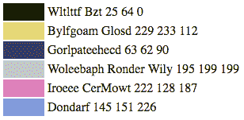
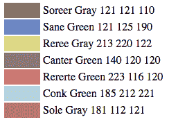
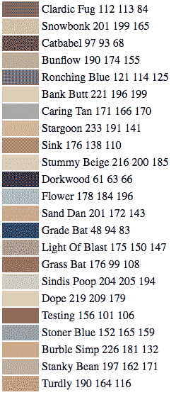

# 当一位科学家让一个人工智能命名新的油漆颜色时，发生了这样的事情

> 原文：<https://www.freecodecamp.org/news/heres-what-happened-when-a-scientist-asked-an-ai-to-name-new-paint-colors-c2e7c9fe0bd7/>

一位科学家将一个包含 7700 种颜料的数据库输入到一个神经网络中。然后，根据她的训练数据，她让计算机自己创造一些颜色。

起初，人工智能创造了一些莫名其妙的名字:

和与颜色完全不对应的名字:

但是，在对她的算法进行了一些调整，并花了一些时间训练神经网络之后，人工智能开始产生迷人的颜色名称，如下所示:

你可以在这里阅读她的全部实验:( [2 分钟阅读](https://fcc.im/2rzIzIE)

### 以下是其他三个值得你花时间去做的链接:

1.  哪些项目需要 React(而不仅仅是普通的 JavaScript 或 jQuery)？所有人！( [5 分钟读数](https://medium.freecodecamp.com/which-projects-need-react-all-of-them-e7ccb6629ba7))
2.  cookies、本地存储和会话存储之间的区别，以及如何使用 JavaScript ( [8 分钟观察](https://fcc.im/2qyVU6o))与它们进行交互
3.  如何从业余爱好者变成专业开发人员( [14 分钟阅读](https://fcc.im/2r03UPp))

### 想到这一天:

> "如果一切都很容易，那就没有什么意义了。"乔瑟琳·k·格莱

### 今日趣事:

克里斯·普蒂克插图

### 今日学习小组:

[都柏林自由代码营](http://bit.ly/2pfmOk1)

编码快乐！

–昆西·拉森，自由代码营的老师

如果你从这些邮件中获得了价值，请考虑[支持我们的非营利组织](http://bit.ly/donate-to-fcc)。