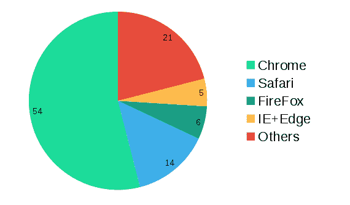
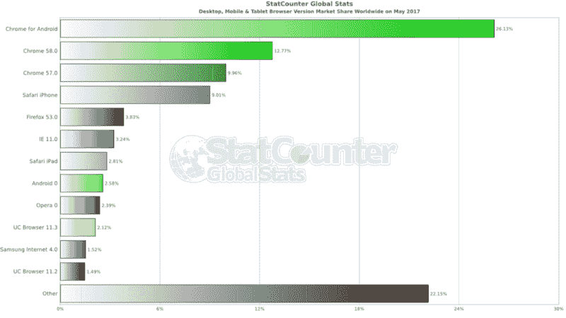
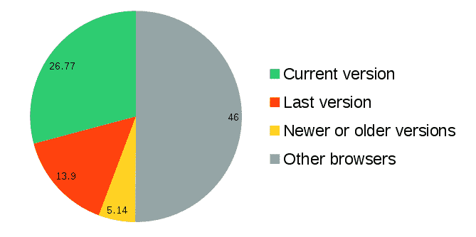
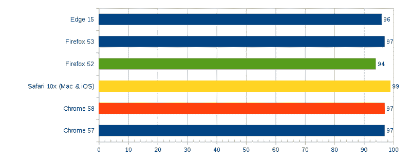
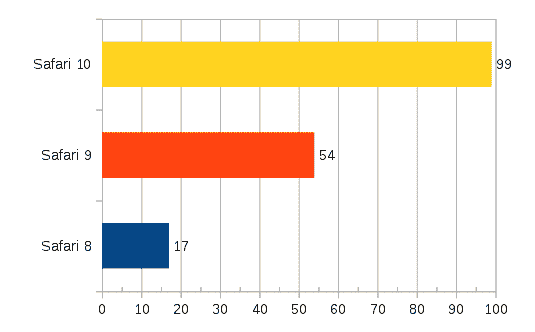
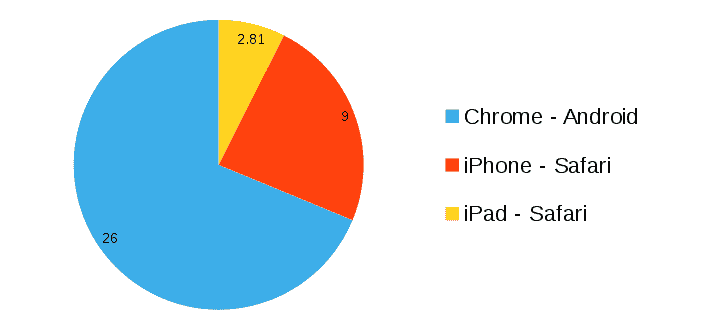

# 您可能不需要传输您的 JavaScript

> 原文：<https://www.freecodecamp.org/news/you-might-not-need-to-transpile-your-javascript-4d5e0a438ca/>

像[YouMightNotNeedJQuery.com](http://youmightnotneedjquery.com/)和[你不需要 Lodash/下划线](https://github.com/you-dont-need/You-Dont-Need-Lodash-Underscore)这样的流行指南已经挑战了普遍的行业惯例。

这篇文章不像[YouMightNotNeedJS.com](http://youmightnotneedjs.com/)那样疯狂，但是它详细阐述了 transpilation，并解释了为什么在不久的将来它可能不那么必要。

[StatCounter](http://gs.statcounter.com/) 每月从全球[的 250 万个网站收集大约 150 多亿次页面浏览的数据](http://gs.statcounter.com/sample-size/StatCounterGlobalStatsSep15_SampleSizeCountryBreakdown.csv)。截至 2017 年 5 月，现状是这样的:

Browser market share as of May 2017 in %

让这个图表有趣的是，排名前三的浏览器(Chrome、Safari 和 FireFox)是 [evergreen](https://www.techopedia.com/definition/31094/evergreen-browser) 、*，这意味着 74%的用户自动获得了他们浏览器的最新版本。*

让我们看看这个假设是否正确。

以下是市场上的顶级浏览器版本:

Browser version distributions according to [StatCounter](http://gs.statcounter.com/browser-version-market-share/desktop-mobile-tablet/worldwide/#monthly-201705-201705-bar)

Chrome 58 [发布](https://www.chromium.org/developers/calendar)不到一个月，其桌面版占据全球浏览器市场 12.77%的份额。Chrome 57 仅在此前 42 天发布，其桌面版占据全球浏览器市场 9.96%的份额。不幸的是，StatCounter 没有区分移动平台上的 chrome 版本，但假设与桌面平台上的比例相同，我们最终会得到:

All versions of chrome in the market (to

### 这对我的代码意味着什么？

根据 [ES 兼容表](http://kangax.github.io/compat-table/es6/)所有主流浏览器的最新版本都对 ES6 特性有很好的支持:

All major browsers have a very good ES6 support

换句话说，如果你把你的 JavaScript 移植到 ES5，你会让你的代码变得不必要的大和慢，以支持少数用户，他们可能会在你配置你的 Webpack 和 Babel 的时候升级他们的系统！？

### 为什么你还会变身？

你可能仍然想移植你的代码，但希望在权衡利弊或可能的替代方案之后:

*   你正在使用 React JSX(这是目前非常流行的，所以我假设很多开发人员都属于这一类)。JSX 的核心是从 XHTML 到 JS 代码的转换，不需要像 Babel 一样的完整编译器。此外，如果你需要的只是[虚拟世界](https://github.com/Matt-Esch/virtual-dom)，那就用那个吧。
*   你想尝试这种语言的最新特性。除非你是 TC39 的一员，或者非常想在你的产品代码中加入不稳定的语言特性，否则你可能会觉得 ES6 不错。如今，大多数浏览器都有一种像样的语言，对移植的需求正在消失。
*   你使用的是 TypeScript，希望[权衡利弊](https://medium.freecodecamp.com/when-should-i-use-typescript-311cb5fe801b)。当面向现代版本的 ES6 时，TypeScript 编译器主要去除类型信息，而不是转换语法。
*   你想使用[树摇动](http://www.engineyard.com/blog/tree-shaking)来减少代码大小(下面是如何做的[在 webpack](https://medium.freecodecamp.org/tree-shaking-es6-modules-in-webpack-2-1add6672f31b) 和 [rollup](https://rollupjs.org/#tree-shaking) )。你想混淆你的代码或通过缩小来减小它的大小。您希望有条件地排除部分代码。这需要静态代码分析。您可以将 smart bundler 用于移动设备等对大小敏感的生产服务，但在创建此类替代部署时，我们会看到更仔细的成本评估。这些静态代码分析将继续作为产品代码的“高级优化技术”发挥作用。你不用**去**缩小你的文件。丑八怪目前不能缩小 ES6(虽然有一个哈蒙尼分支存在)但是[巴比里](https://github.com/babel/babili)可以处理。压缩算法做得相当不错([不是当文件太少的时候](https://webmasters.stackexchange.com/questions/31750/what-is-recommended-minimum-object-size-for-gzip-performance-benefits)),除非你在每次页面加载时都装载一个操作系统，否则不压缩也能做得很好。如今，图像和多媒体内容比代码占用更多的带宽。
*   你想要房间里的大象:

NPM 是这个星球上最大的包装经理。大多数非平凡的网络应用程序使用一些来自 NPM 的代码，这意味着使用模块捆绑器。这种情况很快就会改变！Chrome 已经在 [Canary](https://www.chromestatus.com/feature/5365692190687232) 中支持 ES6 模块(Chrome 60 将于今年 8 月正式推出这一功能)，Safari 也即将推出，而 Firefox 和 Edge 正在努力。

除此之外 [HTTP/2](https://en.wikipedia.org/wiki/HTTP/2) 允许主动向浏览器推送资源。这意味着，如果 **a.js** 正在导入 **b.js** 和 **c.js** ，服务器可以在每次获取 **a.js** 时推送 **b.js** 和 **c.js** ，从而最大限度地缩短请求之间的时间。这当然是一个简化的视图，因为实际上浏览器的缓存中可能已经有了 **b.js** 和 **c.js** 。大多数浏览器都支持 HTTP/2。

### 没有蒸腾的未来

考虑到上面的统计数据，这意味着 2018 年将是大多数网络应用可以摆脱模块捆绑器或传输器的一年。

Transpilation 是一种变通方法。我们可能做得太久了，已经习惯了，但是想想吧。我们正在把一种“被解释的”语言“编译”成一种“被解释的”语言！此外:

*   在许多情况下，配置 Webpack/Browserify 是不必要的负担
*   使用 sourcemaps 进行调试总是比调试正在运行的实际脚本更难(当 sourcemaps 不能正常工作时，有人喜欢尝试调试`this`或变量吗？)
*   当你在每次编辑后必须等待几秒钟(有时半分钟)才能看到最新的代码时，它杀死了 DX。热模块重装(HMR)是解决这个问题的一个办法，但它并不总是能顺利快速地进行配置。没有 transpilation，你所要做的就是刷新页面，不到一秒钟，你的最新页面就出现了！

今年 8 月 ES6 模块上市时，某些类型的应用程序将完全不使用 transpilation:

*   Chrome 扩展
*   电子桌面应用
*   B2B 网络应用程序是由已经拥有该公司提供的良好设备的商业用户运行的

当 transpilation 成为过去时，[具有 Hyperscript 语法](https://mithril.js.org/hyperscript.html)的库将 React 的思想带到了 *POJS* (未被 trans Pilate 且易于在控制台上调试的普通旧 JavaScript)。

### 不要 transpile，而是真正的编译！

[WASM](http://webassembly.org/) 是城里的新人，官方编译目标承诺[更快的执行速度和更小的代码量](https://www.youtube.com/watch?v=HktWin_LPf4)。[目前](http://caniuse.com/#feat=wasm) Chrome 和 Firefox 支持 WASM，但在大型浏览器供应商中有一个很好的共识，WASM 将是未来的共同运行时。如果你有 Chrome，你可以[试试](http://webassembly.org/demo/)。

如果你是那种渴望新事物的开发人员，看看 [Rust](https://doc.rust-lang.org/book/) 吧。它[编译到 WASM](https://hackernoon.com/compiling-rust-to-webassembly-guide-411066a69fde) 但不限于 web。人们实际上用它来编写[操作系统](https://github.com/redox-os/redox)或者[浏览器引擎](https://github.com/servo/servo)。此外，过去的 C/C++开发人员[认可并喜欢它](https://www.quora.com/What-do-C-C++-systems-programmers-think-of-Rust)，它有一个非常受欢迎的社区。

### 几个音符

*   据前 Mozilla CTO 称，Chrome 赢了，不太可能会有另一场浏览器大战。有趣的是 **Chrome 凭借精英管理赢得了它**。它是开源的，谷歌已经明确定义了[它从用户那里收集什么信息](https://www.google.com/chrome/browser/privacy/whitepaper.html)。Chrome 甚至赢了传统上使用 Windows 的商业用户。然而，虽然最终用户选择 Chrome 是因为它的速度、安全性和简单性，但程序员喜欢它的开发工具。Google 在 TC39 中扮演着积极的角色，TC39 推动了 JavaScript 的未来，并且总体上是 web 平台最强有力的支持者，尽管它可能会与自己的移动操作系统竞争。不仅如此，谷歌还帮助其竞争对手。谷歌一直是 Mozilla 最大的财政支持者之一，Opera 使用的是它的渲染引擎。
*   大约 17 个月前，微软正式宣布放弃对 IE 的支持。IE 11 的安全更新将一直持续到 2025 年，但最终要由你来决定是不是要投入[大量资源](http://kangax.github.io/compat-table/es6/#ie11)来支持一个只有 3.24%市场使用的浏览器。还要记住，Edge 是 Windows 10 中的默认浏览器。如果有谁不想把他们的 Windows 升级到最新版本的话，那么最近的[想成为埃及人的攻击](https://blogs.technet.microsoft.com/msrc/2017/05/12/customer-guidance-for-wannacrypt-attacks/)可能给了他们一个重新考虑的理由！就我个人而言，我对任何有关这一特定客户群收入的市场调查都很感兴趣。
*   苹果设置了一系列不公平的限制，将其他浏览器厂商挡在他们的 iOS 平台之外。例如，iOS 上的 Chrome 在技术上仅限于 Safari 引擎的一部分！Safari [曾经是新的 IE](https://www.safari-is-the-new-ie.com/) ，直到 2016 年他们做得很好，成为支持 ES6 最好的浏览器:

Released 16 months ago, Safari 10 brought a good level of ES6 support to iOS platforms

总体而言，iOS/Safari 的全球份额低于 Android/Chrome。这因国家而异，例如，在较富裕的国家，iOS 的渗透率略高，而在发展中国家，Android 是绝对的赢家，但全球数据如下:

Global browser share for Android and iOS

### 行动起来！

如果你足够老，你可能还记得那些恼人的日子，一些网站强迫(或礼貌地建议)他们选择的浏览器(主要是 IE):

我们不想这么做！无论我们对 Chrome 有多兴奋，我们都不想忽视 46%的网络流量不是由 Chrome 呈现的。

> 仅仅因为我们可能很快就会在浏览器中支持 ES6 模块，这并不意味着我们可以摆脱构建过程和适当的“捆绑策略”。斯蒂芬·朱迪斯

我们总会有人在电视固件或汽车信息娱乐系统中使用旧浏览器。我们将永远有一个固执的爷爷，他不认为有必要投资升级他的机器，只是把它作为一个遗产。孩子们将继续使用他们父母的旧 iPhone 或平板电脑，每个孩子一台笔记本电脑不会在一夜之间增加处理能力。我们不想把任何人拒之门外。

尽管这不是一个新问题。尽管 ES6 是网络中最大的变化之一，但是[优雅的退化](https://www.w3.org/wiki/Graceful_degradation_versus_progressive_enhancement)仍然可以为**少数人**提供一些用途，同时保持开发成本在大多数人的控制之下。

在以后的帖子中，我将讨论如何在为适度降级制定备份计划的同时发布现代代码的实践方面。你可以在 Twitter 或 Medium 上关注我，保持关注。

**加成:**看看 [JS 码移位](https://github.com/facebook/jscodeshift)。它是一个 CLI，用于将旧的 javascript 代码转换为新的 javascript 代码，甚至更新旧的 javascript 库对其最新 API 的调用。它试图尽可能多地保留原始样式。工作流:在将您的变更提交到版本控制之后，运行它，进行彻底的比较，并运行自动化的&手动测试。搞定了。

**更新 1(2017–09–8):**Chrome 61 日前登陆，全面支持 ES6 模块。它拥有全球浏览器市场 54%的份额。Safari(占全球市场的 14%)支持 ES6 模块已经有一段时间了。

**更新 2(2017–09–10):**多亏了[这招](https://medium.com/dev-channel/es6-modules-in-chrome-canary-m60-ba588dfb8ab7)*<scri**pt nomod**ule src = " compiled . js "><*；/scri**pt>。**no module 属性告诉支持 ES6 模块的浏览器不要加载脚本。在 Safari 上，你可以在讨论[技巧的页面上看到一些警告。阅读规范。](https://html.spec.whatwg.org/multipage/scripting.html#the-script-element)

**更新 3(2017–09–12):**[ES6 模块支持浏览器登陆:是时候重新考虑捆绑了吗？](https://www.contentful.com/blog/2017/04/04/es6-modules-support-lands-in-browsers-is-it-time-to-rethink-bundling/)

**更新 4(2017–09–12):**模块默认为*延时*红色。如果你想绕过它，给脚本标签添加一个*异步*属性来防止[单点故障(SPOF)](https://www.stevesouders.com/blog/2010/06/01/frontend-spof/) 。

**更新 5(2017–09–13):**节点 LTS 8.5 [支持 ES6 模块](https://nodejs.org/en/blog/release/v8.5.0/)(称为 ESM)当文件有 ***时在一个标志后面。msj** 扩展。这里有一个关于如何使用它们的很好的介绍。

**更新 6(2017-09–22):**[这里](https://philipwalton.com/articles/deploying-es2015-code-in-production-today/)是一些支持新老浏览器的很棒的实用建议。避免传输带来的带宽节省是巨大的！

**更新 7(2018–01–15):**[Lebab](https://lebab.io/)(巴别塔的反转)is 有一个 CLI，用于现代化旧式 Javascript。这有点类似于脸书的 [CodeShift](https://github.com/facebook/jscodeshift) ，因为他们都将旧代码现代化。

计算史上最广泛部署的 bug 为我们打开了一个绝佳的机会！阅读[为什么我们应该说服用户更新他们的浏览器？](https://medium.freecodecamp.org/should-we-demand-the-latest-browser-version-d5c72f8c9ffb)