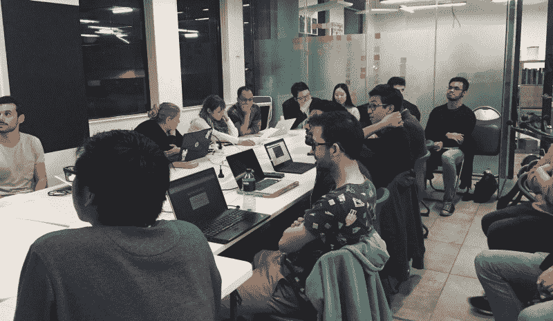

# 就像堆栈溢出，但是对于露营者来说

> 原文：<https://www.freecodecamp.org/news/like-stack-overflow-but-for-campers-910b5cf7dc40/>

大约一年前，我们启动了社区论坛。今天，成千上万的露营者每天使用它来分享见解和获得帮助。

这里有一些你可以做的有用的事情:

1.  你可以问任何问题。然后你可以看看其他营员的回复。如果回复回答了您的问题，您可以将其标记为解决方案。
2.  你可以[获得关于你已经建立的项目的反馈](https://fcc.im/2qxH5PQ)。
3.  你可以[阅读获得第一份开发工作](https://fcc.im/2rsiP0U)的露营者，以及他们迄今为止的编码之旅。

您甚至可以在我们的[排行榜](https://fcc.im/2qTi05a)上看到每周哪些营员最有帮助。

我们有一个强大的搜索引擎和数以千计的主题，所以你可以在那里找到关于几乎所有事情的讨论。

如果你已经有了 GitHub 账号，[只需要几秒钟就可以加入](https://fcc.im/2pVp3WU)。

### 这里有三个值得你花时间的链接:

1.  来自历史上伟大创新者的教训，你永远不应该忘记
2.  我是如何爱上 OpenBSD 操作系统的( [4 分钟阅读](https://fcc.im/2pVu6GB)
3.  利用不变性的力量编写更安全、更干净的代码( [4 分钟读取](https://fcc.im/2pVCuWN))

### 想到这一天:

> “复杂性害死人。它耗尽了开发人员的精力，使产品难以规划、构建和测试，带来了安全挑战，并使最终用户和管理员感到沮丧。”—雷·奥茨

### 今日趣事:

网络漫画作者 [XKCD](https://fcc.im/2rsu8q5) 。

### 今日学习小组:

[墨尔本自由代码营](http://bit.ly/2kC9Kk4)

编码快乐！

–昆西·拉森，自由代码营的老师

如果你从这些邮件中获得了价值，请考虑[支持我们的非营利组织](http://bit.ly/donate-to-fcc)。