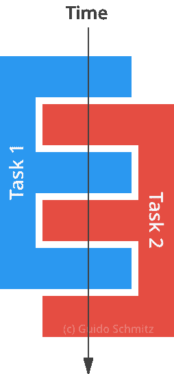

# 利用“不变性”的力量编写更安全、更干净的代码

> 原文：<https://www.freecodecamp.org/news/write-safer-and-cleaner-code-by-leveraging-the-power-of-immutability-7862df04b7b6/>

吉多·施密茨

# 利用“不变性”的力量编写更安全、更干净的代码


Photo from [https://unsplash.com](https://unsplash.com)

不变性是函数式编程的基石之一。它允许您编写更安全、更干净的代码。我将通过一些 JavaScript 示例向您展示如何实现不变性。

**据维基百科([来源](https://en.wikipedia.org/wiki/Immutable_object) ):**

> 不可变对象(不可改变的对象)是在创建后其状态不能被修改的对象。这与可变对象(可变对象)相反，可变对象可以在创建后进行修改。在某些情况下，一个对象被认为是不可变的，即使一些内部使用的属性发生了变化，但从外部的角度来看，对象的状态似乎是不变的。

### 不可变数组

数组是理解不变性实际工作原理的一个很好的起点。让我们来看看。

```
const arrayA = [1, 2, 3];arrayA.push(4); const arrayB = arrayA;arrayB.push(5); console.log(arrayA); // [1, 2, 3, 4, 5]console.log(arrayB); // [1, 2, 3, 4, 5]
```

这个例子将 **arrayB** 赋值给引用 **arrayA** ，所以 push 方法将值 5 加到两个变量中。我们的代码间接变异了其他值，这不是我们想要做的。这违反了不变性原则。

我们可以通过使用 [slice](https://developer.mozilla.org/en-US/docs/Web/JavaScript/Reference/Global_Objects/Array/slice) 函数将我们的示例改进为不可变的，代码的行为是不同的。

```
const arrayA = [1, 2, 3];arrayA.push(4); const arrayB = arrayA.slice(0);arrayB.push(5); console.log(arrayA); // [1, 2, 3, 4]console.log(arrayB); // [1, 2, 3, 4, 5]
```

这正是我们想要的。代码不会改变其他值。

记住:当使用 [push](https://developer.mozilla.org/en-US/docs/Web/JavaScript/Reference/Global_Objects/Array/push) 向一个数组添加一个值时，你是在**改变**这个数组。您希望避免变异变量，因为它会在代码中产生副作用。[切片](https://developer.mozilla.org/en-US/docs/Web/JavaScript/Reference/Global_Objects/Array/slice)函数返回数组的一个副本。

### 功能

现在你知道如何避免改变其他值。你将如何编写“纯粹”的函数？Pure 是另一个词，用来调用一个没有任何副作用，不会改变状态的函数。

让我们看一个利用数组示例中相同原理的函数。首先我们创建一个变异另一个值的函数，然后我们将函数改进为“纯的”。

```
const add = (arrayInput, value) => {  arrayInput.push(value);   return arrayInput;};
```

```
const array = [1, 2, 3]; console.log(add(array, 4)); // [1, 2, 3, 4]console.log(add(array, 5)); // [1, 2, 3, 4, 5]
```

所以，我们再次**改变**我们的输入，这就产生了一个不可预测的函数。在函数式编程的世界里，有一条关于函数的黄金法则:**一个具有相同输入的函数应该总是返回相同的结果**。

上面的函数违反了黄金法则。每次调用我们的 **add** 函数时，它都会对**数组**变量进行变异，结果是不同的。

让我们看看如何改变我们的 **add** 函数的实现，使其成为不可变的。

```
const add = (arrayInput, value) => {  const copiedArray = arrayInput.slice(0);  copiedArray.push(value);   return copiedArray;}; const array = [1, 2, 3];
```

```
const resultA = add(array, 4);console.log(resultA); // [1, 2, 3, 4]
```

```
const resultB = add(array, 5);console.log(resultB); // [1, 2, 3, 5]
```

现在我们可以多次调用我们的函数，并期望基于输入的输出是相同的。这是因为我们不再改变**数组**变量。我们可以称这个函数为“纯函数”。

> **注意:**也可以用**串联**，代替**切片**和**推**。
> So:array input . concat(value)；

我们可以使用 ES6 中可用的[扩展语法](https://developer.mozilla.org/nl/docs/Web/JavaScript/Reference/Operators/Spread_operator)来缩短这个函数。

```
const add = (arrayInput, value) => […arrayInput, value];
```

### 并发

NodeJS 应用程序使用一个叫做并发的概念。并发操作意味着两个计算都可以独立进行。如果有两个线程，第二个计算不需要等待第一个线程完成才能继续。



Visualization of a concurrent operation

NodeJS 通过事件循环使并发成为可能。事件循环重复获取一个事件，并一次触发一个监听该事件的事件处理程序。这个模型允许 NodeJS 应用程序处理大量的请求。如果你想了解更多，请阅读这篇关于事件循环的文章。

不变性与并发性有什么关系？由于多个操作可以以并发方式更改函数范围之外的值，这将产生不可靠的输出并导致意外的结果。注意一个在其作用域之外变异变量的函数，因为这可能非常危险。

### 后续步骤

在学习函数式编程的过程中，不变性是一个需要理解的重要概念。你可能想看一看脸书的开发者写的 [ImmutableJS](https://facebook.github.io/immutable-js) 。该库提供了某些不可变的数据结构，如**映射**、**集合**和**列表**。

[**不可变. js，持久数据结构和结构共享**](https://medium.com/@dtinth/immutable-js-persistent-data-structures-and-structural-sharing-6d163fbd73d2)
[*为什么用不可变. js 代替普通的 JavaScript 对象？*medium.com](https://medium.com/@dtinth/immutable-js-persistent-data-structures-and-structural-sharing-6d163fbd73d2)[**高阶函数:使用 Filter、Map 和 Reduce 来获得更易维护的代码**](https://medium.freecodecamp.org/higher-order-functions-in-javascript-d9101f9cf528)
[*高阶函数可以让代码更具声明性，从而帮助您提升您的 JavaScript 水平。那就是……*medium.freecodecamp.org](https://medium.freecodecamp.org/higher-order-functions-in-javascript-d9101f9cf528)

*点击？下面，所以其他人会看到这篇文章在媒体上。感谢阅读。*

