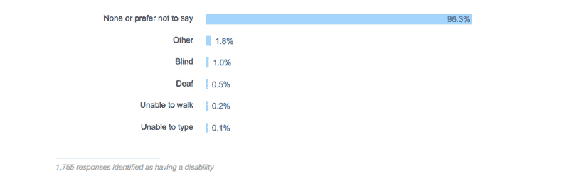

# 盲人如何编码

> 原文：<https://www.freecodecamp.org/news/how-blind-people-code-fdb64e3bf5c/>

大约每 200 个软件开发人员中就有一个是盲人。我们知道这个是因为 Stack Overflow [几个月前就这个问题询问了 64，000 名开发者](https://fcc.im/2qp6ddh)。

问题是:盲人开发者看不到屏幕怎么编码？

freeCodeCamp 贡献者 [Florian Beijers](https://www.freecodecamp.org/news/how-blind-people-code-fdb64e3bf5c/undefined) 天生失明。他可以用标准配置的笔记本电脑编写代码。他使用一款叫做**屏幕阅读器**的软件。有了它，他可以选择一行文本或代码，并听到它的内容以每分钟数百个单词的速度读给他听。他写了一篇文章解释他的[如何能够在失明的情况下编码。](https://www.freecodecamp.org/news/a-vision-of-coding/)

> “实际上，我如何编码与[有远见的开发人员]如何编码并没有太大的不同。我已经学会了如何触摸字体，并在心里概念化我的代码，这样我就可以像你们一样使用它了。唯一的区别是我几乎不用鼠标做任何事情。我倾向于坚持使用热键和命令行。”弗洛里安·贝杰斯

昨天，微软发布了一个视频，讲述了他们的一名开发人员如何使用屏幕阅读器和 Visual Studios 代码编辑器进行编程。作为一名视力正常的开发人员，我醒着的大部分时间都盯着屏幕，我发现这个视频令人印象深刻，鼓舞人心:( [7 分钟观看](https://fcc.im/2qsST67))

这些只是众多开发人员中的两个，他们尽管失明，却已经找到了高效编码的方法。我希望这能激励你坚持编码，不管你面临什么样的挫折，并鼓励其他人也这样做。