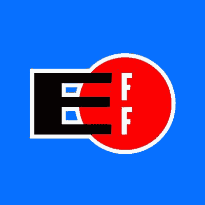
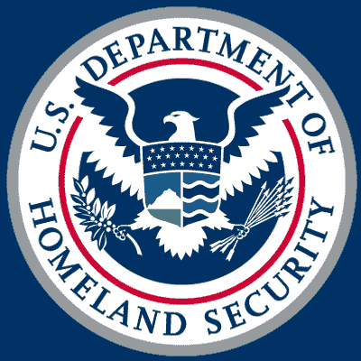
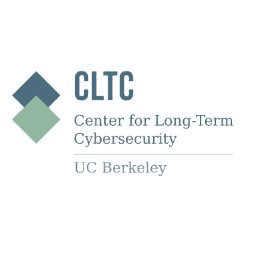
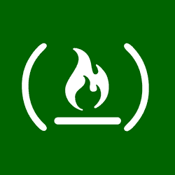
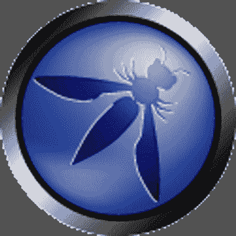

# 网络安全从未如此重要。以下是你可以跟上的方法。

> 原文：<https://www.freecodecamp.org/news/if-you-want-to-stay-up-to-speed-with-cybersecurity-subscribe-to-these-six-newsletters-in-a-hurry-3940c9fd419f/>

史蒂文·吉尔伯特

# 网络安全从未如此重要。以下是你可以跟上的方法。

[Image credit](https://unsplash.com/collections/446976/privacy?photo=4iuYQZUB3Tc)

过去几个月是网络安全史上最重要的几个月:

*   维基解密公布了他们收集的中情局黑客资料
*   WannaCry 勒索软件已经感染了[数十万台电脑](https://www.us-cert.gov/ncas/alerts/TA17-132A)。
*   联邦调查局正在调查俄罗斯黑客可能干预了美国总统选举。
*   国会投票通过一项决议，撤销联邦通信委员会的隐私保护措施，该措施阻止互联网服务提供商将你的数据出售给第三方(并为互联网服务提供商以其他令人毛骨悚然的方式使用你的数据打开大门)。
*   开放的网络正受到来自大公司的威胁，他们可能会使用深度数据包检测将它变成一个封闭的中国式互联网。

如果说围绕网络安全和数字隐私的问题是“新闻”，那也是轻描淡写。因为这些问题离我们家很近。

实际上，它们就在你的家里。你的电脑、智能手机、智能家居设备，甚至你的电视。

这意味着你可能有兴趣了解更多关于网络安全领域的知识，因为它肯定会影响到你。隐私、安全、数字权利、自由表达、开放网络——这些都是可以追溯到网络基本机制的激烈问题。

我致力于深入这个世界。我在挪威的一家安全软件公司 Crypho T1 担任顾问，该公司为组织构建私人安全通信工具。我目前正在加州大学伯克利分校法学院学习延期，我计划在那里学习更多关于数字隐私和安全法的知识。

此外，为了掌握最新动态，我订阅了以下免费电子邮件简讯:

#### **#1:电子前沿基金会(EFF)**

**邮件简讯报名:** [效果器列表](https://www.eff.org/effector)

来自 [EFF 网站](https://www.eff.org/about):

> “电子前沿基金会是捍卫数字世界公民自由的领先非营利组织。EFF 成立于 1990 年，通过影响诉讼、政策分析、草根行动主义和技术开发来捍卫用户隐私、自由表达和创新。我们致力于确保随着技术应用的增长，权利和自由得到增强和保护。”

EFF 是安全工具背后的组织，通常与其他人合作，如[隐私獾](https://www.eff.org/privacybadger)、 [HTTPS Everywhere](https://www.eff.org/https-everywhere) 、 [Certbot](https://certbot.eff.org/) 等等。

EFF 是一个组织，为更安全的在线交流提供了大量的建议、工具和指导。这个宝库包括[监视自我防御](https://ssd.eff.org/en)、 *EFF 通过使用安全技术和发展谨慎实践来保护自己和朋友免受监视的指南*

EFF 以法庭之友简报、博客文章、白皮书的形式，当然还有他们几乎每周一次的电子邮件简讯[效应器列表](https://www.eff.org/effector)的形式，提供了更多信息。

#### **#2:美国认证**

**邮件简讯报名:** [US-CERT](https://www.us-cert.gov/)

CERT 代表计算机应急准备小组。所以 US-CERT 是美国的计算机应急准备小组。

US-CERT 是国土安全部的一个组织，它负责"*响应重大事件，分析威胁，并与世界各地值得信赖的合作伙伴交换重要的网络安全信息*。

US-CERT 简讯让您了解所有与网络安全相关的事情，包括:

*   网络安全警报，比如最近的 [WannaCry 勒索软件](https://www.us-cert.gov/ncas/alerts/TA17-132A)
*   公告，如 [FTC 的隐私意识周](https://www.us-cert.gov/ncas/current-activity/2017/05/08/FTC-Promotes-Privacy-Awareness-Week)
*   提示，如[保护家庭和小型企业路由器](https://www.us-cert.gov/ncas/current-activity/2015/12/15/Securing-Home-and-Small-Business-Routers)
*   安全更新，如 [Mozilla 发布安全更新](https://www.us-cert.gov/ncas/current-activity/2017/05/05/Mozilla-Releases-Security-Updates)
*   软件漏洞公告，如 2017 年 5 月 8 日一周[漏洞汇总](https://www.us-cert.gov/ncas/bulletins/SB17-135)

请注意，许多国家都有自己的 CERT，因此您可能也有兴趣关注这些 CERT。你可以在这里找到证书列表[。](https://en.wikipedia.org/wiki/Computer_emergency_response_team)

#### #3:施耐尔谈安全

**邮件简讯报名:** [加密简讯](https://www.schneier.com/crypto-gram/)

Bruce Schneier 是一位有影响力的安全技术专家。他在一个名为 Schneier on Security 的博客上讨论安全问题。还有一封名为 Crypto-Gram 的免费月度电子邮件，这是他博客文章的摘要。

更多关于 Schneier [这里](https://en.wikipedia.org/wiki/Bruce_Schneier)。

#### **#4:奥赖利安全简讯**

**邮件简讯报名:** [奥赖利安全简讯](http://www.oreilly.com/security/newsletter)

[O'Reilly](https://www.oreilly.com/) 是一家由 Tim O'Reilly 创办的媒体公司，出版大量关于软件和计算机技术的优质书籍和内容。他们组织受欢迎的[技术会议](https://www.oreilly.com/conferences/)，如 Velocity 和 OSCON。并发布了许多电子邮件简讯，其中包括一个专门针对数字安全的简讯。

#### **#5:加州大学柏克莱分校长期网络安全中心(CLTC)**

**邮件快讯报名:** [CLTC](https://cltc.berkeley.edu/)

长期网络安全中心(CLTC)是加州大学伯克利分校的一个研究和合作中心，其目标如下:

> “该中心位于信息学院(I School)，将在工业、学术界、政策和实践者之间建立有效的对话，旨在促进研究项目、技术和建议。CLTC 的工作建立在面向未来的网络安全概念基础上——这对人类、机器以及依赖于两者的社会可能意味着什么。”

如果你住在湾区，你可能会对 CLTC 特别感兴趣，因为他们组织的活动和讲座。如果你不是，你仍然可以在 CLTC 时事通讯中找到价值，因为它涵盖了网络安全新闻、实习和工作等等。

#### #6:免费代码营

电子邮件简讯注册: [freeCodeCamp](https://medium.freecodecamp.com/)

freeCodeCamp 是一个致力于帮助你学习编码的开源社区。作为这一努力的一部分，freeCodeCamp 在 Medium 上维护一个受欢迎的技术出版物，在那里发布关于开发、设计、数据科学、开放网络以及其他技术主题的故事。

虽然这不是 freeCodeCamp 出版物的独家焦点，但你经常会发现与网络安全和数字隐私及安全相关的信息文章，如关于 VPN 的[这篇](https://medium.freecodecamp.com/how-to-set-up-a-vpn-in-5-minutes-for-free-and-why-you-urgently-need-one-d5cdba361907)和关于端到端加密的[这篇](https://medium.freecodecamp.com/why-i-asked-my-friends-to-stop-using-whatsapp-and-telegram-e93346b3c1f0)以及关于加密你的数字生活的[这篇](https://medium.freecodecamp.com/tor-signal-and-beyond-a-law-abiding-citizens-guide-to-privacy-1a593f2104c3)。

这意味着关注 freeCodeCamp 的电子邮件简讯是值得的，你可以通过在媒体上关注[出版物并选择“在收件箱中接收信件”来订阅](https://medium.freecodecamp.com/)

#### #7: OWASP

电子邮件简讯注册: [OWASP 邮件列表](https://lists.owasp.org/mailman/listinfo)

[开放 Web 应用安全项目](https://www.owasp.org/index.php/Main_Page)通常被称为 [OWASP](https://www.owasp.org/index.php/About_The_Open_Web_Application_Security_Project) 是*一个开放社区，致力于使组织能够构思、开发、获取、操作和维护可信任的应用。OWASP 的所有工具、文档、论坛和章节都是免费的，对任何对提高应用程序安全性感兴趣的人开放*。

因此，OWASP 是许多资源和项目[的幕后推手，这些资源和项目](https://www.owasp.org/index.php/OWASP_Project_Inventory#Flagship_Projects)旨在提高应用程序的安全性，并从总体上提高软件安全性的可见性。一个这样的项目是重要的和经常被引用的[十大项目](https://www.owasp.org/index.php/Category:OWASP_Top_Ten_Project)，OWASP 的 10 个最关键的 web 应用程序安全风险列表。

### 一些额外的网络安全邮件列表

如果你关注并阅读所有这些电子邮件简讯，你可能会比 95%的人更了解网络安全世界。

如果这些不能满足你的胃口，还有一些需要注意的地方包括:

*   [Jigsaw](https://jigsaw.google.com/vision/) ，Alphabet(又名谷歌)*旗下的一个孵化器，它构建技术来应对当今世界面临的一些最严峻的全球安全挑战——从挫败在线审查到减轻数字攻击的威胁，到打击暴力极端主义，再到保护人们免受在线骚扰*
*   美国联邦通信委员会 [RSS 源和电子邮件更新](https://www.fcc.gov/news-events/rss-feeds-and-email-updates-fcc)
*   [Mozilla](https://www.mozilla.org/en-US/) ，偶尔会涉及安全相关问题。
*   位于多伦多大学的公民实验室

最后，因为我一直生活在拉丁美洲，所以我也关注该地区涉及数字隐私和安全的组织。因此，如果你说西班牙语，你可能会想去看看 [Fundación Karisma](https://karisma.org.co/) (哥伦比亚)和 [Derechos Digitales](https://www.derechosdigitales.org/) (智利)和 [TEDIC](https://www.tedic.org) (巴拉圭)，因为他们正在做令人难以置信的工作。

如果你知道其他的资源，请在评论中提出来！如果有任何问题，你可以在 Twitter 上找到我，地址是 [@gilbertginsberg](https://twitter.com/gilbertginsberg) 或 [Gilbert Index](https://goo.gl/DgxjEj) 。感谢阅读。