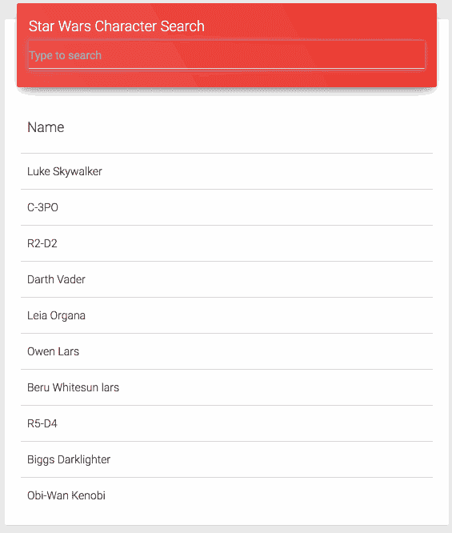

# 让我们探索一下 Cycle.js 和模型-视图-意图的好处

> 原文：<https://www.freecodecamp.org/news/exploring-cycle-js-and-model-view-intent-ada5ed82da22/>

法比奥·弘树


# 让我们探索一下 Cycle.js 和模型-视图-意图的好处

在当前的软件开发生态系统中，模型-视图-控制器(MVC)架构名声不佳并不奇怪。常见的替代方案越来越受欢迎，如模型-视图-演示者(MVP)和模型-视图-视图模型(MVVM)。

作为一名移动开发者，我尝试了 MVP 架构。事实上，由于这种架构提供的关注点分离和改进的可测试性，我有了更好的体验。但是它没有提出数据流的模式(像 Flux 或 Redux)，我对此感到有点不满意。我想知道是否有一种方法可以最小化 bug 并提供更好的开发者体验。

### 模型-视图-意图(MVI)

引起我注意的第一个概念是由 [Mosby](https://github.com/sockeqwe/mosby) 库提出的 Android 上的模型-视图-意图(MVI)实现。我决定读它的代码，试着理解它的原理。

莫斯比看起来像一个伟大的图书馆，特别是因为它的创建者彻底记录了它的动机，并在他的博客上发布了例子。但不幸的是，莫斯比似乎太复杂了。它有一个陡峭的学习曲线，并不完全是我试图寻找的——并且只代表了 MVP 的一个小的增量改进。

MVI 的概念并不是由莫斯比首先提出的，而是由一个叫做 [Cycle.js](https://cycle.js.org/) 的网络框架提出的。所以我决定学习基础知识。令我惊讶的是，Cycle.js 让我喜欢上了 MVI 的想法，并想尝试一下。主要是因为框架很小很简单。

这些是 MVI 的基本原则，也是它们具有巨大价值的原因:

*   **纯反应式:**这使得协调异步任务变得更加容易，并且带来了声明式编程的所有[好处](https://tylermcginnis.com/imperative-vs-declarative-programming/)。在 Cycle.js 的情况下，它使您的**视图** 可测试。正如我们下面将要看到的，这个视图变成了一个普通的**可观测的** *。*
*   **单向数据流:**在 MVI，数据遵循**意图**、**模型**、**视图**的直线路径。我会在下一节详细讨论这个问题。但是现在，这意味着作为开发人员，您必须学习如何组织您的代码来使用这种模式。一旦你克服了学习曲线，你的应用程序就会变得更容易理解。你的应用程序上的每一个功能都遵循相同的配方。
*   ***视图层由单个对象表示，模型****:整个**视图**状态由唯一的真实来源表示，包括**加载**和**错误**状态。这意味着，为了正确显示视图，您必须查看并操作一个地方。*

*关于 MVI 设计和优点的更多细节在 Cycle.js 创建者撰写的[这篇文章](http://futurice.com/blog/reactive-mvc-and-the-virtual-dom)和[这篇文章](https://medium.com/@fkrautwald/plug-and-play-all-your-observable-streams-with-cycle-js-e543fc287872)中有描述。即使你没有 web 开发背景，我也建议你阅读这两本书，以便有更好的理解。*

### *实际应用中的 MVI*

*

The application I've built using Cycle.js* 

*在对 MVI 有了简单的了解之后，我决定使用 Cycle.js 构建一个应用程序，以实际的方式验证它的好处。我构建的应用程序提供了一个初始的字符列表，然后当你在输入文本中键入一些内容时，它会在[星球大战 API](https://swapi.co/) 上执行搜索请求。你可以在这个[库](https://github.com/fabiothiroki/cyclejs-starwars)中看到代码。*

*Cycle.js 应用程序的主要结构是人机交互概念的抽象。这由单个函数表示，其中任何外部交互都作为函数参数传递(通常称为“源”)，而“人”的输出是该函数返回的对象(通常称为“汇”)。*

*在我们的应用程序中，这由“app.js”文件中的“App”方法表示。放置在输入和输出之间的代码将把“源”转换成可观察的 *、*的**意图，可观察的**模型** **。** 后者随后被转换成一个**视图可观察对象**，它被返回到“sinks”对象内部。***

```
*`export function App (sources) {`*
```

```
 *`// ...`*
```

```
 *`return sinks;}`*
```

*我们将按照数据流动的顺序逐步构建每一层。*

### *目的*

*意图对象包含从“源”对象生成的**观察值**。它代表了用户在与应用程序交互时的意图。在我们的应用程序中，用户可以做两件事:*

*   *通过在输入文本上键入来输入搜索词*
*   *从 API 接收字符数据*

```
*`const intents = {  receiveCharacterList: sources.HTTP.select(‘api’).flatten(),`*
```

```
 *`changeSearchTerm: sources.DOM.select(‘#search.form-control’)    .events(“input”)    .map(ev => ev.target.value)    .startWith(‘’)}`*
```

*如果您不理解 **intents** 对象的 receiveCharacterList 属性，您不必担心。现在，要理解 MVI 概念，您只需要理解这个:每当用户在 id 为“search.form-control”的输入中键入内容时，changeSearchTerm 就会收到一个新的**可观察值**默认情况下，它以空字符串开始。*

### *模型*

*正如我上面提到的，**模型**是当前**视图**状态的表示。这只取决于**意图**的对象。*

```
*`const model = Observable.combineLatest(  intents.receiveCharacterList,   intents.changeSearchTerm)  .map((combined) => {`*
```

```
 *`const [response, searchTerm] = combined`*
```

```
 *`return {      characters: response.body.results,      searchTerm: searchTerm    }; }) .startWith({   characters: [{name: ‘Loading…’}],   searchTerm: ‘’ });`*
```

*这里我们将包含 API 响应的可观察的与包含类型化的**字符串** 的可观察的组合在一起。结果是一个新的可观察值，包含字符列表和搜索项。*

### *视角*

*Cycle.js 中的**视图** 并不是由 HTML 或者控制器层表示的，就像我们在移动应用中常见的那样。默认的 Cycle.js 配置使用一个名为 [Cycle DOM](https://cycle.js.org/api/dom.html) 的库，它可以从虚拟 DOM [抽象](https://github.com/snabbdom/snabbdom)中生成一个可观察对象。*

```
*`const view = model.map((state) => {`*
```

```
 *`const list = state.characters.map( character => {    return tr(td(character.name));  });`*
```

```
 *`return div(“.card”, [    div(‘.card-header’, [      h4(‘.title’, ‘Star Wars Character Search’),      input(‘#search.form-control’, {props: {type: “text”, placeholder: “Type to search”, value: state.searchTerm}})    ]),    div(‘.card-content .table-responsive’,[      table(‘.table’, [        thead(tr(th(h5(‘Name’)))),        tbody(list)      ])    ])  ]);});`*
```

*正如我上面提到的，视图只取决于**模型。** 它生成一个列出字符的 HTML 表，并用键入的字符串填充**输入** 。*

*在我们的“App”函数的末尾，视图是返回的“sinks”对象的一部分。“接收器”还应该包含对 API 的 HTTP 请求的配置:*

```
*`return {  DOM: view,  HTTP: intents.changeSearchTerm.map( searchTerm => {    return {      url: ‘https://swapi.co/api/people/?search=' + searchTerm,      category: ‘api’,    }  })};`*
```

### *单元测试视图*

*鉴于视图的表示只是模型*的一个函数，我们可以很容易地为它编写单元测试。首先，我将视图提取到方法中，并将其移动到一个单独的文件中。这允许我在应用程序和测试中使用它。然后我使用了 [chai-virtual-dom](https://github.com/staltz/chai-virtual-dom) 包来比较两个视图*。***

**我实现的测试遵循这个基本结构:**

1.  **创建一个**模拟** 我们想要测试的状态的模型。**
2.  **使用**视图** 函数传递创建的模拟生成其视图。**
3.  **断言创建的视图是否等于期望的视图。**

**在这个应用程序中，我创建了两个简单的测试用例:**

*   **当应用程序正在加载 API 数据时，视图应该显示一个**加载***状态:***

```
**`const model = Observable.of({ characters: [{name: ‘Loading…’}], searchTerm: ‘’});`**
```

```
**`const view = view(model);`**
```

```
**`const expected = div(".card", [  div('.card-header', [    h4('.title', 'Star Wars Character Search'),    input('#search.form-control', {props: {type: "text", placeholder: "Type to search"}})  ]),  div('.card-content .table-responsive',[    table('.table', [      thead(tr(th(h5('Name')))),        tbody([          tr(td('Darth Vader')),          tr(td('Darth Maul')),        ])      ])    ])  ]);`**
```

```
**`expect(view).to.look.exactly.like(expected);`**
```

*   **当应用程序从 API 接收到角色数据时，视图应该显示它:**

```
**`const model = Observable.of({  characters: [{name: 'Darth Vader'}, {name: 'Darth Maul'}],  searchTerm: 'darth'});`**
```

```
**`const view = view(model);`**
```

```
**`const expected$ = div(".card", [  div('.card-header', [    h4('.title', 'Star Wars Character Search'),    input('#search.form-control', {props: {type: "text", placeholder: "Type to search"}})  ]),  div('.card-content .table-responsive',[    table('.table', [      thead(tr(th(h5('Name')))),        tbody([          tr(td('Darth Vader')),          tr(td('Darth Maul')),        ])      ])    ])  ]);`**
```

```
**`expect(view).to.look.exactly.like(expected);`**
```

### **结论**

**我对模型-视图-意图架构有了很好的第一印象。代码看起来更有条理，也更容易理解，因此它提供了更好的开发人员体验。对象和它的职责之间的通信已经预先定义好了，所以在编程时你不必做太多的决定。**

**最后，MVI 并不需要花费太多的努力去学习，而且和 MVP 相比，他似乎是一个更好的选择。**

**Cycle.js 呢？我还没有 100%的信心可以开始使用 Cycle.js 构建一个生产应用程序。我认为我需要进一步探索这个框架，以评估它的实际功能，比如创建路线或身份验证系统。**

**你喜欢这篇文章吗？如果是这样，请给我一些掌声，让更多的人看到它。谢谢大家！**