# 理解 UI 动画中的线性插值

> 原文：<https://www.freecodecamp.org/news/understanding-linear-interpolation-in-ui-animations-74701eb9957c/>

纳什·韦尔

# 理解 UI 动画中的线性插值

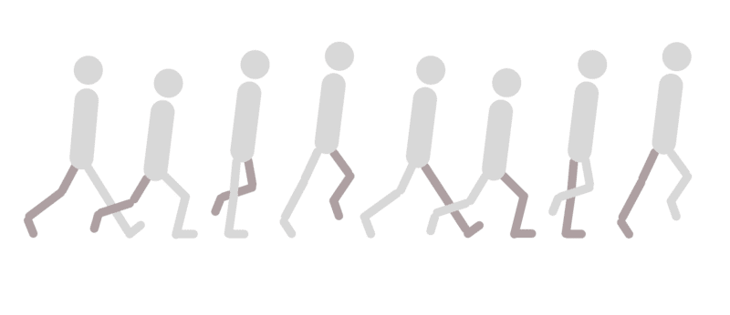

在传统(手绘)动画中，资深或关键的艺术家绘制定义运动的关键帧。

助手，通常是实习生或初级艺术家，然后为场景绘制必要的中间画面。助手的工作，也被称为中间者，是使关键姿势之间的过渡看起来平滑和自然。


中间是必要的，因为没有它们的动画会显得不连贯。不幸的是，在中间画图或多或少是一项繁重的工作。但是现在是 21 世纪，我们有可以处理这类任务的电脑。

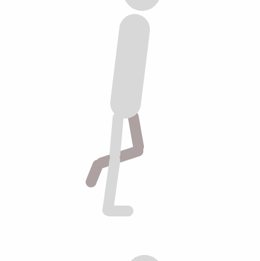

Choppy Animation

还记得小学时老师告诉你的关于电脑是哑巴的话吗？计算机需要被告知执行一个动作的确切步骤顺序。今天我们来看一个这样的步骤序列或算法，它帮助计算机绘制必要的中间点来创建一个平滑的动画。

我将使用 HTML5 canvas 和 JavaScript 来演示该算法。然而，即使你不熟悉这篇文章，你也能够阅读并理解它。

### 目的

我们的目标很简单，制作一个从 A 点`(startX, startY)`到 B 点`(endX, endY)`的球的动画。

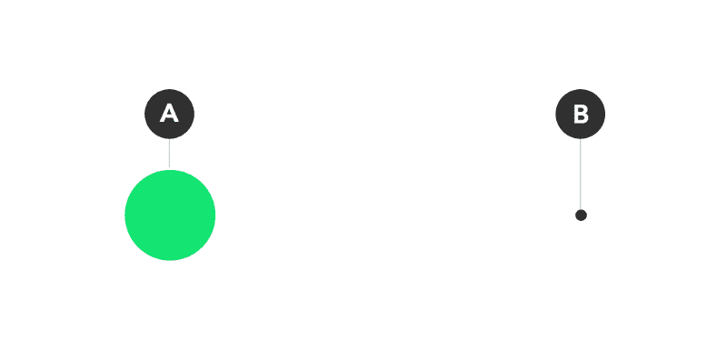

如果这个场景被传到一个做传统动画的工作室，这位资深艺术家会画出以下关键姿势…

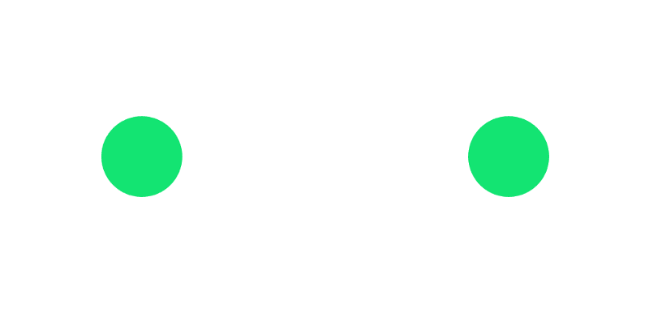

…然后把画板递给一个初级画家，让他画出这样的中间部分。

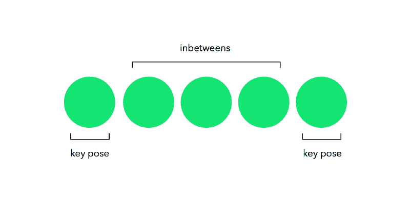

对于我们的情况，没有动画工作室，也没有初级艺术家。我们有的只是一个目标，一台电脑，和写一些代码的能力。

### 方法

HTML 代码很简单，我们只需要一行代码。

```
<canvas id=”canvas”></canvas>
```

这部分 JavaScript 代码(如下所示)只是从文档对象模型(DOM)中抓取`<canva` s/ >、 `[gets c](https://developer.mozilla.org/en/docs/Web/API/CanvasRenderingContext2D)` ontext，并设置画布的宽度和高度属性以匹配视口。

```
const canvas = document.getElementById(‘canvas’),  context = canvas.getContext(‘2d’),  width = canvas.width = window.innerWidth,  height = canvas.height = window.innerHeight;
```

下面的函数在`x`和`y`坐标处绘制了一个半径为`radius`的绿色实心圆。

```
function drawBall(x, y, radius) {  context.beginPath();   context.fillStyle = ‘#66DA79’;  context.arc(x, y, radius, 0, 2 * Math.PI, false);  context.fill();}
```

上面所有的代码都是设置动画的样板文件，下面是有趣的部分。

```
// Point Alet startX = 50, startY = 50;
```

```
// Point Blet endX = 420, endY = 380;
```

```
let x = startX, y = startY;
```

```
update();function update() {  context.clearRect(0, 0, width, height);  drawBall(x, y, 30);  requestAnimationFrame(update);}
```

首先，注意`update`函数在其声明的正上方被调用。其次，注意`requestAnimationFrame(update)`反复调用`update`*。*

*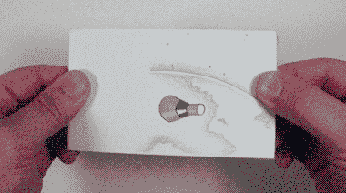

A Flipbook animation* 

*“动画书”动画是对我们正在编写的程序的一个很好的类比。就像反复翻阅动画书会产生运动的错觉一样，反复调用`update`函数会为我们的绿球产生运动的错觉。*

*关于上面的代码需要注意的一点是,“update”只是一个名称。该函数可以被命名为任何其他名称。有些程序员喜欢用`nextFrame`、`loop`、`draw`或`flip`这样的名字，因为函数会被重复调用。重要的部分是函数做什么。*

*在对`update`的每个后续调用中，我们期望该函数在画布上绘制一个与前一个稍有不同的图像。*

*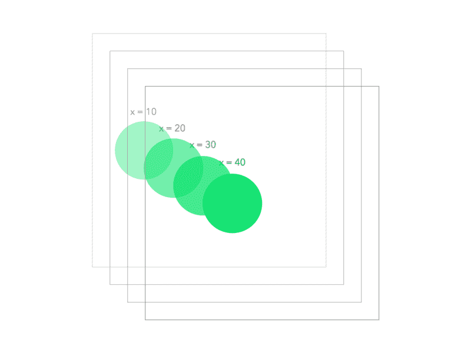*

*我们当前对`update`的实现在每次调用`drawBall(x, y, 30)`时在相同的精确位置绘制球。没有动画，但让我们改变这一点。下面是一只[笔](http://codepen.io/nashvail/pen/XRNprQ)，里面包含了我们到目前为止已经写好的代码，你可以打开它跟着做。*

*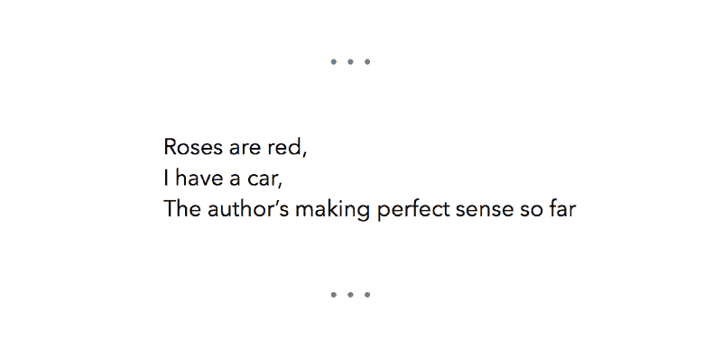*

*在`update`的每次迭代中，让我们继续增加`x`和`y`的值，看看它创建的动画类型。*

```
*`function update() {  context.clearRect(0, 0, width, height);  drawBall(x, y, 30);  x++; y++;  requestAnimationFrame(update);}`*
```

*每次迭代都将球在 x 和 y 方向上向前移动，重复调用`update`会产生如图所示的动画。*

*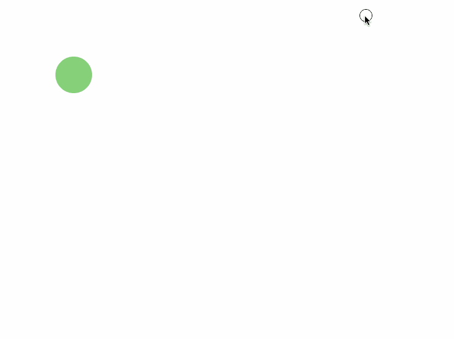*

*事情是这样的，我们的目的是将球从开始位置移动到结束位置。但是我们绝对没有在终点位置停止球。让我们解决这个问题。*

*一个显而易见的解决方案是仅当坐标小于`endX`和`endY`值时才增加坐标。这样，一旦球越过`endX, endY`，它的坐标将停止更新，球将停止。*

```
*`function update() {  context.clearRect(0, 0, width, height);  drawBall(x, y, 30);   if(x <= endX && y <= endY) {    x++;    y++;  }   requestAnimationFrame(update);}`*
```

*但是这种方法有一个错误。你看到了吗？*

*这里的问题是，你不能仅仅通过将`x`和`y`的值增加`1`来使球到达*任何你想要的*终点坐标。例如，考虑终点坐标`(500, 500)`，当然如果你从`(0, 0)`开始，将`1`加到`x`和`y`，它们最终会到达`(500, 500)`。但是如果我选择`(432, 373)`作为终点坐标呢？*

*使用上述方法，您只能到达与水平轴成 45 度角的直线上的点。*

*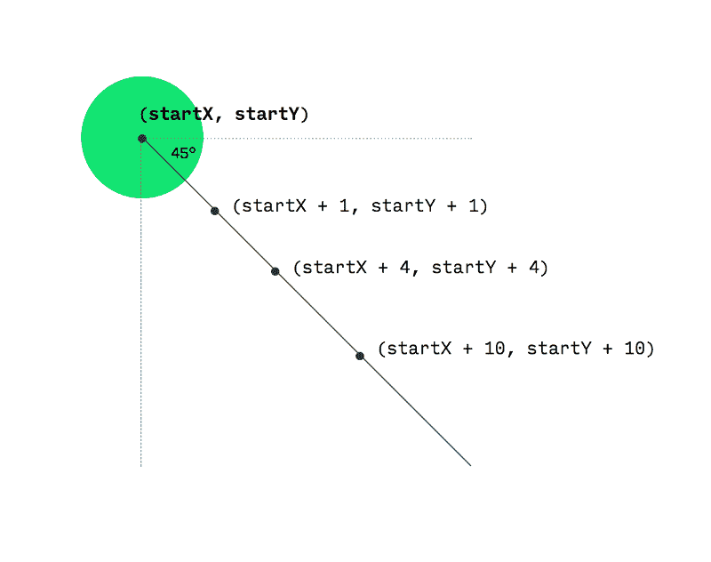*

*现在你可以使用三角学和奇特的数学来计算精确的量，即`x`和`y`应该增加多少，以达到你想要的任何坐标。但是当你有线性插值时，你不需要这样做。*

### *线性插值方法*

*这里是线性插值函数 a.k.a `lerp`的样子。*

```
*`function lerp(min, max, fraction) {  return (max — min) * fraction + min;}`*
```

*为了理解线性插值的作用，考虑一个左端有一个`min`值、右端有一个`max`值的滑块。*

*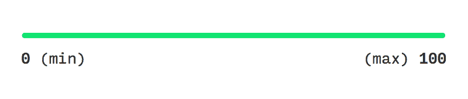

min = 0, max = 100* 

*接下来我们需要选择的是`fraction`。`lerp`获取`fraction`，并将其转换为一个介于`min`和`max`之间的值。*

*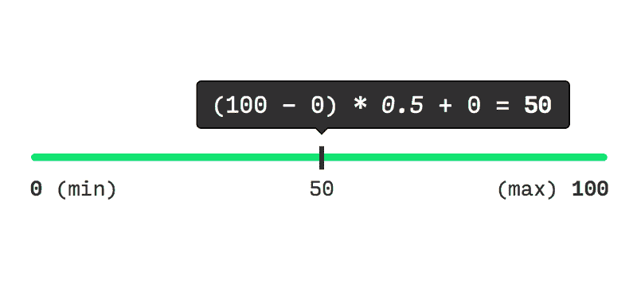

min = 0, max = 100, fraction = 0.5* 

*当我将`0.5`放入`lerp`公式中时——不出所料——结果是 50。这正好是`0`(最小)和`100`(最大)的中间点。*

*类似地，如果我们为`fraction`选择另一个值，比如说`0.85` …*

*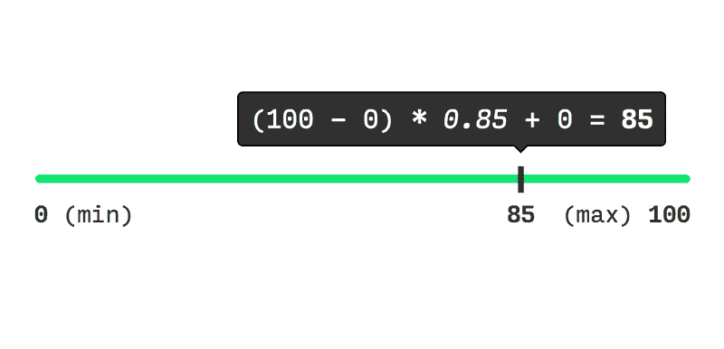

min = 0, max = 100, fraction = 85* 

*而如果我们让`fraction = 0`，`lerp`会输出`0` (min)，on `fraction = 1`，`lerp`会产生`100` (max)。*

*我选择 0 和 100 作为`min`和`max`以保持这个例子的简单，但是`lerp`将适用于任意选择的`min`和`max`。*

*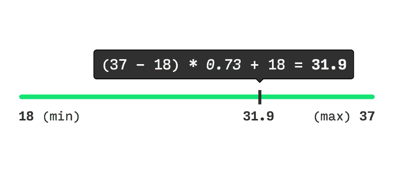

min = 18, max = 37, fraction = 0.73* 

*对于`0`和`1`之间的`fraction`值，`lerp`允许您在`min`和`max`之间用*插值*。或者换句话说，在`min`和`max`值之间遍历，其中为`fraction`选择`0`会将您置于`min`，选择`1`会将您置于`max`，对于`0`和`1`之间的任何其他值，会将您置于`min`和`max`之间的任何位置。你也可以看到`min`和`max`作为关键姿态，就像在传统动画中一样，而`lerp`作为中间输出；-).*

*好吧，但是如果有人给了一个在`0`和`1`边界之外的值作为`fraction`到`lerp`呢？你看，`lerp`的公式通过最基本的数学运算非常简单。这里没有技巧或错误的值，只是想象在两个方向上扩展滑块。无论为`fraction`提供什么值，`lerp` *将*产生一个逻辑结果。我们不应该在这里花太多心思在不好的值上，我们应该考虑的是所有这些如何映射到球的动画上。*

*如果您正在跟进，继续修改`update`函数以匹配下面的代码。另外，不要忘记添加我们在本节开始时定义的`lerp`函数。*

```
*`function update() {  context.clearRect(0, 0, width, height);  drawBall(x, y, 30);  x = lerp(x, endX, 0.1);  y = lerp(y, endY, 0.1);  requestAnimationFrame(update);}`*
```

*这是我们程序现在的样子。试着四处点击:)*

*顺利吧？下面是`lerp`如何帮助改进动画。*

*在代码中，注意变量`x`和`y`——它们最初被设置为`startX`和`startY`——标记球在任何帧中的当前位置。另外，我选择`0.1`作为`fraction`是任意的，你可以选择任何你想要的分数值。请记住，您选择的`fraction`会影响动画的速度。*

*在每一帧中，`x`和`endX`作为`min`和`max`，并与作为`fraction`的`0.1`进行插值，以获得`x`的新值。类似地，`y`和`endY`被用作`min`和`max`，以使用`0.1`作为分数来获得`y`的新值。*

*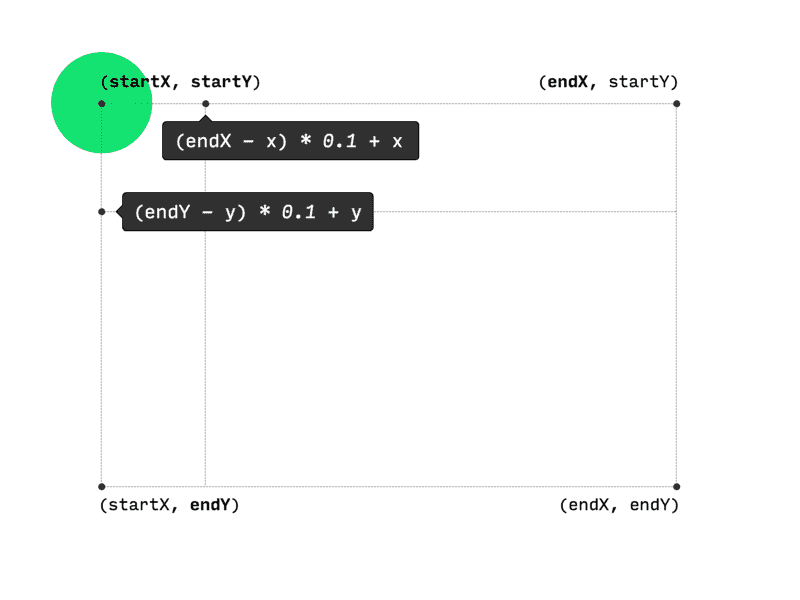*

*然后在新计算的`(x, y)`坐标绘制球。*

*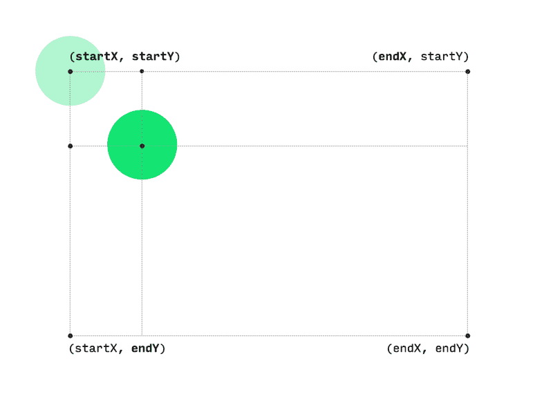*

*重复这些步骤，直到`x`变成`endX`并且`y`变成`endY`，在这种情况下`min = max`。当`min`和`max`变得相等时`lerp`会为任何后续帧抛出完全相同的值(最小值/最大值),从而停止动画。*

*这就是如何使用线性插值来平滑地动画一个球。*

*这篇短文涵盖了很多内容。我们从定义关键姿势和中间姿势这样的术语开始。然后，我们尝试了一种简单的方法来画中间点，并注意到了它的局限性。最后，通过线性插值，我们能够实现我们的意图。*

*我希望所有的数学对你有意义。随意玩线性插值甚至更多。这篇文章的灵感来自于[瑞秋·史密斯](https://www.freecodecamp.org/news/understanding-linear-interpolation-in-ui-animations-74701eb9957c/undefined)在 CodePen 上[的帖子。瑞秋的帖子还有很多例子，一定要去看看。](https://codepen.io/rachsmith/post/animation-tip-lerp)*

*想要更多吗？我定期在 nashvail.me 的[博客上发表文章。](https://nashvail.me)那里见，祝你愉快！*

**