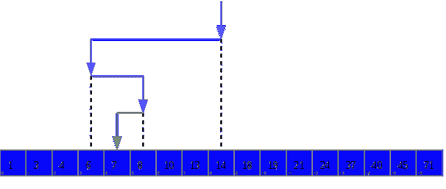

# 用 C++解释二分搜索法算法

> 原文：<https://www.freecodecamp.org/news/what-is-binary-search-algorithm-c-d4b554418ac4/>

巴勃罗·科尔特斯

# 用 C++解释二分搜索法算法


Image source: Unsplash

二分搜索法是那些你会在每堂(好的)计算机科学导论课上遇到的算法之一。这是一种在有序列表中查找条目的有效算法。为了这个例子，我们假设这是一个数组。

二分搜索法的目标是:

*   能够在每次迭代中丢弃数组的一半
*   尽量减少我们必须经历的元素数量
*   留给我们最后一个价值

以下面的整数数组为例:

```
int array[] = {     1, 3, 4, 6, 7, 8, 10, 13, 14, 18, 19, 21, 24, 37, 40, 45, 71 };
```

假设我们试图在这个数组中找到数字 7 的索引值。总共有 17 个项目，索引值从 0 到 16。

我们可以看到索引值 7 是 4，因为它是数组中的第五个元素。

但是对于计算机来说，找到我们要找的数字的索引值的最好方法是什么呢？

首先，我们存储`min`和`max`值，比如`0`和`16`。

```
int min = 0;int max = 16;
```

现在我们必须想出一个猜测。最聪明的做法是猜测数组中间的索引值。

该数组的索引值为 0 到 16，数组的中间索引值为 8。包含数字 14。

`// This will round down if the quotient is not an integer`


我们的猜测现在等于 8，也就是数组中的 14，因为`array[8]`等于`14`。



(Wikimedia Commons.) The first guess is at index value 8, which stores the number 14.

如果我们要找的数字是 14，我们就完了！

由于情况并非如此，我们现在将丢弃数组的一半。这些都是 14 之后的数字，或者索引值 8，因为我们知道 14 大于 7，我们的猜测太高了。

在第一次迭代之后，我们的搜索现在在:`1, 3, 4, 6, 7, 8, 10, 13`

我们不必在原数组的后半部分进行猜测，因为我们知道所有那些值都太大了。这就是为什么我们将二分搜索法应用到一个有序列表中很重要。

由于我们最初对 14 的猜测大于 7，现在我们将其减少 1 并存储到`max`中:

```
max = guess - 1; // max is now equal to 7, which is 13 in the array
```

现在搜索看起来像这样:

```
 1, 3, 4, 6, 7, 8, 10, 13
```

```
min = 0max = 7guess = 3 
```

因为我们的猜测太低，我们通过增加`min`来丢弃数组的下半部分，与我们之前对`max`所做的相反:

```
min = guess + 1; // min is now 4
```

到下一次迭代时，我们只剩下:

```
 7, 8, 10, 13min = 4max = 7guess = 5
```

因为索引值 5 返回 8，所以我们现在比目标多一个。我们再次重复这个过程，我们只剩下:

```
 7min = 4max = 4guess = 4
```

我们只剩下一个值，4，作为我们要寻找的目标数的索引，也就是 7。

二分搜索法的目的是在每次迭代中去掉一半的数组。所以我们只研究那些继续猜测有意义的值。

该算法的伪代码如下所示:

1.  设`min = 0`，设`max = n`，其中`n`是可能的最高索引值
2.  求`min`和`max`的平均值，向下舍入为整数。这是我们的`guess`
3.  如果我们猜对了号码，停，我们猜对了！
4.  如果`guess`太低，将`min`设置为比`guess`大 1
5.  如果`guess`过高，将`max`设置为比`guess`小 1
6.  回到第二步。

这里有一个用 C++写的解决方案: