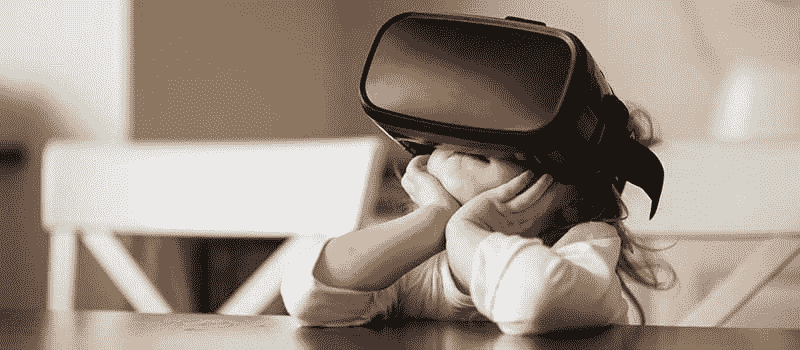

# 人工智能让虚拟和增强现实更加真实的 8 种方式

> 原文：<https://www.freecodecamp.org/news/8-ways-ai-makes-virtual-augmented-reality-even-more-real-25037707cfa1/>

作者:姚

# 人工智能让虚拟和增强现实更加真实的 8 种方式

*这篇文章是由&和 TOPBOTS 的作者[尼克·霍尔](http://www.topbots.com/staff)合作编辑的。*

常规现实正在被虚拟和增强现实(VR/AR)所颠覆。科技界的大腕们正在为下一代娱乐、教育和通信领域的发展而战。

脸书收购 Oculus，让下一代社交网络虚拟化。苹果首席执行官蒂姆·库克[声称](http://fortune.com/2017/02/13/apple-tim-cook-ar-augmented-reality-iphone/)增强现实将“和 iPhone 一样大”微软的 HoloLens、谷歌的 Tango 和英特尔的 Project Alloy 只是正在进行的无数开发中的几个例子，这些开发旨在使 VR/AR 设备像电脑和手机一样无处不在。

另一个主要趋势是人工智能(AI)，它提高了引人注目的 VR/AR 体验背后的技术复杂性。尽管有大肆宣传，但 AI 在 VR/AR 中推动的进步绝不是人为的。

以下是人工智能让我们的虚拟现实更加真实的 8 种具体方式。

### 1.物理环境测绘

Occipital's Bridge 是人工智能如何帮助实时绘制整个环境并将结果与虚拟世界融合的一个例子。Bridge 上的外部'[结构传感器](https://www.youtube.com/watch?v=Iys8yo0sjYg)输入到人工智能系统中，并允许完全在耳机中获得“混合现实”体验。这要归功于即时深度感知和六自由度精确定位的魔力。结果是你获得了一个完全沉浸在真实世界结构中的虚拟现实体验。

这个羽翼未丰的系统已经可以制作出 CAD 质量的房屋模型，所以你可以在购买之前先试一下家具和装饰品。这种混合版本的现实可以在当地零售店提供[精确的 AR 购物体验](http://gizmodo.com/googles-project-tango-will-power-augmented-reality-shop-1594886458)。该公司还邀请开发者开发新的应用程序，并采用开源方法。

谷歌 Tango 可以说更先进，已经在联想 Phab 2 上投入使用。到目前为止，大多数针对手机的应用都是相对简单的游戏。我们预计这种情况会迅速改变。

### 2.精确的深度感知

绘制建筑物的墙壁是一回事，绘制手术台上病人不断移动的内部器官则完全是另一回事。我们正在接近这样一个世界，外科医生将通过耳机看到你的主要器官，这是一种现代的 x 光视觉。事实上，我们从 mbits imaging 和“[手术垫](https://www.youtube.com/watch?v=T4mboj-GbEA)等产品中获得了最初的概念。

展望未来，手术机器人将接管常规手术。这些设备的一个重要部分将是自动深度感知和即时、准确的调整。即使是有规律的呼吸也会导致患者的位置发生轻微变化，因此只有人工智能的精度才能应对大量的计算，这些计算将区分干净的切口和切断的动脉。

### 3.选择性危险警告

战场上的士兵在猛烈的炮火下瞬间做出生死攸关的决定。与此同时，他们被来自天上的眼睛和基地里的船员的信息轰炸。

人工智能有能力为他们做出复杂的决定，并且已经在军事战略中得到应用。由人工智能驱动的 AR 系统可以运行数百万次模拟，将当前情况与档案进行比较，并在任何子弹发射之前确定最佳行动路线。未来的士兵将拥有一个视频游戏风格的视野，所有的辅助都打开了。

AR 还可以突出明确和当前的危险，这使得地面上的士兵能够做出明智的选择，并有序地处理威胁。ARC4 是迈向这一未来愿景的一小步。一个连接到军用无人机、卫星和更多设备的系统，未来的战场将是一个更加高科技的环境。

军事技术将渗透到民用领域。帮助海军陆战队赢得胜利的相同 AR 系统可以从迎面而来的汽车中拯救骑自行车的人。Garmin 的[配备雷达的 Varia Vision](https://www.digitaltrends.com/wearables/garmin-varia-vision-news/) 是未来的想法，但未来的模型将会看到拐角处，并在你处于危险之前给你提前警告。

### 4.定制的模拟和培训

人工智能和 VR/AR 的结合是教育下一代外科医生、飞行员甚至在校青少年的有力工具。

医生们已经获得了无数小时的虚拟手术时间，因此他们可以在到达病房之前应对每一种并发症。紧急医疗队(EMTs)处理车祸和自然灾害，消防员在最严重的火灾中航行，飞行员体验发动机如何失灵——所有这些都在虚拟世界中进行，没有一个生命受到威胁。

人工智能可以通过整合更多的数据点，比较和对比不同的技术，以及个性化的教育来改善模拟训练。该系统将更像一个可定制的教练，而不是静态的模拟器。孩子们可以得到他们自己的古罗马和亚马逊丛林导游。他们将会问问题，看到世界的动态，体验书本无法提供的互动教育。

通过一组简单的传感器和一个监控每个动作的耳机，我们应该能够学习从完美的高尔夫挥杆到中文的一切。几乎任何人都应该能够在任何学术或体育学科获得世界级的教练。人工智能与虚拟现实/增强现实的结合有可能使教育民主化，给每个学生一个学习的机会。

### 5.真正的社交媒体

有一天，当我们和远在地球另一端的朋友一起喝着虚拟咖啡放松时，我们会回过头来，对着脸书可怜的聊天窗口大笑。在不久的将来，我们可以在真实或虚拟的环境中见到我们的朋友，从台球厅到泰姬陵，就像他们在同一个房间里一样进行互动。这需要令人难以置信的处理能力，但多亏了人工智能，我们还是可以做到的。

通过[购买 Oculus Rift](https://www.cnet.com/news/facebook-mark-zuckerberg-shows-off-live-vr-virtual-reality-chat-with-oculus-rift/) 而在 VR 领域投入巨资的脸书，已经在使用深度学习的生成模型，根据你的照片自动设计[可信的角色头像](http://www.gizmodo.co.uk/2017/04/facebook-researchers-used-celebrity-bitmoji-to-help-create-vr-avatars/)。

### 6.角色建模

现在，我们使用两种方法制作角色动画:动作捕捉和手工 CG 工作。手工制作的动画很费力，而动作捕捉受限于被建模的演员的身体能力。变化得益于人工智能方法，如[通过演示学习](http://www.topbots.com/bringing-ai-robot-characters-avatars-life/)、[自学人工智能](http://www.topbots.com/humans-need-not-apply-mit-teaches-robots-train/)、[阶段功能神经网络](http://theorangeduck.com/media/uploads/other_stuff/phasefunction.pdf)。

动作捕捉包括费力地记录大量重复的动作。爱丁堡大学开发的相位功能神经网络等新系统使用机器学习来组合庞大的存储动作库，并将它们映射到新角色上。

该团队将神经网络应用于一个名为橙色鸭子的角色，结果非常显著。

这将在视频游戏、卡通和虚拟现实环境中开辟一个真实动画的新世界。在神经网络的帮助下，一次相对简单的动作捕捉可以变成全方位的运动。这意味着从理论上讲，现实人物可以在飞行中被创造出来。

并非所有人都对人工智能驱动的动画感到满意。吉卜力工作室创始人宫崎骏[臭名昭著地反映](https://www.youtube.com/watch?v=ngZ0K3lWKRc)当展示日本公司 DWANGO 的自动角色模型时，AI 代表了“时代的终结”。也许你不应该感到惊讶，这让一个一生都在用人工智能取代绘画的人感到不安。

### 7.对话式非玩家角色(NPC)

视频游戏中的辅助、不可玩的角色(NPC)因行为古怪而臭名昭著。当犯罪在他们面前发生或陌生人闯入他们的家时，他们表现得漠不关心。他们的谈话很生硬，他们只是不适应环境。

即使在像“质量效应”这样的对话驱动游戏中，NPC 也是事后才想到的。控制台只能提供这么多的处理能力，所以 NPC 经常成为背景的一部分。但是有了人工智能为他们的现实主义提供动力，NPC 可以适应事件，甚至参与适当的对话。游戏控制台，尤其是虚拟现实，可以携带神经形态芯片，将人工智能相关的任务发送到云服务器，因此即使是副业角色也可以根据其他玩家的输入进行进化。

### 8.渲染优化

VR / AR 最大的挑战之一是用今天的消费级硬件渲染逼真的图形。太多的复杂性导致[像素化的图像和滞后](https://medium.com/visbit/why-do-all-the-360-vr-videos-today-look-so-pixelated-b1ab3cba6f95)。这导致 VR 头戴设备佩戴者很头疼。结果是大多数 VR 体验都过于简单化，缺乏令人信服的细节。

人工智能在游戏渲染中的应用是如此明显，以至于 Nvidia 甚至提供了[正式课程](https://developer.nvidia.com/deep-learning-games)教授 3D 和图形艺术家如何将深度学习技术应用于超级分辨率、照片到纹理映射和纹理乘法等任务。在 VR 中，机器学习可以用于选择性渲染，其中只有观众正在观看的场景部分以完全视觉保真度动态生成，从而节省计算成本。图像也可以通过人工智能技术进行更加智能的压缩，在没有明显质量损失的情况下，通过无线连接实现更快的传输。

高成本壁垒和落后的硬件导致 VR/AR 在过去几年中被过度宣传。通过使用人工智能来克服技术障碍和提高真实感，现在你可以在真实拓扑结构的 30 厘米内[检查火星错综复杂的外星景观。鉴于美国宇航局对宇航员的接受率不到 0.08%，由人工智能驱动的虚拟现实可能是你最接近太空冒险的体验。](https://community.plm.automation.siemens.com/t5/NX-Design-Blog/Rendering-VR-and-AI-Oh-my-The-Inside-Scoop-on-NVIDIA-GTC-2016/ba-p/342428)

喜欢你所阅读的东西？你可以在 www.topbots.com 找到更多这样的故事。或者加入 [TOPBOTS](http://www.topbots.com/bot-news-pro-newsletter/?utm_medium=article&utm_source=medium&utm_campaign=newsletter) 社区，获取最好的机器人新闻&独家行业内容。