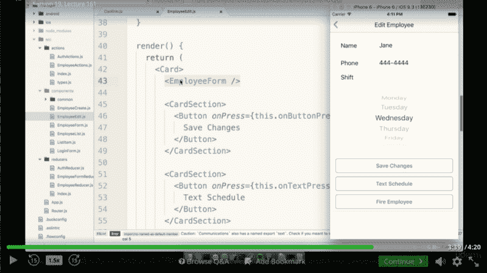
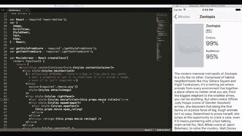

# 在构建了我的第一个 React 原生应用程序之后，我现在确信它就是未来。

> 原文：<https://www.freecodecamp.org/news/after-building-my-first-react-native-app-im-now-convinced-it-s-the-future-d3c5e74f8fa8/>

泰勒·米利曼

# 在构建了我的第一个 React 原生应用程序之后，我现在确信它就是未来。

Screenshots from the current version of my app

在玩了几周 React Native 之后，我刚刚完成了我的第一个真正的移动应用。这相当简单，但我只花了几天时间就做好了，而且做得很开心。

我为我最喜欢的美食博客 [Smitten Kitchen](https://smittenkitchen.com/) 创建了一个移动应用。

该应用程序允许用户搜索超过 1000 种食谱的数据库，并简明地查看每种食谱的必要成分和说明。

用户还可以将食谱加入书签，并轻松地与朋友分享。

我仍然在等待博客的许可来发布这个应用，但是你可以在这里查看所有的代码。注意，出于对 Smitten Kitchen 的尊重，我的 API 的 url 暂时被删除了。

### React Native 不会很快消失

开发人员的一个普遍保留意见是，如果一项新技术很有可能在不久的将来过时，他们就不想花时间去学习它。

即使从我相对较少的 React Native 经验来看，我也发现它是一个非常强大的工具。我相信它将在未来的岁月里得到应用。

脸书、Instagram 和 Airbnb 都使用 React Native 开发了最新版本的移动应用。这里有一个使用它开发的其他一些流行应用的列表。

播客[软件工程日报](https://softwareengineeringdaily.com/2017/04/11/the-future-of-react-native-with-brent-vatne-and-adam-perry/)的创建者杰夫·迈耶森广泛谈论了 React 原生平台。他相信它会生存下来，并继续占领移动生态系统的大部分。

他甚至推测，脸书可能正在开发他们自己的手机，这款手机将专门用于支持 React Native 开发的应用程序。

### React Native 与其他跨平台工具有何不同

如果你不熟悉 React Native，这是一个由脸书发起的开源项目。它允许开发者使用 JavaScript 构建跨平台的移动应用。它的工作方式与 React 非常相似，React 是脸书流行的用于构建单页面 web 应用程序的 JavaScript 库。

我一直对那些标榜自己是移动跨平台的工具持怀疑态度。很多时候，你最终得到的外观、感觉和性能都与原生平台不太匹配。

React Native 不像其他移动应用开发框架，比如 Ionic 或者 Cordova。那些运行在网络视图中的应用程序，或者“HTML5 应用程序”，或者“混合应用程序”

您构建了一个高性能的移动应用程序，它与使用 Swift/Objective-C 或 Java 构建的应用程序没有区别。

话虽如此，理解平台之间的错综复杂和差异仍然很重要。Android 和 iOS 的用户体验是根本不同的，你仍然需要以一种在两个平台上都感觉自然的方式来构建你的应用。

此外，如果您需要添加 React 本机库尚不支持的功能，React Native 可以让您轻松地用相应的语言编写自己的[本机模块](https://facebook.github.io/react-native/docs/native-modules-ios.html)，然后可以链接到 React 本机代码库。

### 如何开始

就我个人而言，我用[这个我的课程](https://www.udemy.com/the-complete-react-native-and-redux-course/learn/v4/overview)开始。它是 react 和 redux 的一个很好的补充，有助于进行设置。

最近脸书发布了 [Create React Native App](https://facebook.github.io/react-native/blog/2017/03/13/introducing-create-react-native-app.html) 。该工具进一步简化了初始设置过程。

Working my way through the Udemy Course

如果你已经熟悉 React，你可以直接进入[文档](https://facebook.github.io/react-native/docs/getting-started.html)。然而，只要 10 美元，这个课程就很划算，它将带你完成制作四个移动应用程序的过程，以及你可以在未来项目中重用的通用组件。

Udemy 还为那些已经熟悉该平台的人提供了一门课程，涵盖了[高级 React 本地概念](https://www.udemy.com/react-native-advanced/)。

### React Native 中的样式

React Native 中的样式需要一些时间来适应。React Native 大量使用 CSS flexbox，这是我不太习惯的东西，即使是来自网络背景。

幸运的是，已经有一些很棒的资源可以了解 flexbox:

【flexbox 的工作原理——用巨大的彩色动画 gif 图解释

[React 原生布局示例](http://browniefed.com/blog/react-native-layout-examples/)

一个帮你练习的好玩游戏: [Flexbox Froggy](http://flexboxfroggy.com/)

在使用 React Native 几个星期后，我现在对 flexbox 有了更好的理解，可以应用到我的下一个 web 项目中。

当前的最佳实践是为每个组件创建一个样式对象，然后通过 inline-styles 应用它。请记住，您实际上并没有编写 CSS，所以属性的命名也有一点不同。

另一个关键区别是，您不能在 javascript 中使用 HTML 标记，因为您正在编写在手机上运行的代码，而不是在浏览器中。相反，组件是用 React 本机库提供的一组基础级组件构建的。

这需要一点时间来适应，但是在你知道之前，你会发现自己无意中使用了一个`<View>&`lt；/在您的下一个 web app 中查看 `place of a` < div > < /div >中的>标签。

为了更好地理解所有这些是如何工作的，请看一下下面一个简单按钮组件的代码。

下面是 GitHub 的要点。

### 航行

导航是 React Native 为数不多的几个在明确的解决方案上没有共识的领域之一。

React Router 已经成为 React 社区选择的标准库，但是在 React 本地社区中还有许多库。

就我个人而言，我在我的项目中使用了 [React Native Router Flux](https://github.com/aksonov/react-native-router-flux) 库，效果很好。但是我知道在更复杂的项目中你可能会遇到更大的问题。

幸运的是，React Native 已经开发了一个庞大的社区。这个项目的新版本每个月都会发布，所以我相信像导航这样的问题会随着时间的推移得到解决。

### 开发者体验很重要

Android 和 iOS 应用程序之间共享代码的能力无疑是 React Native 的一个优势，但这只是该工具如此不可思议的一小部分。

我最喜欢使用 React Native 的部分是能够立即重新加载。我过去用过 Android Studio，通常需要处理 30-60 秒的构建时间。

这节省了时间，而且我发现进入[流畅状态](https://en.wikipedia.org/wiki/Flow_(psychology))更容易，没有那些烦人的构建时间来打扰我。

Hi I’m Taylor. Hot Reloading changed my life. Source: [Facebook](https://facebook.github.io/react-native/blog/2016/03/24/introducing-hot-reloading.html)

React Native 使移动开发再次变得有趣，仅此一点就足以成为您在下一个项目中尝试它的理由。

### 愿意探索

React Native 是一个很好的例子，说明了当我们将在一个软件领域(web)证明成功的想法应用到一个看似独立的领域(移动)时会发生什么。

正如 Haseeb Quereshi 在他的[关于融合的演讲](https://softwareengineeringdaily.com/2017/02/24/convergence-with-haseeb-qureshi/)中令人信服地指出的，作为软件工程师，我们应该在某些原则、语言和工具上融合，这些原则、语言和工具可以成功地普遍应用。

Source: [ThoughtCo](https://www.thoughtco.com/philosophy-of-mind-250531)

我们应该想找到真正的最优解。

> “保持你的小身份”——保罗·格拉厄姆

很多时候，我们在一个社区内变得过于教条，这是以从外部社区获得重要见解为代价的。

去探索其他领域。

如果你尝试一下 React Native，你会发现结果有多棒。

非常感谢您抽出时间阅读我的文章。

要阅读更多我写的关于软件开发和个人发展的文章，请访问 [taylormilliman.me](http://taylormilliman.me/) 。

如果您喜欢关于 React Native 的更多详细文章/教程，请单击？下面，并随时在下面留下评论。