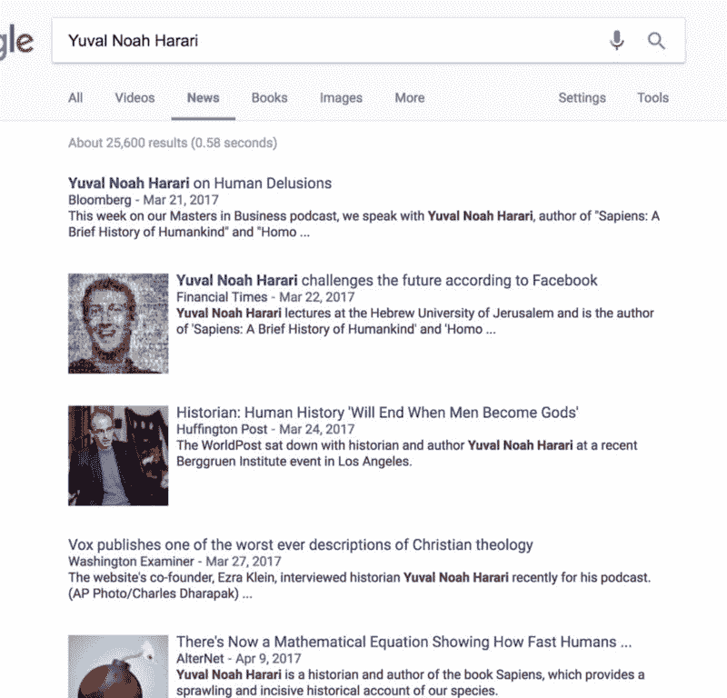

# 9 个永远消失的热门在线课程…以及如何找到它们

> 原文：<https://www.freecodecamp.org/news/9-popular-online-courses-that-are-gone-forever-and-how-you-can-still-find-them-a716ddf8e1d9/>

自 2011 年末免费在线课程首次兴起以来，全球超过 700 所大学已经创建了超过[7000 门在线课程](https://www.class-central.com/)。

但是几乎三分之一的课程在[课程中心](https://www.class-central.com/)被列为[完成](https://www.class-central.com/courses/past)。这意味着我们不知道这些课程何时(或是否)会再次开设。

去年，当 Coursera [关闭他们的旧技术平台](https://www.class-central.com/report/coursera-old-platform-shutdown-download-courses/)时，我们失去了几百个这样的课程。

其中一些课程已经回归，甚至迁移到不同的课程平台。但许多课程已经离线多年，在许多情况下，课程平台已经从网站上删除了课程的描述页面。就像他们从未存在过一样。其中一些课程在 Class Central 上有数百条评论，有成千上万的学习者学习了这些课程。

幸运的是，Class Central 拥有几乎所有已开设课程的完整历史。我把所有完成的课程都梳理了一遍，把几门热门课程列了一个清单。在可能的情况下，我会推荐其他来源来获取课程视频。

### 1.丹·艾瑞里的非理性行为初学者指南

如果你喜欢阅读关于经济的文章或听播客，你可能知道谁是丹·艾瑞里。他是杜克大学的心理学和行为经济学教授，在媒体中经常被用作主题“专家”。他是一个相当受欢迎的人物——他的 TED 演讲有超过 700 万人观看，他还写了多本《纽约时报》畅销书。

早在 2013 年 3 月，丹·艾瑞里还在 Coursera 上推出了一门非常受欢迎的课程，名为*非理性行为初学者指南。*Coursera 上的课程页面已经不存在了，但是你可以在[课堂中心这里找到](https://www.class-central.com/mooc/424/coursera-a-beginner-s-guide-to-irrational-behavior)。它最近一次在 2014 年 3 月推出，在 Class Central 上有超过 500 条评论，几乎所有评论都是 5 星评论。事实上，它仍然是班级中心心理学评分最高的课程。

你可以在 Quora [上阅读为什么这门课程被取消了](https://www.quora.com/Has-the-Dan-Ariely-course-been-removed-from-Coursera)。

#### 在哪里可以找到课程资料？

另一个 Quora 用户[已经备份了课程资料](https://www.quora.com/Where-can-I-find-the-videos-by-professor-Dan-Ariely-for-A-Beginners-Guide-to-Irrational-Behavior)。你可以在这里找到[第 1 周—第 5 周](https://drive.google.com/drive/u/0/folders/0B9AAtHvw6OPiX0pELUU2SEc5SlE)和[第 6 周](https://www.dropbox.com/sh/aj7ruq7ypmnttd2/AADsSyfye21BKT4GKzWf8ZAVa?dl=0)。如果你在 YouTube 上搜索，你也会发现丹·艾瑞里的一些演讲。这些不是本课程的视频，但可能会有一些重叠。

### 2.CS188.1x:人工智能

看到这个 edX 课程被取消，令人失望。加州大学伯克利分校的 [CS188.1X](https://www.class-central.com/mooc/445/edx-cs188-1x-artificial-intelligence) 是 Class Central[有史以来排名前 50 的在线课程](https://www.class-central.com/collection/top-free-online-courses)之一，也是我们[人工智能](https://www.class-central.com/subject/ai?sort=rating-up)主题页面上排名第二的课程。我们甚至为这门课程发表了一篇[1100 字的深度综述](https://www.class-central.com/report/review-edx-uc-berkeley-artificial-intelligence/)。以下是评论者([马尔·米哈斯](http://malm.teqy.net/))所说的话:

> “这不仅仅是网上有史以来最好的人工智能课程。这是有史以来任何科目的最佳课程。”

根据 Mal 的说法，CS188.1x 是一门要求极高且非常困难的课程，但也是值得的。这是 Mal 提交的一个项目的 GIF 图。

你应该认真考虑阅读 Mal 的[完整评论](https://www.class-central.com/report/review-edx-uc-berkeley-artificial-intelligence/)来了解这个你永远也不会体验到的神奇课程。

#### 在哪里可以找到课程资料？

开玩笑的。这门课的教授们已经把所有的课程资料放到了他们的网站上。

### 3.社会心理学

这是另一门非常受欢迎的心理学课程。事实上，这是中央课堂上排名第三的心理学课程。于 2013 年 8 月推出的[社会心理学](https://www.class-central.com/mooc/555/coursera-social-psychology)已经被全球超过 50 万的学习者采用。该课程曾号称是世界上规模最大的课程，有 25 万名学员注册。即使在免费在线课程的全盛时期，这个数字也相当可观。

这门课的讲师斯科特·皮斯是卫斯理大学心理学系的心理学教授。他也是社会心理学网络(SPN)的创始人，这是世界上最大的致力于社会心理学的在线社区。

去年 Coursera 关闭了他们的旧平台后，这个课程就停止了。

#### 在哪里可以找到课程资料？

这篇文章的早期版本指出了上传到学术洪流的另一门课程。不幸的是，我还没能找到社会心理学的替代来源。

**更新** : [穆罕默德·亚瑟](https://www.freecodecamp.org/news/9-popular-online-courses-that-are-gone-forever-and-how-you-can-still-find-them-a716ddf8e1d9/undefined)将社会心理学视频上传到 [Google Drive](https://drive.google.com/drive/folders/0B39jsuKsL3G8UzFIOEZzYWVMY1E) 。感谢穆罕默德·亚西尔。

### 4.人类简史

尤瓦尔·诺亚·哈拉里博士是以色列历史学家，也是耶路撒冷希伯来大学历史系的终身教授。像丹·艾瑞里一样，你可能会在主流出版物中遇到他。

*A quick search on Google News shows a number of mentions for Dr. Yuval Noah Harari.*

他是许多书的作者，包括评价很高的《智人:人类简史》。根据对作家进行排名的亚马逊作者测试版，尤瓦尔博士是历史上排名第三的作家。能直接从这么一个当红的主流人物那里上一门课岂不是很神奇？

上一次你可以这样做是在 2014 年 8 月，当时课程在 Coursera 上提供。他的课程，[人类简史](https://www.class-central.com/mooc/566/coursera-a-brief-history-of-humankind)，是中央课堂上另一门评价很高的课程，我们可能再也看不到了。您可以通过访问中央课堂上的[课程页面](https://www.class-central.com/mooc/566/coursera-a-brief-history-of-humankind)查看教学大纲。第 17 讲的题目是“第 17 讲:智人的终结。”

#### 在哪里可以找到课程资料？

你不必违反法律就能获得这门课的教材。尤瓦尔博士已经把课程上传到了 YouTube 上。[这是播放列表](https://www.youtube.com/playlist?list=PLfc2WtGuVPdmhYaQjd449k-YeY71fiaFp)的链接。

### 5.6.7.自然语言处理(3 门课程)

这门课也可以叫做黑魔法防御术。出于某种原因，Coursera 上的自然语言处理课程已经有了三个版本，现在没有一个可用。这是这三门课程的清单。

1.  自然语言处理:丹·茹拉夫斯基和克里斯托弗·曼宁，斯坦福大学。该课程于 2012 年 3 月首次教授，是 Coursera 上首批提供的 20 门课程之一(现在已有 2000 多门)。
2.  [自然语言处理](https://www.class-central.com/mooc/836/coursera-natural-language-processing):迈克尔·柯林斯，哥伦比亚大学。于 2013 年 2 月推出。
3.  [自然语言处理入门](https://www.class-central.com/mooc/3332/coursera-introduction-to-natural-language-processing):德拉戈米尔·拉德夫，密歇根大学。这门课程相对较新，自 2015 年 10 月在 Coursera 上首次推出以来，已经开设了几次。该课程的 Coursera 课程页面仍然存在，但没有即将到来的课程日期。我希望这个最终会重新上线。

#### 在哪里可以找到课程资料？

这些课程都可以在两个地方找到:YouTube 和学术洪流。学术种子的好处是你也可以下载补充课程材料，如成绩单、pdf 或 PPT。

1.  斯坦福大学的 Dan Jurafsky 和 Christopher Manning。 [YouTube](https://www.youtube.com/watch?v=nfoudtpBV68&list=PL6397E4B26D00A269) | [学术洪流](http://academictorrents.com/details/d2c8f8f1651740520b7dfab23438d89bc8c0c0ab)
2.  自然语言处理:迈克尔柯林斯，哥伦比亚大学。 [YouTube](https://www.youtube.com/watch?v=mieV29RVpuQ&list=PLGQnlmH5d2z6ehl1bTY8BQxDTCHfr1TSY) | [学术洪流](http://academictorrents.com/details/8a8f93e18dd6c46c48ee2936ed500b1ff4cc9175)
3.  自然语言处理导论:德拉戈米尔·拉德夫，密歇根大学。 [YouTube](https://www.youtube.com/watch?v=n25JjoixM3I&list=PLLssT5z_DsK8BdawOVCCaTCO99Ya58ryR) | [学术洪流](http://academictorrents.com/details/78515f90de063ffc144be5e7e726c03849b4e0ed)

### 8.1300 年以来的世界历史/全球历史实验室

这个普林斯顿大学的课程有一段有趣的历史(哈！).它在三个不同的平台上提供。首先，它于 2012 年 9 月在 Coursera 上发布，名为【1300 年以来的世界历史。2014 年 9 月，它搬到了 NovoEd，被称为*全球历史实验室*。终于，它[在 2016 年 9 月的 edX](https://www.class-central.com/mooc/2371/edx-global-history-lab) 上现身了。可能阿德尔曼教授喜欢每两年开一次这门课。在课程的这些反复之间，材料可能已经部分或完全改变。

#### 在哪里可以找到课程资料？

不幸的是，我找不到课程材料。如果能找到，就在下面留言评论吧。如果您仍然可以访问课程的 [edX 迭代](https://www.class-central.com/mooc/2371/edx-global-history-lab)，也许您可以创建一个视频播放列表。EdX 以非公开模式在 YouTube 上托管他们所有的视频。你不能搜索它们，但如果你可以访问它们，你可以创建一个播放列表，并在下面的评论中告诉我们:)

### 9.启动工程

创业工程是斯坦福大学的一门课程，它“弥合了学术计算机科学和生产软件工程之间的差距。”

它曾在 Coursera 上提供过一次，时间是 2013 年 6 月。课程由 Balaji S. Srinivasan 教授；他是基因组学初创公司 Counsyl 的首席技术官和联合创始人，这家公司始于斯坦福大学的一间宿舍，现在检测了约 4%的美国新生儿。今年早些时候，特朗普政府还考虑让他领导 FDA(没错，巴拉吉讨厌 FDA)。目前，他是风投公司 A16Z 的董事会成员，也是 21.co 的首席执行官/联合创始人。

该课程还有另一位讲师，斯坦福大学教授维杰·潘德博士，但看起来该课程中的所有视频都以巴拉吉为特色。

#### 在哪里可以找到课程资料？

你可以在 YouTube 上的[这个播放列表中找到该课程的所有视频。](https://www.youtube.com/watch?v=u3APsyUvAZI&list=PL58C6Q25sEEFVyISrZc80RhYFpyMF_DYl)

我确信我错过了许多课程。如果你最喜欢的课程从在线课程平台上消失了，请在评论中告诉我。