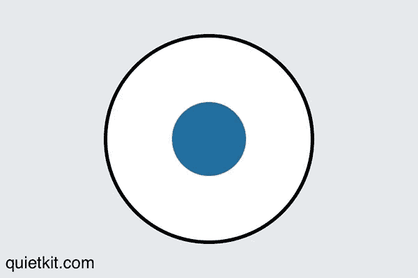
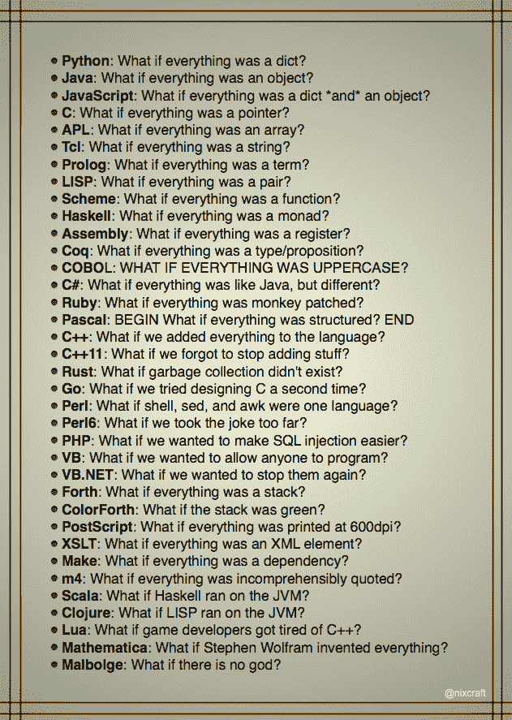

# 海豹突击队的一种呼吸技巧，可以让你在编码时保持冷静

> 原文：<https://www.freecodecamp.org/news/a-navy-seal-breathing-technique-you-can-use-to-keep-calm-when-coding-f05a66da8067/>

美国海豹突击队教授一种让自己冷静下来的技巧，叫做“战斗战术呼吸”。

下次当你遇到失败的测试或神秘的错误信息而感到沮丧或焦虑时，试试这个。我保证这比把你的头往桌子上撞要好。

1.  吸气 4 秒钟(当圆圈扩大时)
2.  让你的肺充满空气 4 秒钟(圆圈保持完全扩张)
3.  然后呼气 4 秒钟(随着圆圈缩小)
4.  保持你的肺部为空 4 秒钟(当圆圈收缩时)

你可以根据需要多次重复这个过程，直到你感到平静为止。那就回去编码吧！

### 这里有三个值得你花时间的链接:

1.  编程很难。这正是你应该学习它的原因。( [5 分钟读数](https://fcc.im/2qiUazp))
2.  如何避开这些障碍，并获得堆栈溢出所需的帮助( [4 分钟阅读](https://fcc.im/2qKNFFw))
3.  了解 Node.js 事件驱动架构( [12 分钟阅读](https://fcc.im/2pXotdU))

### 想到这一天:

> “我记得那些日子，QA 测试人员几乎被当作二等公民，而开发人员统治着软件世界。但是我最近想到:我们现在都是测试者了。”—乔·科兰托尼奥

### 今日趣事:

图片由 [Nixcraft](https://fcc.im/2qTTjCm) 提供

### 今日学习小组:

[马尼拉自由代码营](https://fcc.im/2pdWOXe)

编码快乐！

–昆西·拉森，自由代码营的老师

如果你从这些邮件中获得了价值，请考虑[支持我们的非营利组织](http://bit.ly/donate-to-fcc)。