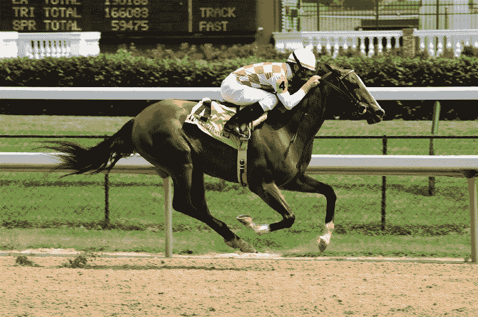
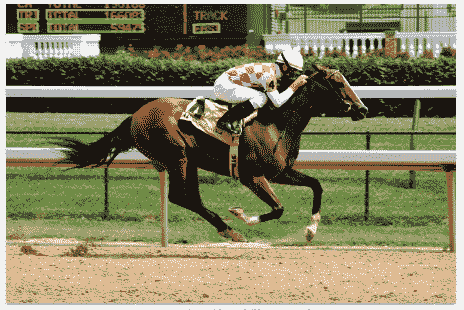

# 人工智能竞赛已经开始。这是谁赢了。

> 原文：<https://www.freecodecamp.org/news/the-race-is-on-for-artificial-intelligence-heres-who-is-winning-f7dad96f1d33/>

特伦·彼得森

# 人工智能竞赛已经开始。这是谁赢了。


周六，肯塔基州的路易斯维尔举办了第 143 届肯塔基赛马会。这是一个超过 15 万人亲自观看的奇观。数百万人在电视和流媒体上关注此事。获胜者获得了 140 万美元的奖金，并有机会在今年晚些时候的比赛中赢得更多奖金。

一场更大的竞赛正在科技领域激烈展开，围绕谁能够将机器学习商品化为服务。预先构建的机器学习模型价值数十亿美元。这场竞争让世界上最大的科技公司都陷入了困境。

像肯塔基赛马会这样的活动实际上有许多比赛在同一天进行。主宰机器学习的竞赛也是如此。在这篇文章中，我将只关注图像识别竞赛是如何形成的。

### 云竞争者

现在，每个主要的公共云供应商都有选择。亚马逊、谷歌和微软凭借其存储托管服务获得了主要地位。他们的产品将决定市场方向。图像识别可能会成为大型基于云的图像存储系统中的一项功能。这一举措将消除作为独立产品的预建模型。

#### 测试当前产品

为了让供应商们互相“竞赛”，我使用了下面这张来自维基百科的照片。为了让文章更具可读性，我将下面每个回答的精确度降低到了三位数。



#### 亚马孙

亚马逊拥有业内最大的公共云足迹。六个月前，他们发布了他们的最有价值球员。这项服务构建于他们的云平台之上，集成到 S3 和 Lambda 中。这是他们的模型从比赛照片中确定的。

```
[{’Confidence’: 98.0, ’Name’: ’Animal’},{’Confidence’: 98.0, ’Name’: ’Horse’},{’Confidence’: 98.0, ’Name’: ’Mammal’},{’Confidence’: 90.8, ’Name’: ’Equestrian’},{’Confidence’: 90.8, ’Name’: ’Person’},{’Confidence’: 52.7, ’Name’: ’Colt Horse’}]
```

#### 谷歌

谷歌拥有庞大的云业务，包括对象存储。他们在搜索领域的图像识别历史也是一大优势。使用他们的[云视觉 API](https://cloud.google.com/vision/) 提供了对比赛图像的全面响应。

```
[{ "description": "horse", "score": 0.937 },{ "description": "western riding", "score": 0.889 },{ "description": "jockey", "score": 0.881 },{ "description": "racing", "score": 0.861 },{ "description": "stallion", "score": 0.810},{ "description": "mare", "score": 0.810 },{ "description": "western pleasure", "score": 0.806 },{  "description": "sports", "score": 0.776 },{  "description": "horse racing", "score": 0.775 },{  "description": "english riding", "score": 0.731 },{  "description": "horse trainer", "score": 0.722 },{  "description": "equestrian sport", "score": 0.708 },{  "description": "equestrianism", "score": 0.705 },{  "description": "animal sports", "score": 0.685 },{  "description": "barrel racing", "score": 0.648},{  "description": "eventing", "score": 0.614},{  "description": "horse like mammal", "score": 0.590},{  "description": "reining", "score": 0.546 }]
```

谷歌甚至更进一步，增加了文本识别功能。当扫描图像时，它翻译了记分牌上的文字。请参见下图左上角的黄色方框。



谷歌将这些信息翻译成机器可读格式(JSON)。这是一个其他人还没有提供的强大功能。

#### 微软

微软还拥有庞大的云计算和搜索业务的组合。他们的产品已经上市一年多了。他们的[云视觉 API](https://www.microsoft.com/cognitive-services/en-us/computer-vision-api) 识别了图像，并提供了以下结果。

```
[ { “name”: “grass”, “confidence”: 0.999 },{ “name”: “fence”, “confidence”: 0.999 },{ “name”: “outdoor”, “confidence”: 0.995 },{ “name”: “horse”, “confidence”: 0.985 },{ “name”: “ground”, “confidence”: 0.974 },{ “name”: “sport”, “confidence”: 0.821 },{ “name”: “horse racing”, “confidence”: 0.519 }]
```

### 希望渺茫

这场竞赛的参赛者比三大公共云提供商都多。IBM 有沃森，在人工智能方面有很强的能力。他们已经在 [BlueMix](https://visual-recognition-demo.mybluemix.net/) 中启用了这一功能。以下是我尝试使用照片进行公开演示时得到的结果。


这项服务也有局限性，因为有大小限制。这可能是阻碍客户的可用性差距。我在维基百科上找到了一张类似的照片，在 2MB 的范围内。识别的质量与其他的相似。

```
[ { "class": "horse racing", "score": 0.922 },{ "class": "racing", "score": 0.928 },{ "class": "sport", "score": 0.928 },{ "class": "jockey (horse rider)", "score": 0.622 },{ "class": "traveler", "score": 0.622 },{ "class": "person", "score": 0.622 },{ "class": "racehorse", "score": 0.53 },{ "class": "mammal", "score": 0.53 },{ "class": "animal", "score": 0.53 },{ "class": "green color", "score": 0.876 }]
```

在这场竞赛中，初创企业提供了创造性的选择。一个例子是去年[筹集了 3000 万美元](https://techcrunch.com/2016/10/25/clarifai-raises-30m-to-give-developers-visual-search-capabilities/)的 Clarifai 。他们的 API 使用与科技巨头相同的图像来突出强大的识别能力。

```
horse, 0.999equine, 0.992race, 0.990track, 0.989fast, 0.984jockey, 0.983thoroughbred, 0.981competition, 0.966gambling, 0.951filly, 0.942mare, 0.936turf, 0.924whip, 0.902best, 0.897stallion, 0.882athlete, 0.869saddle, 0.865racehorse, 0.864rider, 0.864blinker, 0.858
```

这凸显了新人闯入这场比赛的潜力。这家初创公司可以利用现有的云托管提供商，实现规模经济。

### 谁是赢家？

这场竞争非常激烈，谷歌目前处于领先地位。将图像识别集成到数字产品中的软件开发商也是赢家。我最近开发了一个 Alexa 游戏，用它来玩寻宝游戏。这只用了几行代码就完成了，而且不需要训练模型。

目前的价位大约是 1/1000 张图片。在这个级别，图像识别将被集成到许多不同的产品中。成为消费最多的服务的竞赛开始了！