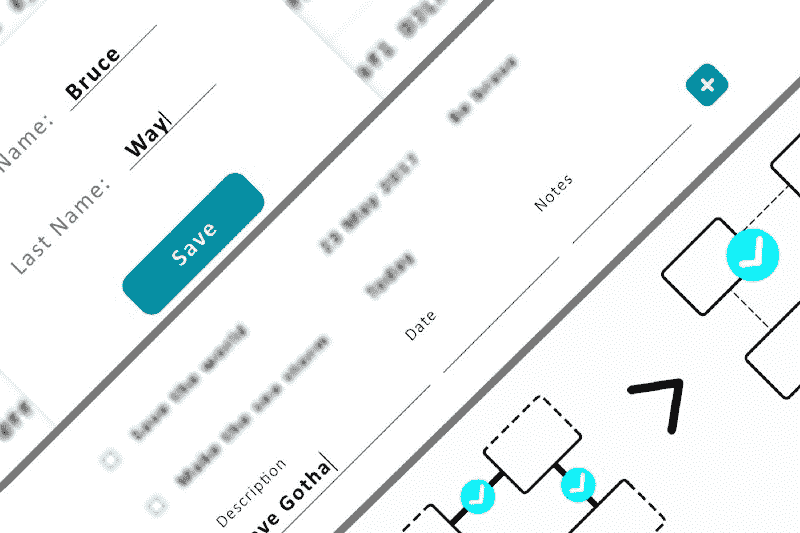
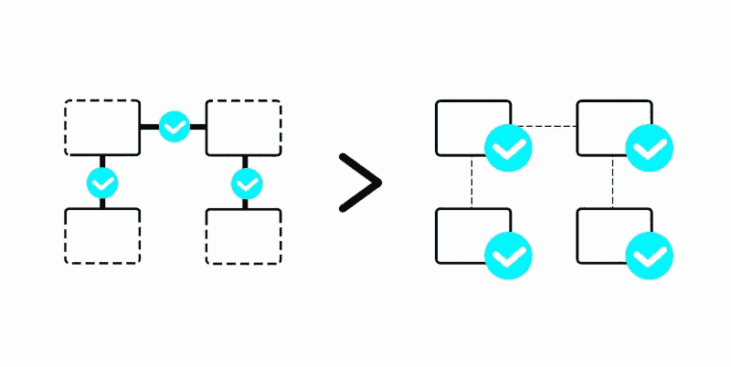

# 如何在不完全疯狂的情况下构建复杂的用户界面

> 原文：<https://www.freecodecamp.org/news/3-tips-to-keep-in-mind-while-developing-complex-ui-in-web-b56312310390/>

伊利亚·科洛迪亚日尼

# 如何在不完全疯狂的情况下构建复杂的用户界面



我最近构建了一个具有复杂的动态用户界面(UI)的 web 应用程序。一路走来，我学到了一些宝贵的经验。

在我着手这样一个雄心勃勃的项目之前，我希望有人告诉我以下几个建议。这些会节省我很多时间和理智。

### 理智提示#1:使用组件的内部状态来存储临时数据

复杂的 UI 通常需要你维护某种应用程序状态。这告诉 UI 要显示什么以及如何显示。一种选择是当用户在页面上触发一个动作时就访问该状态。然而，我知道在某些情况下，推迟应用程序状态的更改，并将此更改临时保存在当前组件的内部状态中是有益的。

说明这一点的一个例子是供用户编辑一些记录的对话窗口，例如他或她的姓名:


在这种情况下，您可能希望每当用户编辑该对话窗口中的字段时触发一个更改。但是我鼓励你用显示的所有数据来维护这个对话框的内部状态。等到用户按下保存按钮。此时，您可以安全地更改保存这些记录的数据的应用程序状态。

这样，如果用户决定放弃更改并关闭对话框，您可以删除组件。那么应用程序状态保持不变。如果您需要将数据发送到后端，您可以在一个请求中完成。如果其他用户也可以使用相同的列表，当有人编辑它时，他们将看不到临时值。

> 你的用户界面行为应该符合用户的心理模型

当用户使用对话框时，在完成编辑之前，他们不会认为记录已经完成。组件的功能应该完全像这样工作。

*使用 React/Redux 的人员请注意:*如果您将常规数据保存在 Redux 存储中，并使用 React 组件状态来存储临时数据，那么这种行为是可以实现的。

### 健康提示#2:将模型数据与 UI 状态分离

我在这里使用的术语**模型**指的是 MVC 模式中的经典实体。

web 应用程序中的现代 UI 在结构和行为上可能很复杂。这通常会导致您在应用程序状态中存储纯粹与 UI 相关的数据。我建议您将 UI 相关数据和业务数据分开。

> 将业务数据和逻辑与 UI 状态分开存储

这种方法更容易遵循和理解，因为它将业务逻辑与其他一切分离开来。您的模型可以保存数据以及处理这些数据的方法(函数、手段)。否则，您的应用程序可能会以业务逻辑分散在多个地方而告终，最有可能是*视图*组件。

例如，您的应用程序中有一个待办任务列表，您实现了一个页面来将新任务添加到该列表中。您希望禁用“保存”按钮，直到出现解释该任务的说明和格式正确的任务日期:


最简单的方法是将所需的数据存储在应用程序状态中的某个地方，并将类似于`const saveButtonDisabled = !description && !date && !dateIsValid(date)`的代码放在您的*视图*组件中。但是问题是保存按钮被禁用了，因为有一个*业务需求*要求所有记录都有描述和正确的日期。

所以在这种情况下，禁用按钮的逻辑应该放在待办任务的*模型*中。这个模型可能是这样的:

```
{    description: 'Save Gotham',    date: 'NOW',    notes: 'Speak with deep voice',    dateIsValid: () => this.date === 'NOW',    isValid: () => this.description !== '' && this.dateIsValid()}
```

现在你可以在*视图*组件中为你的 UI 逻辑`const saveButtonDisabled = !task.isValid()`使用它。

正如你所看到的，这个技巧基本上是关于在 MVC 模式中保持你的*模型*与*视图*的分离。

### 理智提示#3:优先考虑集成测试而不是单元测试

如果您足够幸运，在有时间为每个特性编写多个测试的环境中工作，这不是问题。但我敢肯定，对我们大多数人来说，情况并非如此。通常你必须决定使用哪种测试。大多数时候，我认为集成测试比单元测试更有价值。



根据我的经验，我了解到具有良好单元测试覆盖率的代码库通常比具有良好集成测试覆盖率的代码库更容易出错。我注意到开发工作中引入的大多数错误是[回归错误](https://en.wikipedia.org/wiki/Software_regression)。单元测试通常不太能抓住这些问题。

当您修复代码中的问题时，我鼓励您遵循以下简单步骤:

1.  编写一个由于现有问题而失败的测试。如果可以通过单元测试来完成，那就太好了。否则，让测试接触尽可能多的代码模块。
2.  修复代码库中的问题。
3.  验证测试不再失败。

这个简单的实践确保了问题被修复并且不会再次发生，因为测试将会验证它。

现代 web 应用程序向开发人员提出了许多挑战，UI 开发就是其中之一。我希望这篇文章能帮助你避免错误，或者给你一个思考和讨论的好话题。

如果能在评论中读到你的想法和发现，我将不胜感激。